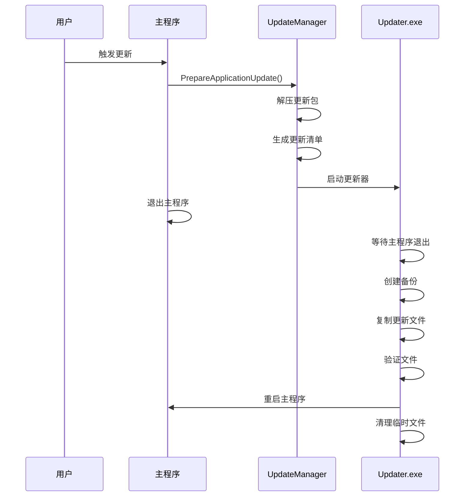

# ColorVision 更新机制

## 概述

ColorVision 现在支持两种更新机制：

1. **新的独立更新器** (推荐) - 使用 ColorVision.Updater.exe
2. **旧的 BAT 脚本** (保留作为后备) - 使用批处理文件

系统采用双轨并行策略，可通过配置切换，新方法失败时自动回退到旧方法。

## 架构

```
主程序 (ColorVision.exe)
    ↓
UpdateManager
    ↓
配置检查 (UseNewUpdateMechanism)
    ↓
┌────────────────┬────────────────┐
│ 新更新机制      │ 旧更新机制      │
│ ColorVision.   │ BAT脚本        │
│ Updater.exe    │ update.bat     │
└────────────────┴────────────────┘
```

## 新更新机制特性

### 优势

- ✅ **专业可靠**：独立程序，职责单一
- ✅ **用户友好**：无干扰的后台更新
- ✅ **安全可控**：完整的备份和回滚机制
- ✅ **易于维护**：清晰的代码结构，完善的日志
- ✅ **跨平台准备**：使用 .NET API，为未来跨平台做准备

### 核心组件

#### ColorVision.Updater.exe
独立的更新器程序，负责：
- 等待主程序退出
- 创建备份
- 执行文件操作（复制/删除）
- 验证文件完整性
- 失败时回滚
- 重启主程序
- 清理临时文件

#### UpdateManager
主程序中的更新协调器，负责：
- 准备更新包
- 生成更新清单 (JSON)
- 启动更新器
- 协调更新流程

## 配置

### UpdateManagerConfig

```csharp
public class UpdateManagerConfig
{
    // 是否使用新的更新机制
    public bool UseNewUpdateMechanism { get; set; } = true;
    
    // 更新器路径（可选）
    public string UpdaterPath { get; set; } = "";
    
    // 是否启用备份
    public bool EnableBackup { get; set; } = true;
    
    // 备份保留天数
    public int BackupRetentionDays { get; set; } = 7;
    
    // 更新临时目录
    public string TempUpdateDirectory { get; set; } = "C:\\Temp\\ColorVisionUpdate";
}
```

### 切换更新机制

```csharp
// 使用新的更新机制
UpdateManagerConfig.Instance.UseNewUpdateMechanism = true;

// 回退到旧的 BAT 方式
UpdateManagerConfig.Instance.UseNewUpdateMechanism = false;
```

## 更新流程

### 增量更新流程



### 完整更新流程

完整更新直接运行新的安装程序，安装程序会覆盖现有文件。

## 文件结构

```
ColorVision/
├── ColorVision.exe              # 主程序
├── ColorVision.Updater.exe      # 更新器
└── Update/
    ├── UpdateManager.cs         # 更新管理器
    ├── UpdateManagerConfig.cs   # 配置类
    ├── UpdateModels.cs          # 数据模型
    └── AutoUpdater.cs           # 更新逻辑（已改造）

Tools/ColorVision.Updater/
├── Program.cs                   # 更新器入口
├── UpdateExecutor.cs            # 核心更新逻辑
├── Models/
│   └── UpdateManifest.cs        # 数据模型
├── Logging/
│   └── UpdateLogger.cs          # 日志记录
├── ProcessManagement/
│   └── ProcessManager.cs        # 进程管理
├── FileOperations/
│   ├── FileOperator.cs          # 文件操作
│   └── BackupManager.cs         # 备份管理
└── app.manifest                 # 请求管理员权限
```

## 更新清单格式

更新清单是一个 JSON 文件，描述了更新的所有细节：

```json
{
  "version": "1.0",
  "updateType": "Application",
  "updateInfo": {
    "version": "1.2.3.4",
    "name": "ColorVision",
    "description": "增量更新"
  },
  "paths": {
    "sourcePath": "C:\\Temp\\ColorVisionUpdate\\Extract",
    "targetPath": "C:\\Program Files\\ColorVision",
    "backupPath": ""
  },
  "executable": {
    "name": "ColorVision.exe",
    "arguments": "",
    "workingDirectory": ""
  },
  "options": {
    "createBackup": true,
    "verifyFiles": false,
    "restartAfterUpdate": true,
    "cleanupOnSuccess": true,
    "rollbackOnFailure": true
  },
  "files": [
    {
      "source": "ColorVision.exe",
      "target": "ColorVision.exe",
      "action": "Replace",
      "verify": false,
      "critical": true
    }
  ],
  "timestamp": "2025-01-15T12:00:00Z"
}
```

## 日志

### 主程序日志
使用 log4net，位于：`%AppData%\ColorVision\Logs\`

### 更新器日志
位于：`%AppData%\ColorVision\Logs\Updater_yyyyMMdd_HHmmss.log`

日志包含：
- 时间戳
- 日志级别 (DEBUG/INFO/WARNING/ERROR)
- 详细消息

## 备份机制

### 自动备份
- 更新前自动创建备份
- 备份目录：`ColorVisionBackup_yyyyMMdd_HHmmss`
- 仅备份被替换的文件（节省空间）

### 自动回滚
- 更新失败时自动回滚到备份
- 保留备份用于手动恢复

### 备份清理
- 定期清理旧备份（默认保留 7 天）
- 可通过 `BackupRetentionDays` 配置

## 使用方法

### 程序化调用

```csharp
// 增量更新
AutoUpdater.RestartIsIncrementApplication(downloadPath);

// 完整更新
AutoUpdater.RestartApplication(downloadPath);

// 手动控制
var manager = UpdateManager.Instance;
var manifestPath = manager.PrepareApplicationUpdate(zipPath, isIncremental: true);
manager.ExecuteUpdate(manifestPath);
```

### 命令行调用更新器

```bash
ColorVision.Updater.exe --manifest "path/to/manifest.json" --pid 1234 --log-level Info
```

参数说明：
- `--manifest`: 更新清单文件路径（必需）
- `--pid`: 主程序进程ID，等待其退出（可选）
- `--log-level`: 日志级别 Debug|Info|Warning|Error（可选）

## 故障排除

### 更新失败
1. 检查日志文件
2. 确认是否有足够的磁盘空间
3. 确认是否有管理员权限（Program Files 安装）
4. 尝试手动回滚备份

### 更新器无法启动
1. 确认 `ColorVision.Updater.exe` 存在
2. 检查 UAC 设置
3. 尝试以管理员身份运行

### 回退到旧方法
```csharp
UpdateManagerConfig.Instance.UseNewUpdateMechanism = false;
```

## 未来计划

- [ ] 差分更新：使用 bsdiff 算法生成二进制差分
- [ ] 静默更新：后台下载，下次启动时应用
- [ ] 断点续传：支持大文件的断点续传
- [ ] 跨平台支持：Linux、macOS 支持
- [ ] 签名验证：数字签名验证更新包
- [ ] 自动更新服务器：完善的更新服务器

## 参考文档

- [UPDATE_MECHANISM_REDESIGN.md](../../docs/UPDATE_MECHANISM_REDESIGN.md) - 详细设计方案
- [UPDATE_MIGRATION_CHECKLIST.md](../../docs/UPDATE_MIGRATION_CHECKLIST.md) - 迁移检查清单
- [UPDATE_IMPLEMENTATION_GUIDE.md](../../docs/UPDATE_IMPLEMENTATION_GUIDE.md) - 实施指南

## 版本历史

- **v1.0** (2025-01-15): 初始实现，双轨并行支持
