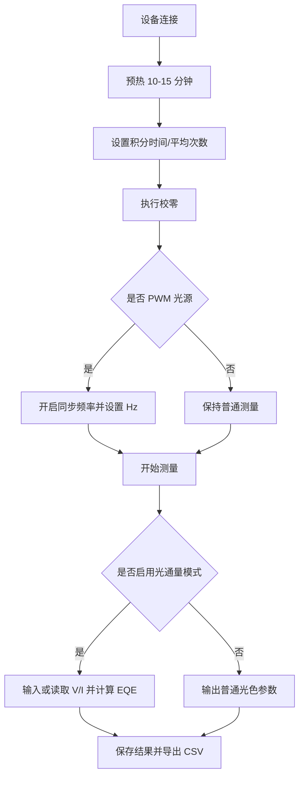

# 光谱仪帮助文档（培训版）

适用对象：培训讲师、FAE、新员工入门培训  
建议时长：45-90 分钟

---

## 一、培训目标

1. 理解核心光色参数含义与应用。
2. 掌握标准测量流程与关键设置。
3. 能独立完成普通模式与光通量模式测量。
4. 能定位常见异常并采取纠正措施。

---

## 二、课程结构

### 模块 A：基础概念（15-20 分钟）
- 色度与亮度：CIE XYZ、xy、u'v'
- 光源评价：Ra、CCT、Duv
- 光谱参数：Lp、Ld、FWHM、纯度

### 模块 B：系统操作（15-25 分钟）
- 校零（手动/自动）
- 自动积分时间
- 同步频率（PWM）
- 连续测量与数据管理

### 模块 C：高级模式（15-25 分钟）
- 光通量模式（EQE）
- 源表（SMU）联动
- 导出与复算

### 模块 D：案例演练（10-20 分钟）
- 案例 1：PWM 灯具闪烁导致数据不稳
- 案例 2：积分时间不当导致过饱和
- 案例 3：切换积分时间后未校零导致偏差

---

## 三、标准测量流程

---

## 四、关键知识点讲解

### 1) 校零是准确性的基础
- 目的：扣除暗电流与背景噪声。
- 触发时机：开机后、积分时间变化后、环境温变时。

### 2) 自动积分提升一致性
- 原理：让峰值信号落入合理区间。
- 实操目标：让 IP 尽量稳定在 30%-80%。

### 3) 同步频率用于 PWM 光源
- 原理：积分时间对齐到 PWM 整周期。
- 结果：显著降低闪烁引起的波动。

### 4) 光通量模式用于电光联合分析
- 输入：V、I
- 输出：EQE、光通量、辐射通量、光效
- 应用：LED 性能评估、工艺对比、批次分析

---

## 五、实操考核建议

### 考核项 1：普通模式测量
- 要求：独立完成一次稳定测量并导出数据。
- 判定：结果无饱和、参数完整、文件可追溯。

### 考核项 2：PWM 场景测量
- 要求：正确启用同步频率并解释原因。
- 判定：重复测量波动明显下降。

### 考核项 3：EQE 测量
- 要求：完成 V/I 输入与 EQE 计算。
- 判定：结果逻辑正确、单位正确、可复算。

---

## 六、故障排查清单（培训现场可打印）

### 数据抖动明显
- 是否 PWM 光源未开同步频率
- 是否未校零或校零过久未更新
- 是否环境光干扰

### 信号过低
- 积分时间是否太短
- 入光口是否遮挡
- 光路是否偏移

### 信号饱和
- 积分时间是否过长
- 样品距离是否过近
- 是否应降低驱动电流

### EQE 异常
- V/I 输入单位是否正确（mA 与 A）
- 幅值标定文件是否正确加载
- 是否选择了正确数据条目复算

---

## 七、培训资料配套建议

1. 课前发：精简版文档（5-10 分钟预读）
2. 课堂用：培训版文档 + 实测演示
3. 课后发：用户版完整文档 + 常见问题清单
