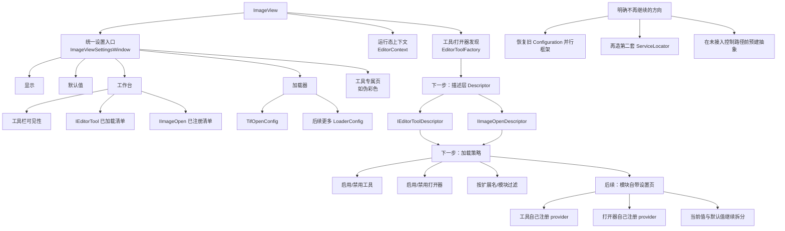

# ImageEditor 下一步迭代图

## 当前基线

已经完成的收口：

- 统一设置窗口：`ImageViewSettingsWindow`
- 工作台页：工具栏可见性 + `IEditorTool` 清单 + `IImageOpen` 清单
- 模块化 provider：`IImageViewSettingProvider`
- 打开器专用配置样例：`TifOpenConfig`
- 伪彩色当前值 / 默认值拆分

## 迭代目标

下一轮不再回到旧 `Configuration` 实验层，而是在现有真实链路上继续做三件事：

1. 给 `IEditorTool` / `IImageOpen` 增加正式描述信息。
2. 把“仅展示已加载状态”推进到“可配置加载策略”。
3. 让更多模块按 provider 方式自带设置页，而不是继续把逻辑堆回 `ImageView`。

## 迭代图

## 建议的实现顺序

### 第 1 步：描述层

先给 `IEditorTool` 和 `IImageOpen` 补充统一元数据来源，例如：

- 显示名称
- 所属分组
- 描述
- 来源模块/程序集
- 默认是否启用

目标不是先做开关，而是先把“展示名”和“可管理对象”变成稳定实体。

### 第 2 步：加载策略

在 `EditorToolFactory` 的发现阶段前置策略判断：

- 哪些 `IEditorTool` 不实例化
- 哪些 `IImageOpen` 不注册
- 哪些扩展名映射要被覆盖或禁用

这一步做完，设置页里“已加载列表”才会变成真正有控制力的“已启用列表”。

### 第 3 步：模块继续下沉

把更多格式特例和复杂工具继续从 `ImageView` 中拆出去：

- 打开器特定行为进入各自 `LoaderConfig`
- 工具特定行为进入各自 provider
- 当前值 / 默认值继续严格分层

## 验收标准

如果下一轮完成得对，应该看到这些结果：

- `ImageView.xaml.cs` 不再继续膨胀。
- 新增工具/打开器时，设置页无需再手写集中式 if/else。
- “是否加载”在发现阶段就能控制，而不是实例化后再隐藏。
- 文档能直接指出真实控制路径，而不是再出现未接入的平行抽象。