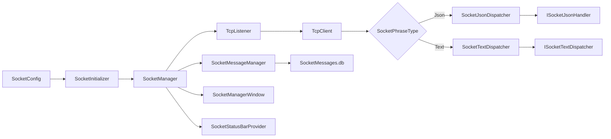

# ColorVision.SocketProtocol

> 版本: 1.5.5.1 | 目标框架: .NET 8.0 / .NET 10.0 Windows

`ColorVision.SocketProtocol` 是 ColorVision 桌面端的本地 TCP 通信模块。它不是单纯的协议模型库，而是把 Socket 服务启停、JSON/Text 请求分发、SQLite 消息历史、状态栏入口和管理窗口整合在一起的运行时模块。

## 模块定位

- 启动和停止本地 TCP 服务
- 维护当前客户端连接列表
- 按配置处理 JSON 或纯文本请求
- 自动发现 `ISocketJsonHandler` / `ISocketTextDispatcher` 扩展实现
- 将收发消息持久化到 SQLite
- 提供状态栏入口和 `SocketManagerWindow` 调试窗口

## 项目结构

| 文件 | 作用 |
| --- | --- |
| `SocketManager.cs` | TCP 服务、客户端连接、JSON/Text 分发和收发记录主链 |
| `SocketManagerWindow.xaml(.cs)` | 连接管理、消息查询、过滤、详情查看、复制、重发和删除 |
| `SocketMessage.cs` | SQLite 持久化实体，记录方向、内容、客户端、事件名、MsgID、响应码 |
| `SocketMessageManager.cs` | 消息数据库初始化、查询、插入、删除和通用查询入口 |
| `SocketConfig.cs` | 服务器启用状态、监听 IP、端口、Buffer 大小、协议模式 |
| `SocketConfigProvider.cs` | 接入设置系统 |
| `SocketInitializer.cs` | 应用初始化时按配置启动服务，并监听启停变化 |
| `SocketStatusBarProvider.cs` | 状态栏连接状态提示和管理窗口入口 |
| `ISocketJsonHandler.cs` | JSON 请求处理器扩展接口 |
| `Properties/Resources.*.resx` | 管理窗口和设置项多语言资源 |

## 运行链路



## 管理窗口能力

`SocketManagerWindow` 现在承担日常调试入口，界面按“服务状态、查询过滤、消息工作区”组织，重点能力包括：

- 顶部显示服务启用状态、服务是否打开、监听地址、协议模式、客户端数量
- 服务打开失败时，顶部直接显示最后一次错误信息，右侧“服务诊断”页也可查看
- 支持按客户端、事件名、MsgID、响应码和内容过滤消息
- 支持按方向查看全部、接收、发送消息
- 消息列表启用虚拟化，适合查看较大的历史窗口
- 消息详情支持 JSON 格式化查看和原文复制
- 支持自动滚动到新消息，也可以关闭自动滚动做历史排查
- 重发消息时优先匹配原客户端，找不到时可落到当前选中的客户端
- 右侧标签页在“消息详情 / 连接的客户端 / 服务诊断”之间切换，避免所有信息堆在同一屏
- 快捷键：`Ctrl+F` 聚焦过滤框，`Esc` 清空过滤，`F5` 重新查询，`Ctrl+C` 复制选中消息，`Delete` 删除选中消息

## JSON 协议模型

当前 JSON 请求和响应模型定义在 `SocketManager.cs`：

```csharp
public class SocketRequest : SocketMessageBase
{
    public string Params { get; set; }
}

public class SocketResponse : SocketMessageBase
{
    public int Code { get; set; }
    public string Msg { get; set; }
    public dynamic Data { get; set; }
}
```

其中 `SocketMessageBase` 包含 `Version`、`MsgID`、`EventName`、`SerialNumber`。JSON 模式下，`SocketJsonDispatcher` 会按 `EventName` 查找对应的 `ISocketJsonHandler`。

## 扩展处理器

新增 JSON 事件处理时，实现 `ISocketJsonHandler` 并确保类型能被 `AssemblyService.Instance.GetAssemblies()` 扫描到：

```csharp
public class DemoSocketHandler : ISocketJsonHandler
{
    public string EventName => "Demo.Event";

    public SocketResponse Handle(NetworkStream stream, SocketRequest request)
    {
        return new SocketResponse
        {
            Version = request.Version,
            MsgID = request.MsgID,
            EventName = request.EventName,
            SerialNumber = request.SerialNumber,
            Code = 0,
            Msg = "OK",
            Data = new { received = request.Params }
        };
    }
}
```

文本模式则实现 `ISocketTextDispatcher`，由 `SocketTextDispatcher` 顺序调用。

## 数据与配置

- 消息数据库默认路径：`%AppData%/ColorVision/Config/SocketMessages.db`
- 主要配置入口：`SocketConfig.Instance`
- 可配置项：`IsServerEnabled`、`IPAddress`、`ServerPort`、`SocketBufferSize`、`SocketPhraseType`
- 服务启停由 `SocketConfig.IsServerEnabled` 驱动，`SocketInitializer` 和管理窗口都会复用同一份配置

## 构建

```powershell
dotnet build UI/ColorVision.SocketProtocol/ColorVision.SocketProtocol.csproj -p:Platform=x64
```

## 优化路线

后续优化建议按风险从低到高推进：

| 阶段 | 目标 | 重点 |
| --- | --- | --- |
| P0 稳定性 | 保证服务启停和 TCP 收发更可靠 | 增加取消令牌、防止重复启动、处理 TCP 粘包/半包、统一客户端清理 |
| P1 可观测性 | 让现场调试更快定位问题 | 消息导出、错误统计、连接生命周期事件、状态栏更详细提示 |
| P2 协议化 | 让外部设备对接更稳定 | JSON Schema、版本兼容策略、处理器元数据、错误码规范 |
| P3 性能与容量 | 支持更长时间运行和更大消息量 | UI 分页/增量加载、数据库索引、保留策略、批量写入 |

更详细的路线见文档站：

- `docs/02-developer-guide/performance/socket-protocol-optimization-roadmap.md`
- `docs/04-api-reference/ui-components/ColorVision.SocketProtocol.md`
