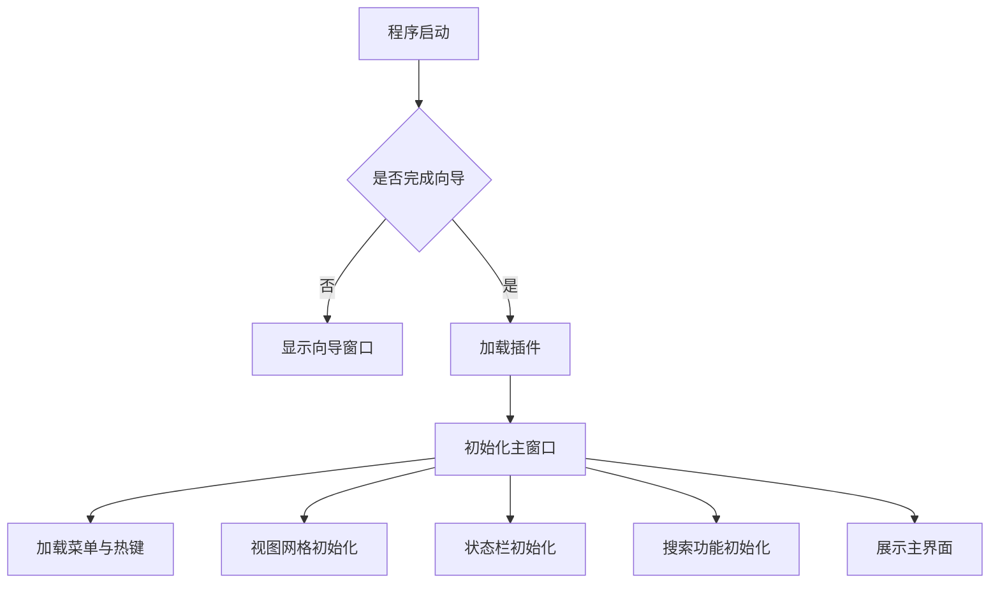
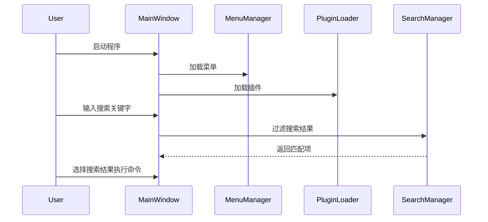
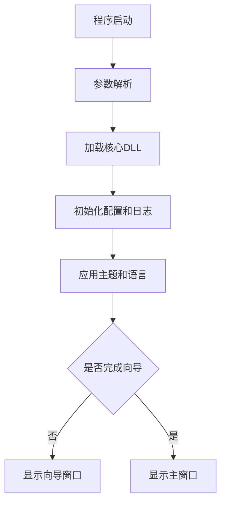

# 快速上手


# 快速上手

## 目录
1. [介绍](#介绍)
2. [项目结构](#项目结构)
3. [核心组件](#核心组件)
4. [架构概览](#架构概览)
5. [详细组件分析](#详细组件分析)
6. [依赖关系分析](#依赖关系分析)
7. [性能考虑](#性能考虑)
8. [故障排除指南](#故障排除指南)
9. [结论](#结论)

## 介绍
本项目“ColorVision”是一个功能丰富的视觉检测软件系统，旨在为用户提供图像处理、设备控制及数据分析等核心功能。本文档通过创建一个快速上手教程，引导用户完成一个简单的端到端任务：连接模拟设备，加载示例模板，执行测量并查看结果。文档内容兼顾技术细节与易用性，力求帮助不同技术背景的用户快速理解和使用系统。

## 项目结构

项目采用模块化设计，代码库结构清晰，主要按功能和技术层次划分。以下是主要目录及其职责说明：

```mermaid
graph TD
    A[ColorVision 根目录] --> B[Engine]
    A --> C[UI]
    A --> D[Projects]
    A --> E[Plugins]
    A --> F[Core]
    A --> G[Docs]
    A --> H[Scripts]
    A --> I[Tests]
    A --> J[ColorVision 主程序]

    B --> B1[ColorVision.Engine]
    B --> B2[ColorVision.Core]
    B --> B3[ColorVision.ImageEditor]
    B --> B4[ColorVision.Scheduler]
    B --> B5[CVImageChannelLib]

    C --> C1[ColorVision.UI]
    C --> C2[ColorVision.Themes]
    C --> C3[ColorVision.Solution]

    D --> D1[ProjectBase]
    D --> D2[ProjectKB]
    D --> D3[ProjectHeyuan]
    D --> D4[CV_Spectrometer]
    D --> D5[ProjectARVR]
    D --> D6[ProjectBlackMura]
    D --> D7[ProjectShiyuan]

    E --> E1[EventVWR]
    E --> E2[ScreenRecorder]
    E --> E3[WindowsServicePlugin]
    E --> E4[SystemMonitor]
    E --> E5[ColorVisonChat]

    J --> J1[ColorVision 主程序文件]
```



### 1. Engine 目录
包含核心引擎模块，如图像处理（ImageEditor）、调度（Scheduler）、核心算法（Core）、设备驱动和算法实现（ColorVision.Engine）等。负责业务逻辑、算法实现和设备交互。

### 2. UI 目录
负责用户界面相关代码，包括主题（Themes）、界面视图（UI）、解决方案管理（Solution）等。实现界面交互、主题支持、搜索、菜单管理等功能。

### 3. Projects 目录
包含多个具体项目子模块，每个项目对应一种应用场景或硬件设备（如光谱仪Spectrometer、ARVR项目等）。方便针对不同客户需求定制功能。

### 4. Plugins 目录
存放插件模块，支持扩展系统功能，如事件查看器（EventVWR）、屏幕录像（ScreenRecorder）、系统监控（SystemMonitor）等。

### 5. Core 目录
一些底层辅助库和工具，支持OpenCV、CUDA等第三方库的集成。

### 6. Docs 目录
包含项目相关文档，如许可协议、API文档、解决方案说明等。

### 7. Scripts 目录
自动化脚本和构建工具，支持项目的编译、配置和部署。

### 8. Tests 目录
测试代码，保证项目质量。

### 9. ColorVision 主程序目录
包含主程序入口和窗口定义文件，如 `MainWindow.xaml` 与其代码后置 `MainWindow.xaml.cs`，应用启动文件 `App.xaml` 及其代码后置 `App.xaml.cs`。

整体架构采用典型的MVVM设计模式，分离视图（XAML文件）、视图模型（ViewModel）和模型（Model），提高代码可维护性和扩展性。

## 核心组件

结合快速上手目标，核心组件主要包括：

- **MainWindow.xaml.cs**  
  主窗口逻辑入口，负责界面初始化、菜单加载、搜索功能、视图管理和插件初始化。

- **App.xaml.cs**  
  应用程序启动入口，负责程序启动流程控制、参数解析、插件加载、异常处理和主题语言设置。

- **ViewGridManager**  
  视图网格管理器，控制主界面视图布局和切换。

- **MenuManager**  
  菜单管理，动态加载菜单项并绑定命令。

- **PluginLoader**  
  插件加载器，动态加载扩展模块。

- **SearchManager**  
  搜索管理器，支持关键字搜索和快速命令执行。

- **FloatingBallWindow**  
  浮动球窗口，提供快捷操作入口。

以上组件协同工作，支持用户通过界面快速实现设备连接、模板加载、测量执行及结果查看。

## 架构概览

程序启动时，`App.xaml.cs` 处理启动参数，加载核心DLL和插件，初始化主题和语言环境，启动主窗口或向导窗口。主窗口(`MainWindow.xaml.cs`)负责界面布局初始化，加载菜单、插件和热键，管理视图网格和搜索框，支持快捷键操作和状态栏动态显示。系统采用事件驱动和命令模式解耦界面与业务逻辑。



## 详细组件分析

### 1. MainWindow.xaml.cs

**功能概述**  
作为主窗口的代码后置文件，负责窗口初始化和用户交互逻辑。其职责涵盖界面元素绑定、菜单和插件加载、搜索功能实现、视图布局管理、状态栏动态内容展示及快捷键支持。

**关键类和方法**

- `CommadnInitialized` 类  
  实现接口 `IMainWindowInitialized`，负责根据启动参数执行指定菜单命令，支持命令行控制程序行为。

- `MainWindow` 类  
  - 构造函数 `MainWindow()`  
    初始化窗口组件，设置标题、窗口样式和大小调整事件。  
  - `Window_Initialized`  
    主要初始化逻辑，包括菜单管理、视图管理器、插件加载、热键绑定和浮动球显示。  
  - `LoadIMainWindowInitialized()`  
    异步加载并执行实现了 `IMainWindowInitialized` 接口的组件初始化逻辑。  
  - 搜索相关事件处理  
    处理搜索框文本变化，动态过滤搜索结果，支持调用外部工具 Everything 进行文件搜索。  
  - 视图网格切换  
    响应用户点击按钮调整视图网格布局。  
  - 状态栏初始化  
    动态加载所有实现了 `IStatusBarProvider` 接口的状态栏项，支持图标和文本类型，绑定数据和事件。

**代码示例**

```csharp
public static async void LoadIMainWindowInitialized() 
{
    foreach (var assembly in AssemblyHandler.GetInstance().GetAssemblies())
    {
        foreach (Type type in assembly.GetTypes().Where(t => typeof(IMainWindowInitialized).IsAssignableFrom(t) && !t.IsAbstract))
        {
            if (Activator.CreateInstance(type) is IMainWindowInitialized componentInitialize)
            {
                try
                {
                    await componentInitialize.Initialize();
                }
                catch (Exception ex)
                {
                    log.Error(ex);
                }
            }
        }
    }
}
```
该方法动态加载实现初始化接口的组件，并执行初始化，体现了插件式架构的灵活性。

**界面交互流程**



### 2. App.xaml.cs

**功能概述**  
应用程序入口，负责启动流程控制、参数解析、异常处理、日志初始化、主题和语言设置、插件加载、启动向导或主窗口。

**关键流程**

- 启动时解析命令行参数（如 `debug`、`restart`、`input`、`export`）。  
- 加载核心DLL（引擎、调度、图像编辑、解决方案模块）。  
- 初始化配置管理和日志。  
- 应用主题和语言环境。  
- 处理文件导入导出命令。  
- 启动向导窗口（首次使用）或主窗口。  
- 异常捕获和日志记录，保证程序稳定性。

**代码示例**

```csharp
private void Application_Startup(object sender, StartupEventArgs e)
{
    // 解析参数
    var parser = ArgumentParser.GetInstance();
    parser.AddArgument("debug", true, "d");
    parser.AddArgument("restart", true, "r");
    parser.Parse();

    // 加载核心动态库
    if (File.Exists("ColorVision.Engine.dll"))
        Assembly.LoadFrom("ColorVision.Engine.dll");
    // ...加载其他DLL

    // 初始化配置和日志
    ConfigHandler.GetInstance();
    LogConfig.Instance.SetLog();

    // 应用主题和语言
    this.ApplyTheme(ThemeConfig.Instance.Theme);
    Thread.CurrentThread.CurrentUICulture = new System.Globalization.CultureInfo(LanguageConfig.Instance.UICulture);

    // 启动向导或主窗口
    if (!WizardWindowConfig.Instance.WizardCompletionKey)
    {
        new WizardWindow().Show();
    }
    else
    {
        new MainWindow().Show();
    }
}
```

**启动流程图**



## 依赖关系分析

- 主程序依赖 `ColorVision.Engine`、`ColorVision.Scheduler`、`ColorVision.ImageEditor`、`ColorVision.Solution` 等核心模块。  
- 插件通过反射动态加载，解耦主程序和扩展功能。  
- 界面层通过 MVVM 模式与业务逻辑层解耦，利用数据绑定实现视图更新。  
- 搜索功能支持调用外部工具 Everything，实现快速文件搜索。  
- 状态栏通过接口 `IStatusBarProvider` 动态加载多个状态项，支持扩展和定制。

## 性能考虑

- 异步初始化和插件加载避免启动阻塞，提升用户体验。  
- 视图管理支持动态调整布局，适应不同屏幕大小。  
- 搜索结果过滤采用延迟加载与关键字拆分，提升响应速度。  
- 日志采用异步写入，减少对主线程影响。  

## 故障排除指南

- 启动异常日志查看 `log4net` 生成的日志文件。  
- 插件加载失败检查插件DLL是否放置正确。  
- 搜索功能无响应确认 Everything 工具是否安装且路径正确。  
- 许可证检测失败时，程序会自动尝试创建许可证文件。  

## 结论

本文档详细分析了 ColorVision 项目的结构、核心组件及其交互，重点介绍了主窗口和应用启动流程，帮助用户快速上手并理解系统架构。通过模块化设计和插件机制，系统具备良好的扩展性和维护性。结合丰富的示例和流程图，文档适合不同技术背景的用户参考。

---

**参考代码文件**  
- [ColorVision/MainWindow.xaml.cs](https://github.com/xincheng213618/scgd_general_wpf/blob/master/ColorVision/MainWindow.xaml.cs)  
- [ColorVision/App.xaml.cs](https://github.com/xincheng213618/scgd_general_wpf/blob/master/ColorVision/App.xaml.cs)

