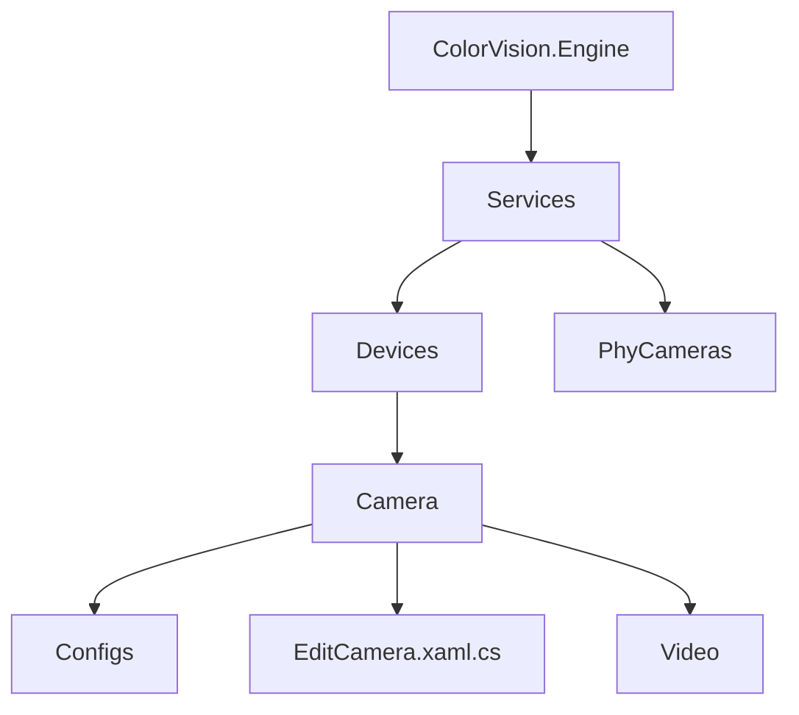

# 相机参数配置


# 相机参数配置

## 目录
1. [引言](#引言)
2. [项目结构](#项目结构)
3. [核心组件](#核心组件)
4. [架构概述](#架构概述)
5. [详细组件分析](#详细组件分析)
6. [依赖关系分析](#依赖关系分析)
7. [性能考虑](#性能考虑)
8. [故障排查指南](#故障排查指南)
9. [结论](#结论)

## 引言
本文档旨在详细介绍本项目中相机参数的配置方法，包括分辨率、帧率、曝光时间、增益、触发模式等关键参数的设置。通过对代码的深入分析，帮助用户理解这些参数如何影响图像质量和采集性能，从而实现更优的相机配置和应用效果。

本项目基于ColorVision引擎，涉及对物理相机设备的管理和参数配置，支持多种相机型号和模式，提供丰富的配置接口和用户交互界面。

## 项目结构
项目整体采用模块化设计，代码组织清晰，按功能和设备类型划分目录。针对相机设备的配置和管理主要集中在如下目录：

- `/Engine/ColorVision.Engine/Services/Devices/Camera/`  
  该目录包含相机设备服务相关代码，包括配置类、UI编辑窗口、视频处理等子模块。  
  其中：
  - `Configs` 子目录存放相机参数配置类，如`ConfigCamera.cs`，定义了相机的各项参数及其属性。
  - 主目录中如`EditCamera.xaml.cs`为相机配置的编辑窗口，负责用户交互和参数绑定。

- `/Engine/ColorVision.Engine/Services/PhyCameras/`  
  物理相机管理模块，负责物理设备的注册、管理和状态维护。

- `/Engine/ColorVision.Engine/Services/Devices/Camera/Video/`  
  视频相关配置和控制逻辑。

文件命名规范清晰，类名和文件名一一对应，方便查找和维护。UI文件采用WPF技术，代码文件后缀为`.xaml.cs`，逻辑与界面分离。

整体架构体现了MVVM设计模式，UI层通过数据绑定与配置数据模型交互，服务层负责设备管理和参数应用，保证了代码的清晰分层和职责分明。



## 核心组件

### 1. ConfigCamera（相机配置类）
- 负责定义相机的所有配置参数。
- 包含分辨率（ImageBpp）、通道（Channel）、曝光时间（ExpTime及其分通道设置）、增益（Gain）、饱和度（Saturation）等。
- 支持自动曝光（IsAutoExpose）和文件缓存设置。
- 继承自`DeviceServiceConfig`，实现`IFileServerCfg`接口，支持文件服务器相关配置。
- 内部包含视频配置（VideoConfig）、色彩校正（ZBDebayer）、电机配置（MotorConfig）等复杂子配置。

### 2. EditCamera（相机配置编辑窗口）
- WPF窗口类，负责用户界面交互。
- 绑定`DeviceCamera`设备实例和`ConfigCamera`配置副本，实现参数的编辑和更新。
- 支持物理相机列表选择，自动更新配置。
- 支持输入框回车事件处理，提升用户体验。
- 通过`PropertyEditorHelper`动态生成参数编辑控件，支持复杂配置的可视化编辑。

## 架构概述
系统采用分层架构和MVVM模式，设备服务层负责物理设备管理和参数应用，UI层负责配置展示与用户交互。配置数据模型（如`ConfigCamera`）作为中间层，桥接UI与设备服务。

相机配置参数的变化通过属性通知机制（`NotifyPropertyChanged`）实时反映到UI，保证数据同步。物理相机管理单例（`PhyCameraManager`）维护所有物理设备信息，支持设备绑定和配置同步。

整体架构确保了灵活的参数配置管理，支持多设备、多模式的统一管理和扩展。

## 详细组件分析

### 1. EditCamera.xaml.cs
该文件实现了相机配置的编辑窗口逻辑，主要功能包括：

- 构造函数初始化设备实例并加载UI组件。
- `UserControl_Initialized`方法中加载物理相机列表，绑定当前设备对应的物理相机，初始化配置副本。
- 动态生成视频配置、色彩校正和文件服务器配置的属性编辑控件，方便用户编辑复杂参数。
- `UpdateConfig`方法根据选中的物理相机更新配置参数，如通道、滤光片（CFW）、电机配置、相机模式等。
- 事件处理函数支持按键事件（回车切换焦点）、按钮点击保存配置、物理相机选择变化自动更新配置。

代码示例：

```csharp
public void UpdateConfig()
{
    if (CameraPhyID.SelectedIndex > -1)
    {
        var phyCamera = PhyCameras[CameraPhyID.SelectedIndex];
        EditConfig.Channel = phyCamera.Config.Channel;
        EditConfig.CFW.CopyFrom(phyCamera.Config.CFW);
        EditConfig.MotorConfig.CopyFrom(phyCamera.Config.MotorConfig);

        EditConfig.CameraMode = phyCamera.Config.CameraMode;
        EditConfig.CameraModel = phyCamera.Config.CameraModel;
        EditConfig.TakeImageMode = phyCamera.Config.TakeImageMode;
        EditConfig.ImageBpp = phyCamera.Config.ImageBpp;
    }
}
```

### 2. ConfigCamera.cs
该类定义了相机所有可配置参数及其属性，重点如下：

- **分辨率与颜色位深**：通过`ImageBpp`属性设置图像的位深度，影响图像细节表现。
- **通道选择**：`Channel`属性支持单通道或三通道配置，影响颜色采集方式。
- **曝光时间**：`ExpTime`及其分通道值（`ExpTimeR`, `ExpTimeG`, `ExpTimeB`）支持精细调节曝光，影响图像亮度和清晰度。
- **增益**：`Gain`属性调节信号放大倍数，影响图像亮度和噪声水平。
- **饱和度**：`Saturation`及分通道设置调节颜色强度。
- **自动曝光**：`IsAutoExpose`控制是否启用自动曝光功能。
- **文件缓存与保存**：支持文件缓存及CVCIE格式文件保存，保证数据存储性能和格式兼容。

此外还包括相机模式、型号、拍摄模式、视频配置、滤光片（CFW）、电机配置、自动对焦参数等，支持丰富的硬件控制和参数微调。

代码示例：

```csharp
public double ExpTime { get => _ExpTime; set { _ExpTime = value; NotifyPropertyChanged(); NotifyPropertyChanged(nameof(ExpTimeLog)); } }
private double _ExpTime = 10;

public float Gain { get => _Gain; set { _Gain = value; NotifyPropertyChanged(); } }
private float _Gain = 10;
```

## 依赖关系分析
- `EditCamera`依赖`DeviceCamera`，后者包含设备服务`MQTTCamera`和配置`ConfigCamera`。
- `ConfigCamera`依赖多个子配置类如`CameraVideoConfig`、`CFWPORT`、`MotorConfig`、`AutoFocusParam`等，体现组合复用。
- 物理相机管理通过`PhyCameraManager`单例提供设备列表和配置数据，保证设备与配置的一致性。
- 事件驱动机制（如`ConfigChanged`事件）实现配置更新和设备状态同步。

## 性能考虑
- 曝光时间、增益和帧率等参数直接影响采集性能和图像质量，合理配置可平衡速度与效果。
- 文件缓存启用可提升数据写入速度，避免采集过程中阻塞。
- 配置变更及时通知UI和设备，保证响应速度和用户体验。
- 通过属性变更通知机制减少不必要的UI刷新，优化性能。

## 故障排查指南
- 若相机参数修改无效，检查配置是否正确复制到设备实例。
- 确认物理相机与逻辑设备绑定是否正确，避免配置错乱。
- 关注曝光时间和增益设置，避免过曝或图像噪声过大。
- 文件缓存和保存路径配置错误可能导致数据丢失或写入失败。

## 结论
本项目通过模块化设计和MVVM架构，实现了对相机参数的全面管理和灵活配置。`ConfigCamera`类详细定义了关键参数，`EditCamera`窗口提供了直观的编辑界面。合理调整分辨率、帧率、曝光时间、增益、触发模式等参数，有助于提升图像质量和采集效率。

通过本文档，用户不仅能理解相机参数的作用，还能掌握如何在系统中配置和应用这些参数，实现最佳的图像采集效果。

