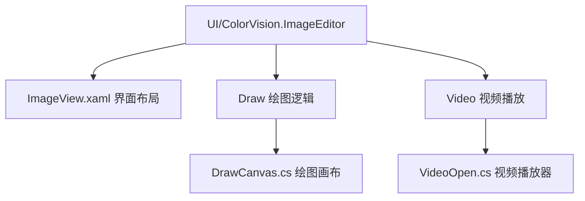
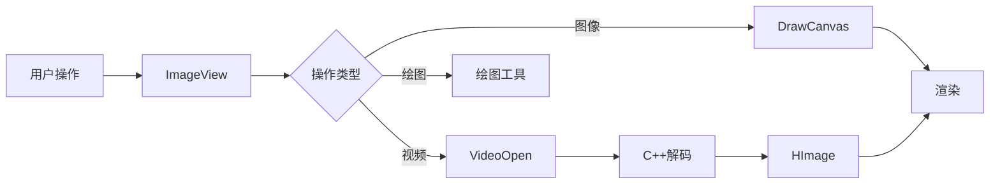

# 图像编辑器

## 目录
1. [介绍](#介绍)
2. [功能特性](#功能特性)
3. [视频播放](#视频播放)
4. [项目结构](#项目结构)
5. [核心组件](#核心组件)
6. [架构概述](#架构概述)
7. [详细组件分析](#详细组件分析)
    - [ImageView.xaml](#imageviewxaml)
    - [DrawCanvas.cs](#drawcanvascs)
    - [VideoOpen.cs](#videoopencs)
8. [依赖分析](#依赖分析)
9. [性能考虑](#性能考虑)
10. [故障排除指南](#故障排除指南)
11. [总结](#总结)

---

## 介绍

本文档介绍了内置图像编辑器的功能，包括图像显示、缩放、ROI（感兴趣区域）选择、绘图工具、伪彩色处理、直方图显示、3D视图等功能。**v1.5+ 版本新增视频播放功能**，支持多种视频格式的高性能播放。

文档详细解析了图像编辑器的代码结构、核心组件及其实现细节，帮助用户理解其工作原理和使用方法。

---

## 功能特性

### 图像处理
- 多格式图像显示（PNG、JPG、BMP、TIFF、RGB48等）
- 流畅的缩放、平移和适配
- 伪彩色映射和直方图分析
- 3D 可视化（CIE色彩空间、深度图）

### 绘图工具
- 几何图形：矩形、圆形、多边形、贝塞尔曲线
- 文本标注和测量工具
- 标尺和比例尺显示
- 撤销/重做支持

### 视频播放 (v1.5+)
- **支持格式**: MP4、AVI、MKV、MOV、WMV、FLV、WebM
- **播放控制**: 播放/暂停/停止、进度拖拽、倍速播放
- **音频同步**: 自动音画同步，支持静音
- **降采样预览**: 1x/1/2/1/4/1/8 缩放，优化高分辨率视频
- **自动隐藏**: 播放时工具栏自动隐藏

---

## 视频播放

### 使用方式

打开支持的视频文件（MP4、AVI、MKV、MOV、WMV、FLV、WebM）后，图像编辑器会自动切换到视频播放模式，底部工具栏显示视频控制按钮：

![视频播放界面示意图]

**控制按钮说明：**

| 按钮 | 功能 |
|------|------|
| ▶ | 播放 |
| ⏸ | 暂停 |
| ■ | 停止并回到开头 |
| 🔊 | 取消静音 |
| 🔇 | 静音 |
| 进度条 | 显示/调整当前播放位置 |
| 速度选择 | 调整播放速度 (0.25x - 4x) |
| 缩放选择 | 调整预览分辨率 (1x / 1/2 / 1/4 / 1/8) |
| Auto Hide | 启用/禁用自动隐藏工具栏 |

### 播放高分辨率视频

对于 4K/8K 高分辨率视频，建议使用降采样功能提升流畅度：

1. 打开视频后，如果感觉卡顿，将**缩放选择**改为 1/2、1/4 或 1/8
2. 降采样会减小显示分辨率，但播放更流畅
3. 原始视频信息（分辨率、帧数）始终显示在工具栏

### 音画同步

播放器会自动检测并修正音频漂移。如果发现音画不同步：
1. 暂停后重新播放
2. 使用进度条跳转到其他位置再跳回
3. 检查原始视频文件是否正常

---

## 项目结构

该图像编辑器属于一个较大的软件项目，位于 `/UI/ColorVision.ImageEditor` 目录下。项目采用模块化设计，代码按照功能划分，界面使用WPF（Windows Presentation Foundation）技术实现，结合了WinForms控件和自定义绘图组件。

主要目录结构说明：
- `/UI/ColorVision.ImageEditor/`：图像编辑器的主界面和相关控件实现
- `/UI/ColorVision.ImageEditor/Draw/`：绘图相关的核心逻辑实现，如绘图画布、绘图工具等
- `/UI/ColorVision.ImageEditor/Video/`：视频播放功能实现（v1.5+）
- `/UI/ColorVision.ImageEditor/EditorTools/`：编辑工具集（缩放、旋转、图像处理算法等）
- 资源文件和XAML布局文件，定义了界面布局、样式和交互控件

该结构清晰分离了界面布局与绘图逻辑，视频播放作为独立模块通过 `IImageOpen` 接口集成，便于维护和扩展。



---

## 核心组件

图像编辑器的核心组件包括：

1. **ImageView.xaml**  
   负责图像显示的界面布局，集成了图像显示控件、工具栏、属性面板、缩放控件、伪彩色调节、绘图工具按钮等。它是用户与图像交互的主要界面。

2. **DrawCanvas.cs**  
   作为绘图画布控件，继承自 `Image`，负责图像上的绘图操作管理，包括绘图元素的添加、删除、撤销重做、鼠标事件处理等。实现了丰富的绘图命令管理和事件处理机制。

3. **VideoOpen.cs** (v1.5+)
   视频播放控制器，实现 `IImageOpen` 接口。通过 C++ 层的 OpenCV 进行视频解码，C# 层负责渲染和播放控制，支持音频同步。

---

## 架构概述

图像编辑器基于WPF技术，采用MVVM设计模式，界面与逻辑分离。界面通过XAML定义，绑定到ViewModel，实现数据驱动的UI更新。绘图逻辑封装在自定义控件中，支持多种绘图操作和撤销重做功能。视频播放通过跨语言架构实现，C++ 负责解码，C# 负责渲染和控制。

主要交互流程：
- 用户通过ImageView界面操作图像、视频和绘图工具
- DrawCanvas负责捕获鼠标事件，管理绘图元素
- VideoOpen通过 OpenCVMediaHelper 与 C++ 层交互，管理视频解码和播放
- 属性面板动态显示所选绘图元素的属性，支持编辑
- 工具栏提供缩放、伪彩色调整、绘图工具选择、视频播放控制等功能



---

## 详细组件分析

### ImageView.xaml

Source:
 - [https://github.com/xincheng213618/scgd_general_wpf/blob/master/UI/ColorVision.ImageEditor/ImageView.xaml](ImageView.xaml)

#### 组件目的
`ImageView.xaml` 是图像编辑器的主用户控件，定义了图像显示区域及其辅助工具界面。它集成了图像显示、缩放、绘图工具栏、属性显示、伪彩色调节、3D视图按钮等。

#### 主要功能区域
1. **图像/视频显示区域**  
   使用自定义控件 `DrawCanvas` 包裹在 `ZoomboxSub` 中，支持高质量缩放显示。视频播放时复用同一显示区域。

2. **工具栏**  
   包含顶部、底部、左右多组工具栏：
   - 图像缩放控制
   - 绘图工具选择（圆形、矩形、多边形、贝塞尔曲线）
   - 图像操作（打开、保存、清除）
   - 伪彩色调节
   - 直方图、3D视图
   - **视频播放控制**（播放/暂停、进度、速度、缩放）

3. **属性面板**  
   通过WinForms的 `PropertyGrid` 显示选中绘图元素的属性，支持动态显示和编辑。

4. **伪彩色调节**  
   使用 `RangeSlider` 控件调整伪彩色的起止值，配合色彩图像显示。

5. **等待控件**  
   加载数据时显示进度环和进度条，提升用户体验。

6. **高级设置面板**  
   包含白平衡调节（红绿蓝通道）、伽马、亮度、对比度、阈值调整以及滤除摩尔纹功能。

#### 重要控件示例
```xml
<draw:ZoomboxSub x:Name="Zoombox1" MaxZoom="{Binding MaxZoom}" MinZoom="{Binding MinZoom}">
    <draw:DrawCanvas x:Name="ImageShow" Initialized="ImageShow_Initialized" />
</draw:ZoomboxSub>
```
这里 `ZoomboxSub` 是缩放容器，`DrawCanvas` 是实际绘图画布。

#### 交互绑定
界面控件大量采用绑定（Binding）机制连接ViewModel属性，实现界面与数据同步更新。

---

### DrawCanvas.cs

Source:
 - [https://github.com/xincheng213618/scgd_general_wpf/blob/master/UI/ColorVision.ImageEditor/Draw/DrawCanvas.cs](DrawCanvas.cs)

#### 组件目的
`DrawCanvas` 是一个继承自WPF `Image` 控件的自定义绘图画布，负责管理绘图元素的显示、添加、删除和用户交互事件（如鼠标点击、双击）。

#### 关键功能
1. **绘图元素管理**  
   内部维护一个 `List<Visual>` 存储所有绘图元素。支持添加和移除绘图元素，同时更新视觉和逻辑树。

2. **撤销与重做**  
   通过两个 `ObservableCollection<ActionCommand>` 分别管理撤销栈和重做栈，实现绘图操作的撤销和重做功能。

3. **鼠标双击事件**  
   自定义实现鼠标双击事件，判断两次点击间隔小于300毫秒触发双击事件。

4. **命令绑定**  
   绑定系统命令 `Undo` 和 `Redo`，以及自定义命令 `UndoHistory`，实现快捷键操作和菜单绑定。

5. **命中测试**  
   支持通过点和区域检测绘图元素，方便实现选中和编辑功能。

#### 重要方法示例
```csharp
public void AddVisual(Visual visual, bool recordAction = true)
{
    visuals.Add(visual);
    AddVisualChild(visual);
    AddLogicalChild(visual);
    VisualsAdd?.Invoke(visual, EventArgs.Empty);
    VisualsChanged?.Invoke(visual, EventArgs.Empty);

    if (recordAction)
    {
        Action undoaction = () => RemoveVisual(visual, false);
        Action redoaction = () => AddVisual(visual, false);
        AddActionCommand(new ActionCommand(undoaction, redoaction) { Header = "添加" });
    }
}
```
该方法添加绘图元素，并记录撤销操作。

---

### VideoOpen.cs

Source:
 - [https://github.com/xincheng213618/scgd_general_wpf/blob/master/UI/ColorVision.ImageEditor/Video/VideoOpen.cs](VideoOpen.cs)

#### 组件目的
`VideoOpen` 是视频播放控制器，实现 `IImageOpen` 接口。它负责：
- 通过 `OpenCVMediaHelper` 与 C++ 层交互进行视频解码
- 管理 WPF MediaPlayer 进行音频播放
- 处理播放控制UI（工具栏按钮、进度条、速度选择等）
- 实现帧丢弃和降采样逻辑，优化高分辨率视频播放

#### 技术架构

```
视频文件 → C++ OpenCV解码 → HImage → C# WriteableBitmap → WPF渲染
                ↓
         音频文件 → WPF MediaPlayer → 音频输出
                ↓
            音视频同步
```

#### 关键功能

1. **跨语言视频解码**  
   使用 C++ 层的 OpenCV + FFmpeg 进行视频解码，通过 P/Invoke 接口与 C# 层交互。
   ```csharp
   int handle = OpenCVMediaHelper.M_VideoOpen(filePath, out var info);
   OpenCVMediaHelper.M_VideoPlay(handle, frameCallback, statusCallback, IntPtr.Zero);
   ```

2. **音频同步**  
   使用 WPF MediaPlayer 独立播放音频，定期检测视频时间与音频位置的差异，自动修正漂移。
   ```csharp
   private void CorrectAudioSync(int currentFrame)
   {
       double videoTime = currentFrame / fps;
       double audioTime = player.Position.TotalSeconds;
       if (Math.Abs(videoTime - audioTime) > 0.5)
           player.Position = TimeSpan.FromSeconds(videoTime);
   }
   ```

3. **性能优化**  
   - **最新帧槽模型**: 生产者（解码）不等待消费者（渲染）
   - **pyrDown 降采样**: 使用 OpenCV 图像金字塔下采样
   - **并行内存拷贝**: 大帧使用 `Parallel.For` 多线程拷贝
   - **帧丢弃**: UI 繁忙时自动跳过帧
   - **UI 节流**: 进度条每 10 帧更新一次

4. **播放控制UI**  
   动态创建并添加到工具栏：
   - 播放/暂停/停止按钮
   - 进度条（支持点击和拖拽跳转）
   - 速度选择（0.25x - 4x）
   - 缩放选择（1x / 1/2 / 1/4 / 1/8）
   - 时间显示和帧信息显示
   - 静音按钮
   - 自动隐藏复选框

5. **自动隐藏工具栏**  
   播放时工具栏自动隐藏，鼠标移动时显示：
   ```csharp
   private void SetupAutoHideTimer(ImageView imageView)
   {
       _mouseIdleTimer = new DispatcherTimer { Interval = TimeSpan.FromMilliseconds(500) };
       _mouseIdleTimer.Tick += (s, e) =>
       {
           if ((DateTime.Now - _lastMouseMoveTime).TotalSeconds > 3.0)
               _videoToolBar.Opacity = 0; // 隐藏
       };
   }
   ```

#### 高分辨率视频支持

| 分辨率 | 原始帧率 | 建议缩放 | 预期效果 |
|--------|----------|----------|----------|
| 1080p | 60fps | 1x | ✅ 流畅 |
| 4K | 60fps | 1x | ✅ 流畅 |
| 8K | 60fps | 1/4x 或 1/8x | ⚠️ 需降采样 |

对于 8K 视频，使用 1/4 降采样后，数据传输量减少 93.75%，可实现流畅播放。

---

## 依赖分析

- `ImageView.xaml` 依赖 `DrawCanvas` 作为核心绘图控件
- `DrawCanvas` 使用 `ActionCommand` 管理撤销重做，依赖 `ColorVision.Common.MVVM` 命令模型
- `VideoOpen` 依赖 `OpenCVMediaHelper` (C++ 互操作) 和 `MediaPlayer` (音频)
- 控件间通过数据绑定和事件机制解耦，符合MVVM设计模式
- 使用 `WindowsFormsHost` 集成WinForms控件 `PropertyGrid`，实现属性编辑功能
- 伪彩色调节依赖第三方控件 `HandyControl` 的 `RangeSlider`

---

## 性能考虑

### 图像处理
- 绘图元素使用 `Visual` 对象管理，减少UI元素数量，提升渲染性能
- 撤销重做通过命令封装，避免重复渲染
- 缩放控件使用高质量位图缩放，保证图像清晰
- 命中测试使用WPF视觉树的HitTest，效率较高

### 视频播放
- **最新帧槽模型**: 生产者不阻塞，始终推送最新帧，避免播放卡顿
- **pyrDown 降采样**: 使用 OpenCV 图像金字塔进行高效下采样
- **并行内存拷贝**: 大帧（>1MB）使用 `Parallel.For` 多线程拷贝，8K帧从~25ms降至~5ms
- **帧丢弃机制**: UI 线程繁忙时自动跳过帧，保证时间线稳定
- **UI 更新节流**: 进度条和时间显示每 10 帧更新一次，减少UI开销

---

## 故障排除指南

### 图像问题
- 若图像不显示，检查 `DrawCanvas` 是否正确初始化及添加绘图元素
- 缩放异常时，确认 `ZoomboxSub` 的最大最小缩放绑定值是否合理
- 属性面板不显示，确认 `PropertyIsChecked` 绑定状态及 `WindowsFormsHost` 是否加载
- 撤销重做无效，检查 `UndoStack` 和 `RedoStack` 是否正确维护

### 视频播放问题

| 问题 | 可能原因 | 解决方案 |
|------|----------|----------|
| 视频无法打开 | 格式不支持或文件损坏 | 检查文件格式（支持 MP4/AVI/MKV/MOV/WMV/FLV/WebM） |
| 播放卡顿 | 分辨率过高或 CPU 负载高 | 使用降采样功能（1/2、1/4、1/8） |
| 音画不同步 | 音频漂移未自动修正 | 暂停后重新播放，或跳转后跳回 |
| 只有视频没有声音 | 音频编码不支持 | 检查视频文件的音频编码 |
| 工具栏不自动隐藏 | Auto Hide 未启用 | 勾选 Auto Hide 复选框 |
| 帧信息显示 D:xxx | 帧被丢弃（正常优化行为） | 高分辨率视频会自动丢弃帧，属正常情况 |

---

## 总结

本图像编辑器模块通过WPF强大的数据绑定和自定义控件机制，实现了丰富的图像显示和编辑功能。核心的 `DrawCanvas` 控件支持灵活的绘图操作和撤销重做管理，`ImageView` 界面集成了多种工具栏和属性面板，满足用户多样化的图像操作需求。

**v1.5+ 版本新增的视频播放功能**采用 C++/C# 跨语言架构，通过 OpenCV 解码和 WPF 渲染，结合音频同步、帧丢弃、降采样等优化策略，实现了高分辨率视频（最高支持 8K@60fps）的流畅播放。视频播放作为独立模块通过 `IImageOpen` 接口集成，保持了架构的清晰和可扩展性。

整体设计符合现代软件架构理念，易于扩展和维护。
