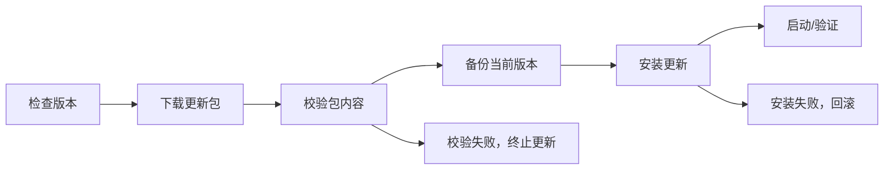

# 自动更新

本页保留 ColorVision 自动更新的工程入口。安装器和更新包的实际发布流程以 [部署概览](./overview.md) 与 [构建与发布脚本](../scripts/README.md) 为准。

## 更新流程

## 相关位置

| 范围 | 位置 |
| --- | --- |
| 安装器和更新程序 | `src/ColorVisionSetup/` |
| 发布和更新脚本 | `Scripts/` |
| 发布版本号 | `Directory.Build.props` 的 `VersionPrefix` |
| 版本历史 | 根目录 `CHANGELOG.md` |

## 维护要求

- 正式发布使用 `Scripts\release.bat`。
- 增量更新包上传失败时，`Scripts\build_update.py` 必须返回失败码。
- 修改更新机制时，同步更新部署概览、构建脚本文档和 CHANGELOG。
- 不新增本地-only 主安装包发布捷径。
