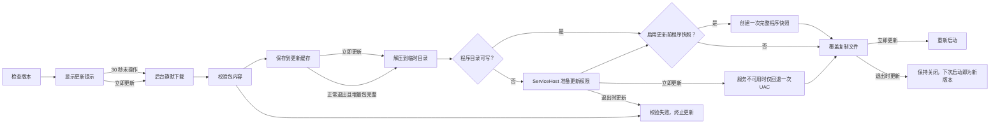

# 自动更新

本页保留 ColorVision 自动更新的工程入口。安装器和更新包的实际发布流程以 [部署概览](./overview.md) 与 [构建与发布脚本](../scripts/README.md) 为准。

## 更新流程

同一主次版本内使用增量更新包链，跨主次版本直接运行完整安装程序。增量更新采用覆盖复制，不再创建旧式 `UpdateBackup`、恢复状态或回滚脚本。主程序、插件和组合更新统一使用“更新前创建程序快照”开关，默认关闭；关闭时更新流程不会读取或创建程序快照，已有快照不会影响更新速度。需要现场兜底时开启该选项，更新执行入口会在替换文件前创建一次完整程序快照。

客户端继续使用 `GET /api/app/latest-version`、`POST /api/plugins/batch-version-check` 和插件详情接口。主程序版本与插件批量版本并发查询，只有批量结果确认存在新版的插件才会并发读取详情并筛选兼容版本；不会再为全部插件逐个请求版本。最近一次成功的主程序版本、插件批量版本和插件详情在进程内保留 5 分钟，重复打开更新窗口直接复用，并发检查也会由现有锁与缓存合并。Marketplace 的显式“刷新”操作仍会强制重新查询。

更新窗口在“程序备份”旁提供“不使用系统代理”选项，默认开启。开启时使用独立的直连 `HttpClient`；取消勾选后，更新检查和 Marketplace 请求遵循 Windows 系统代理。修改从下一次请求生效。该选项只影响 HTTP 元数据与 Marketplace 请求，不改变 aria2 下载和程序快照行为。短暂网络故障时优先使用进程内最近一次成功结果；从未成功取得元数据时不会凭空生成更新计划。

更新提示显示 30 秒后会静默预下载主程序和插件包。退出时只自动应用已经完整缓存并通过校验的增量包；程序目录不可写时，必须由 `ColorVisionServiceHost` 在 3 秒内静默准备好目录权限，否则本次退出直接跳过，不弹 UAC、不阻塞关闭。主程序和插件分别判断包是否可用：任意一方未准备好不会阻止另一方更新。完整安装程序可以预下载和复用，但不会在退出时自动运行；后台启动检查仍会按当前主程序版本独立查询和预下载兼容插件，使已经准备好的插件可以在退出时单独更新。

权限准备按最短路径执行：便携版、非系统盘或其他本来可写的程序目录直接更新，不调用特权服务；只有目录不可写时才请求 `ColorVisionServiceHost`，用户主动更新时服务仍不可用才使用 UAC 兜底。

下载完成的安装包、增量包和插件包保留在各自的更新缓存中，供后续重装、还原或复用；更新结束时只删除 `%TEMP%` 下本次生成的解压和拼装目录。缓存除了检查文件结构，还会核对包内 `ColorVision.exe` 或完整安装程序的目标版本，避免同名旧包被当成新版本使用。校验失败或暂时无法读取的缓存包不会直接删除，而是移入同级 `Recovery` 目录并重新下载。无法读取的普通程序快照保留原位；手动重建默认快照时，旧文件会先保留到 `Recovery`。

程序快照按安装目录隔离，同一台电脑上的便携版、测试版和正式版不会再共用默认快照；历史全局快照仍会显示，避免升级后看不到旧备份。打开“程序备份”窗口只加载列表，不再强制创建默认快照；删除默认快照也不会自动重建。手动重建仍采用先生成后替换：新快照完整写入后，旧快照才会移动到 `Recovery`，替换失败时旧快照会恢复到原位置。自动更新快照每个安装目录最多保留 3 份；创建时使用快速压缩，已压缩媒体和包文件不重复压缩，并忽略 `log/`、`.pdb`、`.tmp` 与更新批处理等非运行时文件。还原使用原进程 PID 和 ServiceHost 权限通道，不按进程名关闭其他 ColorVision 实例；ShellExtension 文件保留在快照中但不做在线覆盖。

主程序、插件和快照的外部批处理会向当前安装目录对应的 `%LocalAppData%\ColorVision\UpdateState\<安装标识>\update.log` 追加开始、成功或失败记录，便于定位静默更新没有生效的问题。

## 相关位置

| 范围 | 位置 |
| --- | --- |
| 安装器和更新程序 | `src/ColorVisionSetup/` |
| 发布和更新脚本 | `Scripts/` |
| 发布版本号 | `Directory.Build.props` 的 `VersionPrefix` |
| 版本历史 | 根目录 `CHANGELOG.md` |

## 维护要求

- 正式发布使用 `Scripts\release.bat`。
- 增量更新包上传失败时，`Scripts\build_update.py` 必须返回失败码。
- 主程序增量包只使用 `.cvx`；普通 `.zip` 仅作为第三方插件包兼容格式，不再识别旧式主程序更新 ZIP。
- `.cvx` 是在线更新计划使用的差异包，不提供双击或文件打开直接安装；离线升级旧版本必须使用完整安装包，避免绕过多版本增量链。
- 增量包始终携带完整 `ServiceHost/` 目录，不能只打入相对上一版本发生变化的服务文件。
- 正式安装包构建前必须同时校验顶层运行时 DLL 和完整 `ServiceHost/` 目录已经进入 Advanced Installer 项目。
- 启动检查只保留进程内待更新计划；应用重启后重新查询服务器，不持久化检测到的版本。
- 退出自动更新不重启应用；下一次由用户正常启动新版本。
- 立即更新、静默预下载和主程序/插件组合更新共用同一套下载缓存与包校验入口，不再各自维护下载回调。
- 最终安装入口会重新校验全部 `.cvx`；插件市场、本地文件和最终暂存共用插件包可安装判断，带 `.aria2` 的下载中包、损坏包、空包和非 `.cvxp/.zip` 文件都会被拒绝。组合更新中的插件包统一按 `manifest.id` 暂存；第三方根目录包、官方包和主程序包内已有插件目录使用同一套覆盖规则。
- 更新脚本和解包中间文件位于暂存根目录，真正的覆盖复制源固定为其 `ColorVision/` 子目录；`update.bat`、`Packages/` 等辅助文件不会进入程序目录，复制成功或失败后都会删除整个暂存根目录。
- 更新元数据请求失败时仅复用本进程最近一次成功结果；没有成功缓存时结束本次检查，不凭空生成更新计划。
- 修改更新机制时，同步更新部署概览、构建脚本文档和 CHANGELOG。
- 不新增本地-only 主安装包发布捷径。
