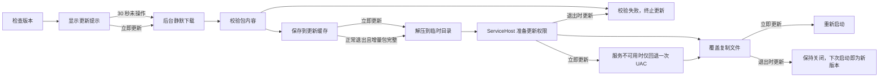

# 自动更新

本页保留 ColorVision 自动更新的工程入口。安装器和更新包的实际发布流程以 [部署概览](./overview.md) 与 [构建与发布脚本](../scripts/README.md) 为准。

## 更新流程

同一主次版本内使用增量更新包链，跨主次版本直接运行完整安装程序。增量更新采用覆盖复制，不创建自动备份、恢复状态或回滚脚本；需要保留当前程序时，可独立使用“程序备份”功能。

更新提示显示 30 秒后会静默预下载主程序和插件包。退出时只自动应用已经完整缓存并通过校验的增量包，而且必须由 `ColorVisionServiceHost` 在 3 秒内静默准备好目录权限；否则本次退出直接跳过，不弹 UAC、不阻塞关闭。完整安装程序可以预下载和复用，但不会在退出时自动运行。

## 相关位置

| 范围 | 位置 |
| --- | --- |
| 安装器和更新程序 | `src/ColorVisionSetup/` |
| 发布和更新脚本 | `Scripts/` |
| 发布版本号 | `Directory.Build.props` 的 `VersionPrefix` |
| 版本历史 | 根目录 `CHANGELOG.md` |

## 维护要求

- 正式发布使用 `Scripts\release.bat`。
- 增量更新包上传失败时，`Scripts\build_update.py` 必须返回失败码。
- 增量包始终携带完整 `ServiceHost/` 目录，不能只打入相对上一版本发生变化的服务文件。
- 启动检查只保留进程内待更新计划；应用重启后重新查询服务器，不持久化检测到的版本。
- 退出自动更新不重启应用；下一次由用户正常启动新版本。
- 更新元数据请求失败时直接结束本次检查，不使用过期版本结果继续更新。
- 修改更新机制时，同步更新部署概览、构建脚本文档和 CHANGELOG。
- 不新增本地-only 主安装包发布捷径。
