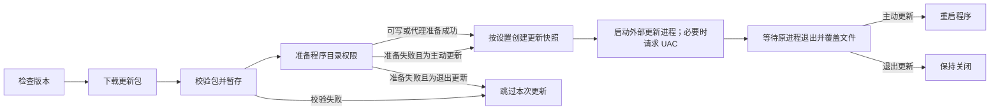

# 检查更新、重新安装与程序备份

ColorVision 在“检查更新”窗口中统一查看主程序与插件更新，并提供变更日志、重新安装和程序备份入口。本页说明操作、完成条件和失败定位；安装器及更新包的发布流程见[部署概览](./overview.md)与[构建与发布脚本](../scripts/README.md)。

## 检查并安装更新

1. 从帮助菜单打开 **检查更新**，等待检查结束。
2. 有更新时核对主程序和插件项目，选择需要安装的项目，再点击 **立即更新**。下载、校验和安装交接完成后按提示重启。
3. 显示 **已是最新版本** 时可关闭窗口；需要获取完整安装程序时使用左下角的 **重新安装**。
4. 右上角 **变更日志** 在浏览器打开在线日志及下载页面；**程序备份** 打开快照管理窗口。

检查失败时先看错误状态与网络配置。窗口没有列出更新项不一定代表服务器已确认没有新版。

### 网络设置

设置中的“不使用系统代理”选项默认开启，开启时使用独立的直连 `HttpClient`；取消勾选后，更新检查和 Marketplace 请求遵循 Windows 系统代理。修改从下一次请求生效。该选项只影响 HTTP 元数据与 Marketplace 请求，不改变 aria2 下载和程序快照行为。

## 重新安装

更新窗口仅在检查结束且没有更新项时，在左下角显示“重新安装”；检查中或存在主程序、插件等更新项时隐藏，取消勾选更新项不会使其出现。显示“已是最新版本”或本轮主程序/插件检查失败且没有更新项时，仍可点击该入口：客户端重新请求主程序最新版本，仅在服务器确认成功且版本有效时生成完整安装计划，不以当前版本是否更低为条件。断网或请求失败时，即使接口返回上次成功的版本缓存，也不启动重装；窗口显示错误并允许重试。

重新安装取消待执行的启动更新及其预下载，不等待增量包或合并插件更新，直接下载最新版本的完整 `.exe` 安装包；已有通过结构与目标版本校验的完整包可复用。获取版本期间禁用重复操作，关闭窗口不会启动安装。包校验成功后启动完整安装器，并按更新前快照选项、配置保存与退出交接流程执行。此入口用于增量更新异常但仍能打开更新窗口的情况；安装器启动不代表重装或问题修复已完成，需要在目标环境完成安装并重新启动验证。

## 程序备份与还原

从更新窗口点击 **程序备份**，查看列表中的类型、时间、版本、大小和文件。打开窗口只加载可用快照；**打开目录** 可能创建尚不存在的目录，但不会自动创建默认快照。

### 选择快照类型

| 类型 | 创建方式 | 保留规则 |
| --- | --- | --- |
| 自动存档 / `autosave.zip` | 正常启动后后台生成，默认开启 | 在当前自动存档位置保留一份；同版本已有可读自动存档时跳过 |
| 默认快照 / `default.zip` | 手动选择“重建默认” | 生成新文件后替换；删除后不会因打开窗口而重建 |
| 用户快照 | 点击“创建快照” | 以版本和时间命名，由用户选择删除 |
| 更新快照 | 开启“更新前创建程序快照”后，在更新替换前创建 | 每个安装目录最多保留 3 份 |

**正常启动后自动存档** 与 **更新前创建程序快照** 是独立选项，后者默认关闭，主程序、插件和组合更新共用它；关闭时不为此次更新读取或创建程序快照。自动存档在主窗口首次呈现且插件正常加载、未临时跳过插件时调度，后台等待约 10 秒后检查版本并生成。关闭自动存档不会删除已有文件；删除自动存档后，后续符合条件的启动会重新创建。

### 保存位置与内容

快照默认按安装目录标识保存到 `%APPDATA%\ColorVision\Snapshots\Application\<安装标识>`；列表也包含可读取的历史全局快照。自动存档可通过“更改位置”使用其他完整路径，不能放在当前程序目录内；“默认位置”恢复默认路径。改位置只更新后续读取/保存的位置，不移动已有存档。

快照按文件复制当前程序目录，包括其插件和运行组件；忽略 `log/`、`.pdb`、`.tmp` 和 `update.bat`，使用快速压缩，已压缩媒体与包文件不重复压缩。程序目录外的用户配置、MySQL 数据和结果文件不在这项备份范围内，参见[数据所有者与存储定位](../../01-user-guide/data-management/README.md)。运行中逐文件读取也不提供所有文件同一时刻的一致性快照。

### 创建、删除与还原

1. 需要保留当前程序时点击“创建快照”，等待列表出现完成的快照；重建基准使用“重建默认”。
2. 删除时选择一项并确认。默认快照不会自动重建，自动存档受上述正常启动策略控制。
3. 还原时先核对所选版本和文件，点击“还原所选”并确认退出程序。客户端解压 ZIP、准备外部脚本，通过权限代理或 UAC 取得所需权限后交接还原。
4. 外部脚本等待原进程退出后覆盖文件并重启。重新启动后再确认程序版本与功能；快照可读取、ZIP 可解压或脚本已启动都不等于还原成功。

无法读取的普通程序快照保留原位。手动重建默认快照先生成新文件，再把旧文件保留到 `Recovery`；替换失败时尝试恢复旧文件。自动存档替换完成后清理上一份，不累积历史版本。

还原按原进程 PID 等待，不按进程名关闭其他 ColorVision 实例；ShellExtension 文件保留在快照中，但不在线覆盖。当前还原路径不验证发布者签名或执行完整安装包的版本校验，不能直接套用下载包的校验保证。运行期恢复入口的任务检查、文档保存和取消规则见本页“启动恢复”。

## 后台下载与退出时更新

更新提示显示 30 秒后会静默预下载主程序和插件包。退出时只自动应用已经完整缓存并通过校验的增量包；程序目录不可写时，必须由 `ColorVisionServiceHost` 在 3 秒内静默准备好目录权限，否则本次退出直接跳过，不弹 UAC。这3秒只约束权限准备请求，不是全部退出更新准备阶段的耗时上限。主程序和插件分别判断包是否可用：任意一方未准备好不会阻止另一方更新。完整安装程序可以预下载和复用，但不会在退出时自动运行；后台启动检查仍会按当前主程序版本独立查询和预下载兼容插件，使已经准备好的插件可以在退出时单独更新。

启动检查只在进程内保存待更新计划，程序重启后重新查询服务器。立即更新、静默预下载和组合更新使用同一套下载缓存及包校验入口。

## 更新流程

以下为主程序增量更新的交接顺序；完整安装程序和插件目录事务有各自的执行路径。

```mermaid
flowchart LR
  Check["检查版本"] --> Download["下载更新包"]
  Download --> Verify["校验包并暂存"]
  Verify --> Permission["准备程序目录权限"]
  Permission -->|"可写或代理准备成功"| Snapshot["按设置创建更新快照"]
  Permission -->|"准备失败且为主动更新"| Snapshot
  Permission -->|"准备失败且为退出更新"| Stop["跳过本次更新"]
  Snapshot --> Handoff["启动外部更新进程；必要时请求 UAC"]
  Handoff --> Install["等待原进程退出并覆盖文件"]
  Install -->|"主动更新"| Restart["重启程序"]
  Install -->|"退出更新"| Closed["保持关闭"]
  Verify -->|"校验失败"| Stop
```

### 权限与扫描保护

`ApplicationUpdatePrivilegeBroker` 按实际写权限判断，不按“便携版”或盘符直接放行：目录可写时跳过代理的权限准备接口；但传入了暂存ServiceHost包目录时，仍会尝试代理自更新，失败不阻断主程序更新。目录不可写才请求代理准备权限，用户主动更新且该路径不可用时才使用 UAC 兜底。代理调用身份、免票据命令的副作用和超时不取消执行的边界，统一见[本机权限代理](../../03-architecture/components/service-host.md)。

增量/组合更新另有可选的[扫描保护](./update-scan-protection.md)，会经ServiceHost临时修改Defender排除项，与目录是否可写无关；启用失败不阻断更新。ID交接、首次主窗口渲染后的完成请求、过期重试和停止不保证撤销的规则集中在该主题，不以更新完成日志代替安全设置恢复。

## 更新包与插件事务

同一主次版本内使用增量包链，跨主次版本运行完整安装程序。主程序增量更新采用覆盖复制。应用文件打开路由也接受 `.cvx`：`IncrementalUpdatePackageFileProcessor` 检查文件就绪后，把单个包直接交给增量更新入口；它不会补齐在线版本链，也不确认此包适用于当前基线。这是直接安装入口的校验缺口，不能把任意一个差异包当作完整离线升级包。常规离线升级使用完整安装包。

带清单的 `.cvxp` 必须包含完整插件目录。客户端先取得当前安装位置的插件恢复备份，再通过同卷目录事务替换 `Plugins/<id>/`；切换失败时尝试逆序回退。备份可以复用，不保证每次更新重新复制；无清单的旧式插件使用兼容覆盖路径。备份校验时机、保留策略和回退限制统一见[插件备份与恢复](../plugin-development/getting-started.md#插件备份与恢复)。

主程序增量包可能只包含某个插件的变更文件。组合更新会先以已安装插件目录建立完整临时副本，再叠加主程序增量片段；若同时下载了完整 `.cvxp`，则以该完整插件包为准。随后才执行备份和目录事务，不能把差异片段直接当成完整插件目录替换。

## 下载缓存与暂存校验

下载完成的安装包、增量包和插件包保留在各自的更新缓存中，供后续重装、还原或复用；更新结束时只删除 `%TEMP%` 下本次生成的解压和拼装目录。缓存除了检查文件结构，还会核对包内 `ColorVision.exe` 或完整安装程序的目标版本，避免同名旧包被当成新版本使用。校验失败或暂时无法读取的缓存包不会直接删除，而是移入同级 `Recovery` 目录并重新下载。

用户可在[存储与维护](../../04-api-reference/ui-components/storage-maintenance.md)中另行扫描并确认清理过期安装包缓存。该类别默认不勾选，进行中或待安装的更新、未完成下载及续传文件受保护，`Recovery` 和程序快照不进入普通清理范围；这不改变上述正常更新结束时的缓存保留策略。

最终安装入口重新检查全部 `.cvx` 的就绪状态：存在、非空、无同名 `.aria2` 且 ZIP 可打开并包含条目；这不是签名或完整版本链校验。插件市场、本地文件和最终暂存共用插件包就绪判断：带 `.aria2` 的下载中包、损坏包、空包和非 `.cvxp/.zip` 文件都会被拒绝；`.zip` 仅用于第三方插件兼容。组合更新按 `manifest.id` 暂存插件，根目录包、官方包和主程序包内的插件目录采用同一套覆盖规则。

更新脚本和解包中间文件位于暂存根目录，真正的覆盖复制源固定为其 `ColorVision/` 子目录；`update.bat`、`Packages/` 等辅助文件不会复制进程序目录，复制成功或失败后都会清理暂存根目录。

## 更新失败与日志

主程序、插件和快照的外部批处理会向当前安装目录对应的 `%LocalAppData%\ColorVision\UpdateState\<安装标识>\update.log` 追加开始、成功或失败记录，便于定位静默更新没有生效的问题。主程序覆盖复制遇到杀毒扫描或文件句柄短暂占用时，每秒重试一次、最多重试 10 次；最终失败会把 `robocopy` 的文件明细和退出码写入同一日志。“发送反馈”的诊断项默认包含最近 7 天内各安装目录的更新日志，因此外部更新进程已经退出后仍能随反馈包回传。

## 启动恢复

如果上次启动没有完成，主程序会先显示独立启动恢复窗口。该窗口自动检查主程序新版，也可重新安装当前完整版本；插件侧支持本次跳过、持久禁用和按已验证备份回退。更新或回退只有在外部进程真实接管后才清理启动失败记录，下载失败、恢复准备失败或仅打开快照窗口都不会丢失现场。更新前的旧进程清理是尽力而为：无法识别、权限不足或终止超时时记录警告，不能阻止外部更新程序继续启动。

运行中也可从应用搜索直接打开恢复窗口，无需先重启；它不是第二次启动流程。该入口执行更新、修复、插件回退，或从其子窗口还原快照时，在开始业务前检查任务状态并完成文档保存/取消确认，取消或保存失败不开始恢复。仅查看窗口和列表不关闭文档。运行期禁用的生效时机、临时跳过插件的显式重启与 Owner 保留规则见[维护入口](../../03-architecture/overview/runtime.md#打开故障恢复与初始化向导)；不将此入口的保护推广为所有既有更新调用方都已统一改造。

启动失败的主程序原生提示与后台缺文件告警不是这个恢复窗口；它们的依赖识别、终态抑制和有限观察范围见[启动失败上报](../../03-architecture/components/startup-integrity.md)。提示存在或缺失都不直接证明更新包正确、Defender已恢复或安装器修复成功。

## 检查复用与元数据新鲜度

当前没有“检查成功后五分钟内重复打开窗口直接用完成结果”的规则。`CombinedUpdateCoordinator` 的检查任务、HTTP 的最后成功响应和磁盘下载包是不同状态。

| 层次 | 当前复用条件 |
| --- | --- |
| 组合检查任务 `SharedUpdateCheck` | 主程序/插件检查开关必须相同，且已包含请求需要的当前宿主插件范围；范围不兼容会另建检查 |
| 尚在进行的组合检查 | 兼容范围可等待同一任务；交互请求一旦复用启动任务，就消耗它的启动结果消费资格 |
| 已完成的启动检查 | 任务正常完成、结果尚未被交互请求消费且范围兼容时，只允许一个交互请求消费；不是每次打开都复用，也没有五分钟有效期 |
| 已完成的交互检查，或已消费的启动检查 | 不再复用完成结果，后续调用发起新的检查；`Refresh` 请求也不消费已完成的启动结果 |
| 主程序版本 HTTP 请求 | `LatestVersionCheckRequestCache` 只共享同 URL 的进行中请求；完成后新建请求。因此组合范围不同仍可能共享正在进行的主程序版本请求 |
| 插件更新元数据 HTTP 请求 | 按服务地址与插件 ID 共享进行中请求；批量版本查询使用信号量串行执行，不等于复用一个已完成批量结果 |

组合检查和上述共享 HTTP 请求用调用方的 `WaitAsync(cancellationToken)` 等待；关闭窗口可取消自己的等待，不会取消共享底层请求。启动结果的消费资格在选择复用任务时就改变，不以窗口成功显示或安装成功为条件；取消等待也不会恢复这个资格。

客户端使用 `GET /api/app/latest-version`、`POST /api/plugins/batch-version-check` 和插件更新元数据接口 `GET /api/plugins/{id}?view=update`。主程序版本与插件批量版本并发查询，插件管理器再按 `HasUpdate` 选择候选并读取元数据以筛选兼容版本。插件更新元数据请求采用 2 秒单次超时，并以 300 ms、900 ms 间隔最多建立 3 次新请求。任一候选插件的元数据在重试和可用旧结果回退后仍未取得时，本轮主程序与插件更新计划整体延期，不把本应组合的更新拆成两次。

`AutoUpdater` 仍在进程内保存同 URL 的最后成功版本和 ETag：后续请求可带 `If-None-Match`，服务器返回 304 时使用旧版本并报告 `Success`。断网、超时、HTTP 异常或无效载荷也可能返回旧版本，但仍携带 `NoInternetConnection` / `ServerUnavailable`；取得非空 `Version` 或 `Plan` 不代表检查成功。组合入口在无 Internet 时提前结束，最终状态非 `Success` 时会延期主程序与插件计划。交互入口仅对 `ServerUnavailable` 再检查一次，不对 `NoInternetConnection` 重试。

`MarketplaceClient` 的批量版本、普通详情和更新元数据也保留最后成功响应，某些请求异常分支会回退这些旧对象；没有五分钟 TTL，返回值也不统一标记新鲜度。插件详情回退的缓存键只有插件 ID，批量回退按插件 ID 集合匹配，不保证切换服务地址后的缓存隔离。取到旧详情仍可能形成兼容更新候选，不能从非空结果或整轮检查完成推断每条插件元数据都刚从服务器取得。

这些元数据 API 保留 `forceRefresh` 参数，但当前实现没有用它绕过进行中请求共享或禁用失败后的旧结果回退。Marketplace 显式刷新会重新进入查询链，不等于“完全禁用所有缓存”。磁盘中的安装包、`.cvx`、`.cvxp` 及程序快照另按包校验与恢复规则管理，不受上述检查结果消费次数控制。

## 相关位置

| 范围 | 位置 |
| --- | --- |
| 客户端更新实现 | `ColorVision/Update/`、`UI/ColorVision.UI/Update/`、`UI/ColorVision.UI/Plugins/PluginUpdater.cs` |
| 启动与插件恢复 | `ColorVision/Recovery/`、`UI/ColorVision.UI/Plugins/PluginRecoveryBackupService.cs` |
| 正式发布入口 | [构建与发布脚本](../scripts/README.md) 中的 `Scripts\release.bat` |
| 完整安装包 | `Scripts/build.py` 调用仓库外的 Advanced Installer `ColorVision.aip` 构建 |
| 发布版本号 | `Directory.Build.props` 的 `VersionPrefix` |
| 版本历史 | 根目录 `CHANGELOG.md` |

## 开发与交付约束

- 正式发布由 `Scripts\release.bat` 负责，不增加本地-only 发布捷径；版本号读取 `Directory.Build.props`，版本变化记录在 `CHANGELOG.md`。
- `Scripts\build_update.py` 在增量包上传失败时必须返回失败码；增量包始终携带完整 `ServiceHost/`，不能仅打入其中的变更文件。
- 构建完整安装包前，必须确认顶层运行时 DLL 和完整 `ServiceHost/` 已进入 Advanced Installer 项目。
- 修改检查、包结构、安装或交付命令时，在对应主题原位更新，并同步受影响的部署概览、脚本文档与版本日志。

## 检查复用的验证入口与缺口

`AutoUpdatePlanTests` 中的 `LatestVersionChecksReuseOnlyTheSameInFlightRequest` 验证请求对象只复用同 URL 的进行中任务；`FirstInteractiveCheckConsumesTheCompletedStartupResultOnlyOnce`、`InteractiveCheckSharesAnInFlightStartupRequestWithoutCachingItsResult`、`CompletedInteractiveCheckIsNeverReused` 验证消费状态；`UpdateCheckReuseRequiresTheSameScopeAndCompatiblePluginCoverage` 与 `InteractiveUpdateCheckRetriesOnlyTransientServerFailures` 验证范围及状态判定。这些是请求缓存/状态辅助器的直接测试，不等于真实窗口、HTTP 或安装流程已经验收。

当前没有据此声明 ETag/304、超时后旧元数据、服务地址切换、取消窗口与共享请求并发、真实主程序/插件组合更新的端到端覆盖。验证这些行为需要隔离网络和安装环境；文档检查不授权发起更新、安装或发布。

快照相关验证见 `ApplicationSnapshotServiceTests`（开关、版本判定、替换、裁剪及还原脚本）与 `StartupRecoverySnapshotRuntimeTests`（运行期还原入口）。它们不证明用户当前快照完整、所有进程已退出或目标安装已恢复。
