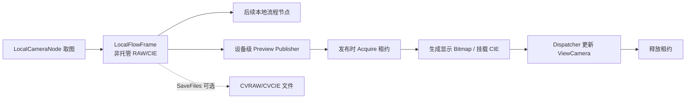

# 本地相机内存帧预览方案（待实施）

## 文档状态

- 状态：设计备忘，尚未实施。
- 目标：本地相机流程节点不保存图像文件时，也能把当前内存帧显示到该节点所绑定设备的 `ViewCamera`。
- 当前决定：暂不修改运行时代码；后续实现时以本文为起点重新核对现状。
- 非目标：本方案不要求把每一帧永久保留在内存中，也不以临时文件模拟内存结果。

## 背景

`LocalCameraNode` 已经可以把 RAW/CIE 数据保存在进程内存中并交给后续本地流程节点。关闭 `SaveFiles` 后不再写入 CVRAW/CVCIE，流程耗时显著降低，但相机设备视图当前仍以文件路径作为主要图像打开入口，因此没有文件的结果行不能重新显示图像。

当前文件链路大致如下：

```text
MeasureResultImgModel.FileUrl
    -> ViewCamera.listView1_SelectionChanged
    -> File.Exists(...)
    -> ImageView.OpenImage(filePath)
```

内存链路不应构造临时路径，也不应写临时文件后再读回。文件保存应只承担持久化和历史重开，当前帧预览应直接消费内存。

## 现有能力与约束

### 已有能力

| 能力 | 当前代码 |
| --- | --- |
| 本地相机直接写入非托管 RAW/CIE 缓冲 | `Engine/ColorVision.Engine/Services/Devices/Camera/Local/LocalCameraCaptureService.cs` |
| 帧引用计数和短期租约 | `LocalFlowFrame.Acquire()` / `LocalFlowFrameLease` |
| 流程内传递本地帧 | `LocalFlowFrameRuntime.SetCurrentFrame(...)` |
| 设备和设备视图的一对一绑定 | `DeviceCamera.View` |
| `ImageView` 直接显示位图 | `ImageView.OpenImage(WriteableBitmap)` |
| 本地相机窗口直接显示内存 RAW | `CameraLocalWindow.ShowImageInView(...)` |
| 不经过文件挂载内存 CIE | `CVRawOpen.AttachLiveCvcie(...)` |
| CIE native 接口接收指针 | `ConvertXYZ.CM_SetBufferXYZ(..., IntPtr rawBuffer)` |

### 关键约束

1. `LocalFlowFrame` 的根引用保存在 `CVStartCFC.RuntimeResources` 中。
2. 流程完成时，`CVStartCFC.DoFinishingCore()` 会释放 `RuntimeResources`。
3. UI 更新使用 Dispatcher，通常晚于流程工作线程发布预览的时刻。
4. 因此不能在 Dispatcher 回调执行时才尝试 `Acquire()`；发布端必须在流程资源释放前取得租约。
5. `ViewCamera.listView1_SelectionChanged` 当前仅认识 `FileUrl`。
6. `ViewCameraConfig.ViewResults` 当前是全局集合，不应在其中保存某个设备的帧租约或大块图像数据。
7. 图像预览是附加功能，预览失败不能让流程节点失败。

## 推荐架构



### 1. 设备级发布，不让节点直接操作 UI

不建议在 `LocalCameraNode` 中直接调用：

```text
device.View.ImageView.OpenImage(...)
```

直接调用会把流程节点和 WPF 线程、视图创建时机、显示策略耦合在一起。

推荐在相机设备层增加设备级预览入口，例如：

```text
DeviceCamera.PublishLocalFramePreview(...)
LocalCameraFramePreviewPublisher
LocalFrameImagePresenter
```

职责建议：

- `LocalCameraNode`：产生帧、保存业务结果、决定是否发布预览。
- `DeviceCamera` 或设备级 Publisher：按设备路由、管理待显示的最新一帧。
- `LocalFrameImagePresenter`：完成像素格式转换及内存图像挂载。
- `ViewCamera`：只在 UI 线程更新 `ImageView` 和当前结果状态。

### 2. 租约必须在发布时取得

推荐顺序：

1. 节点完成取图并设置 `frame.MasterId`。
2. Publisher 同步调用 `frame.Acquire()`。
3. Publisher 接管该 `LocalFlowFrameLease` 的所有权。
4. UI 更新完成、预览被覆盖或请求被丢弃时，Publisher/Presenter 释放租约。
5. 流程可以独立结束并释放根引用。

不要把裸 `LocalFlowFrame`、`IntPtr` 或延迟执行的 `Acquire()` 委托放进 Dispatcher 队列。

### 3. 只保留最新预览请求

流程可能连续执行，UI Dispatcher 也可能暂时繁忙。预览队列必须采用 latest-wins：

- 新帧到来时原子替换尚未显示的旧请求。
- 被替换请求立即释放租约。
- 同一设备同时最多存在一个待显示请求。
- 不因预览积压阻塞相机取图或后续算法。
- 如果 View 未加载、不可见或关闭自动刷新，可直接跳过预览。

### 4. RAW 显示和 CIE 功能分层

建议预览模式：

| 模式 | 行为 | 适用场景 |
| --- | --- | --- |
| `Off` | 不生成 UI 预览 | 无人值守、追求最低内存 |
| `Raw` | RAW 转为 `WriteableBitmap` | 默认预览，速度和内存较平衡 |
| `FullCie` | RAW 显示并挂载 CIE 数据 | 需要取点、伪彩、图层等功能 |

RAW 显示可以复用 `CameraLocalWindow.ShowImageInView(...)` 的像素格式和通道转换逻辑，但应提取成独立 Presenter，避免复制两套实现。

完整 CIE 预览应优先为 `CVRawOpen.AttachLiveCvcie(...)` 增加 `IntPtr` 入口，复用已有的 `ConvertXYZ.CM_SetBufferXYZ(..., IntPtr)`，避免先产生一个数百 MiB 的托管 `byte[]`。

是否在后台构造并冻结 `BitmapSource`，还是在 UI 线程写入 `WriteableBitmap`，需要用目标分辨率做原型测试后决定。无论采用哪种方式，都应避免“非托管帧 → 大型托管数组 → WriteableBitmap”的重复复制。

### 5. 文件和内存结果语义分离

| `SaveFiles` | 预览 | 当前显示 | 历史重新打开 |
| --- | --- | --- | --- |
| `false` | 关闭 | 不显示 | 不可用 |
| `false` | 开启 | 从内存立即显示 | 仅最新帧可用，重启后不可用 |
| `true` | 开启 | 仍从内存立即显示 | 后续通过文件重新打开 |

即使 `SaveFiles=true`，当前帧也不必等待磁盘写入后再读回。

无文件结果可以继续保存数据库元数据和 `MasterId`，但 UI 应明确标记为“内存帧”，不能把它表现成普通的缺失文件。

第一阶段可以只更新当前图像，不支持从历史无文件结果行重新打开。这样不需要让结果列表长期持有图像或租约。

## 内存预算

以 5544 × 3692、3 通道图像为例：

| 数据 | 估算大小 |
| --- | ---: |
| 16-bit RAW | 约 117 MiB |
| 32-bit CIE | 约 234 MiB |
| RAW 显示用 `Rgb48 WriteableBitmap` | 约 117 MiB |
| CIE 分析 native 缓冲 | 可能再占约 234 MiB |

在流程帧、显示副本和完整 CIE 工具同时存活时，单帧相关峰值可能超过 700 MiB。因此：

- 禁止无界预览队列。
- 禁止在全局结果集合中保存帧租约。
- 默认优先考虑 `Raw` 模式。
- 新帧替换旧帧时应主动清理旧的 `ImageView`/CIE 状态。
- 性能验证同时观察 Private Bytes、Working Set 和帧处理时间。

## 建议实施阶段

### 第一阶段：当前帧 RAW 预览

1. 增加设备级预览 Publisher。
2. 发布时取得租约，并实现 latest-wins。
3. 提取 RAW 到 `WriteableBitmap` 的 Presenter。
4. `ViewCamera` 只更新当前图像，不支持历史内存帧重开。
5. 不自动激活或切换设备 Tab。
6. 预览异常仅记录日志，不改变流程执行结果。

### 第二阶段：完整 CIE 预览

1. 为 `CVRawOpen.AttachLiveCvcie(...)` 增加指针入口。
2. 明确 `CM_SetBufferXYZ` 调用后的 native 缓冲所有权。
3. 正确处理新图像到来时的 `Config.ClearProperties()`、CIE buffer release 和工具重置。
4. 增加 `Off` / `Raw` / `FullCie` 配置。

### 第三阶段：结果列表语义

1. 将文件结果、当前内存结果和已过期内存结果区分显示。
2. 决定 `ViewResults` 是否改为按设备实例维护；在此之前不要把租约放入全局集合。
3. 保存文件的结果继续支持历史重开。
4. 无文件结果在当前帧被替换后显示“内存帧已释放”。

## 验收与测试

后续实现至少覆盖：

1. `SaveFiles=false` 时没有创建 CVRAW/CVCIE，但绑定设备 View 能显示当前帧。
2. 节点绑定设备 A 时，不更新设备 B 的 View。
3. View 未加载、不可见或关闭预览时，不额外持有帧。
4. 流程结束释放根引用后，已排队的 UI 预览仍能安全完成。
5. 新帧覆盖尚未显示的旧帧时，旧租约立即释放。
6. 连续执行多次后，待显示请求数量始终有界，Private Bytes 不呈无界阶梯增长。
7. `SaveFiles=true` 的现有文件保存和历史打开行为不回归。
8. 预览转换或 UI 更新失败时，流程仍正常完成。
9. RAW 三通道 8/16-bit、单通道 8/16-bit 的像素格式和通道顺序正确。
10. 完整 CIE 模式下，取点、伪彩和图层功能在替换图像后仍正确释放旧状态。

## 新对话接手清单

新的实现对话开始时，建议先检查这些文件的最新状态：

- `Engine/ColorVision.Engine/FlowProcessing/Nodes/LocalCameraNode.cs`
- `Engine/ColorVision.Engine/Services/Devices/Camera/Local/LocalCameraCaptureService.cs`
- `Engine/ColorVision.Engine/Services/Devices/Camera/Local/LocalFlowFrame.cs`
- `Engine/ColorVision.Engine/Services/Devices/Camera/DeviceCamera.cs`
- `Engine/ColorVision.Engine/Services/Devices/Camera/Views/ViewCamera.xaml.cs`
- `Engine/ColorVision.Engine/Services/Devices/Camera/Views/ViewCameraConfig.cs`
- `Engine/ColorVision.Engine/Services/Devices/Camera/CameraLocalWindow.xaml.cs`
- `Engine/ColorVision.Engine/Media/CVRawOpen.cs`
- `UI/ColorVision.ImageEditor/ImageView.xaml.cs`
- `Engine/FlowEngineLib/Base/CVStartCFC.cs`

已经确定的原则：

- 不使用临时文件模拟内存预览。
- 节点不直接操作 WPF View。
- 发布时取得租约，UI 完成后释放。
- 每台设备只保留最新待显示帧。
- 文件持久化与当前帧预览相互独立。
- 第一阶段不要求历史无文件结果重新打开。

仍需产品确认：

- 默认预览模式是 `Raw` 还是 `Off`。
- View 不可见时是跳过预览，还是保存一份最新的轻量显示副本。
- 是否需要自动把结果行加入列表并选中。
- 完整 CIE 功能是否属于第一版范围。
