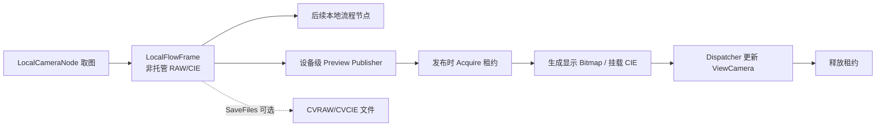

# 本地相机内存帧预览方案（待实施）

## 文档状态

- 状态：设计备忘，尚未实施。
- 目标：本地相机流程节点不保存图像文件时，也能把当前内存帧显示到绑定设备的 `ViewCamera`。
- 当前决定：暂不修改运行时代码；实现前应重新核对相关源码。
- 非目标：不永久保留每一帧，也不以临时文件模拟内存结果。

## 背景

`LocalCameraNode` 已能把 RAW/CIE 数据保存在进程内存中并交给后续本地流程节点。关闭 `SaveFiles` 后不再写入 CVRAW/CVCIE，但相机设备视图仍主要通过文件路径打开图像，无文件结果因此不能重新显示。

```text
MeasureResultImgModel.FileUrl
    -> ViewCamera.listView1_SelectionChanged
    -> ViewCamera.OpenImage(filePath)
    -> 空路径清理，否则交给 ImageView.OpenImage(filePath)
```

文件保存只负责持久化和历史重开；当前帧预览应直接消费内存，不应构造临时路径或写临时文件后再读回。

## 现有能力

| 能力 | 当前代码 |
| --- | --- |
| 写入非托管 RAW/CIE 缓冲 | `LocalCameraCaptureService.cs` |
| 帧引用计数和短期租约 | `LocalFlowFrame.Acquire()` / `LocalFlowFrameLease` |
| 在流程内传递本地帧 | `LocalFlowFrameRuntime.SetCurrentFrame(...)` |
| 绑定设备和设备视图 | `DeviceCamera.View` |
| 直接显示位图 | `ImageView.OpenImage(WriteableBitmap)` |
| 显示内存 RAW | `CameraLocalWindow.ShowImageInView(...)` |
| 挂载内存 CIE | `CVRawOpen.AttachLiveCvcie(...)` |
| native CIE 指针入口 | `ConvertXYZ.CM_SetBufferXYZ(..., IntPtr rawBuffer)` |

## 关键约束

1. `LocalFlowFrame` 的根引用保存在 `CVStartCFC.RuntimeResources`。
2. 流程完成时，`CVStartCFC.DoFinishingCore()` 会释放这些资源。
3. Dispatcher 回调通常晚于流程工作线程发布预览的时刻。
4. 发布端必须在流程资源释放前取得租约，不能等到 UI 回调再调用 `Acquire()`。
5. `ViewCamera.listView1_SelectionChanged` 当前只识别 `FileUrl`。
6. 全局的 `ViewCameraConfig.ViewResults` 不应持有设备帧租约或大块图像数据。
7. 预览失败不能让流程节点失败。

## 推荐架构



设备级 Publisher 负责按设备路由并管理最新待显示帧；Presenter 负责像素转换和 CIE 挂载；`ViewCamera` 只在 UI 线程更新图像与结果状态。`LocalCameraNode` 只产生帧、保存业务结果并决定是否发布预览，不直接操作 WPF View。

建议的职责边界：

- `LocalCameraNode`：产生帧和业务结果。
- `DeviceCamera` 或 Publisher：设备路由、租约和 latest-wins。
- `LocalFrameImagePresenter`：RAW 显示转换及内存 CIE 挂载。
- `ViewCamera`：更新 `ImageView` 和当前结果状态。

## 相关页面

- [生命周期、显示模式与内存预算](./local-camera-memory-preview-runtime.md)
- [实施阶段、验证要求与源码检查](./local-camera-memory-preview-validation.md)

## 验证入口与缺口

验证缺口：这是待实施设计，尚未登记该预览能力的验收测试；现有帧传递和局部显示 API 不能证明设备预览 Publisher 已实现。
