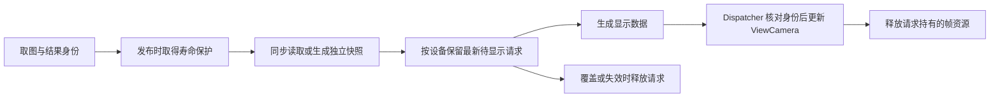

# 设备视图内存预览设计（待实施）

本方案的目标是：本地相机流程节点在 `SaveFiles=false` 时，也能把当前帧显示到所绑定设备的 `ViewCamera`，不借助临时 CVRAW/CVCIE 文件，不永久保留每帧，也不承诺重新打开无文件历史结果。

**该功能尚未实现。** 下文的设备级 Preview Publisher、LocalFrameImagePresenter、Off/Raw/FullCie 模式和 latest-wins 调度是设计要求，当前没有对应设置或完整执行链。现有本地帧 API 与手动窗口不能作为本方案已交付的证明。

## 现有入口与设计缺口

| 入口 | 当前事实 |
| --- | --- |
| `CameraLocalWindow` 手动测量 | 能直接显示内存 RAW，并在有 CIE 时挂载数据；不需要保存文件 |
| `LocalCameraNode` 流程取图 | 可向下游交接内存帧；SaveFiles=false 仍写测量主记录、设置 MasterId 并发布持久化结果通知 |
| `ViewCamera` 设备结果视图 | 收到通知后按 MasterId 查主记录，经 ViewResultImage.FileUrl 打开文件；空路径清空显示，没有取得 LocalFlowFrame 的分支 |
| 本地 Live 视频 | 有独立实时帧处理与伪彩链，不是本地测量流程帧的设备视图路由 |

操作、文件与数据库完成判据由[相机服务](../../01-user-guide/devices/camera.md)维护。本方案补设备视图的当前帧显示，不改变文件保存和历史重开的责任。

当前流程帧的根引用、多个 FrameId、校正修改与翻转规则见同页“流程帧的寿命与读写限制”。**Acquire 解决引用寿命，不解决下游同时改写 RAW 或替换 CIE 的问题。** 异步发布必须先确定可安全读取的一致帧，再讨论 Dispatcher 排队；不能简单把裸指针换成租约后认为并发问题已经解决。

## 发布、转换与显示的责任

| 责任 | 计划归属与约束 |
| --- | --- |
| 取图、业务结果、是否请求预览 | LocalCameraNode；先确定 DeviceCode、FrameId、MasterId，不直接调用 WPF View |
| 按设备路由、接管请求、合并待显示帧 | 设备级 Preview Publisher；同步取得所需寿命保护，不将租约放入全局业务结果集合 |
| 生成稳定显示数据、处理 RAW/CIE 格式与方向 | 独立 LocalFrameImagePresenter；与下游写入建立明确同步或快照协议 |
| 应用图像、更新状态、释放旧视图资源 | ViewCamera 的 UI Dispatcher；提交前再次验证设备、视图生命周期及请求序号 |

预览错误只记录和呈现预览状态，不改变已有采集、文件保存或流程结果。发布不能让 UI 积压反压相机取图；同步保护、快照复制的成本也必须纳入验收，不能把“异步转换”当作零成本。

这是目标数据流，不代表这些组件已经存在。快照与合并的具体先后仍须按选定读写协议实现：淘汰请求应尽量发生在昂贵复制之前，但不能把仍可能被下游改写的帧延迟读取。

### 租约取得与释放

发布时同步 Acquire，之后 UI 更新、覆盖、拒绝、异常、窗口销毁和 Dispatcher 停止都要有唯一释放路径。不能向队列传裸帧、IntPtr，或传入等到 UI 回调时才 Acquire 的委托；流程结束时根对象可能已经释放。

即使持有租约，CIE 重新分配仍可能改变指针与长度，Metadata/曝光和方向也可能与发布时不同。实施前需选择并验证不可变快照、读写互斥或其它等价协议；不得依赖“下游通常来不及修改”的时间假设。同一租约也不能在读取期间被另一线程 Dispose。

### latest-wins 的范围

同一设备最多保留一个待显示请求；新请求原子替换旧请求，立即释放被替换请求。另有正在转换/提交的请求时，它仍需要序号或 generation 检查，旧转换完成不得覆盖新图。

View 未加载、不可见、已释放或关闭自动刷新时应按明确策略跳过或只保留约定副本；当前设计倾向无效视图不额外持有帧。视图重新创建、设备切换、用户手动打开历史图和暂停刷新，也要防止旧回调回写。是否由 AutoRefreshView 控制、是否另设开关，仍待确定。

这个队列界限仅约束预览请求，不能保证整个流程只占一帧内存：流程 RuntimeResources 可按不同 FrameId 保留多个根引用。

## RAW 与 FullCie 接入

| 计划模式 | 预期行为 |
| --- | --- |
| Off | 不生成设备视图预览 |
| Raw | 生成独立 RAW 显示位图，作为低成本默认候选 |
| FullCie | 显示图像并保留取点、伪彩和图层所需 CIE 数据；其寿命与显示位图分别管理 |

默认 Raw 或 Off、FullCie 是否进入首版仍未定。模式名称不是已经存在的配置项。

### RAW 转换不能原样复用现有实现

`CameraLocalWindow.CaptureAndPrepareDisplay` 当前把 RAW/CIE 复制为托管数组，用 CreateDisplayBitmap 生成并 Freeze 位图，在后台完成这些独立数据后释放流程帧，再把结果交给 UI。ShowImageInView 负责重置 opener、工具、图层和属性，随后打开位图；像素转换并不在 ShowImageInView 中。

当前映射为单通道 8/16-bit → Gray8/Gray16、三通道 8/16-bit → Bgr24/Rgb48，但 GetPixelFormat 本身没有严格拒绝其它组合。三通道 16-bit 分支实际把三个源分量按 `0,2,1` 写入目标，不能只依据旁边 RGB/GRB 注释推断颜色正确。

CreateDisplayBitmap 用目标 BackBufferStride 计算该分支的源行偏移；其它格式直接连续 Marshal.Copy，没有逐行处理目标 padding。紧凑 RAW 行字节数与 WPF stride 不同时会造成错行，指针分支还可能越过源数组。后续 Presenter 必须分别使用源/目标行步长，验证长度、通道排列、非对齐宽度和单/多行样例，不能把该方法直接抽取为“已验证转换器”。

RAW 与 CIE 可能处于不同翻转状态：只翻转最终 CIE 的流程，原 RAW 不一定与 POI 坐标同向；无校正帧还可能延迟翻转。预览要选择对应方向的显示副本并明确坐标映射，不为显示提前改写下游还需使用的传感器数据。

### CIE 使用当前测量与图层契约

`CVRawOpen.AttachLiveCvcie` 当前接收 byte[]，由 PoiMeasurementBuffer 保留托管平面 CIE，测量时短暂固定数组；图层控制器也保留该 CIE 数据，并克隆一份原显示位图。它不在这条挂载链中调用 ConvertXYZ.CM_SetBufferXYZ。

因此 FullCie 的指针优化需要覆盖 PoiMeasurementBuffer、测量调用与图层读取的共同所有权。ConvertXYZ 虽保留 IntPtr P/Invoke 声明，仅增加或调用该声明不能替代当前挂载链，也不能证明零拷贝或 native 已接管数据。

替换为新内存图、文件图或清空时，应整体更新 opener、属性、工具和图层，释放旧测量 owner、取消旧图层任务，再允许新的取点/伪彩读取。图层和数组还有其它引用时不会因单个租约释放立刻消失，验收须覆盖切换后的实际资源寿命。

## 当前图与历史结果

| 文件保存 | 计划预览 | 当前显示 | 历史重新打开 |
| --- | --- | --- | --- |
| 关闭 | Off | 不发布新预览 | 无图像文件可重开 |
| 关闭 | Raw / FullCie | 稳定的当前显示副本 | 不提供通用历史重开；仅当前副本存活期间可用 |
| 开启 | Raw / FullCie | 仍走内存预览 | 历史通过保存文件重开 |

无文件主记录应标识“内存帧”，区分当前显示与已过期结果，不能伪装成普通缺失文件。第一阶段只更新当前图像，不自动激活设备 Tab，也不让结果列表长期持有帧或租约。是否加入并选中结果行另行确定。

## 内存预算与观测

以 5544 × 3692、三通道为例，按纯像素字节估算：

| 数据 | 单份大小 |
| --- | ---: |
| 16-bit RAW / 无 padding 的 Rgb48 位图 | 117.12 MiB |
| 32-bit 平面 CIE | 234.24 MiB |

每次托管复制、显示位图克隆和 CIE 快照都要按份计入。当前手动窗口会生成 RAW/CIE 托管数组，live 图层还克隆显示源；不能沿用“必有另一份 native CIE 缓冲”的旧预算假设。计划中的流程 RAW+CIE、RAW 显示位图、独立 CIE 副本和一份同尺寸位图克隆，仅这五项同时存活就约 819.85 MiB，还未计旧视图、多个流程帧、ImageView 缓冲、图层缓存及转换临时量。

该数字是条件性内存估算，不是实测峰值或已接受限额。现场需分别给 Raw/FullCie 的分辨率、帧率、并发设备数及保留策略设定字节/延迟预算，并观察 Private Bytes、Working Set、GC、待显示槽位、活动请求及丢帧数。请求有界不等于进程内存有界。

## 实施依赖与验收

实施顺序仍是当前 RAW 预览、完整 CIE、结果列表语义；在 RAW 接入前先确定读写协议、默认模式、视图不可见时的保留策略、AutoRefreshView 关系及结果选择行为。实施完成后按实际能力更新状态，不把阶段标题当成交付证据。

| 必须验证的场景 | 完成判据 |
| --- | --- |
| SaveFiles=false / true | 前者不为预览创建临时 CVRAW/CVCIE；后者文件保存及历史打开保持正确；数据库行为按当前节点契约单独确认 |
| 跨设备、视图隐藏/销毁/重新创建 | 路由正确，无效视图不保留未约定资源，旧回调不回写 |
| 根引用已释放、请求覆盖、异常与 Dispatcher 停止 | 已接管请求安全完成或丢弃，租约/快照各释放一次 |
| 预览与下游校正、CIE 重新分配并发 | 指针、长度、Metadata 和像素属于同一稳定版本，无悬空读取或混合数据 |
| 连续取图与慢转换 | 每设备待显示请求有界，旧任务不能覆盖新图；单独统计流程内保留帧 |
| RAW 格式、行步长与方向 | 1/3 通道、8/16-bit、非对齐宽度、独立颜色和翻转标记均正确 |
| FullCie 与文件图/内存图互换 | 取点、伪彩、图层和 opener 属性对应新图；旧 owner/任务及时释放 |
| 预览转换失败 | 流程业务结果不被改判，状态可诊断，不留下半更新视图 |
| 生产分辨率、多设备与长期运行 | 峰值内存、保留资源和延迟满足预先指定预算，而非只看短时平均帧率 |

现有 LocalFlowNodePortTests 检查节点副本共享帧及流程结束；LocalFrameMirrorTests 检查方向和校正准备；PoiMeasurementServiceTests 检查托管 CIE 测量及 Dispose 后拒绝访问。它们只是实现基础，不覆盖本方案的 Publisher、合并队列、模式切换、异步并发和现场性能，也不证明 RAW 转换 helper 正确。实施后再登记对应自动化用例与设备条件，验证记录留在测试产物或 Git/任务报告，不逐轮追加到正文。
