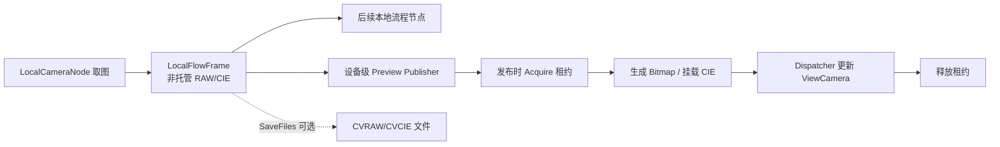

# 本地相机内存帧预览方案（待实施）

本页合并该功能的设计、生命周期、实施顺序和验收要求。它是 `planned` 决策，不表示当前 `ViewCamera` 已支持无文件结果预览；现有帧与显示 API 只是实施起点。

目标是在 `SaveFiles=false` 时，把本地相机节点的当前内存帧显示到所绑定设备的 `ViewCamera`，不使用临时文件，不永久保留每帧，也不承诺历史无文件结果可重新打开。

## 当前行为与缺口

`LocalCameraNode` 已能把 RAW/CIE 数据放在进程内存并交给后续本地节点。关闭 `SaveFiles` 后不再写 CVRAW/CVCIE，但设备结果视图仍主要按文件路径打开：

`MeasureResultImgModel.FileUrl → ViewCamera.listView1_SelectionChanged → ViewCamera.OpenImage(filePath)`

文件保存负责持久化和历史重开；当前帧预览应直接消费内存。当前尚不存在设备级 Preview Publisher、latest-wins 队列和完整验收测试。

## 已确定责任边界

| 责任 | 计划归属 |
| --- | --- |
| 取图、业务结果和是否发布预览 | `LocalCameraNode` |
| 按设备路由、取得租约、latest-wins | 设备级 Preview Publisher |
| RAW 转换与 CIE 挂载 | 独立 `LocalFrameImagePresenter` |
| UI 线程更新当前图像和结果状态 | `ViewCamera` |

节点不直接操作 WPF View；预览异常只记录日志，不改变流程执行结果。文件持久化与当前帧预览相互独立，不用临时文件模拟内存预览，也不把帧租约放入全局结果集合。

`LocalFlowFrame` 的根引用由流程运行资源持有，流程完成会释放。Publisher 必须在发布时同步调用 `frame.Acquire()`，不能把裸帧、`IntPtr` 或延迟 `Acquire()` 委托排入 Dispatcher。

## 租约与 latest-wins

推荐顺序：

1. 节点完成取图并设置 `frame.MasterId`。
2. Publisher 同步取得 `LocalFlowFrameLease`。
3. UI 更新完成、请求被覆盖或被丢弃时释放租约。
4. 流程独立结束并释放根引用。

同一设备最多保留一个待显示请求。新帧原子替换未显示旧帧，被替换请求立即释放；预览积压不阻塞取图或后续算法。View 未加载、不可见或关闭自动刷新时可跳过预览。

## RAW、CIE 与结果语义

| 模式 | 行为 | 适用场景 |
| --- | --- | --- |
| `Off` | 不生成 UI 预览 | 无人值守或最低内存 |
| `Raw` | RAW 转为 `WriteableBitmap` | 默认预览候选 |
| `FullCie` | RAW 显示并挂载 CIE | 取点、伪彩和图层 |

RAW 转换可复用 `CameraLocalWindow.ShowImageInView(...)` 的像素格式规则，但应提取为 Presenter。完整 CIE 优先为 `CVRawOpen.AttachLiveCvcie(...)` 增加 `IntPtr` 入口并复用 `ConvertXYZ.CM_SetBufferXYZ(..., IntPtr)`，避免先生成大型托管 `byte[]`。

| `SaveFiles` | 预览 | 当前显示 | 历史重新打开 |
| --- | --- | --- | --- |
| `false` | 关闭 | 不显示 | 不可用 |
| `false` | 开启 | 从内存显示 | 仅最新帧可用，重启后不可用 |
| `true` | 开启 | 从内存显示 | 后续通过文件重新打开 |

无文件结果可以保留数据库元数据和 `MasterId`，但应标记为“内存帧”，不能伪装成普通缺失文件。第一阶段只更新当前图像，不让结果列表长期持有图像或租约。

## 内存预算

以 5544 × 3692、3 通道图像估算：

| 数据 | 大小 |
| --- | ---: |
| 16-bit RAW | 约 117 MiB |
| 32-bit CIE | 约 234 MiB |
| `Rgb48 WriteableBitmap` | 约 117 MiB |
| CIE 分析 native 缓冲 | 可能再占约 234 MiB |

流程帧、显示副本和完整 CIE 同时存活时，单帧峰值可能超过 700 MiB。因此禁止无界队列和全局租约；默认优先评估 `Raw`，替换图像时清理旧 `ImageView`/CIE 状态，并同时观察 Private Bytes、Working Set 与帧处理时间。

## 实施阶段

1. 当前帧 RAW：增加 Publisher、发布时租约、latest-wins 和独立 Presenter；`ViewCamera` 只更新当前图像，不自动激活设备 Tab。
2. 完整 CIE：增加指针入口，明确 native 缓冲所有权；替换图像时释放旧 CIE buffer 并重置属性与工具状态。
3. 结果列表：区分文件结果、当前内存结果和已过期内存结果；保存文件的结果继续支持历史重开。

实施前仍需确认：

- 默认模式是 `Raw` 还是 `Off`。
- View 不可见时直接跳过，还是保留最新轻量显示副本。
- 是否自动加入并选中结果行。
- `FullCie` 是否进入第一版。

## 验收要求

1. `SaveFiles=false` 时不创建 CVRAW/CVCIE，绑定设备 View 仍显示当前帧。
2. 绑定设备 A 的节点不更新设备 B。
3. View 未加载、不可见或关闭预览时不额外持有帧。
4. 流程释放根引用后，已排队的 UI 预览仍安全完成。
5. 新帧覆盖旧请求时旧租约立即释放，连续执行的待显示请求有界。
6. `SaveFiles=true` 的保存和历史打开不回归。
7. 转换或 UI 更新失败时流程仍正常完成。
8. RAW 单/三通道 8/16-bit 的格式和通道顺序正确。
9. `FullCie` 替换图像后，取点、伪彩和图层释放旧状态。
10. 目标分辨率下的峰值内存和预览延迟满足现场预算。

## 源码入口与验证缺口

实施前重新核对 `LocalCameraNode.cs`、`CVStartCFC.cs`、`LocalCameraCaptureService.cs`、`LocalFlowFrame.cs`、`ViewCamera.xaml.cs`、`CameraLocalWindow.xaml.cs`、`CVRawOpen.cs` 和 `ImageView.xaml.cs`。

当前 `test_paths` 为空；Publisher、模式切换、租约释放、覆盖、跨设备隔离和生产分辨率内存均未验证。实施后应登记实际测试文件、设备/样例条件、运行命令与未通过项，再调整本页状态。
