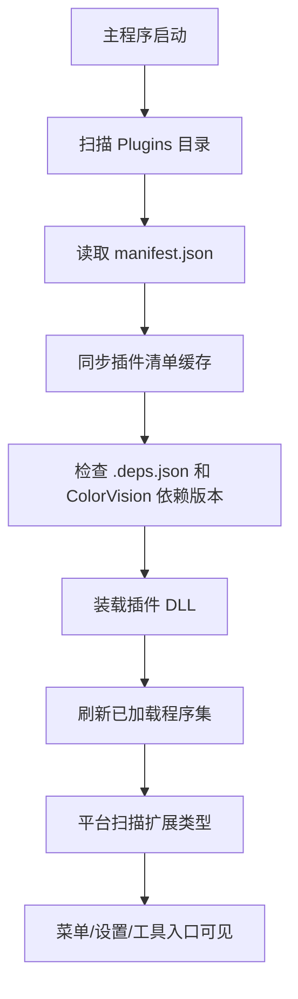

# 插件生命周期

本页描述当前仓库里可以直接从代码确认的插件运行路径，不再使用旧版“独立插件宿主 + 异步生命周期接口”的叙述。

## 启动到可用

## 当前主链路

| 阶段 | 当前行为 | 先查 |
| --- | --- | --- |
| 发现插件 | `PluginLoader.LoadPlugins()` 扫描运行目录下的 `Plugins/`，每个子目录都是候选插件 | 目录是否存在，目录名是否符合交付预期 |
| 读取清单 | 优先读取 `manifest.json`，获取插件 ID、名称、描述、DLL 路径等 | `manifest.json` 是否可解析，`dllpath` 是否正确 |
| 兼容装载 | 没有清单时尝试按“目录名同名 DLL”装载 | 仅兼容旧包，不作为正式交付方式 |
| 同步缓存 | 扫描开始时移除配置里记录但磁盘已不存在的插件 ID | 删除插件目录后，下次启动会从管理列表消失 |
| 校验依赖 | 如果存在 `.deps.json`，重点检查 `ColorVision.*` 依赖版本 | 主程序目录 DLL 是否存在，版本是否满足最低要求 |
| 装载程序集 | 计算主 DLL 路径并 `Assembly.LoadFrom(...)`，记录名称、版本、路径、构建时间 | DLL 是否缺失、版本是否冲突、日志是否有装载异常 |
| 扩展生效 | 在已加载程序集上扫描菜单、设置、状态栏、工具窗口等 provider | provider 接口、非抽象类型、公开无参构造 |

当前插件装载是“把程序集加入主进程并参与后续类型扫描”，不是为每个插件建立独立宿主或可回收加载上下文。

## 更新与管理

插件信息被记录后，平台基于缓存中的插件信息做管理和更新提示。更新逻辑和插件市场集成位于 UI 层插件相关模块中，但它们建立在扫描、依赖校验和装载结果之上。

## 排查

| 现象 | 先查 |
| --- | --- |
| 插件目录存在但没被识别 | `manifest.json`、`dllpath`、主 DLL 是否复制到插件目录 |
| 插件被识别但装载失败 | `.deps.json` 中 `ColorVision.*` 版本要求、主程序目录依赖 DLL、日志提示 |
| 插件已装载但菜单或功能没出现 | provider 接口、入口类型是否非抽象/非开放泛型/公开无参构造 |

## 边界

- 当前文档只描述仓库中直接可见的装载路径。
- 旧文档里关于 `PluginContext`、权限系统、隔离宿主、可卸载上下文等内容，不能作为当前主路径实现依据。
