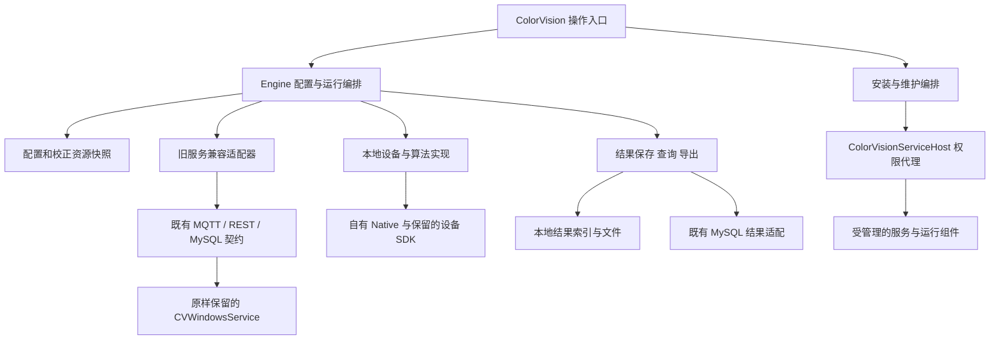

# 配套服务纳入 ColorVision 的演进规划

本规划用于持续推进 ColorVision 对配套服务的接管。目标是让设备配置、测量运行、结果管理和安装维护由 ColorVision 统一负责，旧服务成为可选择、可维护、可逐步退出的内部执行组件。**在不修改 CVWindowsService 源码的前提下，可以先完成产品层面的整合，并按完整业务链逐步减少依赖。**

本文是待实施的架构决策与工作顺序；“现状”来自源码核对，其余均为建议。当前操作契约仍以各能力主题为准。源码中存在本地实现，不代表所有设备、客户流程和交付环境都已验收。

## 目标与边界

“成为我们的一部分”应落实为五项可检查的责任：

| 责任 | 目标状态 |
| --- | --- |
| 产品入口 | 用户从 ColorVision 完成准备、测量、查询和维护，无需理解注册中心、MQTT topic 或服务目录结构 |
| 配置归属 | 每个设备和流程有确定的配置来源与版本；数据库断开、重连不会擅自改变生产配置 |
| 执行选择 | ColorVision 决定本次使用本地实现、兼容服务或后续独立工作进程，并明确缺失依赖 |
| 结果归属 | ColorVision 能说明本次使用的配置、输入、后端及结果保存状态；关闭重开仍可追溯已持久化结果 |
| 交付维护 | ColorVision 管理匹配的程序、服务包、原生库、驱动和数据版本，能够诊断并按已验证路径恢复 |

整合不要求立即合并三个仓库、重编旧服务或把全部能力加载进 WPF 进程。旧服务宿主与基础库仍使用 .NET Framework 4.7.2，主程序使用 .NET 10 Windows/x64；将其作为项目引用或直接搬类并不能免除运行时、原生库和数据契约差异。

本路线保持旧服务可独立运行，适配代码和新能力放在 ColorVision 侧。旧数据库结构、MQTT/REST 协议和历史包保持兼容。既有设备 SDK、许可证及 ABI 继续遵守原约束；停止依赖某个 Windows 服务，不等于可以删掉它曾经使用的全部 DLL。

## 已有基础与剩余边界

以下按能力判断进度，不用代码行数或类数量估算“替换百分比”。

| 能力 | 已有基础 | 尚需收口的边界 | 主要依据 |
| --- | --- | --- | --- |
| 安装、启停、维护 | `WindowsServicePlugin` 已管理服务包、MySQL/MQTT 安装、版本及备份；`ColorVisionServiceHost` 已提供本机权限代理 | 从逐项工具操作推进到按运行需求选组件、兼容版本预检和恢复验收；当前备份不等于整包自动回滚 | [服务包安装](../04-api-reference/plugins/standard-plugins/windows-service.md)、[权限服务主机](./components/service-host.md) |
| 相机采集 | 本地会话、采集、预览、流程内存帧、后端占用保护已存在 | 本地相机仍通过 `cvColorVision` 调用 `cvCamera.dll`；部分结果落库仍依赖 MySQL；多进程设备占用需现场验收 | `LocalCameraNative.cs`、`DeviceCamera.Local.cs`、[相机契约](../01-user-guide/devices/camera.md) |
| 光谱采集 | 本地窗口、共享会话、流程适配、校零和自动积分已有实现 | 仍使用原生光谱接口；外部快门自动控制、ND/端口操作及 EQE 同步频率本地支持不完整；离线历史仍不完整 | `LocalSpectrumSession.cs`、[光谱契约](../04-api-reference/engine-components/spectrum-device.md) |
| 校正 | 本地校正默认采用自有 `opencv_helper`，文件/内存处理及用户校正已有入口 | 旧 native 后端由兼容开关保留；部分模板资源加载及流程结果保存仍依赖 MySQL；需逐项确认文件格式、数值和可追溯性 | `LocalCalibrationCacheManager.cs`、[校正契约](../01-user-guide/devices/calibration.md) |
| 流程编排 | 自有 Flow 引擎、执行会话、诊断、本地模板已有实现；纯本地图可跳过注册中心要求 | 本地流程定义不保证每个节点离线；服务节点仍依赖 RC/token；部分本地算法和客户后处理依赖数据库 | `FlowExecutionSession.cs`、[执行契约](../01-user-guide/workflow/execution.md) |
| 配置与模板 | 设备、许可证及部分模板已支持本地 SQLite；本地对象重连后仍保存到本地 | 当前新查询以连接状态选本地/MySQL；本地流程导入和服务 `.cvflow` 关联模板迁移的能力不同 | `LocalConfigurationDao.cs`、[流程模板](../04-api-reference/engine-components/template-flow-chain.md) |
| 算法 | 自有统一 Runner/provider、Native 算法、Engine 本地节点及直接 native 工具已形成基础 | 同时存在统一算法、直接 native 工具及 Engine 模板/MQTT 三条链；要按实际算法和节点确认执行、参数及结果依赖 | [算法入口](../04-api-reference/algorithms/README.md) |
| 结果与归档 | 客户端已负责很多结果展示、文件保存、数据库清理及流程后处理；默认类型树隐藏 FileServer | 离线采集不自动形成可重开的业务历史；旧归档浏览/配置、服务更新恢复逻辑仍在；清理、归档与备份职责不能混同 | `LocalCameraResultService.cs`、`LocalSpectrumResultService.cs`、`Archive/`、`MySqlResultCleanupProvider.cs` |
| 其余设备 | PG、SMU、Motor、Sensor、LightingController 等仍有 MQTT 适配；部分底层绑定已存在 | 不能由“有 DLL 接口”推定主程序已有完整本地控制；设备型号、联动、保护动作和现场需求需逐项核实 | `Engine/ColorVision.Engine/Services/Devices/`、`Engine/cvColorVision/` |

过去的工作已经建立了控制和计算基础。接下来的主要收益来自把这些能力连成可独立交付、可恢复、可追溯的业务链。

## 优先解决的四个问题

### 配置来源应成为明确选择

`LocalConfigurationDao.UseLocal` 当前取决于是否连接 MySQL。`ServiceManager` 订阅连接变化并执行 `LoadServices()`，重载会释放旧设备并重新装配。这套实现提供了离线基础，但连接变化仍可能影响设备集合；不能将它直接视为稳定的生产配置管理。

建议引入显式运行配置：固定设备身份、配置来源、模板版本、校正资源和执行后端。一轮运行取得不可变快照，网络状态只改变可用性；切换配置在空闲状态明确执行。现有“本地对象重连仍保存本地”的规则继续保留。

优先增加显式来源选择和切换门禁，不先搬迁全部表。设备身份需要独立于本地负数 ID 和旧 MySQL 正数 ID；由映射记录保留旧 ID，不能把其中一个数据库主键直接当成跨系统唯一身份。

### 本地结果需要形成完整历史

当前无 MySQL 的流程会固定 `PersistResults=false`，保留内存批次和帧，按节点设置保存文件。诊断库记录运行诊断，不是测量结果库。手动文件校正的 `TryPersist` 在断库时跳过保存；部分 Flow 本地节点仍要求有效的数据库结果 ID。

建议先补独立的本地结果存储边界，再决定底层文件和数据库方案。轻量索引可以使用独立 SQLite，原始图像和大数组放文件；不把结果塞进现有配置库，也不将诊断库改作业务历史。

最小结果记录包含稳定 RunId、设备身份、配置/校正指纹、算法与执行后端版本、输入/输出文件及校验信息、单位、执行终态、保存状态和导出状态。区分计算完成、文件落盘、索引提交、客户判定和上传完成。采用可恢复的文件提交与索引写入流程，覆盖进程异常退出、磁盘满和重复导出；不能假定文件与数据库存在共同事务。

联网同步可在后续增加独立待同步队列和幂等键；短期仍可把 MySQL 作为既有部署的结果目标。获得产品控制权不要求马上替换全部数据库。

### 旧服务需要固定的适配边界

旧服务的 `MQTTServiceNodeManager.LoadAllServices/LoadDevices` 经 `CVRepositoryLib` 读取 MySQL 资源视图，已有 MQTT 注册、心跳和重载协议。**保持服务源码不变时，ColorVision 无法只保存一份新 JSON 就要求旧服务自动使用它。**

建议分两步接管：

1. 先由 ColorVision 接管旧配置的编辑、校验和受控发布，继续使用现有服务理解的数据格式及重载通道；旧数据库仍是该模式下的执行配置来源。
2. 需要统一配置主来源的能力，再增加 ColorVision 侧兼容适配器，将明确选择的配置投影为旧服务所需的资源、模板、路径和 ID。记录发布版本及映射，禁止双向自动同步和两个入口无仲裁地同时写入。

发布过程应为“校验与差异预览 → 保存目标数据 → 空闲时重载受影响范围 → 读回/探测 → 标记生效”。服务的全量重载会先停止既有服务对象，不应在测量中调用。多表、文件和重载不是共同事务，需要保存可恢复快照；超时只能报告尚未确认，不能假定配置已生效。

兼容适配器集中处理 topic、token、消息关联、错误及旧结果映射。上层按“采集、移动、运行算法”等业务动作调用；逐个能力迁入，无需先给所有类套一层空接口。旧服务是否接受可追溯标识需按协议确认，不能擅自新增必填字段。

### 运行准备需要按业务依赖判断

安装成功、Windows 服务 Running、RC 心跳在线、设备可用和测量成功是不同层级。建议从当前流程、设备配置和算法 provider 派生依赖清单，复用现有注册表与执行门禁，逐步增加运行前检查。

检查应能回答：本次为何需要 MySQL/MQTT/RC，哪一个节点需要旧服务，校正文件是否匹配，设备是否可能仍被另一后端占用。普通检查不通过试拍或设备移动验证健康；需要真机动作的验收作为单独步骤。

开始运行后固定后端。不能因服务超时就自动换本地重试采集或移动：超时可能发生在动作完成之后。对状态不明的硬件动作先查询或人工确认；纯计算只在输入固定且具备幂等条件时考虑重试。

## 建议的职责结构

下图是目标结构，兼容适配器和本地业务结果存储尚需完善。

具体边界如下：

- 设备实现和旧服务适配放在 `Engine/ColorVision.Engine/Services/**`，Flow 原语保留在 `Engine/FlowEngineLib/`；不让设备 UI 各自实现一套协议。
- 中立算法继续使用 `UI/ColorVision.Algorithms` 的输入、结果和 provider 契约，不能为旧表/消息加入 Engine DAO 依赖。Engine 历史结果继续通过既有 handler 链；两条结果链在合适的适配层衔接，见[结果交接契约](../04-api-reference/engine-components/result-handoff-chain.md)。
- 客户判定、MES/外部协议和客户导出继续由 `Projects/` 负责。新运行及结果契约向这些消费者提供稳定入口，不能把客户规则放进通用 native 算法。
- `ColorVisionServiceHost` 继续负责特权维护。若未来确需无人值守或崩溃隔离，另设普通权限的测量工作进程；不要把全部相机 SDK 和算法塞进权限服务。现有 `FlowHeadlessExecutionService` 可以作为复用起点，但不等于已完成 Windows 服务化、无 UI 依赖和独立进程交付。
- 多进程部署还需解决设备唯一所有者、配置/结果目录和账户权限。当前本地配置在用户目录，不能假定后台服务账户会读到同一份配置；显式迁移目录和访问权限应随该阶段设计。

## 分阶段实施与验收

阶段以可验收产物推进，不先承诺全年固定日期。前一阶段的退出条件通过后，再扩大到下一类设备或流程。

| 阶段 | 主要交付 | 完成判据 | 失败后的处理 |
| --- | --- | --- | --- |
| A：建立范围与运行预检 | 选择一条高频流程，列出设备、节点、模板、文件、数据库和服务依赖；标明配置/结果所有者；生成只读准备报告 | 每个缺失依赖能定位到具体能力；能区分纯本地、混合和服务模式；不靠试运行发现所有前提 | 不切换既有执行路径，修正能力声明和检查依据 |
| B：完成一条本地业务链 | 固定配置来源；一条采集/图像输入 → 校正/算法 → 结果保存 → 重开查询 → 导出的链路 | 在隔离环境无 CVWS/RC/MQTT/MySQL 时，该选定链路可工作；断库/重连不改变运行配置；程序重启后结果可重开 | 保留原模式和配置；未通过的本地链不设为生产默认 |
| C：将旧服务纳入统一编排 | 兼容适配器、配置差异与发布记录、服务状态汇总、消息和结果关联 | 同一业务入口可明确选择本地/服务；旧现场流程可继续运行；失败明确落在哪一阶段；未改旧服务源码 | 切回事先保留的服务配置/执行选择；先确认设备释放，不在未知状态自动接管 |
| D：按收益扩大本地覆盖 | 将最高频残余设备/算法逐项接入，建立旧新输入输出对照和现场验收记录 | 每项能力有适用型号、参数范围、数值/协议判据及回退路径；相关客户流程和导出验收通过 | 仅回退该能力，不要求整个平台一起回退 |
| E：按场景缩减交付组件 | 运行组件清单、版本兼容规则、独立安装组合、升级/恢复演练；按需独立工作进程 | 新机器只装所需组件即可完成目标链；兼容部署能保留旧服务；停用组件后重启及历史查询通过 | 使用已验证的旧包、配置和数据恢复方案；不把重新注册服务当作完整回滚 |

B 和 C 可按项目需求交错推进，但同一能力应先明确配置与结果责任。运行准备报告可以先落地；复杂的服务生命周期总框架和全设备通用接口不作为第一步。

### 首轮建议的四个工作项

| 顺序 | 工作项 | 最小范围与验收产物 |
| --- | --- | --- |
| 1 | 确定一条可独立交付的基准流程 | 优先从现有本地相机/本地图片起步，选择已有内存输入的算法；记录所需校正/模板和实际结果消费者。先用合成或获准样本跑通软件链，再排真机验收 |
| 2 | 固定该流程的配置来源与运行快照 | 覆盖本地、服务两种来源的明确选择、重连、旧窗口保存及运行中拒绝切换；不先做自动同步 |
| 3 | 补齐该流程的本地结果保存与重开 | 覆盖批次、图像、算法明细、来源指纹和导出；验证异常退出、磁盘满、缺文件及重复提交，不只验证结果出现在界面 |
| 4 | 增加依赖预检和兼容后端对照 | 用同一份固定输入对照计算结果；核对既有服务模式仍可运行；形成该链路的部署清单和验收记录 |

初始基准不宜选择依赖最多的整条客户产线流程。先完成可复用闭环，再把客户流程逐步接入；相机型号、首个算法和必须保留的客户输出应在实施前确定。

## 残余能力的推进顺序

建议依次处理“会阻塞基准流程的残余依赖”“高频且接口稳定的能力”“低频特殊设备/算法”。实际排序以现场使用量、运维成本和故障影响校正，当前没有足够现场数据给出可靠工期或完成比例。

| 对象 | 建议策略 | 推进前需要的证据 |
| --- | --- | --- |
| 本地相机和光谱 | 先完善已有会话、存储、配置与联动边界 | 真实型号/驱动/许可证、断开与重新打开、设备占用、持续运行及内存行为 |
| 校正与自有算法 | 对已有自有实现补齐输入语义、版本和比对；优先迁移高频服务算法 | 合法样本、单位、ROI/方向、通道顺序、曝光/增益/ND、数值容差与客户判定影响 |
| PG、Motor、FilterWheel、LightingController | 按基准流程的实际阻塞选择一个设备族接入 | 端口/设备唯一占用、命令确认、位置/状态读回、停止与保护语义；不要仅搬 Open/Close |
| SMU、Sensor 与特殊设备 | 先封装服务适配；量产依赖明确后再做本地接管 | 电压/电流范围、联锁、取消后状态、异常恢复与真实测试条件 |
| 第三方算法及旧 x86 组件 | 优先保留隔离进程和现有通信；有收益时再替换 | 真实在用插件清单、位数和许可证、外部程序集身份、输入输出兼容 |
| `cvCamera.dll` 等 | 当前作为产品内部 SDK 依赖管理；本地 OLED/CUDA 链路已移除，其他能力逐功能替换 | 导出 ABI、句柄与释放配对、回调线程/寿命、内存布局、依赖 DLL 及有效发布版本 |

本地校正已经默认走 `opencv_helper`，但本地相机取图仍走 `cvCamera.dll`，本地光谱仍调用其既有原生接口；这是不同层级的接管进度。外部 C++ 中相机、校正、光谱、PG、XYZ 和流程导出同时存在，不能按一个 DLL 名称将全部能力判定为已替换或应重写。

旧新比较先使用相同的录制输入和配置，避免两套后端争用硬件。容差必须来自已确认的计量/产品要求；无法解释的差异列为阻断或明确限制，不通过放宽测试阈值掩盖。原生替换还需分别验证计算精度、资源寿命和交付 ABI。

## 组件退出条件

“不再默认使用”“可选安装”“可安全停止”“可从交付删除”应分别判定。下表是退出条件，不能作为直接停止现场服务的操作授权。

| 组件 | 允许从某个部署组合退出的条件 |
| --- | --- |
| 旧相机/校正服务能力 | 该组合所有相机/校正入口、流程节点和后处理均有已验收实现，原服务已释放设备；仍需它的其他插件时保留共享宿主 |
| 旧流程/算法服务能力 | 不再有服务节点或外部调用方依赖；所有关联模板、结果字段和客户判定已迁移。主程序拥有 Flow 引擎本身不构成退出证据 |
| RC 与 MQTT | 整个部署组合无注册、token、服务节点或外部设备/系统使用；混合部署继续保留 |
| MySQL | 配置、模板、运行结果、历史查询、报表和客户出口均有替代或明确保留的远程目标；仅离线采集成功不够 |
| FileServer / CVArchService | 旧图像访问与历史记录路径可继续解析；文件保留/迁移/清理/恢复职责已有替代；安装更新不会误恢复已明确停用的服务 |
| 旧 native DLL | 主程序、客户包、外部插件与保留服务均无运行期依赖，并完成新包验证；不能只搜索 C# 引用后删除 |
| 旧安装管理工具 | 仍在使用的维修、版本切换和恢复流程已被覆盖，人员有等价入口 |

`WindowsServicePlugin` 当前会在更新时恢复原已安装的 `CVArchService`，这是兼容行为。未来应增加明确的组件期望状态，区分“需要保留”与“已经退役”；在没有替代和迁移验收前，不能直接删除该恢复逻辑。

归档退出还要核对旧服务承担的批次归档、图片/算法文件迁移、光谱/SMU 数据整理及日志清理。客户端已有数据库清理和文件后处理，但不自动证明这些职责全部等价。旧历史可以先保留只读查询和路径映射，避免为完成迁移而一次性重写全部历史数据。

## 交付、升级与恢复

建议在现有安装管理基础上增加运行组件清单，记录主程序版本、旧服务包精确文件/内容身份、native 版本与位数、配置 schema、数据库版本、驱动和必需资源。许可证只记录验证状态及受保护引用，不写入公开清单。

按部署需求形成三类组合：纯本地、混合兼容、服务执行。具体哪些 Windows 服务可独立拆装，要以真实包布局和宿主插件关系验证；旧包的三个服务目录目前被完整安装逻辑作为必需项，不能只加几个勾选框就宣称实现按需安装。

升级前验证包内容、兼容关系、可用空间和备份可恢复性，保存配置及组件选择。升级后的验收分为文件/版本、服务状态、依赖就绪及获准的业务测试。文件恢复、服务注册恢复和数据库恢复是三个动作；涉及数据库变化时先确定向后兼容或恢复策略，再开放版本回退。

对用户仍呈现一个产品安装与维护入口，内部允许多个进程和独立版本。无需为了“统一”强制所有模块同时发布，也不把当前部署的最新包自动视为所有设备都兼容的包。

## 持续维护与阶段决策

每接管一项能力，保留一条简短记录：能力/现场范围、当前所有者、目标所有者、配置与结果归属、阻塞项、验收输入及判据、回退方式、负责人角色和状态。状态建议为“待盘点、已封装、已替代、已验收、已退出”，不能从“已有代码”直接跳到“已退出”。

职责分工建议：Engine 维护运行及适配边界，Native/设备维护者负责 ABI 与硬件行为，Projects 维护者确认客户判定和输出，交付维护者负责部署和恢复。小团队可以由同一个人承担多个角色，但验收问题必须有人确认。

首轮尚需补齐的业务输入包括：优先设备型号和流程、在用服务/插件组合、是否要求关闭 UI 后继续测量、必须保留的历史查询及导出、允许的维护窗口。它们影响阶段排序，不阻碍先做配置归属和结果存储的基础设计。

进度用以下可检查事实衡量：完整离线业务链数量、已验收能力在真实使用范围中的覆盖、仍需手工配置旧服务的步骤、未知执行状态的处理情况、可重开的结果覆盖、升级恢复演练结果。没有现场分母时只列已验收范围，不给百分比；没有实际测量时不设虚构性能目标。

实现完成后，把实际契约更新到对应 `current` 主题；本规划维护未完成边界及决策，不重复维护全部当前操作说明。阶段测试记录和现场结果保存在对应任务/验收材料中，不把每次运行日志追加成架构正文。

## 源码依据与验证限制

本规划的初始现状依据 2026-09-24 可访问的三个工作区；版本锚点只用于定位初始分析，不构成已发布二进制或真机验证声明。

| 仓库/工作区 | 初始版本锚点 | 关键核对入口 |
| --- | --- | --- |
| ColorVision 主仓库 | `7e5e5c930`，含已有未提交资源生成文件变更 | 本文 `code_paths`；另含 `FlowProcessing/Runtime/FlowHeadlessExecutionService.cs`、`Services/ServiceInitializer.cs`、`Archive/` |
| `cvwindowsservice` | `c427404e` | `CVWindowsServiceLib/Service/MQTTServiceNodeManager.cs`、`CVRepositoryLib/Services/Comm/SysResourceService.cs`、`CVWindowsServiceLib/Device/CVBaseDeviceControl.cs`、`FlowPlugin/FlowDevice.cs`、`CVArchivedLib/ArchivedJob.cs`、宿主及基础库 `.csproj` |
| `scgd_internal_dll` | `2a57108e`，含未提交 C++ 修改和新增文件 | `cvCameraItem/cvCameraItem/cvCamera.h`、`cvCalibration.h`、`cvSpectrometer.h`、`cvFlow.h`、`cvCameraTCL.vcxproj`；与主仓库托管绑定及实际调用对照 |

后两个仓库是外部只读参考，不纳入主仓库 `code_paths`，不复制其业务源码。C++ 工作区与主仓库交付 DLL 是否来自同一构建尚未核实；任何依赖新增导出的实现都必须进一步核对实际二进制和构建来源。

声明的测试路径说明已有局部验证入口，不表示本规划已运行这些测试。后续实现按变更选择最小验证范围：配置/来源测试、本地流程及结果恢复测试、设备后端互斥测试、光谱契约测试、原生样本与 ABI 测试、服务安装兼容测试。替身测试不能代替真实 SDK、许可证、设备、数据库和升级恢复演练。

本文未完成所有客户项目、设备型号、旧算法及外部调用方的穷举盘点，未执行服务启停、硬件操作、数据库写入或发布。阶段 A 应把这些缺口转成具体清单后再决定删除和默认切换范围。
