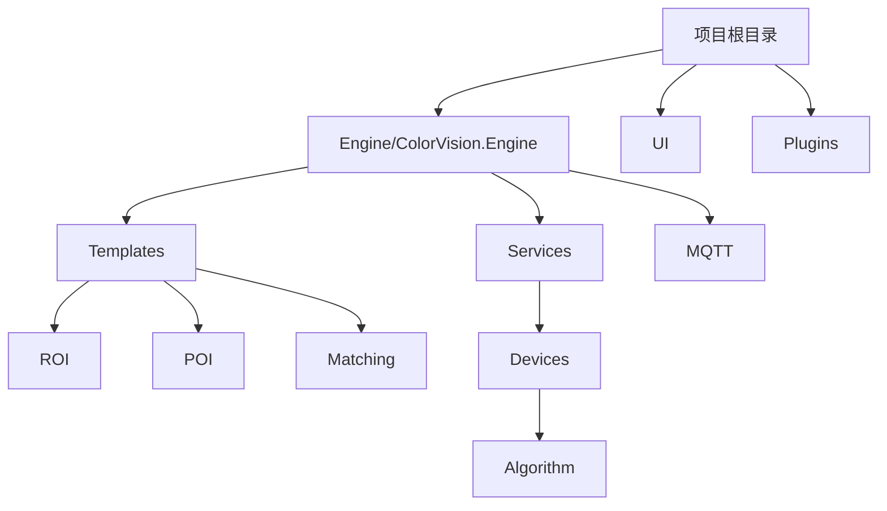
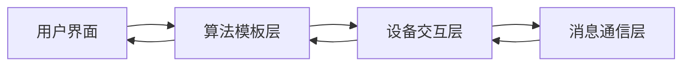

# 通用算法模块


# 通用算法模块

## 目录
1. [引言](#引言)
2. [项目结构](#项目结构)
3. [核心组件](#核心组件)
4. [架构概述](#架构概述)
5. [详细组件分析](#详细组件分析)
6. [依赖分析](#依赖分析)
7. [性能考虑](#性能考虑)
8. [故障排除指南](#故障排除指南)
9. [总结](#总结)
10. [附录](#附录)

## 引言
本项目“通用算法模块”旨在提供核心、可复用的算法构建块，涵盖了感兴趣区域（ROI）选择与处理、关注点（POI）提取与分析、图像匹配等基础算法模块。这些模块是构建更复杂模板和算法的基础，支持图像处理和分析的多种应用场景。本文档详细介绍了项目的架构、核心组件及其实现细节，帮助技术人员和非技术用户理解和使用该算法模块。

---

## 项目结构
项目整体采用模块化设计，目录清晰，代码按功能和技术层次组织。主要目录包括：

1. **Engine/ColorVision.Engine/Templates/ROI**  
   - 负责“感兴趣区域（ROI）”相关算法实现与界面交互。  
   - 包含核心算法类（如`AlgorithmRoi.cs`）、模板定义、显示控件等。

2. **Engine/ColorVision.Engine/Templates/POI**  
   - 负责“关注点（POI）”的提取、过滤、修正与输出。  
   - 包含算法实现（如`AlgorithmPOI.cs`）、过滤器、输出模板、修正模板等子模块。

3. **Engine/ColorVision.Engine/Templates/Matching**  
   - 负责图像匹配相关算法和模板。

4. **Engine/ColorVision.Engine/Services/Devices/Algorithm**  
   - 提供设备算法服务接口和实现，支持算法模块的设备交互。

5. **Engine/ColorVision.Engine/MQTT**  
   - 实现基于MQTT协议的消息通信，用于算法模块与设备或服务间的数据交互。

6. **UI 和 Plugins**  
   - 提供用户界面和插件支持，方便算法模块的扩展和集成。

项目采用MVVM设计模式，界面与业务逻辑分离，便于维护和扩展。算法模块通过继承`DisplayAlgorithmBase`类实现统一接口，支持命令绑定和界面交互。



---

## 核心组件

### 1. ROI算法模块（`AlgorithmRoi.cs`）
- 负责发光区检测，属于定位算法组。
- 继承自`DisplayAlgorithmBase`，封装了设备算法交互。
- 提供打开模板编辑窗口的命令。
- 支持发送检测命令，封装参数通过MQTT发布，实现异步通信。

### 2. POI算法模块（`AlgorithmPOI.cs`）
- 负责关注点数据提取，属于数据提取算法组。
- 支持模板编辑、过滤、修正和输出等多功能操作。
- 支持从文件加载POI点数据。
- 通过MQTT协议发送命令，支持多模板参数组合。
- 采用MVVM模式，支持界面数据绑定和命令操作。

---

## 架构概述
算法模块采用分层架构：

- **表示层（UI）**  
  提供界面显示和用户交互，使用WPF控件和MVVM模式。

- **业务逻辑层（算法模板）**  
  各种算法实现封装为模板类，继承统一基类，实现统一接口。

- **设备交互层**  
  通过`DeviceAlgorithm`和MQTT通信实现与硬件设备或服务的数据交换。

- **消息通信层**  
  使用MQTT消息库封装事件和参数，支持异步消息发布和响应。

此架构保证了模块的可复用性和易扩展性，且界面与算法逻辑解耦，便于维护。



---

## 详细组件分析

### 1. AlgorithmRoi.cs 分析

#### 文件目的
实现发光区检测算法的封装，支持模板编辑和命令发送。

#### 关键类和方法
- `AlgorithmRoi`  
  继承`DisplayAlgorithmBase`，核心算法类。

- 属性：
  - `Device`：设备算法实例，负责与硬件交互。
  - `DService`：MQTT算法服务，发送消息。
  - `OpenTemplateCommand`：打开模板编辑窗口的命令。

- 方法：
  - `OpenTemplate()`：打开ROI模板编辑窗口。
  - `GetUserControl()`：获取显示控件实例，支持界面展示。
  - `SendCommand()`：构造并发送MQTT消息，执行发光区检测。

#### 代码示例

```csharp
public MsgRecord SendCommand(RoiParam param, string deviceCode, string deviceType, string fileName, FileExtType fileExtType, string serialNumber)
{
    string sn = string.IsNullOrWhiteSpace(serialNumber) ? DateTime.Now.ToString("yyyyMMdd'T'HHmmss.fffffff") : serialNumber;
    if (DService.HistoryFilePath.TryGetValue(fileName, out string fullpath))
        fileName = fullpath;
    var Params = new Dictionary\\<string, object\>()
    {
        { "ImgFileName", fileName },
        { "FileType", fileExtType },
        { "DeviceCode", deviceCode },
        { "DeviceType", deviceType },
        { "TemplateParam", new CVTemplateParam() { ID = param.Id, Name = param.Name } }
    };

    MsgSend msg = new()
    {
        EventName = MQTTAlgorithmEventEnum.Event_LightArea2_GetData,
        SerialNumber = sn,
        Params = Params
    };

    return DService.PublishAsyncClient(msg);
}
```

#### 设计说明
- 使用命令绑定实现界面操作。
- 利用MQTT消息异步调用算法服务，解耦设备和算法逻辑。
- 支持模板参数动态传递，便于算法扩展。

---

### 2. AlgorithmPOI.cs 分析

#### 文件目的
实现关注点（POI）提取与分析算法封装，支持多模板组合和文件输入。

#### 关键类和方法
- `AlgorithmPoi`  
  继承`DisplayAlgorithmBase`，支持POI算法及其相关功能。

- 属性：
  - `Device`：设备算法实例。
  - `DService`：MQTT算法服务。
  - 多个`RelayCommand`命令支持模板编辑、过滤、修正、输出和文件打开。
  - `POIStorageModel`：存储类型（数据库或文件）。
  - `POIPointFileName`：POI点文件路径。

- 方法：
  - `OpenTemplate()`、`OpenTemplatePOIFilter()`、`OpenTemplatePoiRevise()`、`OpenTemplatePoiOutput()`：打开不同模板编辑窗口。
  - `OpenPoiFile()`：打开文件选择对话框加载POI点文件。
  - `SendCommand()`：构造并发送MQTT消息，执行POI数据提取。

#### 代码示例

```csharp
public MsgRecord SendCommand(string deviceCode, string deviceType, string fileName, PoiParam poiParam, PoiFilterParam filter, PoiReviseParam revise, PoiOutputParam output, string sn)
{
    sn = string.IsNullOrWhiteSpace(sn) ? DateTime.Now.ToString("yyyyMMdd'T'HHmmss.fffffff") : sn;

    if (DService.HistoryFilePath.TryGetValue(fileName, out string fullpath))
        fileName = fullpath;

    var Params = new Dictionary\\<string, object\>()
    {
        { "ImgFileName", fileName },
        { "DeviceCode", deviceCode },
        { "DeviceType", deviceType },
        { "TemplateParam", new CVTemplateParam() { ID = poiParam.Id, Name = poiParam.Name } }
    };

    if (filter.Id != -1)
        Params.Add("FilterTemplate", new CVTemplateParam() { ID = filter.Id, Name = filter.Name });
    if (revise.Id != -1)
        Params.Add("ReviseTemplate", new CVTemplateParam() { ID = revise.Id, Name = revise.Name });
    if (output.Id != -1)
        Params.Add("OutputTemplate", new CVTemplateParam() { ID = output.Id, Name = output.Name });

    if (POIStorageModel == POIStorageModel.File)
    {
        Params.Add("POIStorageType", POIStorageModel);
        Params.Add("POIPointFileName", POIPointFileName);
    }

    MsgSend msg = new()
    {
        EventName = MQTTAlgorithmEventEnum.Event_POI_GetData,
        SerialNumber = sn,
        Params = Params
    };
    return DService.PublishAsyncClient(msg);
}
```

#### 设计说明
- 支持多模板组合，灵活配置数据处理流程。
- 通过文件或数据库存储POI数据，适应不同应用场景。
- 使用多命令绑定支持不同模板的编辑，提升用户交互体验。
- 异步MQTT通信机制保证算法调用的实时性和可靠性。

---

## 依赖分析
- **MQTTMessageLib**：提供消息通信功能，是算法模块与设备或服务交互的桥梁。
- **ColorVision.Common.MVVM**：实现MVVM模式基础设施，支持命令和数据绑定。
- **DeviceAlgorithm** 和 **MQTTAlgorithm**：核心设备算法接口，封装设备操作和消息发布。
- 模板编辑窗口（`TemplateEditorWindow`）统一管理模板配置和编辑。

模块之间耦合度低，依赖清晰，便于维护和扩展。

---

## 性能考虑
- 使用异步消息发布（`PublishAsyncClient`）避免阻塞主线程，提升响应性能。
- 模板参数传递采用字典结构，灵活但需注意参数数量和大小，避免性能瓶颈。
- 界面控件采用懒加载（`UserControl ??=`），减少资源消耗。
- 文件路径管理支持历史路径缓存，优化文件访问效率。

---

## 故障排除指南
- **模板无法打开**：检查`TemplateSelectedIndex`是否正确，确保模板文件存在。
- **MQTT消息发送失败**：确认MQTT服务连接状态和设备代码正确性。
- **文件加载失败**：确保文件路径有效，支持的文件格式正确。
- **界面无响应**：检查异步调用是否正常执行，避免UI线程阻塞。

---

## 总结
本通用算法模块通过模块化设计，实现了ROI和POI两大核心算法的封装与交互，支持模板编辑、多参数组合和异步消息通信。采用MVVM模式和MQTT协议，保证了系统的灵活性、扩展性和实时性。该模块为构建复杂图像处理模板提供了坚实基础，适合多种工业和科研应用场景。

---

## 附录

### 相关文件链接
- [AlgorithmRoi.cs](https://github.com/xincheng213618/scgd_general_wpf/blob/master/Engine/ColorVision.Engine/Templates/ROI/AlgorithmRoi.cs)
- [AlgorithmPOI.cs](https://github.com/xincheng213618/scgd_general_wpf/blob/master/Engine/ColorVision.Engine/Templates/POI/AlgorithmImp/AlgorithmPOI.cs)

