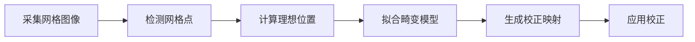
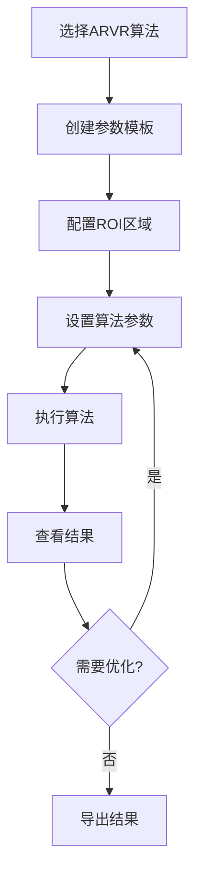

# ARVR 模板详解

## 目录
1. [概述](#概述)
2. [MTF 模板](#mtf-模板)
3. [SFR 模板](#sfr-模板)
4. [FOV 模板](#fov-模板)
5. [Distortion 模板](#distortion-模板)
6. [Ghost 模板](#ghost-模板)
7. [通用特性](#通用特性)
8. [使用指南](#使用指南)

## 概述

ARVR模板组专门用于AR/VR显示设备的光学性能测试和评估。该组包含五大核心算法模板：

- **MTF (Modulation Transfer Function)**: 调制传递函数测试
- **SFR (Spatial Frequency Response)**: 空间频率响应测试
- **FOV (Field of View)**: 视场角测试
- **Distortion**: 畸变分析
- **Ghost**: 鬼影检测

### 技术特点

- 高精度数值计算
- ROI（感兴趣区域）处理
- 频域分析能力
- 图像质量评估
- 可视化结果展示

### 应用场景

- VR头显光学性能评测
- AR眼镜显示质量检测
- 光学镜头MTF测试
- 显示设备畸变校正
- 鬼影问题诊断

## MTF 模板

### 简介

MTF（调制传递函数）是评价光学系统成像质量的重要指标，描述了系统对不同空间频率正弦信号的传递能力。

### 参数说明

#### MTFParam 参数类

```csharp
public class MTFParam : ParamModBase
{
    // Gamma校正值
    [Category("MTF")]
    [Description("Gamma")]
    public double Gamma { get; set; }  // 默认: 0.01
    
    // ROI区域
    [Category("MTF")]
    [DisplayName("ROI X")]
    public int X { get; set; }
    
    [Category("MTF")]
    [DisplayName("ROI Y")]
    public int Y { get; set; }
    
    [Category("MTF")]
    [DisplayName("ROI Width")]
    public int Width { get; set; }
    
    [Category("MTF")]
    [DisplayName("ROI Height")]
    public int Height { get; set; }
    
    // 计算的RECT区域
    [Browsable(false)]
    public System.Windows.Rect RECT { get; }
}
```

#### 参数详解

| 参数 | 类型 | 范围 | 说明 |
|------|------|------|------|
| Gamma | double | 0.0-2.0 | Gamma校正系数，影响对比度计算 |
| X | int | ≥0 | ROI区域左上角X坐标 |
| Y | int | ≥0 | ROI区域左上角Y坐标 |
| Width | int | >0 | ROI区域宽度 |
| Height | int | >0 | ROI区域高度 |

### 结果数据

#### AlgResultMTFModel

```csharp
[SugarTable("t_scgd_algorithm_result_detail_mtf")]
public class AlgResultMTFModel : EntityBase, IViewResult
{
    public int? Pid { get; set; }
    public int? RoiX { get; set; }
    public int? RoiY { get; set; }
    public int? RoiWidth { get; set; }
    public int? RoiHeight { get; set; }
    public double? Gamma { get; set; }
    public string? Pdfrequency { get; set; }          // 频域数据（JSON）
    public string? PdomainSamplingData { get; set; }  // 采样数据（JSON）
}
```

### 使用示例

```csharp
// 1. 创建MTF模板
var templateMTF = new TemplateMTF();
templateMTF.Load();

// 2. 创建新的MTF参数
var mtfParam = new MTFParam
{
    Name = "VR头显MTF测试",
    Gamma = 0.45,
    X = 100,
    Y = 100,
    Width = 500,
    Height = 500
};

// 3. 添加到模板
templateMTF.Params.Add(mtfParam);
templateMTF.Save();

// 4. 执行MTF算法（通过算法服务）
var algorithmMTF = new AlgorithmMTF();
algorithmMTF.Execute(mtfParam);
```

### 结果可视化

MTF结果包含：
- MTF曲线图（调制度随空间频率的变化）
- ROI区域标记
- 频域采样数据
- 关键指标值（MTF50, MTF20等）

## SFR 模板

### 简介

SFR（空间频率响应）通过分析斜边图像计算MTF，是ISO 12233标准推荐的MTF测试方法。

### 参数说明

#### SFRParam 参数类

```csharp
public class SFRParam : ParamModBase
{
    [Category("SFR")]
    [Description("Gamma")]
    public double Gamma { get; set; }  // 默认: 0.01
    
    [Category("SFR")]
    [DisplayName("ROI X")]
    public int X { get; set; }
    
    [Category("SFR")]
    [DisplayName("ROI Y")]
    public int Y { get; set; }
    
    [Category("SFR")]
    [DisplayName("ROI Width")]
    public int Width { get; set; }
    
    [Category("SFR")]
    [DisplayName("ROI Height")]
    public int Height { get; set; }
    
    [Browsable(false)]
    public System.Windows.Rect RECT { get; }
}
```

### 结果数据

```csharp
[SugarTable("t_scgd_algorithm_result_detail_sfr")]
public class AlgResultSFRModel : EntityBase, IViewResult
{
    public int? Pid { get; set; }
    public int? RoiX { get; set; }
    public int? RoiY { get; set; }
    public int? RoiWidth { get; set; }
    public int? RoiHeight { get; set; }
    public double? Gamma { get; set; }
    public string? Pdfrequency { get; set; }
    public string? PdomainSamplingData { get; set; }
}
```

### 测试流程

1. 准备斜边图像（通常为黑白边界，倾斜5-10度）
2. 设置ROI区域覆盖边界
3. 配置Gamma参数
4. 执行SFR算法
5. 分析SFR曲线和关键指标

### 与MTF的区别

| 特性 | MTF | SFR |
|------|-----|-----|
| 测试图案 | 正弦条纹 | 斜边 |
| 标准依据 | 传统方法 | ISO 12233 |
| 计算复杂度 | 较低 | 较高 |
| 精度 | 中等 | 高 |
| 适用场景 | 快速评估 | 精确测试 |

## FOV 模板

### 简介

FOV（视场角）测试用于测量光学系统的有效视野范围，是AR/VR设备的关键性能指标。

### 参数说明

#### FOVParam 参数类

```csharp
public class FOVParam : ParamModBase
{
    [Category("FOV")]
    [Description("水平视场角")]
    public double HorizontalFOV { get; set; }
    
    [Category("FOV")]
    [Description("垂直视场角")]
    public double VerticalFOV { get; set; }
    
    [Category("FOV")]
    [Description("对角线视场角")]
    public double DiagonalFOV { get; set; }
    
    [Category("FOV")]
    [Description("检测阈值")]
    public double DetectionThreshold { get; set; }
}
```

### 结果数据

FOV测试结果通常包含：
- 水平视场角（度）
- 垂直视场角（度）
- 对角线视场角（度）
- 有效视区边界坐标
- 视场分布图

### 测试方法

1. **网格点测试法**
   - 在全视场显示网格
   - 测量可见网格范围
   - 计算视场角

2. **边界扫描法**
   - 从中心向外扫描
   - 检测亮度下降点
   - 确定视场边界

## Distortion 模板

### 简介

畸变分析用于评估和校正光学系统产生的几何畸变，包括枕形畸变和桶形畸变。

### 参数说明

#### DistortionParam 参数类

```csharp
public class DistortionParam : ParamModBase
{
    [Category("Distortion")]
    [Description("网格行数")]
    public int GridRows { get; set; }
    
    [Category("Distortion")]
    [Description("网格列数")]
    public int GridColumns { get; set; }
    
    [Category("Distortion")]
    [Description("标定点数量")]
    public int CalibrationPoints { get; set; }
    
    [Category("Distortion")]
    [Description("畸变模型")]
    public DistortionModelType ModelType { get; set; }
}
```

### 畸变模型

#### 径向畸变模型

```
x_distorted = x_ideal * (1 + k1*r^2 + k2*r^4 + k3*r^6)
y_distorted = y_ideal * (1 + k1*r^2 + k2*r^4 + k3*r^6)
```

其中：
- (x_ideal, y_ideal): 理想坐标
- (x_distorted, y_distorted): 畸变坐标
- r: 距中心距离
- k1, k2, k3: 径向畸变系数

#### 切向畸变模型

```
x_distorted = x_ideal + [2*p1*x*y + p2*(r^2 + 2*x^2)]
y_distorted = y_ideal + [p1*(r^2 + 2*y^2) + 2*p2*x*y]
```

其中：
- p1, p2: 切向畸变系数

### 校正流程



## Ghost 模板

### 简介

鬼影检测用于识别和量化光学系统中的二次反射和杂散光现象。

### 参数说明

#### GhostParam 参数类

```csharp
public class GhostParam : ParamModBase
{
    [Category("Ghost")]
    [Description("检测灵敏度")]
    public double Sensitivity { get; set; }
    
    [Category("Ghost")]
    [Description("背景阈值")]
    public double BackgroundThreshold { get; set; }
    
    [Category("Ghost")]
    [Description("最小鬼影面积")]
    public int MinGhostArea { get; set; }
    
    [Category("Ghost")]
    [Description("对比度阈值")]
    public double ContrastThreshold { get; set; }
}
```

### 检测算法

1. **背景提取**
   - 分析图像整体亮度分布
   - 建立背景模型
   - 计算背景阈值

2. **异常区域检测**
   - 识别高于背景的区域
   - 过滤噪声点
   - 提取候选鬼影

3. **鬼影确认**
   - 分析形状特征
   - 验证位置关系
   - 计算鬼影强度

### 结果指标

- **鬼影数量**: 检测到的鬼影个数
- **鬼影位置**: 每个鬼影的中心坐标
- **鬼影强度**: 相对于主光源的强度比
- **鬼影面积**: 鬼影区域像素数
- **对比度**: 鬼影与背景的对比度

## 通用特性

### ROI 处理

所有ARVR模板都支持ROI（感兴趣区域）处理：

```csharp
// 定义ROI
var roi = new System.Windows.Rect(x, y, width, height);

// 验证ROI有效性
private bool ValidateROI(Rect roi, int imageWidth, int imageHeight)
{
    return roi.X >= 0 && roi.Y >= 0 &&
           roi.X + roi.Width <= imageWidth &&
           roi.Y + roi.Height <= imageHeight;
}

// 提取ROI图像
Mat roiImage = sourceImage[new OpenCvSharp.Rect(
    (int)roi.X, (int)roi.Y, 
    (int)roi.Width, (int)roi.Height
)];
```

### 结果可视化

ARVR模板结果通过`IResultHandleBase`处理器进行可视化：

```csharp
public class ViewHandleMTF : IResultHandleBase
{
    public override List\<ViewResultAlgType> CanHandle => 
        new List\<ViewResultAlgType>() { ViewResultAlgType.MTF };
    
    public override void Handle(IViewImageA view, ViewResultAlg result)
    {
        // 显示图像
        if (File.Exists(result.FilePath))
            view.ImageView.OpenImage(result.FilePath);
        
        // 绘制ROI
        DrawROI(view, result);
        
        // 显示数据表格
        DisplayDataGrid(view, result);
        
        // 绘制曲线
        DrawMTFCurve(view, result);
    }
}
```

### 数据导出

支持多种导出格式：

```csharp
// CSV导出
public override void SideSave(ViewResultAlg result, string selectedPath)
{
    string fileName = Path.Combine(selectedPath, $"{result.ResultType}_{result.Batch}.csv");
    var csvBuilder = new StringBuilder();
    
    // 添加表头
    csvBuilder.AppendLine("X,Y,Width,Height,Gamma,Frequency,Value");
    
    // 添加数据
    foreach (var item in result.ViewResults)
    {
        csvBuilder.AppendLine($"{item.RoiX},{item.RoiY},...");
    }
    
    File.WriteAllText(fileName, csvBuilder.ToString(), Encoding.UTF8);
}
```

## 使用指南

### 基本工作流程



### 最佳实践

#### 1. ROI选择
- **MTF/SFR**: 选择包含清晰边界的区域
- **FOV**: 覆盖整个视场
- **Distortion**: 确保网格完整性
- **Ghost**: 包含可疑反射区域

#### 2. 参数调优
```csharp
// MTF参数优化
var mtfParam = new MTFParam
{
    // Gamma值建议范围: 0.01-1.0
    Gamma = 0.45,  // 接近sRGB标准
    
    // ROI应避免边缘区域
    X = imageWidth * 0.1,
    Y = imageHeight * 0.1,
    Width = imageWidth * 0.8,
    Height = imageHeight * 0.8
};
```

#### 3. 结果验证
```csharp
// MTF结果验证
public bool ValidateMTFResult(AlgResultMTFModel result)
{
    // 检查频率数据完整性
    if (string.IsNullOrEmpty(result.Pdfrequency))
        return false;
    
    // 解析频率数据
    var frequencies = JsonConvert.DeserializeObject<double[]>(result.Pdfrequency);
    
    // 验证MTF曲线单调递减
    for (int i = 1; i < frequencies.Length; i++)
    {
        if (frequencies[i] > frequencies[i-1])
            return false;  // MTF应随频率递减
    }
    
    return true;
}
```

### 常见问题

#### Q1: MTF值偏低
**可能原因**:
- ROI选择不当
- Gamma值设置错误
- 图像质量差

**解决方案**:
```csharp
// 调整Gamma值
param.Gamma = 0.45;  // 尝试标准值

// 优化ROI
param.Width = Math.Min(param.Width, 1000);  // 限制ROI大小
param.Height = Math.Min(param.Height, 1000);
```

#### Q2: 鬼影误检测
**可能原因**:
- 灵敏度过高
- 背景阈值不合适

**解决方案**:
```csharp
// 降低灵敏度
ghostParam.Sensitivity = 0.5;

// 提高背景阈值
ghostParam.BackgroundThreshold = 0.1;

// 增加最小面积过滤
ghostParam.MinGhostArea = 100;
```

#### Q3: 畸变校正效果不佳
**可能原因**:
- 标定点不足
- 畸变模型选择错误

**解决方案**:
```csharp
// 增加标定点
distortionParam.GridRows = 15;
distortionParam.GridColumns = 15;

// 尝试更高阶模型
distortionParam.ModelType = DistortionModelType.FullRadialTangential;
```

### 性能优化

#### 1. 并行处理
```csharp
// 批量处理多个ROI
Parallel.ForEach(roiList, roi =>
{
    var result = ProcessMTF(roi);
    results.Add(result);
});
```

#### 2. 缓存优化
```csharp
// 缓存频繁使用的数据
private static Dictionary<string, double[]> _frequencyCache = new();

public double[] GetCachedFrequency(string key)
{
    if (!_frequencyCache.ContainsKey(key))
    {
        _frequencyCache[key] = CalculateFrequency();
    }
    return _frequencyCache[key];
}
```

## 相关资源

- [Templates架构设计](./Templates架构设计.md)
- [Templates API参考](./Templates-API参考.md)
- [POI模板详解](./POI模板详解.md)
- [图像处理模板详解](./图像处理模板详解.md)
- [Ghost检测算法](../../algorithms/ghost-detection.md)
