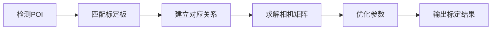
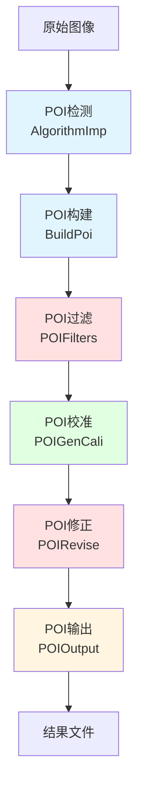

# POI 模板详解

## 目录
1. [概述](#概述)
2. [POI核心概念](#poi核心概念)
3. [POI模板组织结构](#poi模板组织结构)
4. [POI处理流程](#poi处理流程)
5. [各子模块详解](#各子模块详解)
6. [使用指南](#使用指南)
7. [最佳实践](#最佳实践)

## 概述

POI（Point of Interest，兴趣点）模板组是ColorVision中最复杂的模板系统之一，用于图像中关键点的检测、分析、校准和输出。POI系统广泛应用于：

- 显示设备像素级分析
- 光学标定
- 图像配准
- 质量检测
- 特征提取

### 模块组成

POI模板组包含6个子模块：

```
POI/
├── AlgorithmImp/      # POI算法实现
├── BuildPoi/          # POI构建
├── POIFilters/        # POI过滤器
├── POIGenCali/        # POI生成校准
├── POIOutput/         # POI输出
└── POIRevise/         # POI修正
```

### 技术特点

- **多阶段处理**: 检测→过滤→校准→修正→输出
- **高度可配置**: 每个阶段都有独立的参数模板
- **滤波器链**: 支持多个过滤器串联
- **灵活输出**: 支持多种数据格式

## POI核心概念

### POI数据结构

```csharp
public class POIPoint
{
    public int Id { get; set; }              // POI唯一标识
    public double X { get; set; }            // X坐标
    public double Y { get; set; }            // Y坐标
    public PointType Type { get; set; }      // 点类型
    public double Value { get; set; }        // 关联数值
    public string Name { get; set; }         // 点名称
    public Dictionary\<string, object> Properties { get; set; }  // 扩展属性
}
```

### POI类型

| 类型 | 说明 | 应用场景 |
|------|------|----------|
| Feature | 特征点 | 角点、边缘点检测 |
| Calibration | 校准点 | 相机标定、畸变校正 |
| Measurement | 测量点 | 尺寸测量、定位 |
| Defect | 缺陷点 | 质量检测、异常识别 |
| Reference | 参考点 | 基准点、锚点 |

## POI模板组织结构

### 1. AlgorithmImp - POI算法实现

**职责**: 实现各种POI检测算法

**主要算法**:
- **角点检测**: Harris、Shi-Tomasi、FAST
- **特征点检测**: SIFT、SURF、ORB
- **边缘检测**: Canny、Sobel
- **圆形检测**: Hough Circle
- **自定义检测**: 基于模板匹配、颜色阈值等

**参数示例**:
```csharp
public class POIDetectionParam : ParamModBase
{
    [Category("检测算法")]
    [Description("算法类型")]
    public POIAlgorithmType AlgorithmType { get; set; }
    
    [Category("检测参数")]
    [Description("质量阈值")]
    public double QualityThreshold { get; set; } = 0.01;
    
    [Category("检测参数")]
    [Description("最小距离")]
    public double MinDistance { get; set; } = 10.0;
    
    [Category("检测参数")]
    [Description("最大点数")]
    public int MaxPoints { get; set; } = 1000;
}
```

### 2. BuildPoi - POI构建

**职责**: 从检测结果构建POI数据结构

**功能**:
- POI点聚类
- POI层级组织
- POI属性赋值
- POI索引建立

**参数示例**:
```csharp
public class POIBuildParam : ParamModBase
{
    [Category("构建参数")]
    [Description("聚类半径")]
    public double ClusterRadius { get; set; } = 5.0;
    
    [Category("构建参数")]
    [Description("最小聚类点数")]
    public int MinClusterSize { get; set; } = 3;
    
    [Category("输出设置")]
    [Description("POI命名模式")]
    public string NamingPattern { get; set; } = "POI_{0:D4}";
}
```

### 3. POIFilters - POI过滤器

**职责**: 过滤和筛选POI点

**过滤器类型**:

#### 位置过滤器
```csharp
public class POIPositionFilter : IPOIFilter
{
    public Rect ValidRegion { get; set; }
    
    public List\<POIPoint> Filter(List\<POIPoint> points)
    {
        return points.Where(p => ValidRegion.Contains(new Point(p.X, p.Y))).ToList();
    }
}
```

#### 值过滤器
```csharp
public class POIValueFilter : IPOIFilter
{
    public double MinValue { get; set; }
    public double MaxValue { get; set; }
    
    public List\<POIPoint> Filter(List\<POIPoint> points)
    {
        return points.Where(p => p.Value >= MinValue && p.Value <= MaxValue).ToList();
    }
}
```

#### 距离过滤器
```csharp
public class POIDistanceFilter : IPOIFilter
{
    public double MinDistance { get; set; }
    
    public List\<POIPoint> Filter(List\<POIPoint> points)
    {
        // 移除距离过近的点
        var filtered = new List\<POIPoint>();
        foreach (var point in points)
        {
            if (!filtered.Any(p => Distance(p, point) < MinDistance))
            {
                filtered.Add(point);
            }
        }
        return filtered;
    }
}
```

**参数示例**:
```csharp
public class POIFilterParam : ParamModBase
{
    [Category("位置过滤")]
    [Description("最小X坐标")]
    public double MinX { get; set; }
    
    [Category("位置过滤")]
    [Description("最大X坐标")]
    public double MaxX { get; set; }
    
    [Category("值过滤")]
    [Description("最小值")]
    public double MinValue { get; set; }
    
    [Category("值过滤")]
    [Description("最大值")]
    public double MaxValue { get; set; }
}
```

### 4. POIGenCali - POI生成校准

**职责**: 使用POI进行几何校准

**功能**:
- 相机内参标定
- 畸变系数计算
- 坐标系变换
- 刚体变换估计

**参数示例**:
```csharp
public class POICalibrationParam : ParamModBase
{
    [Category("标定参数")]
    [Description("标定板类型")]
    public CalibrationBoardType BoardType { get; set; }
    
    [Category("标定参数")]
    [Description("标定板宽度(mm)")]
    public double BoardWidth { get; set; }
    
    [Category("标定参数")]
    [Description("标定板高度(mm)")]
    public double BoardHeight { get; set; }
    
    [Category("标定参数")]
    [Description("网格间距(mm)")]
    public double GridSpacing { get; set; }
}
```

**标定流程**:


### 5. POIOutput - POI输出

**职责**: 将POI数据输出为各种格式

**支持格式**:
- **JSON**: 结构化数据
- **CSV**: 表格数据
- **XML**: 标记语言
- **Binary**: 二进制格式（高效）
- **Image**: 可视化图像

**参数示例**:
```csharp
public class POIOutputParam : ParamModBase
{
    [Category("输出设置")]
    [Description("输出格式")]
    public OutputFormat Format { get; set; }
    
    [Category("输出设置")]
    [Description("输出路径")]
    public string OutputPath { get; set; }
    
    [Category("输出内容")]
    [Description("包含属性")]
    public bool IncludeProperties { get; set; } = true;
    
    [Category("输出内容")]
    [Description("包含图像")]
    public bool IncludeImage { get; set; } = false;
}
```

**JSON输出示例**:
```json
{
  "version": "1.0",
  "timestamp": "2025-10-12T20:54:33Z",
  "points": [
    {
      "id": 1,
      "x": 123.45,
      "y": 678.90,
      "type": "Feature",
      "value": 0.95,
      "name": "POI_0001",
      "properties": {
        "quality": 0.98,
        "response": 125.3
      }
    }
  ]
}
```

### 6. POIRevise - POI修正

**职责**: 对检测到的POI进行后处理修正

**修正类型**:
- **亚像素精化**: 提高定位精度
- **异常点剔除**: 移除噪声点
- **坐标变换**: 应用几何变换
- **值校正**: 应用校准曲线

**参数示例**:
```csharp
public class POIReviseParam : ParamModBase
{
    [Category("精化参数")]
    [Description("启用亚像素精化")]
    public bool EnableSubPixel { get; set; } = true;
    
    [Category("精化参数")]
    [Description("精化窗口大小")]
    public int RefineWindowSize { get; set; } = 5;
    
    [Category("异常检测")]
    [Description("异常值标准差倍数")]
    public double OutlierStdDev { get; set; } = 3.0;
}
```

## POI处理流程

### 完整处理管道



### 典型工作流

```csharp
public async Task<List\<POIPoint>> ProcessPOIPipeline(Mat image)
{
    // 1. POI检测
    var detector = new POIDetector();
    var rawPoints = detector.Detect(image, detectionParam);
    
    // 2. POI构建
    var builder = new POIBuilder();
    var structuredPoints = builder.Build(rawPoints, buildParam);
    
    // 3. POI过滤
    var filter = new POIFilterChain();
    filter.AddFilter(new POIPositionFilter());
    filter.AddFilter(new POIValueFilter());
    var filteredPoints = filter.Apply(structuredPoints, filterParam);
    
    // 4. POI校准（可选）
    if (needCalibration)
    {
        var calibrator = new POICalibrator();
        filteredPoints = calibrator.Calibrate(filteredPoints, calibrationParam);
    }
    
    // 5. POI修正
    var reviser = new POIReviser();
    var refinedPoints = reviser.Revise(filteredPoints, reviseParam);
    
    // 6. POI输出
    var outputer = new POIOutputer();
    await outputer.Save(refinedPoints, outputParam);
    
    return refinedPoints;
}
```

## 各子模块详解

### AlgorithmImp - 算法实现

#### 角点检测算法

**Harris角点检测**:
```csharp
public class HarrisCornerDetector : IPOIAlgorithm
{
    public double Quality { get; set; } = 0.01;
    public double MinDistance { get; set; } = 10.0;
    public int BlockSize { get; set; } = 3;
    public double K { get; set; } = 0.04;
    
    public List\<POIPoint> Detect(Mat image)
    {
        Mat corners = new Mat();
        Cv2.CornerHarris(image, corners, BlockSize, 3, K);
        
        // 非极大值抑制
        var points = ExtractLocalMaxima(corners, Quality, MinDistance);
        return points;
    }
}
```

**Shi-Tomasi角点检测**:
```csharp
public class ShiTomasiDetector : IPOIAlgorithm
{
    public int MaxCorners { get; set; } = 1000;
    public double QualityLevel { get; set; } = 0.01;
    public double MinDistance { get; set; } = 10.0;
    
    public List\<POIPoint> Detect(Mat image)
    {
        var corners = Cv2.GoodFeaturesToTrack(
            image, MaxCorners, QualityLevel, MinDistance);
        return ConvertToPOI(corners);
    }
}
```

### BuildPoi - POI构建器

#### 聚类构建

```csharp
public class POIClusterBuilder : IPOIBuilder
{
    public double ClusterRadius { get; set; }
    public int MinClusterSize { get; set; }
    
    public List\<POIPoint> Build(List\<POIPoint> rawPoints)
    {
        var clusters = new List<List\<POIPoint>>();
        var visited = new HashSet\<int>();
        
        foreach (var point in rawPoints)
        {
            if (visited.Contains(point.Id))
                continue;
            
            var cluster = FindNeighbors(point, rawPoints, ClusterRadius);
            if (cluster.Count >= MinClusterSize)
            {
                clusters.Add(cluster);
                foreach (var p in cluster)
                    visited.Add(p.Id);
            }
        }
        
        // 计算聚类中心
        return clusters.Select(c => GetClusterCenter(c)).ToList();
    }
}
```

#### 网格构建

```csharp
public class POIGridBuilder : IPOIBuilder
{
    public int GridRows { get; set; }
    public int GridColumns { get; set; }
    public double GridSpacing { get; set; }
    
    public List\<POIPoint> Build(List\<POIPoint> rawPoints)
    {
        var grid = new POIPoint[GridRows, GridColumns];
        
        // 将检测点映射到网格
        foreach (var point in rawPoints)
        {
            var (row, col) = FindNearestGridCell(point);
            if (grid[row, col] == null || 
                point.Value > grid[row, col].Value)
            {
                grid[row, col] = point;
            }
        }
        
        return GridToList(grid);
    }
}
```

### POIFilters - 过滤器系统

#### 过滤器接口

```csharp
public interface IPOIFilter
{
    string Name { get; }
    List\<POIPoint> Filter(List\<POIPoint> points);
}
```

#### 链式过滤

```csharp
public class POIFilterChain
{
    private List\<IPOIFilter> filters = new();
    
    public void AddFilter(IPOIFilter filter)
    {
        filters.Add(filter);
    }
    
    public List\<POIPoint> Apply(List\<POIPoint> points, POIFilterParam param)
    {
        var result = points;
        foreach (var filter in filters)
        {
            result = filter.Filter(result);
        }
        return result;
    }
}
```

#### 内置过滤器

**边界过滤器**:
```csharp
public class POIBoundaryFilter : IPOIFilter
{
    public string Name => "边界过滤";
    public Rect Boundary { get; set; }
    
    public List\<POIPoint> Filter(List\<POIPoint> points)
    {
        return points.Where(p => 
            p.X >= Boundary.Left && p.X <= Boundary.Right &&
            p.Y >= Boundary.Top && p.Y <= Boundary.Bottom
        ).ToList();
    }
}
```

**质量过滤器**:
```csharp
public class POIQualityFilter : IPOIFilter
{
    public string Name => "质量过滤";
    public double MinQuality { get; set; }
    
    public List\<POIPoint> Filter(List\<POIPoint> points)
    {
        return points.Where(p => p.Value >= MinQuality).ToList();
    }
}
```

**稀疏化过滤器**:
```csharp
public class POISparsificationFilter : IPOIFilter
{
    public string Name => "稀疏化";
    public double MinSpacing { get; set; }
    
    public List\<POIPoint> Filter(List\<POIPoint> points)
    {
        var result = new List\<POIPoint>();
        var sortedPoints = points.OrderByDescending(p => p.Value).ToList();
        
        foreach (var point in sortedPoints)
        {
            if (!result.Any(p => Distance(p, point) < MinSpacing))
            {
                result.Add(point);
            }
        }
        return result;
    }
}
```

### POIGenCali - 生成校准

#### 相机标定

```csharp
public class POICameraCalibration
{
    public CalibrationResult Calibrate(
        List<List\<POIPoint>> imagePoints,    // 图像点（多组）
        List<List\<Point3D>> objectPoints,    // 物理点（多组）
        Size imageSize)
    {
        // 标定相机内参
        var cameraMatrix = new Mat();
        var distCoeffs = new Mat();
        
        Cv2.CalibrateCamera(
            objectPoints.ToArray(),
            imagePoints.ToArray(),
            imageSize,
            cameraMatrix,
            distCoeffs,
            out var rvecs,
            out var tvecs
        );
        
        return new CalibrationResult
        {
            CameraMatrix = cameraMatrix,
            DistortionCoefficients = distCoeffs,
            RotationVectors = rvecs,
            TranslationVectors = tvecs
        };
    }
}
```

#### 平面变换

```csharp
public class POIPerspectiveTransform
{
    public Mat GetTransformMatrix(
        List\<POIPoint> sourcePoints,
        List\<POIPoint> targetPoints)
    {
        var src = sourcePoints.Select(p => new Point2f((float)p.X, (float)p.Y)).ToArray();
        var dst = targetPoints.Select(p => new Point2f((float)p.X, (float)p.Y)).ToArray();
        
        return Cv2.GetPerspectiveTransform(src, dst);
    }
}
```

### POIRevise - POI修正

#### 亚像素精化

```csharp
public class POISubPixelRefine
{
    public int WindowSize { get; set; } = 5;
    public int MaxIterations { get; set; } = 30;
    public double Epsilon { get; set; } = 0.001;
    
    public List\<POIPoint> Refine(Mat image, List\<POIPoint> points)
    {
        var corners = points.Select(p => new Point2f((float)p.X, (float)p.Y)).ToArray();
        
        var criteria = new TermCriteria(
            CriteriaTypes.Eps | CriteriaTypes.MaxIter,
            MaxIterations,
            Epsilon
        );
        
        Cv2.CornerSubPix(
            image,
            corners,
            new Size(WindowSize, WindowSize),
            new Size(-1, -1),
            criteria
        );
        
        // 更新点坐标
        for (int i = 0; i < points.Count; i++)
        {
            points[i].X = corners[i].X;
            points[i].Y = corners[i].Y;
        }
        
        return points;
    }
}
```

#### 异常点剔除

```csharp
public class POIOutlierRemoval
{
    public double StdDevMultiplier { get; set; } = 3.0;
    
    public List\<POIPoint> RemoveOutliers(List\<POIPoint> points)
    {
        // 基于统计方法移除异常点
        var values = points.Select(p => p.Value).ToArray();
        var mean = values.Average();
        var stdDev = CalculateStdDev(values, mean);
        
        return points.Where(p => 
            Math.Abs(p.Value - mean) <= StdDevMultiplier * stdDev
        ).ToList();
    }
}
```

### POIOutput - 输出实现

#### JSON输出

```csharp
public class POIJsonOutput : IPOIOutput
{
    public void Save(List\<POIPoint> points, string filePath)
    {
        var output = new
        {
            Version = "1.0",
            Timestamp = DateTime.Now,
            Count = points.Count,
            Points = points.Select(p => new
            {
                p.Id,
                p.X,
                p.Y,
                Type = p.Type.ToString(),
                p.Value,
                p.Name,
                p.Properties
            })
        };
        
        var json = JsonConvert.SerializeObject(output, Formatting.Indented);
        File.WriteAllText(filePath, json, Encoding.UTF8);
    }
}
```

#### CSV输出

```csharp
public class POICsvOutput : IPOIOutput
{
    public void Save(List\<POIPoint> points, string filePath)
    {
        var csv = new StringBuilder();
        csv.AppendLine("ID,X,Y,Type,Value,Name");
        
        foreach (var point in points)
        {
            csv.AppendLine($"{point.Id},{point.X},{point.Y},{point.Type},{point.Value},{point.Name}");
        }
        
        File.WriteAllText(filePath, csv.ToString(), Encoding.UTF8);
    }
}
```

## 使用指南

### 快速开始

```csharp
// 1. 创建POI模板
var templatePOI = new TemplatePoi();
templatePOI.Load();

// 2. 配置检测参数
var detectionParam = new POIDetectionParam
{
    AlgorithmType = POIAlgorithmType.ShiTomasi,
    QualityThreshold = 0.01,
    MinDistance = 10.0,
    MaxPoints = 500
};

// 3. 配置过滤参数
var filterParam = new POIFilterParam
{
    MinX = 0,
    MaxX = 1920,
    MinY = 0,
    MaxY = 1080,
    MinValue = 0.1
};

// 4. 执行POI检测
var algorithm = new AlgorithmPOI();
var result = await algorithm.ExecuteAsync(image, detectionParam);

// 5. 应用过滤
var filtered = ApplyFilters(result.Points, filterParam);

// 6. 输出结果
var output = new POIJsonOutput();
output.Save(filtered, "poi_result.json");
```

### 高级用法

#### 自定义POI算法

```csharp
public class CustomPOIDetector : IPOIAlgorithm
{
    public List\<POIPoint> Detect(Mat image)
    {
        var points = new List\<POIPoint>();
        
        // 自定义检测逻辑
        // 例如：基于颜色的检测
        var hsv = new Mat();
        Cv2.CvtColor(image, hsv, ColorConversionCodes.BGR2HSV);
        
        var mask = new Mat();
        Cv2.InRange(hsv, new Scalar(100, 50, 50), new Scalar(130, 255, 255), mask);
        
        var contours = Cv2.FindContoursAsArray(mask, RetrievalModes.External, ContourApproximationModes.ApproxSimple);
        
        foreach (var contour in contours)
        {
            var moments = Cv2.Moments(contour);
            var center = new Point2d(
                moments.M10 / moments.M00,
                moments.M01 / moments.M00
            );
            
            points.Add(new POIPoint
            {
                X = center.X,
                Y = center.Y,
                Type = PointType.Feature,
                Value = Cv2.ContourArea(contour)
            });
        }
        
        return points;
    }
}
```

#### 自定义过滤器

```csharp
public class CustomPOIFilter : IPOIFilter
{
    public string Name => "自定义过滤";
    
    // 自定义条件
    public Func\<POIPoint, bool> Condition { get; set; }
    
    public List\<POIPoint> Filter(List\<POIPoint> points)
    {
        return points.Where(p => Condition(p)).ToList();
    }
}

// 使用
var filter = new CustomPOIFilter
{
    Condition = p => p.X > 100 && p.Y > 100 && p.Value > 0.5
};
```

## 最佳实践

### 1. 检测参数选择

```csharp
// 高质量检测（精确，较慢）
var highQualityParam = new POIDetectionParam
{
    AlgorithmType = POIAlgorithmType.ShiTomasi,
    QualityThreshold = 0.001,  // 低阈值，检测更多点
    MinDistance = 5.0,          // 允许密集点
    MaxPoints = 2000
};

// 快速检测（快速，一般精度）
var fastParam = new POIDetectionParam
{
    AlgorithmType = POIAlgorithmType.FAST,
    QualityThreshold = 0.05,   // 高阈值，检测少量点
    MinDistance = 20.0,         // 较大间距
    MaxPoints = 200
};
```

### 2. 过滤器配置

```csharp
// 建议的过滤器顺序
var filterChain = new POIFilterChain();

// 1. 首先过滤边界外的点
filterChain.AddFilter(new POIBoundaryFilter { Boundary = validRegion });

// 2. 然后过滤低质量点
filterChain.AddFilter(new POIQualityFilter { MinQuality = 0.1 });

// 3. 最后稀疏化
filterChain.AddFilter(new POISparsificationFilter { MinSpacing = 15.0 });
```

### 3. 性能优化

```csharp
// 使用图像金字塔加速检测
public List\<POIPoint> DetectMultiScale(Mat image)
{
    var pyramid = BuildPyramid(image, 3);  // 3层金字塔
    var points = new List\<POIPoint>();
    
    for (int level = 0; level < pyramid.Count; level++)
    {
        var scale = Math.Pow(2, level);
        var levelPoints = detector.Detect(pyramid[level]);
        
        // 转换回原始尺度
        foreach (var p in levelPoints)
        {
            p.X *= scale;
            p.Y *= scale;
            points.Add(p);
        }
    }
    
    return points;
}
```

### 4. 结果验证

```csharp
public bool ValidatePOIResult(List\<POIPoint> points)
{
    // 检查点数
    if (points.Count == 0)
    {
        Console.WriteLine("警告: 未检测到POI点");
        return false;
    }
    
    // 检查分布
    var bounds = GetBoundingBox(points);
    var coverage = (bounds.Width * bounds.Height) / (imageWidth * imageHeight);
    if (coverage < 0.1)
    {
        Console.WriteLine("警告: POI分布过于集中");
        return false;
    }
    
    // 检查密度
    var density = points.Count / (bounds.Width * bounds.Height);
    if (density > 0.01)
    {
        Console.WriteLine("警告: POI过于密集，可能有噪声");
        return false;
    }
    
    return true;
}
```

### 5. 错误处理

```csharp
public async Task\<POIResult> SafeDetectPOI(Mat image, POIDetectionParam param)
{
    try
    {
        // 验证输入
        if (image == null || image.Empty())
            throw new ArgumentException("图像为空");
        
        if (param == null)
            throw new ArgumentNullException(nameof(param));
        
        // 执行检测
        var points = detector.Detect(image, param);
        
        // 验证结果
        if (!ValidatePOIResult(points))
        {
            return new POIResult 
            { 
                Success = false, 
                Message = "检测结果不符合预期" 
            };
        }
        
        return new POIResult 
        { 
            Success = true, 
            Points = points 
        };
    }
    catch (Exception ex)
    {
        log.Error($"POI检测失败: {ex.Message}", ex);
        return new POIResult 
        { 
            Success = false, 
            Message = ex.Message 
        };
    }
}
```

## 相关资源

- [Templates架构设计](./Templates架构设计.md)
- [Templates API参考](./Templates-API参考.md)
- [POI概念详解](../../common-algorithm-primitives/poi-point-of-interest/POI_(关注点).md)
- [ARVR模板详解](./ARVR模板详解.md)
