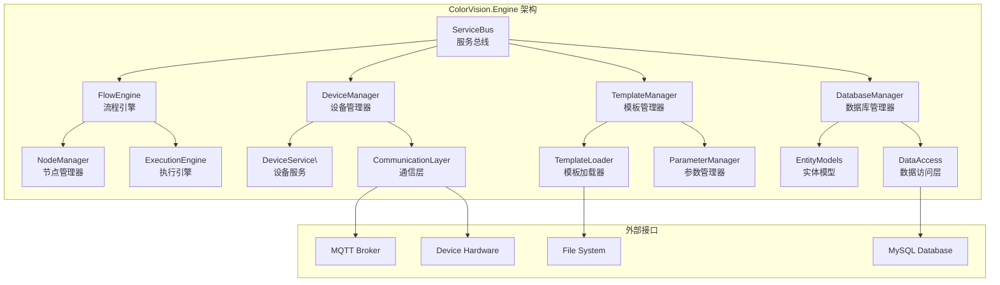

# ColorVision.Engine

## 目录
1. [概述](#概述)
2. [核心功能](#核心功能)
3. [架构设计](#架构设计)
4. [主要组件](#主要组件)
5. [流程引擎](#流程引擎)
6. [设备服务管理](#设备服务管理)
7. [模板系统](#模板系统)
8. [数据库操作](#数据库操作)
9. [使用示例](#使用示例)
10. [API参考](#api参考)

## 概述

**ColorVision.Engine** 是 ColorVision 系统的核心引擎，负责流程管理、设备服务协调、模板系统和数据处理。它是整个系统的控制中心，通过可视化的流程设计器，用户可以创建复杂的测试和分析流程。

### 基本信息

- **主要功能**: 流程引擎、设备管理、模板系统、数据库访问
- **架构模式**: 模块化、服务化、事件驱动
- **通信协议**: MQTT、TCP/IP、串行通信
- **数据存储**: MySQL、SQLite、文件系统
- **特色功能**: 可视化流程设计、设备自动发现、实时监控

## 核心功能

### 1. 流程引擎系统
- **可视化流程设计**: 通过拖拽节点创建复杂流程
- **流程执行管理**: 支持串行、并行、条件分支执行
- **状态监控**: 实时监控流程执行状态和进度
- **异常处理**: 完善的错误处理和恢复机制

### 2. 设备服务管理
- **设备自动发现**: 自动扫描和识别网络设备
- **多协议支持**: MQTT、TCP、UDP、串行通信
- **服务注册**: 动态注册和管理设备服务
- **状态同步**: 实时同步设备状态和参数

### 3. 模板系统
- **参数化模板**: 支持灵活的参数配置
- **模板继承**: 模板间的继承和组合关系
- **版本管理**: 模板版本控制和历史记录
- **导入导出**: 模板的备份和迁移功能

### 4. 数据管理
- **多数据源支持**: MySQL、SQLite、文件存储
- **ORM映射**: Entity Framework数据访问层
- **事务管理**: 保证数据操作的一致性
- **数据同步**: 支持数据的同步和复制

## 架构设计



## 主要组件

### FlowEngineManager 流程引擎管理器

负责流程的创建、加载、执行和监控管理。

```csharp
public class FlowEngineManager
{
    // 加载流程模板
    public async Task\<FlowTemplate\> LoadFlowTemplateAsync(string templateName)
    
    // 执行流程
    public async Task\<FlowResult\> ExecuteFlowAsync(FlowTemplate template, Dictionary\\<string, object\> parameters)
    
    // 监控流程状态
    public event EventHandler\<FlowStatusChangedEventArgs\> FlowStatusChanged;
}
```

### DeviceServiceManager 设备服务管理器

管理所有设备服务的生命周期和通信。

```csharp
public class DeviceServiceManager
{
    // 注册设备服务
    public void RegisterService\<T\>() where T : IDeviceService
    
    // 获取设备服务
    public T GetService\<T\>() where T : IDeviceService
    
    // 设备状态变更事件
    public event EventHandler\<DeviceStatusChangedEventArgs\> DeviceStatusChanged;
}
```

### TemplateManager 模板管理器

处理模板的加载、保存、参数管理等操作。

```csharp
public class TemplateManager
{
    // 创建新模板
    public async Task\<Template\> CreateTemplateAsync(string name, TemplateType type)
    
    // 保存模板
    public async Task SaveTemplateAsync(Template template)
    
    // 加载模板参数
    public async Task<Dictionary\\<string, object>\> LoadTemplateParametersAsync(int templateId)
}
```

## 流程引擎

### 流程设计器

基于 STNodeEditor 的可视化流程设计器，支持：

- **节点拖拽**: 从工具箱拖拽节点到画布
- **连接管理**: 节点间的输入输出连接
- **属性编辑**: 实时编辑节点属性
- **布局管理**: 自动布局和手动调整

### 节点类型

#### 1. 输入节点
- **数据输入**: 从文件、数据库、设备读取数据
- **参数设置**: 流程参数和常量定义
- **触发条件**: 定时、事件、手动触发

#### 2. 处理节点
- **图像处理**: 滤波、变换、增强、分析
- **数据处理**: 统计、计算、格式转换
- **算法执行**: 调用自定义算法模块

#### 3. 控制节点
- **条件判断**: if-else逻辑分支
- **循环控制**: for、while循环处理
- **并行执行**: 多线程并行处理

#### 4. 输出节点
- **结果保存**: 保存到文件、数据库
- **报告生成**: 自动生成分析报告
- **设备控制**: 控制外部设备动作

### 执行机制

```csharp
// 流程执行示例
var flowEngine = new FlowEngine();
var flow = await flowEngine.LoadFlowAsync("quality_check_flow");

// 设置参数
flow.SetParameter("input_image", imagePath);
flow.SetParameter("threshold", 0.8);

// 执行流程
var result = await flowEngine.ExecuteAsync(flow);

// 处理结果
if (result.Success)
{
    var outputData = result.GetOutput\<ProcessingResult\>();
    Console.WriteLine($"处理完成：{outputData.Message}");
}
```

## 设备服务管理

### 设备服务架构

每个设备类型都有对应的服务类，实现 IDeviceService 接口：

```csharp
public interface IDeviceService
{
    string ServiceType { get; }
    DeviceStatus Status { get; }
    
    Task\<bool\> ConnectAsync();
    Task\<bool\> DisconnectAsync();
    Task\<object\> ExecuteCommandAsync(string command, object parameters);
    
    event EventHandler\<DeviceStatusChangedEventArgs\> StatusChanged;
}
```

### 支持的设备类型

#### 1. 相机设备服务
- **LV相机**: 亮度图像采集
- **BV相机**: 生物视觉图像
- **CV相机**: 色彩视觉图像
- **通用相机**: 标准工业相机

#### 2. 光谱设备服务
- **光谱仪**: 光谱数据采集
- **色度计**: 色度参数测量
- **辐射计**: 辐射量测量

#### 3. 运动控制服务
- **电机控制**: 步进电机、伺服电机
- **位移台**: XYZ精密位移控制
- **旋转台**: 角度控制和定位

#### 4. 通信服务
- **MQTT服务**: 消息发布订阅
- **TCP服务**: 网络通信服务
- **串口服务**: RS232/RS485通信

### 设备配置管理

```csharp
// 设备服务配置示例
public class CameraServiceConfig
{
    public string IpAddress { get; set; }
    public int Port { get; set; }
    public string Username { get; set; }
    public string Password { get; set; }
    public CameraType Type { get; set; }
    public Dictionary\\<string, object\> Parameters { get; set; }
}

// 注册和配置设备服务
var deviceManager = ServiceContainer.GetService\<DeviceServiceManager\>();
var cameraService = deviceManager.GetService\<CameraService\>();
await cameraService.ConfigureAsync(config);
```

## 模板系统

模板系统是ColorVision.Engine的核心组成部分，负责算法参数的管理、存储和版本控制。包含约317个文件，分布在45个子模块中。

### 模板体系结构

#### ARVR 算法模板组
专门用于AR/VR显示设备的光学性能测试：
- **MTF (调制传递函数)**: 光学系统成像质量评估
- **SFR (空间频率响应)**: 基于ISO 12233标准的MTF测试
- **FOV (视场角)**: 测量光学系统的有效视野范围
- **Distortion (畸变)**: 几何畸变分析和校正
- **Ghost (鬼影)**: 二次反射和杂散光检测

#### POI 模板组
兴趣点检测、分析与校准的完整处理流程：
- **AlgorithmImp**: POI检测算法实现（Harris、Shi-Tomasi、FAST等）
- **BuildPoi**: POI点聚类和结构化
- **POIFilters**: 多种过滤器（位置、质量、距离等）
- **POIGenCali**: 相机标定和几何校准
- **POIRevise**: 亚像素精化和异常点剔除
- **POIOutput**: 多格式数据输出（JSON、CSV、XML等）

#### 图像处理模板组
基础图像处理与检测：
- **LEDStripDetection**: LED灯带检测
- **LedCheck**: LED质量检查
- **ImageCropping**: 图像裁剪

#### 分析模板组
数据分析与合规性检测：
- **JND (最小可察觉差异)**: 视觉差异阈值分析
- **Compliance (合规性)**: 标准合规性检测
- **Matching (匹配)**: 图像和数据匹配算法

#### 流程与通用模板
- **Flow**: 流程模板定义
- **Jsons**: 基于JSON的通用配置模板（MTF2、FOV2、BinocularFusion等）

### 核心架构

```csharp
// ITemplate 基类 - 所有模板的基础
public class ITemplate
{
    public string Name { get; set; }      // 模板名称
    public string Code { get; set; }      // 模板代码
    public string Title { get; set; }     // 显示标题
    
    public virtual void Load();           // 从数据库加载
    public virtual void Save();           // 保存到数据库
    public virtual bool Import();         // 导入模板
    public virtual void Export(int index); // 导出模板
}

// ITemplate<T> 泛型模板 - 类型安全的参数管理
public class ITemplate<T> : ITemplate where T : ParamModBase, new()
{
    public ObservableCollection<T> Params { get; set; }
}

// ParamModBase - 参数模型基类
public class ParamModBase : ModelBase
{
    public ModMasterModel ModMaster { get; set; }
    public ObservableCollection<ModDetailModel> ModDetailModels { get; set; }
}
```

### 模板管理核心组件

#### TemplateControl - 模板控制中心
```csharp
public class TemplateControl
{
    // 全局模板注册表
    public static Dictionary<string, ITemplate> ITemplateNames { get; set; }
    
    // 添加模板实例
    public static void AddITemplateInstance(string code, ITemplate template);
    
    // 检查模板名称是否存在
    public static bool ExitsTemplateName(string templateName);
}
```

#### UI组件
- **TemplateManagerWindow**: 模板管理主界面，支持搜索和浏览
- **TemplateEditorWindow**: 模板编辑窗口，支持CRUD操作
- **TemplateCreate**: 模板创建/导入窗口

### 使用示例

#### 创建和使用模板

```csharp
// 1. 定义参数类
public class MyAlgorithmParam : ParamModBase
{
    public double Threshold 
    { 
        get => GetValue(_Threshold); 
        set => SetProperty(ref _Threshold, value); 
    }
    private double _Threshold = 0.5;
}

// 2. 创建模板类
public class TemplateMyAlgorithm : ITemplate<MyAlgorithmParam>
{
    public override string Title => "我的算法";
    public string Code => "MyAlg";
    
    public void Load()
    {
        // 从数据库加载参数
        var items = Db.Queryable<ModMasterModel>()
            .Where(a => a.Type == 123)
            .ToList();
        
        Params = new ObservableCollection<MyAlgorithmParam>();
        foreach (var item in items)
        {
            var details = Db.Queryable<ModDetailModel>()
                .Where(d => d.ModMasterId == item.Id)
                .ToList();
            Params.Add(new MyAlgorithmParam(item, details));
        }
    }
}

// 3. 使用模板
var template = new TemplateMyAlgorithm();
template.Load();
var param = template.Params[0];
param.Threshold = 0.75;
template.Save();
```

### 扩展机制

模板系统支持多种扩展方式：

| 扩展点 | 接口/基类 | 用途 |
|--------|----------|------|
| 新算法模板 | ITemplate<T> | 添加新的算法参数化模板 |
| 自定义UI | UserControl | 为模板提供专用编辑界面 |
| 搜索扩展 | ISearch | 扩展模板搜索功能 |
| 结果处理 | IResultHandleBase | 处理算法执行结果的显示 |

### 详细文档

完整的Templates系统文档请参阅：
- [Templates架构设计](../algorithm-engine-templates/templates-architecture/Templates架构设计.md) - 详细的架构设计和组件说明
- [Templates API参考](../algorithm-engine-templates/templates-architecture/Templates-API参考.md) - 完整的API文档和使用示例
- [ARVR模板详解](../algorithm-engine-templates/templates-architecture/ARVR模板详解.md) - ARVR算法模板的详细说明
- [POI模板详解](../algorithm-engine-templates/templates-architecture/POI模板详解.md) - POI处理流程和使用指南
- [模板管理](../algorithm-engine-templates/template-management/模板管理.md) - 模板管理界面和操作指南

## 数据库操作

### 数据模型

主要数据实体包括：

```csharp
// 模板主表
public class ModMaster
{
    public int Id { get; set; }
    public string Name { get; set; }
    public int Type { get; set; }
    public string CreateDate { get; set; }
    public int SysResourceId { get; set; }
    public int Pid { get; set; }
    public string Remark { get; set; }
    public int TenantId { get; set; }
    public bool IsDelete { get; set; }
}

// 流程详情表  
public class ModFlowDetail
{
    public int Id { get; set; }
    public int MasterId { get; set; }
    public string FlowData { get; set; }  // Base64编码的流程数据
    public string CreateDate { get; set; }
    public bool IsEnable { get; set; }
    public string Remark { get; set; }
}
```

### DAO 数据访问层

```csharp
public class ModMasterDao : BaseDao\<ModMaster\>
{
    // 按类型查询模板
    public async Task<List\\<ModMaster>\> GetByTypeAsync(int type)
    
    // 按名称搜索
    public async Task<List\\<ModMaster>\> SearchByNameAsync(string keyword)
    
    // 获取模板树结构
    public async Task<List\\<ModMaster>\> GetTreeStructureAsync(int parentId)
}

public class ModFlowDetailDao : BaseDao\<ModFlowDetail\>
{
    // 获取流程详情
    public async Task\<ModFlowDetail\> GetFlowDetailAsync(int masterId)
    
    // 保存流程数据
    public async Task SaveFlowDataAsync(int masterId, string flowData)
}
```

## 使用示例

### 完整的流程执行示例

```csharp
public class QualityCheckFlow
{
    private readonly FlowEngineManager _flowEngine;
    private readonly DeviceServiceManager _deviceManager;
    private readonly TemplateManager _templateManager;
    
    public async Task\<QualityCheckResult\> ExecuteQualityCheckAsync(string productId)
    {
        try
        {
            // 1. 加载质量检测流程模板
            var flowTemplate = await _templateManager.LoadTemplateAsync("quality_check_flow");
            
            // 2. 获取相机服务
            var cameraService = _deviceManager.GetService\<CameraService\>();
            await cameraService.ConnectAsync();
            
            // 3. 设置流程参数
            var parameters = new Dictionary\\<string, object\>
            {
                ["product_id"] = productId,
                ["camera_service"] = cameraService,
                ["quality_threshold"] = 0.95,
                ["save_images"] = true
            };
            
            // 4. 执行流程
            var result = await _flowEngine.ExecuteFlowAsync(flowTemplate, parameters);
            
            // 5. 处理结果
            if (result.Success)
            {
                var qualityResult = result.GetOutput\<QualityCheckResult\>();
                await SaveResultAsync(qualityResult);
                return qualityResult;
            }
            else
            {
                LogError($"质量检测失败: {result.ErrorMessage}");
                throw new Exception(result.ErrorMessage);
            }
        }
        finally
        {
            // 6. 清理资源
            await _deviceManager.DisconnectAllAsync();
        }
    }
}
```

### 自定义算法节点示例

```csharp
[NodeInfo("图像增强", "对图像进行亮度和对比度调整")]
public class ImageEnhanceNode : BaseFlowNode
{
    [NodeParameter("亮度", 1.0, 0.1, 3.0)]
    public double Brightness { get; set; } = 1.0;
    
    [NodeParameter("对比度", 1.0, 0.1, 3.0)]
    public double Contrast { get; set; } = 1.0;
    
    public override async Task\<NodeResult\> ExecuteAsync(NodeContext context)
    {
        var inputImage = context.GetInput\<Mat\>("image");
        if (inputImage == null)
            return NodeResult.Error("输入图像为空");
            
        var outputImage = new Mat();
        inputImage.ConvertTo(outputImage, -1, Contrast, Brightness * 255 - 255);
        
        return NodeResult.Success(new { image = outputImage });
    }
}
```

## API参考

### 核心接口

#### IFlowEngine
```csharp
public interface IFlowEngine
{
    Task\<FlowResult\> ExecuteAsync(FlowDefinition flow);
    Task\<FlowDefinition\> LoadFlowAsync(string flowName);
    Task SaveFlowAsync(FlowDefinition flow);
    event EventHandler\<FlowExecutionEventArgs\> FlowExecutionChanged;
}
```

#### IDeviceService
```csharp
public interface IDeviceService
{
    string ServiceType { get; }
    DeviceStatus Status { get; }
    Task\<bool\> ConnectAsync();
    Task\<object\> ExecuteCommandAsync(string command, object parameters);
    event EventHandler\<DeviceStatusChangedEventArgs\> StatusChanged;
}
```

#### ITemplate
```csharp
public interface ITemplate
{
    string Name { get; }
    TemplateType Type { get; }
    Dictionary\\<string, TemplateParameter\> Parameters { get; }
    Task ApplyAsync(Dictionary\\<string, object\> parameters);
    Task\<object\> ExecuteAsync();
}
```

### 配置和初始化

```csharp
// 服务容器配置
public void ConfigureServices(IServiceCollection services)
{
    services.AddSingleton\<FlowEngineManager\>();
    services.AddSingleton\<DeviceServiceManager\>();
    services.AddSingleton\<TemplateManager\>();
    services.AddSingleton\<DatabaseManager\>();
    
    // 注册设备服务
    services.AddTransient\<CameraService\>();
    services.AddTransient\<SpectrometerService\>();
    services.AddTransient\<MotorService\>();
}

// 初始化引擎
public async Task InitializeEngineAsync()
{
    var serviceProvider = BuildServiceProvider();
    
    var deviceManager = serviceProvider.GetService\<DeviceServiceManager\>();
    await deviceManager.InitializeAsync();
    
    var templateManager = serviceProvider.GetService\<TemplateManager\>();
    await templateManager.LoadTemplatesAsync();
    
    var flowEngine = serviceProvider.GetService\<FlowEngineManager\>();
    await flowEngine.InitializeAsync();
}
```

## 相关资源

- [流程引擎详细文档](../algorithm-engine-templates/flow-engine/流程引擎.md)
- [设备管理指南](../device-management/)
- [模板系统说明](../algorithm-engine-templates/template-management/模板管理.md)
- [数据库设计文档](../developer-guide/database-schema/)
- [API完整参考](../developer-guide/api-reference/)