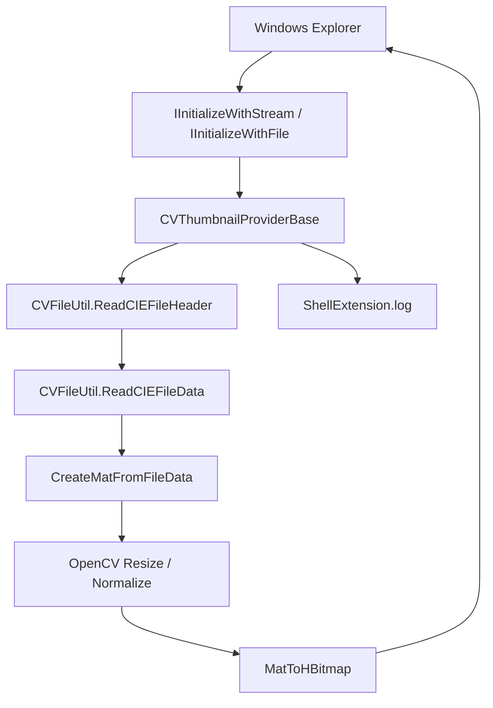

# ColorVision.ShellExtension

`ColorVision.ShellExtension` 是 Windows Explorer 的缩略图扩展，不属于主程序里的 Engine 业务执行链。它的价值是让现场人员在资源目录里直接预览 `.cvraw` 和 `.cvcie` 文件，减少打开主程序、导入文件、再确认内容的成本。

这页只描述当前源码已经落地的 Shell 扩展实现，不把它写成通用文件预览框架。

## 当前定位

| 项 | 当前状态 |
| --- | --- |
| 源码目录 | `Engine/ColorVision.ShellExtension/` |
| 工程文件 | `ColorVision.ShellExtension.csproj` |
| 目标平台 | x64 |
| 关键构建属性 | `EnableComHosting=true`、`EnableDynamicLoading=true`、`AllowUnsafeBlocks=true` |
| 输出重点 | `ColorVision.ShellExtension.comhost.dll`、`ColorVision.ShellExtension.dll`、`ColorVision.FileIO.dll`、OpenCvSharp runtime |
| 支持格式 | `.cvraw`、`.cvcie` |
| 外部宿主 | Windows Explorer |
| 日志 | `%APPDATA%\ColorVision\Log\ShellExtension.log` |

它依赖 [ColorVision.FileIO](./ColorVision.FileIO.md) 读取 ColorVision 自定义文件头和像素数据，再用 OpenCvSharp 生成 `HBITMAP` 交给 Explorer。

## 调用链



交接时重点看 `CVThumbnailProviderBase.cs`。它统一处理 Explorer 初始化、读取文件、异常保护、OpenCV resize、`HBITMAP` 创建和日志。具体格式差异由两个 provider 负责。

## 关键文件

| 文件 | 作用 | 接手时关注 |
| --- | --- | --- |
| `ColorVision.ShellExtension.csproj` | COM hosting、dynamic loading、x64 平台和依赖声明 | 是否生成 `.comhost.dll`，OpenCvSharp runtime 是否进入输出 |
| `CVThumbnailProviderBase.cs` | Shell 缩略图公共基类，实现 `IShellThumbnailProvider`、`IInitializeWithStream`、`IInitializeWithFile` | Explorer 是否能初始化数据源，异常是否只返回 HRESULT 而不是抛出 |
| `CVRawShellThumbnailProvider.cs` | `.cvraw` provider，CLSID `{7B5E2A3C-8F1D-4E6A-B9C2-1D3E5F7A8B9C}` | RAW/SRC 数据如何解释成 OpenCV Mat |
| `CVCieShellThumbnailProvider.cs` | `.cvcie` provider，CLSID `{8C6F3B4D-9E2A-5F7B-C3D4-2E4F6A8B9C0D}` | 三通道 XYZ CIE 数据当前只取第一通道用于缩略图显示 |
| `Interop/ShellInterfaces.cs` | Windows Shell COM 接口定义 | GUID 和 `PreserveSig` 不要随意改 |
| `ShellLog.cs` | Explorer 进程内日志 | 日志失败不能影响 Explorer |
| `Register.ps1` | 注册 COM server 和文件扩展名缩略图 handler | 必须管理员运行，会改 HKCR/HKLM、重启 Explorer、清缩略图缓存 |
| `Unregister.ps1` | 移除扩展名绑定和 COM server | 必须管理员运行，回退时先执行 |

## `.cvraw` 缩略图

`CVRawShellThumbnailProvider` 当前把 `CVType.Raw` 和 `CVType.Src` 当作直接像素数据处理：

1. `CVFileUtil.ReadCIEFileHeader(...)` 解析行列、通道、位深等信息。
2. `CVFileUtil.ReadCIEFileData(...)` 读取原始数据。
3. `Mat.FromPixelData(...)` 根据 `Rows`、`Cols`、`Depth`、`Channels` 建立 Mat。
4. 非 8-bit 数据会先 normalize 到 0-255，再转成 `CV_8U`。
5. 基类按请求尺寸 `cx` 等比例缩放，并转换成 24bpp DIB `HBITMAP`。

如果 `.cvraw` 文件在主程序能打开，但 Explorer 没缩略图，先看日志中的 header/data 读取结果，再确认输出目录是否有 `ColorVision.FileIO.dll` 和 OpenCvSharp runtime。

## `.cvcie` 缩略图

`CVCieShellThumbnailProvider` 当前专门处理 `CVType.CIE`：

- 单通道数据直接按文件头创建 Mat。
- 三通道 CIE/XYZ 数据当前只取第一通道 X 做缩略图显示。
- 非 8-bit 数据同样 normalize 到 0-255。

这意味着 Explorer 缩略图只是快速辨识，不等同于主程序里的完整 CIE 颜色分析视图。不要把缩略图色彩表现当作检测结果验收依据。

## 注册和卸载

构建：

```powershell
dotnet build Engine/ColorVision.ShellExtension/ColorVision.ShellExtension.csproj -c Release -p:Platform=x64
```

注册必须使用管理员 PowerShell：

```powershell
Engine/ColorVision.ShellExtension/Register.ps1
```

卸载：

```powershell
Engine/ColorVision.ShellExtension/Unregister.ps1
```

`Register.ps1` 当前会做四件事：

1. 用 `regsvr32` 注册 `ColorVision.ShellExtension.comhost.dll`。
2. 写入 `HKEY_CLASSES_ROOT\.cvraw\shellex\{E357FCCD-A995-4576-B01F-234630154E96}`。
3. 写入 `HKEY_CLASSES_ROOT\.cvcie\shellex\{E357FCCD-A995-4576-B01F-234630154E96}`。
4. 尝试写入 `HKEY_LOCAL_MACHINE\SOFTWARE\Microsoft\Windows\CurrentVersion\Shell Extensions\Approved`。

脚本还会停止并重启 Explorer，删除本机缩略图和图标缓存。现场执行前要确认用户可以接受 Explorer 窗口被关闭。

## 当前脚本风险

按当前 `Register.ps1`，`$handlerClsid` 使用的是 `{7B5E2A3C-8F1D-4E6A-B9C2-1D3E5F7A8B9C}`，也就是 `CVRawShellThumbnailProvider` 的 CLSID；脚本把 `.cvraw` 和 `.cvcie` 都绑定到这个 CLSID。

接手时要确认现场期望：

- 如果 `.cvcie` 也确实要走同一个 handler，就保留脚本现状，并在验收记录里说明。
- 如果 `.cvcie` 要走 `CVCieShellThumbnailProvider`，则注册脚本需要把 `.cvcie` 绑定到 `{8C6F3B4D-9E2A-5F7B-C3D4-2E4F6A8B9C0D}`，并重新测试两种文件。

这不是主程序业务链问题，但会直接影响 Explorer 缩略图是否能按文件类型正确渲染。

## 交接验收表

| 验收项 | 操作 | 通过标准 |
| --- | --- | --- |
| 构建输出 | Release x64 构建 `ColorVision.ShellExtension.csproj` | `bin/x64/Release/net10.0-windows/` 下存在 `.dll`、`.comhost.dll`、`.deps.json`、`.runtimeconfig.json` |
| 依赖输出 | 检查输出目录和 `runtimes/win-x64/native` | 存在 `ColorVision.FileIO.dll`、OpenCvSharp 相关 DLL 和 native runtime |
| 注册脚本 | 管理员 PowerShell 执行 `Register.ps1` | `regsvr32` 返回成功；Explorer 重启行为已提前告知现场用户 |
| 注册表 | 检查 `.cvraw` / `.cvcie` 的 shellex thumbnail provider | 扩展名绑定到预期 CLSID；如果两类文件共用 `CVRawShellThumbnailProvider`，验收记录里明确说明 |
| `.cvraw` 缩略图 | 用已知可读 `.cvraw` 样例打开 Explorer 目录 | 能生成缩略图；日志出现 `CVRawProvider` 初始化和 `GetThumbnail` 记录 |
| `.cvcie` 缩略图 | 用已知可读 `.cvcie` 样例打开 Explorer 目录 | 能生成缩略图；日志能解释当前走 `CVCieProvider` 还是共享 RAW handler |
| 日志 | 检查 `%APPDATA%\ColorVision\Log\ShellExtension.log` | 初始化、读取 header/data、resize 或异常 HRESULT 都有记录，日志失败不影响 Explorer |
| 回退 | 执行 `Unregister.ps1` 后重新打开 Explorer | 扩展名绑定移除，缓存已清理，Explorer 稳定 |

## 故障首查

| 现象 | 优先检查 |
| --- | --- |
| 没有缩略图 | 是否注册 `ColorVision.ShellExtension.comhost.dll`、扩展名 shellex 是否存在、Explorer 是否重启、缓存是否清理 |
| 只有 `.cvraw` 正常 | `.cvcie` 是否绑定到了正确 CLSID，`CVCieShellThumbnailProvider` 是否被调用 |
| 两类文件都走 RAW provider | `Register.ps1` 是否仍使用单一 `$handlerClsid`，现场是否接受 `.cvcie` 共用 `CVRawShellThumbnailProvider` |
| 日志没有写入 | Explorer 是否加载了扩展、`%APPDATA%\ColorVision\Log` 是否可写、日志失败是否被吞掉 |
| 日志显示 header 读取失败 | 文件是否是当前 `ColorVision.FileIO` 支持的 CVRAW/CVCIE 格式，样例文件是否损坏 |
| 报 native DLL 缺失 | OpenCvSharp runtime 和 `runtimes/win-x64/native` 是否在输出目录，运行平台是否是 x64 |
| Explorer 崩溃或卡住 | 先卸载扩展，清缓存，再用小文件复测；确认异常没有逃出 `GetThumbnail` |
| 注册失败 | 是否管理员运行、脚本选择的 Debug/Release comhost 路径是否存在、`regsvr32` 位数是否匹配 x64 |

## 不属于它的范围

- 不负责主程序里的图像查看、ROI/POI overlay 或检测结果展示。
- 不负责 Flow、模板、设备服务、MQTT 或项目包输出。
- 不替代 [ColorVision.FileIO](./ColorVision.FileIO.md) 对文件格式的正式说明。
- 不保证缩略图颜色可以作为检测或标定依据。

如果问题发生在主程序里，先回到 [Engine 结果展示与项目交接链路](./result-handoff-chain.md) 或 [UI ImageEditor 文档](../ui-components/ColorVision.ImageEditor.md)；只有 Explorer 文件夹预览异常时才从本页开始。
