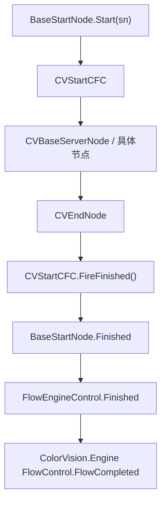

# FlowEngineLib

`Engine/FlowEngineLib/` 是节点执行内核，不是完整的宿主工作流系统。模板管理、流程保存、服务列表和项目结果处理在 `ColorVision.Engine/Templates/Flow/` 和 `Projects/*`。

## 先查什么

| 现象 | 第一检查点 |
| --- | --- |
| Base64 流程加载后没有节点 | Base64 是否为空、`NodeEditor.LoadCanvas(rawData)`、节点类型是否可用 |
| 重复打开同一流程没有变化 | `loadedCanvas` 的 MD5 缓存是否直接命中 |
| 开始按钮点了但没跑 | `GetStartNodeName()`、`startNodeNames`、`BaseStartNode.Ready` |
| 服务节点没有设备 | `FlowNodeManager.UpdateDevice`、`MQTTServiceInfo`、节点 `NodeType` |
| 节点执行但流程不结束 | 是否连接 `CVEndNode`，是否走到 `CVStartCFC.FireFinished()` |
| `Finished` 重复触发 | `clear()` 是否解绑旧 `BaseStartNode.Finished` |
| 项目包收不到结果 | `FlowEngineControl.Finished` 到宿主 `FlowCompleted` 的桥接 |
| UI 选择和节点参数不一致 | `Templates/Flow/NodeConfigurator/` 是否把参数写回节点 |

## 控制面

| 对象 | 负责 |
| --- | --- |
| `FlowEngineControl` | 挂接 `STNodeEditor`、加载画布、管理开始节点和服务节点、抛出 `Finished` |
| `CVFlowContainer` | 多开始节点、按 key 追加/加载/启动流程 |
| `FlowNodeManager` | 设备视图和服务节点同步 |
| `FlowServiceManager` | MQTT service 绑定 |
| `FlowEngineAPI` | 启动、停止、开始节点查询的外部接口 |

`FlowEngineControl.NodeAdded` 会把节点分成两类：`BaseStartNode` 进入 `startNodeNames` 并订阅完成事件；`CVBaseServerNode` 进入服务节点集合并同步到设备视图。

## 核心节点

| 节点/基类 | 重点 |
| --- | --- |
| `CVCommonNode` | 节点名、类型、设备码、端口事件、颜色注册 |
| `BaseStartNode` | 创建开始输出，维护 Ready/Running，分发 `CVStartCFC` |
| `CVBaseServerNode` | 模板、图片、Token、超时、请求参数和服务端响应 |
| `CVEndNode` | 调用 `DoFinishing()` 和 `FireFinished()` 闭合流程 |
| `AlgorithmNode` / `AlgorithmARVRNode` | 把模板、图像、颜色、POI、SMU 数据打包成算法请求 |

大部分节点的核心职责是构建并转发执行参数，不是在本地完成完整算法。

## 弃用节点兼容

标记 `Obsolete` 的节点类型会从 `STNodeTreeView` 的新建/右键目录和 Copilot 节点目录中排除，但仍由节点类型注册表保留，因此旧画布可以继续反序列化。当前包括 `/10 MQTT` 的 4 个旧节点、`/09 合规验证`、`/11 ROI`、`/12 第三方算法`，以及已下线模板对应的旧校正/图像拼接节点。不要删除这些类型，除非已经完成存量流程迁移。

## 完成链路

“节点完成”不等于“流程完成”。真正的流程结束必须进入 End 节点并触发上面的 finished 链。

## 宿主边界

FlowEngineLib 只知道节点和执行状态。主程序里的这些工作在 Engine 模板层：

| 工作 | 入口 |
| --- | --- |
| 从模板加载 Base64 流程 | `Templates/Flow/TemplateFlow.cs` |
| 显示、编辑和运行流程 | `Templates/Flow/DisplayFlow.xaml.cs` |
| 包装完成事件给项目包 | `Templates/Flow/FlowControl.cs` |
| 给节点绑定设备/模板/参数 | `Templates/Flow/NodeConfigurator/` |

如果问题是模板下拉、流程保存、项目结果解析，通常不在 FlowEngineLib 里修。

## 检查

| 验收项 | 通过标准 |
| --- | --- |
| 构建和依赖 | `FlowEngineLib.csproj`、ST.Library.UI、MQTT/JSON 依赖能加载 |
| 画布加载 | Base64 或文件能加载节点，相同画布不会重复加载 |
| 节点发现 | 开始节点进入 `startNodeNames`，服务节点进入服务集合 |
| 服务绑定 | 外部 `MQTTServiceInfo` 能绑定到服务节点 |
| 启动链 | 输入 SN 后能从正确开始节点启动，运行状态正确 |
| 参数链 | 模板、图像、颜色、POI、SMU 能进入请求数据 |
| 完成链 | 结束时能抛出 SN、状态、耗时、消息和错误节点 |
| 清理 | 停止或重新加载后不叠加旧事件 |
| 宿主桥接 | `DisplayFlow`/`FlowControl` 能接到模板、服务和运行按钮 |

## 不要这样理解

- FlowEngineLib 不是完整 DSL 平台；它是节点执行内核。
- 不要把项目判定写进节点内核。
- 不要把服务绑定问题误判成节点执行问题，先看 NodeConfigurator。
- 不要忽略 `loadedCanvas` 缓存，它会影响重复加载行为。
