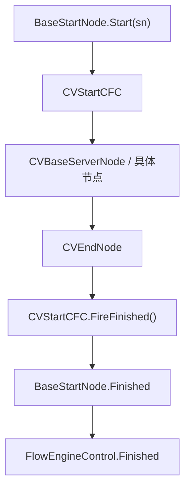

# FlowEngineLib

`Engine/FlowEngineLib/` 是节点图执行内核，不是完整的宿主工作流系统。模板持久化、版本和搜索位于 `ColorVision.Engine/Templates/Flow/`；编辑器、交互式/无界面执行、前后处理和诊断位于 `ColorVision.Engine/FlowProcessing/`，项目结果处理仍在 `Projects/*`。

## 先查什么

| 现象 | 第一检查点 |
| --- | --- |
| Base64 流程加载后没有节点 | Base64 是否为空、`NodeEditor.LoadCanvas(rawData)`、节点类型是否可用 |
| 重复打开同一流程没有变化 | `loadedCanvas` 的 MD5 缓存是否直接命中 |
| 开始按钮点了但没跑 | `GetStartNodeName()`、`startNodeNames`、`IsExecutionReady`、`CanAcceptStart` |
| 服务节点没有设备 | `FlowNodeManager.UpdateDevice`、`MQTTServiceInfo`、节点 `NodeType` |
| 节点执行但流程不结束 | 是否连接 `CVEndNode`，是否走到 `CVStartCFC.FireFinished()` |
| `Finished` 重复触发 | `clear()` 是否解绑旧 `BaseStartNode.Finished` |
| 项目包收不到结果 | `FlowEngineControl.Finished` 到宿主 `FlowCompleted` 的桥接 |
| UI 选择和节点参数不一致 | 属性元数据、`FlowPropertyEditorRegistry` 与选择器绑定；专用补充面板再查 `NodeConfiguration/` |

## 控制面

| 对象 | 负责 |
| --- | --- |
| `FlowEngineControl` | 通过图宿主加载画布，管理开始节点和服务节点，抛出引擎级 `Finished` |
| `CVFlowContainer` | 多开始节点、按 key 追加/加载/启动流程 |
| `FlowNodeManager` / `FlowServiceManager` | 设备视图、服务节点同步和 MQTT service 绑定 |
| `FlowEngineAPI` | 启动、停止、开始节点查询的外部接口 |
| `FlowRuntimeHost` / `FlowEngineRunner` | 为无界面执行持有隔离节点图、服务快照和明确的加载/运行/停止生命周期 |

`FlowEngineControl.NodeAdded` 会把节点分成两类：`BaseStartNode` 进入 `startNodeNames` 并订阅完成事件；`CVBaseServerNode` 进入服务节点集合并同步到设备视图。

`FlowEngineAPI` 定义 `LoadFromFile` / `LoadFromBase64`、`StartNode` 和 `StopNode`，具体的 `FlowEngineControl` 另提供 `TryStartNode`；它们不是 `RunFlow` / `StopFlow` / `PauseFlow` / `ResumeFlow`。`TryStartNode(name, serialNumber)` 检查当前未运行、开始节点存在、`IsExecutionReady` 和 `CanAcceptStart`；拒绝时返回 `false`。返回 `true` 只说明启动被接受，不代表图或客户业务完成；返回 `void` 的 `StartNode` 不提供该拒绝结果。

`BaseStartNode.RequiresConnectionReady` 默认是 `false`，因此不能统一要求所有本地开始节点的 `Ready` 为真；要求连接的开始节点才通过 `Ready` 门禁。`CanAcceptStart` 还要求开始输出已连线。服务节点的 `getActionEvent` / `getBaseEvent` 构造请求，再由 `DoTransferToServer` 转交发送链；它不是通用的本地 `DoServerWork` / `GetInputData<T>` / `SetOutputData` 示例接口。扩展方式见[节点扩展契约](../extensions/flow-node.md)。

`BaseStartNode` 实现 `IDisposable`；脱离 `FlowEngineControl` 构造开始节点的读取器也必须在读取后释放节点。

## 核心节点

| 节点/基类 | 重点 |
| --- | --- |
| `CVCommonNode` | 节点名、类型、设备码、端口事件、颜色注册 |
| `BaseStartNode` | 创建开始输出，维护 Ready/Running，分发 `CVStartCFC` |
| `CVBaseServerNode` | 模板、图片、Token、超时、请求参数和服务端响应 |
| `CVEndNode` | `TryDoFinishing()` 接受首次终止后调用 `FireFinished()`，重复到达不会再次结束 |
| `AlgorithmNode` / `AlgorithmARVRNode` | 把模板、图像、颜色、POI、SMU 数据打包成算法请求 |

大部分节点的核心职责是构建并转发执行参数，不是在本地完成完整算法。

## 节点类型加载

画布保存类型 GUID 和 `程序集文件名|类型名称`。加载先匹配 GUID 和原模型标识，再尝试同程序集的短类型名；仍找不到时，先按已加载类型的完整名称、再按短名称跨程序集查找。名称必须唯一，重名时拒绝猜测。编辑器、运行容器和中立流程编译器共用 `STNodeTypeRegistry` 的名称回退，不需要逐节点映射表，也不改写输入文件。正常保存使用当前类型 GUID，以及 `STNodeSerializationModelAttribute` 声明的兼容模型标识；未声明时使用当前程序集和完整类型名。节点实例 ID、属性和连线沿用原内容。

普通 BV/LV 节点在 `ColorVision.Engine` 中实现，保留 `FlowEngineLib.LVCameraNode` 完整类型名，并声明稳定保存标识 `FlowEngineLib.dll|FlowEngineLib.LVCameraNode`。新宿主直接调用 Engine 的本地取图实现，未选中本地路径时沿用原服务请求。旧端继续加载自己的旧版 FlowEngineLib：GUID 不同时仍可按这个完整模型标识找到旧类，按原参数构造服务请求。只保留 namespace 而保存 Engine DLL 名不足以兼容这种旧加载器，也不应固定某一版本自动生成的 GUID。

曾保存为 Engine 模型标识的画布可在新宿主中按名称回退加载，再保存或通过数据库工具“更新流程节点”写回旧端可识别的模型；旧端自身不具备跨 DLL 名称回退。这里兼容的是流程数据，并不提供 CLR 类型转发：旧端保持整套旧 DLL 不变；跟随新宿主升级且直接引用迁出节点的项目包需引用 Engine 并重新编译。需要 Engine 属性编辑器的相机、校准、POI、SMU、传感器和算法节点位于 `FlowProcessing/Nodes/Compatibility/`，保留原 namespace；普通参数节点和公共执行基类仍在 FlowEngineLib。属性编辑器元数据直接引用 Engine 实现，不属于旧流程保存契约。

`LvCameraNodeMigrationTests` 使用移动前节点保存的双节点画布，检查编辑器、运行容器、编译往返、名称映射及参数/连线保留。`CompatibilityNodeMigrationTests` 使用迁移前保存的 30 节点合成画布核对属性、29 条连线、菜单可见性和构造请求；自动尺寸节点在编辑器中会重新测量宽高，运行容器往返则保留全部字段。跨版本验收还应将新节点实际保存的合成画布交给目标旧 DLL 的 `FlowEngineControl.LoadFromBase64`，核对旧类实例、参数、连线及构造的请求字段；只加载和构造数据，不启动流程或连接设备。这些检查不代表已验证所有现场流程或真实采集。

## 上游 DLL 更新核对

上游通常只交付 `FlowEngineLib.dll` 等编译产物，不同步提供源码或完整变更说明。因此升级前需要反编译新旧 DLL，才能确认对方实际修改了什么。Engine 中 `FlowProcessing/Nodes/Compatibility/` 下的节点是本地维护的实现，替换上游 DLL 不会自动同步这些代码；不能仅凭同名类型、版本号或参数数量判断兼容。

1. 分别保留上次接收与本次接收的原 DLL，在隔离目录中记录文件版本、程序集身份和 SHA-256；关联的 `ST.Library.UI.dll` 或协议依赖有变化时一并核对。不要直接覆盖正在使用的 DLL。
2. 用 ILSpy 等工具反编译，比较对应节点、基类、请求数据类型及加载/保存入口。重点检查完整类型名、保存标识和 GUID 匹配规则、持久化属性名/类型/默认值、端口及连接顺序，以及服务主题、操作码、请求字段和响应处理。
3. 将确认需要的上游改动同步到 Engine 中的对应节点，保留本地取图路由、结果交接与稳定保存标识；区分上游服务行为变更和本地扩展，不把反编译文件整体覆盖进现有实现。记录已核对的 DLL 版本/哈希及同步范围，未能确认的差异列为验证缺口。
4. 用合成流程检查新旧两端加载、保存往返、参数、连线及构造的服务请求，再运行相关迁移、相机路由和属性编辑器测试。反编译和离线验证不启动流程、不连接设备或数据库；真实服务/相机验收另按任务授权进行。

## 弃用节点兼容

标记 `Obsolete` 的节点类型会从 `STNodeTreeView` 的新建/右键目录和 Copilot 节点目录中排除，但仍由节点类型注册表保留，因此旧画布可以继续反序列化。例如旧 MQTT、V5 开始/结束、合规验证、ROI、第三方算法、校正和图像拼接节点都走这条兼容路径；完成存量流程迁移前不要删除这些类型。

旧合规流程依赖以下类型和请求标识；排查画布加载或服务请求时按表定位：

| 节点类型 | 请求 operatorCode | 保留的参数契约 |
| --- | --- | --- |
| `AlgComplianceMathNode` | `Compliance_Math` | `TempName`、`ComplianceMath`、`IsBreak`；新实例默认 `CIE`、`IsBreak = false`，请求使用 `ComplianceMathParam.ComplianceType` 和模板/前步参数 |
| `AlgComplianceContrastNode` | `Compliance_Contrast` | `Operation`、`TempName`；`ComplianceContrastParam` 带运算整数值及两路输入的 `PreFlowRecorderId` |
| `AlgComplianceJudgmentNode` | `Compliance.Judgment` | `IsBreak` 默认 `true`，与前步参数一起构造 `ComplianceJudgmentParam` |

`ComplianceMathType` 的序列化值为 `CIE = 1`、`JND = 2`、`CIE_BUZ = 3`。这些名字、类型和数值属于存量画布/请求兼容边界，迁移前须核对实际保存的节点、模板和算法服务。保留类型支持旧图加载，不表示当前客户端提供对应模板编辑器，也不保证所连接服务仍实现旧算法。

## 完成链路

```mermaid
flowchart TD
  Start["BaseStartNode.Start(sn)"] --> CFC["CVStartCFC"]
  CFC --> Server["CVBaseServerNode / 具体节点"]
  Server --> End["CVEndNode"]
  End --> Finish["CVStartCFC.FireFinished()"]
  Finish --> StartEvent["BaseStartNode.Finished"]
  StartEvent --> EngineEvent["FlowEngineControl.Finished"]
```

“节点完成”不等于“流程图完成”。正常结束路径由 End 节点闭合上述 `Finished` 链；取消、超时和启动拒绝需读取所属运行器的终止状态。宿主可将此事件桥接为 `FlowControl.FlowCompleted` / `EngineExecutionCompleted`，但不会因此自动完成客户业务。

`Finished` 携带 `FlowEngineEventArgs`，字段包括 `StartNodeName`、`SerialNumber`、`Status`、`TotalTime`、`Message` 与错误节点信息；调用方按 `Status` 判断执行结果，按 `StartNodeName` 识别开始节点。

节点完成通知尚未发布时，流程完成通知可延后。多个 `CVStartCFC` 副本共享延后计数，但通知保留真正结束流程的副本；最后释放延后计数的上游副本不能覆盖终态和错误信息。

共享会话的 `RunFinalized`、后处理失败策略及项目兼容链见[执行会话](../../01-user-guide/workflow/execution.md)；隔离运行的状态映射见[无界面执行](../algorithms/templates/flow-engine.md)。它们不是 FlowEngineLib 内核自动附带的业务阶段。

## 宿主边界

FlowEngineLib 只知道节点图和引擎执行状态，不拥有模板数据库、WPF 文档选择或业务批次。服务快照与节点必须在所属图代际内使用，不能让隔离 RuntimeHost 复用编辑器的可变节点。

模板下拉和属性配置归[工作区](../../01-user-guide/workflow/design.md)，流程保存和 `.cvflow` 归[模板持久化](./template-flow-chain.md)，完整跨模块所有权见[Flow 架构](../../03-architecture/components/engine/flow-engine.md)。不要在内核补项目判定、导出或宿主 UI 行为。

## 检查

| 验收项 | 通过标准 |
| --- | --- |
| 构建和依赖 | `FlowEngineLib.csproj`、ST.Library.UI、MQTT/JSON 依赖能加载 |
| 画布加载 | Base64 或文件能加载节点，相同画布不会重复加载 |
| 节点发现 | 开始节点进入 `startNodeNames`，服务节点进入服务集合 |
| 服务绑定 | 外部 `MQTTServiceInfo` 能绑定到服务节点 |
| 启动链 | 输入 SN 后能从正确开始节点启动，运行状态正确 |
| 参数链 | 模板、图像、颜色、POI、SMU 能进入请求数据 |
| 完成链 | 结束时能抛出 SN、状态、耗时、消息和错误节点 |
| 清理 | 停止或重新加载后不叠加旧事件 |
| 宿主桥接 | `ViewFlow`/`FlowExecutionSession` 能接到模板、服务、运行按钮和最终化结果 |

## 不要这样理解

- FlowEngineLib 不是完整 DSL 平台；它是节点执行内核。
- 不要把项目判定写进节点内核。
- 不要把服务绑定问题误判成节点执行问题，先看服务快照与 [PropertyGrid 契约](../ui-components/property-grid.md)；也不要忽略会影响重复加载的 `loadedCanvas` 缓存。

## 验证入口与缺口

关联测试：`Test/ColorVision.UI.Tests/FlowEngineControlLifecycleTests.cs`、`Test/ColorVision.UI.Tests/FlowRuntimeCompletionTests.cs`、`Test/ColorVision.UI.Tests/FlowRuntimeHostTests.cs`。

`FlowEngineControlLifecycleTests` 分别核对本地开始节点无需连接就绪、连接型开始节点的目标就绪门禁、重复挂接和节点移除等行为；测试路径不是本次执行结果。

关联测试未专门声明旧合规画布和旧算法服务的端到端覆盖，交付兼容需要使用对应存量流程另行验证。执行内核测试不能替代宿主后处理或项目判定；需要最终业务状态时另外验证 RunFinalized 所属链。
