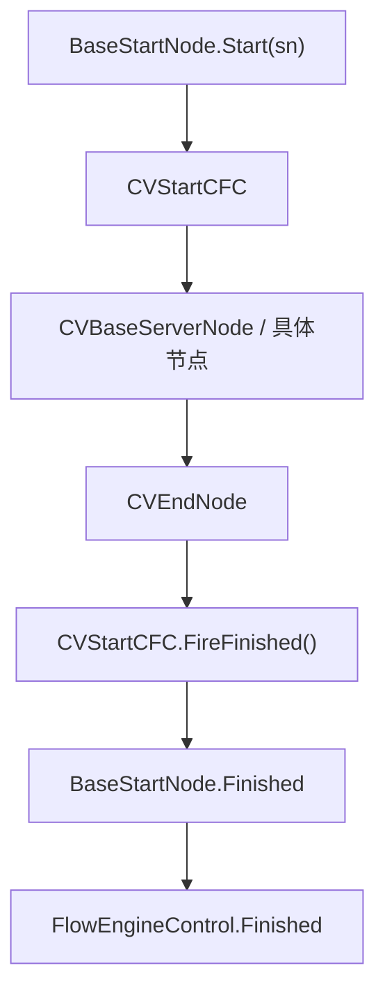

# FlowEngineLib

`Engine/FlowEngineLib/` 是节点图执行内核，不是完整的宿主工作流系统。模板持久化、版本和搜索位于 `ColorVision.Engine/Templates/Flow/`；编辑器、交互式/无界面执行、前后处理和诊断位于 `ColorVision.Engine/FlowProcessing/`，项目结果处理仍在 `Projects/*`。

## 先查什么

| 现象 | 第一检查点 |
| --- | --- |
| Base64 流程加载后没有节点 | Base64 是否为空、`NodeEditor.LoadCanvas(rawData)`、节点类型是否可用 |
| 重复打开同一流程没有变化 | `loadedCanvas` 的 MD5 缓存是否直接命中 |
| 开始按钮点了但没跑 | `GetStartNodeName()`、`startNodeNames`、`IsExecutionReady`、`CanAcceptStart` |
| 服务节点没有设备 | `FlowNodeManager.UpdateDevice`、`MQTTServiceInfo`、节点 `NodeType` |
| 节点执行但流程不结束 | 是否连接 `CVEndNode`，是否走到 `CVStartCFC.FireFinished()` |
| `Finished` 重复触发 | `clear()` 是否解绑旧 `BaseStartNode.Finished` |
| 项目包收不到结果 | `FlowEngineControl.Finished` 到宿主 `FlowCompleted` 的桥接 |
| UI 选择和节点参数不一致 | 属性元数据、`FlowPropertyEditorRegistry` 与选择器绑定；专用补充面板再查 `NodeConfiguration/` |

## 控制面

| 对象 | 负责 |
| --- | --- |
| `FlowEngineControl` | 通过图宿主加载画布，管理开始节点和服务节点，抛出引擎级 `Finished` |
| `CVFlowContainer` | 多开始节点、按 key 追加/加载/启动流程 |
| `FlowNodeManager` / `FlowServiceManager` | 设备视图、服务节点同步和 MQTT service 绑定 |
| `FlowEngineAPI` | 启动、停止、开始节点查询的外部接口 |
| `FlowRuntimeHost` / `FlowEngineRunner` | 为无界面执行持有隔离节点图、服务快照和明确的加载/运行/停止生命周期 |

`FlowEngineControl.NodeAdded` 会把节点分成两类：`BaseStartNode` 进入 `startNodeNames` 并订阅完成事件；`CVBaseServerNode` 进入服务节点集合并同步到设备视图。

`FlowEngineAPI` 定义 `LoadFromFile` / `LoadFromBase64`、`StartNode` 和 `StopNode`，具体的 `FlowEngineControl` 另提供 `TryStartNode`；它们不是 `RunFlow` / `StopFlow` / `PauseFlow` / `ResumeFlow`。`TryStartNode(name, serialNumber)` 检查当前未运行、开始节点存在、`IsExecutionReady` 和 `CanAcceptStart`；拒绝时返回 `false`。返回 `true` 只说明启动被接受，不代表图或客户业务完成；返回 `void` 的 `StartNode` 不提供该拒绝结果。

`BaseStartNode.RequiresConnectionReady` 默认是 `false`，因此不能统一要求所有本地开始节点的 `Ready` 为真；要求连接的开始节点才通过 `Ready` 门禁。`CanAcceptStart` 还要求开始输出已连线。服务节点的 `getActionEvent` / `getBaseEvent` 构造请求，再由 `DoTransferToServer` 转交发送链；它不是通用的本地 `DoServerWork` / `GetInputData<T>` / `SetOutputData` 示例接口。扩展方式见[节点扩展契约](../extensions/flow-node.md)。

## 核心节点

| 节点/基类 | 重点 |
| --- | --- |
| `CVCommonNode` | 节点名、类型、设备码、端口事件、颜色注册 |
| `BaseStartNode` | 创建开始输出，维护 Ready/Running，分发 `CVStartCFC` |
| `CVBaseServerNode` | 模板、图片、Token、超时、请求参数和服务端响应 |
| `CVEndNode` | 调用 `DoFinishing()` 和 `FireFinished()` 闭合流程 |
| `AlgorithmNode` / `AlgorithmARVRNode` | 把模板、图像、颜色、POI、SMU 数据打包成算法请求 |

大部分节点的核心职责是构建并转发执行参数，不是在本地完成完整算法。

## 弃用节点兼容

标记 `Obsolete` 的节点类型会从 `STNodeTreeView` 的新建/右键目录和 Copilot 节点目录中排除，但仍由节点类型注册表保留，因此旧画布可以继续反序列化。例如旧 MQTT、V5 开始/结束、合规验证、ROI、第三方算法、校正和图像拼接节点都走这条兼容路径；完成存量流程迁移前不要删除这些类型。

## 完成链路

```mermaid
flowchart TD
  Start["BaseStartNode.Start(sn)"] --> CFC["CVStartCFC"]
  CFC --> Server["CVBaseServerNode / 具体节点"]
  Server --> End["CVEndNode"]
  End --> Finish["CVStartCFC.FireFinished()"]
  Finish --> StartEvent["BaseStartNode.Finished"]
  StartEvent --> EngineEvent["FlowEngineControl.Finished"]
```

“节点完成”不等于“流程图完成”。正常结束路径由 End 节点闭合上述 `Finished` 链；取消、超时和启动拒绝需读取所属运行器的终止状态。宿主可将此事件桥接为 `FlowControl.FlowCompleted` / `EngineExecutionCompleted`，但不会因此自动完成客户业务。

`Finished` 携带 `FlowEngineEventArgs`，字段包括 `StartNodeName`、`SerialNumber`、`Status`、`TotalTime`、`Message` 与错误节点信息；不能只因收到事件就忽略 `Status`，也不要使用旧说明中不存在的 `FlowName` 字段。

共享会话的 `RunFinalized`、后处理失败策略及项目兼容链见[执行会话](../../01-user-guide/workflow/execution.md)；隔离运行的状态映射见[无界面执行](../algorithms/templates/flow-engine.md)。它们不是 FlowEngineLib 内核自动附带的业务阶段。

## 宿主边界

FlowEngineLib 只知道节点图和引擎执行状态，不拥有模板数据库、WPF 文档选择或业务批次。服务快照与节点必须在所属图代际内使用，不能让隔离 RuntimeHost 复用编辑器的可变节点。

模板下拉和属性配置归[工作区](../../01-user-guide/workflow/design.md)，流程保存和 `.cvflow` 归[模板持久化](./template-flow-chain.md)，完整跨模块所有权见[Flow 架构](../../03-architecture/components/engine/flow-engine.md)。不要在内核补项目判定、导出或宿主 UI 行为。

## 检查

| 验收项 | 通过标准 |
| --- | --- |
| 构建和依赖 | `FlowEngineLib.csproj`、ST.Library.UI、MQTT/JSON 依赖能加载 |
| 画布加载 | Base64 或文件能加载节点，相同画布不会重复加载 |
| 节点发现 | 开始节点进入 `startNodeNames`，服务节点进入服务集合 |
| 服务绑定 | 外部 `MQTTServiceInfo` 能绑定到服务节点 |
| 启动链 | 输入 SN 后能从正确开始节点启动，运行状态正确 |
| 参数链 | 模板、图像、颜色、POI、SMU 能进入请求数据 |
| 完成链 | 结束时能抛出 SN、状态、耗时、消息和错误节点 |
| 清理 | 停止或重新加载后不叠加旧事件 |
| 宿主桥接 | `ViewFlow`/`FlowExecutionSession` 能接到模板、服务、运行按钮和最终化结果 |

## 不要这样理解

- FlowEngineLib 不是完整 DSL 平台；它是节点执行内核。
- 不要把项目判定写进节点内核。
- 不要把服务绑定问题误判成节点执行问题，先看服务快照与 [PropertyGrid 契约](../ui-components/property-grid.md)；也不要忽略会影响重复加载的 `loadedCanvas` 缓存。

## 验证入口与缺口

关联测试：`Test/ColorVision.UI.Tests/FlowEngineControlLifecycleTests.cs`、`Test/ColorVision.UI.Tests/FlowRuntimeCompletionTests.cs`、`Test/ColorVision.UI.Tests/FlowRuntimeHostTests.cs`。

`FlowEngineControlLifecycleTests` 分别核对本地开始节点无需连接就绪、连接型开始节点的目标就绪门禁、重复挂接和节点移除等行为；测试路径不是本次执行结果。

执行内核测试不能替代宿主后处理或项目判定；需要最终业务状态时另外验证 RunFinalized 所属链。
