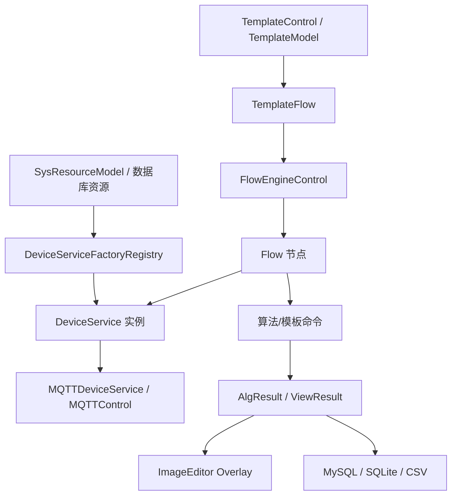

# Engine 组件

`Engine/` 是 ColorVision 的业务核心，负责把设备服务、模板系统、流程引擎、MQTT 通信、数据库结果和图像展示串起来。

## 模块地图

| 模块 | 源码目录 | 主要职责 | 文档 |
| --- | --- | --- | --- |
| ColorVision.Engine | `Engine/ColorVision.Engine/` | 设备服务、模板、流程接入、MQTT、批次、结果 | [ColorVision.Engine](./ColorVision.Engine.md) |
| FlowEngineLib | `Engine/FlowEngineLib/` | 流程节点、开始/结束节点、执行控制 | [FlowEngineLib](./FlowEngineLib.md) |
| cvColorVision | `Engine/cvColorVision/` | OpenCV/native 封装、底层视觉处理 | [cvColorVision](./cvColorVision.md) |
| ColorVision.FileIO | `Engine/ColorVision.FileIO/` | CVRAW/CVCIE 等文件读写 | [ColorVision.FileIO](./ColorVision.FileIO.md) |
| ST.Library.UI | `Engine/ST.Library.UI/` | 节点编辑器 UI 控件 | [ST.Library.UI](./ST.Library.UI.md) |
| ColorVision.ShellExtension | `Engine/ColorVision.ShellExtension/` | Windows Shell 缩略图扩展 | [ColorVision.ShellExtension](./ColorVision.ShellExtension.md) |

## 关键链路

## 继续阅读

- [Engine 业务链路矩阵](./business-flow-matrix.md)
- [Engine 运行时对象目录](./runtime-object-map.md)
- [Engine 设备服务链路](./device-service-chain.md)
- [Engine 模板与 Flow 链路](./template-flow-chain.md)
- [Flow 转换与校准节点](./flow-conversion-calibration-nodes.md)
- [Engine 结果展示与项目链路](./result-handoff-chain.md)
- [FlowEngineLib 架构](../../03-architecture/components/engine/flow-engine.md)
- [Templates 架构设计](../../03-architecture/components/templates/design.md)
