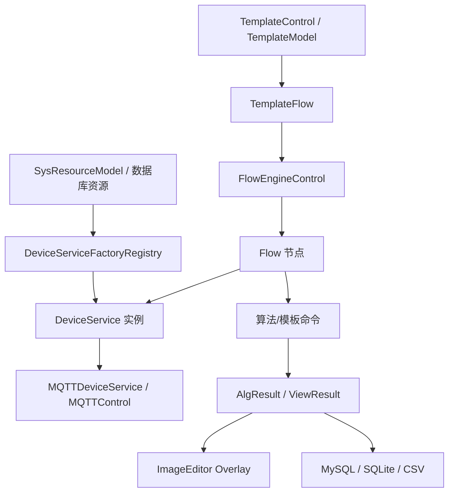

# Engine 组件与业务交接

`Engine/` 是 ColorVision 的业务核心。它既不是纯算法库，也不是单纯设备驱动层，而是把设备服务、模板系统、流程引擎、MQTT 通信、数据库结果和图像展示串起来的运行时层。

## 交接先读

- [当前 Engine 文档覆盖清单](./current-engine-coverage.md)：确认 `Engine/` 顶层项目、核心业务目录和交接页的对应关系。
- [Engine 业务链路矩阵](./business-flow-matrix.md)：按业务场景定位代码入口、配置来源、验证方法和归属边界。
- [Engine 业务场景交接手册](./business-scenario-playbook.md)：按具体需求拆解设备、模板、Flow、结果、项目包和外部系统的处理步骤。
- [Engine 业务交接手册](./business-handoff.md)：按业务链路理解当前实现。
- [Engine 变更影响与验收清单](./engine-change-impact-checklist.md)：改设备、模板、Flow、结果或项目字段后，按影响面收集交接证据。
- [Engine 运行时对象目录](./runtime-object-map.md)：按类名和运行时对象快速定位业务链路。
- [Engine 设备服务链路](./device-service-chain.md)：从数据库资源到 `DeviceService` 和显示页。
- [Engine 模板与 Flow 链路](./template-flow-chain.md)：模板加载、Flow 保存、节点配置和执行完成事件。
- [Flow 转换与校准节点](./flow-conversion-calibration-nodes.md)：数据转换、图像转换、校准、校准 ROI 和旧色差校正节点的真实入口与验收点。
- [Engine 结果展示与项目交接链路](./result-handoff-chain.md)：算法结果、overlay、项目包输出。
- [ColorVision.Engine](./ColorVision.Engine.md)：主引擎模块入口。
- [FlowEngineLib](./FlowEngineLib.md)：流程节点编辑与执行控制。
- [cvColorVision](./cvColorVision.md)：视觉处理和 native 能力封装。
- [ColorVision.FileIO](./ColorVision.FileIO.md)：图像/自定义格式文件读写。
- [ST.Library.UI](./ST.Library.UI.md)：流程节点编辑器 UI 基础。
- [ColorVision.ShellExtension](./ColorVision.ShellExtension.md)：Explorer 中 `.cvraw` / `.cvcie` 缩略图扩展，外部集成链路。

## Engine 模块地图

| 模块 | 源码目录 | 主要职责 | 交接关注点 |
| --- | --- | --- | --- |
| `ColorVision.Engine` | `Engine/ColorVision.Engine/` | 设备服务、模板、流程接入、MQTT、批次、结果 | 业务主链路和扩展点 |
| `FlowEngineLib` | `Engine/FlowEngineLib/` | 流程节点、开始/结束节点、执行控制 | 节点生命周期、Flow 完成事件 |
| `cvColorVision` | `Engine/cvColorVision/` | OpenCV/native 封装、底层视觉处理 | native DLL、算法调用边界 |
| `ColorVision.FileIO` | `Engine/ColorVision.FileIO/` | CVRAW/CVCIE 等文件读写 | 文件格式、导入导出 |
| `ST.Library.UI` | `Engine/ST.Library.UI/` | 节点编辑器 UI 控件 | 节点可视化、属性编辑 |
| `ColorVision.ShellExtension` | `Engine/ColorVision.ShellExtension/` | Windows Shell 缩略图扩展 | 外部集成，非主业务链 |

如果你是按业务问题接手，先看 [Engine 业务链路矩阵](./business-flow-matrix.md)。如果你已经知道类名，例如 `ServiceManager`、`TemplateControl`、`FlowControl`、`NodeConfiguratorRegistry`、`ViewResultAlg`，直接看 [Engine 运行时对象目录](./runtime-object-map.md)。

如果你已经完成或准备完成一个 Engine 改动，直接用 [Engine 变更影响与验收清单](./engine-change-impact-checklist.md) 收集 SN、批次、模板、结果 ID、导出文件和文档同步证据。

## 最重要的业务链路

交接人员要先看这条链，而不是先陷入每个模板目录的细节。

## 当前关键目录

| 目录 | 说明 |
| --- | --- |
| `Services/` | 服务管理器、设备服务基类、物理相机、终端、缓存、RC 服务 |
| `Services/Devices/` | Camera、Calibration、Algorithm、FileServer、FlowDevice、Motor、PG、SMU、Spectrum 等设备 |
| `Templates/` | 模板管理、Flow 模板、POI/ROI、ARVR、JSON 算法模板 |
| `MQTT/` | MQTT 配置、连接窗口、控制对象 |
| `Batch/`、`Dao/` | 批次、流程执行记录和结果数据访问 |
| `Messages/` | MQTT/业务消息模型 |
| `Archive/` | 归档结果查询 |
| `Reports/` | 报表生成 |
| `ToolPlugins/` | 内置工具入口，如 ImageJ、CVRaw 转 CSV 等 |

## 设备服务怎么生成

详细链路见 [Engine 设备服务链路](./device-service-chain.md)。

`ServiceManager` 是当前设备服务集合的中心，`DeviceServiceFactoryRegistry` 是从资源类型到服务实例的关键注册表。当前默认注册的设备类型包括：

- Camera
- PG
- Spectrum
- SMU
- Sensor
- FileServer
- Algorithm
- CfwPort
- Calibration
- Motor
- ThirdPartyAlgorithms
- FlowDevice

新增设备时不要绕过这个注册表。否则资源能写入数据库，但运行时无法稳定生成对应 `DeviceService`。

## 模板和流程怎么协作

详细链路见 [Engine 模板与 Flow 链路](./template-flow-chain.md)。

- 模板参数由 `TemplateModel<T>` 承载，模板入口一般实现 `ITemplate<T>` 或 `ITemplateJson<T>`。
- `TemplateControl` 负责初始化和加载模板。
- `TemplateFlow` 把可视化流程作为模板管理。
- `FlowEngineLib` 执行节点，节点配置器在 `Templates/Flow/NodeConfigurator/` 中把节点绑定到设备、模板和参数。
- 项目包通常不会重写 FlowEngine，而是选择模板、运行流程，再解析结果。

## 结果怎么回到界面和数据

详细链路见 [Engine 结果展示与项目交接链路](./result-handoff-chain.md)。

算法结果通常会经过三层：

1. Engine 查询或接收算法结果，形成 ViewResult/DAO 模型。
2. ImageEditor 或 AlgorithmView 负责可视化展示，包含 ROI、POI、网格、曲线等 overlay。
3. 项目包把结果映射成客户需要的 `ObjectiveTestResult`、CSV、PDF、MES/Socket 响应。

如果要排查“算法跑完了但界面不显示”，优先检查 ViewResult handler 和 ImageEditor overlay；如果要排查“界面有结果但项目 CSV 没值”，优先检查项目包的 Process/Recipe/Fix 映射。

## 继续阅读

- [当前 Engine 文档覆盖清单](./current-engine-coverage.md)
- [Engine 业务链路矩阵](./business-flow-matrix.md)
- [Engine 业务场景交接手册](./business-scenario-playbook.md)
- [Engine 业务交接手册](./business-handoff.md)
- [Engine 变更影响与验收清单](./engine-change-impact-checklist.md)
- [Engine 运行时对象目录](./runtime-object-map.md)
- [Engine 设备服务链路](./device-service-chain.md)
- [Engine 模板与 Flow 链路](./template-flow-chain.md)
- [Flow 转换与校准节点](./flow-conversion-calibration-nodes.md)
- [Engine 结果展示与项目交接链路](./result-handoff-chain.md)
- [ColorVision.ShellExtension](./ColorVision.ShellExtension.md)
- [FlowEngineLib 架构](../../03-architecture/components/engine/flow-engine.md)
- [Templates 架构设计](../../03-architecture/components/templates/design.md)
- [项目说明](../../00-projects/README.md)
