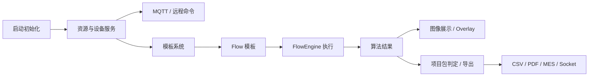

# Engine 业务链路矩阵

这页用于 Engine 交接、排障和改需求时快速定位“业务能力、代码入口、配置来源、验证方法”。它不是替代 [业务交接手册](./README.md)，而是把横向业务场景摊开：接手人员可以先按问题类型找到入口，再进入设备链路、模板链路或结果链路深挖。

## 阅读方式

如果你刚接手 Engine，推荐按这个顺序读：

1. 先看本页，确定当前问题属于设备、模板、Flow、结果、项目包还是发布验证。
2. 如果已经拿到具体需求或缺陷，进入 [Engine 业务场景交接手册](./README.md)，按步骤处理。
3. 再进入 [Engine 业务交接手册](./README.md)，理解完整执行链。
4. 改动完成或准备交付时，用 [Engine 变更影响与验收清单](./README.md) 收集证据。
5. 如果已经知道类名，直接用 [Engine 运行时对象目录](./runtime-object-map.md) 反查。
6. 如果是具体链路问题，继续看 [设备服务链路](./device-service-chain.md)、[模板与 Flow 链路](./template-flow-chain.md)、[结果展示与项目交接链路](./result-handoff-chain.md)。

## 总体链路



Engine 的核心职责是把这些环节串起来。UI 负责操作入口和显示容器，项目包负责客户流程和判定输出，插件负责可插拔能力；不要把客户专用规则写进通用 Engine handler。

## 核心链路总表

| 业务场景 | 主要代码入口 | 触发入口 | 数据和配置来源 | 先查什么 |
| --- | --- | --- | --- | --- |
| 启动初始化 | `Engine/ColorVision.Engine/App.xaml.cs`、`MySqlInitializer`、`MqttInitializer`、`ServiceInitializer`、`TemplateInitializer`、`RCInitializer` | 主程序启动、插件加载、初始化流程 | 本地配置、MySQL、MQTT 配置、插件目录 | 初始化顺序、异常日志、数据库连接、MQTT 连接、模板扫描是否完成 |
| 设备服务生成 | `Services/ServiceManager.cs`、`Services/Type/TypeService.cs`、`Services/Devices/DeviceServiceFactory.cs`、`Services/DeviceService.cs` | 资源树加载、设备管理页面、Flow 节点配置器 | `SysDictionaryModel`、`SysResourceModel`、`DeviceServiceConfig` | `ServiceTypes` 值、资源 `type/pid/is_delete/tenant_id`、工厂是否注册、`DeviceServices` 是否生成 |
| MQTT 与远程命令 | `MQTT/MQTTControl.cs`、`MQTT/MQTTConfig.cs`、`Services/Devices/*/MQTT*.cs`、`Messages/`、`Services/RC/MQTTRCService.cs` | 设备按钮、Flow 节点执行、项目包自动测试 | MQTT 地址、topic、设备 Code、注册中心配置、文件服务器 | 是否连接成功、topic 是否匹配、返回码/结果 ID、文件是否下载、服务端日志 |
| 模板加载 | `Templates/TemplateContorl.cs`、`Templates/TemplateModel.cs`、`Templates/Jsons/**/Template*.cs`、`Templates/POI/TemplatePoi.cs` | 启动初始化、模板管理窗口、流程编辑器 | 模板类型、`TemplateDicId`、`Code`、模板参数表 | 模板类是否被扫描、是否有无参构造、`TemplateParams` 是否加载、名称是否冲突 |
| Flow 模板保存与导入 | `Templates/Flow/TemplateFlow.cs`、`Templates/Flow/FlowPackageHelper.cs`、`Dao/ModMasterModel.cs`、`Dao/ModDetailModel.cs`、`Dao/SysResourceModel.cs` | 流程编辑器保存、导入 `.cvflow`、项目包选择流程 | 数据库模板表、`SysResourceModel.Value`、`.cvflow` 包 | `DataBase64` 是否有效、关联模板是否导入、重名处理、资源 `ValueA/Value` 是否指向正确模板 |
| Flow 执行 | `FlowEngineLib/FlowEngineControl.cs`、`FlowEngineLib/Start/BaseStartNode.cs`、`FlowEngineLib/End/CVEndNode.cs`、`Templates/Flow/FlowControl.cs` | 手动运行流程、项目包自动运行、Socket/MES 触发 | Flow 模板、节点参数、设备 Code、`FlowControlData` | Start 节点是否存在、节点状态、设备 token、`FlowCompleted` 是否触发、结束节点是否拿到结果 |
| 节点业务绑定 | `Templates/Flow/Nodes/`、`Templates/Flow/NodeConfigurator/NodeConfiguratorRegistry.cs`、各类 `*NodeConfig.cs` | 打开流程、编辑节点属性、执行节点 | 节点类型、设备列表、模板列表、节点参数 | 节点类型是否有配置器、设备/模板名是否还存在、参数恢复是否失败、是否只改了 `FlowEngineLib` |
| 算法结果展示 | `Services/Core/ViewResultAlg.cs`、`Abstractions/IViewResult.cs`、`Abstractions/IResultHandlers.cs`、`Abstractions/IDisplayAlgorithm.cs`、`Templates/**/ViewHandle*.cs` | 算法结果窗口、ImageEditor、项目结果回看 | 算法结果 DAO、文件路径、`ViewResultAlgType` | handler 是否被反射加载、`CanHandle` 是否匹配、结果 ID 是否正确、图像路径和 overlay 坐标 |
| 数据、批次、归档 | `Dao/`、`Batch/`、`Archive/`、`Reports/`、`Dao/MeasureBatchModel.cs` | 批次页面、历史记录、报表导出、项目包读取 | MySQL/SQLite、批次 ID、模板名、测试时间 | 批次是否创建、算法结果是否落库、模板名/key 是否一致、历史查询条件是否过滤 |
| 项目包业务交接 | `Projects/*/Process/`、`Projects/*/Recipe/`、`Projects/*/Fix/`、`Projects/*/ObjectiveTestResult.cs`、项目导出器 | 客户项目窗口、Socket/MES 自动测试、CSV/PDF 输出 | Engine 结果、Recipe/Fix、SN/工位配置、客户字段定义 | Engine 原始值是否有、项目 `Process` 是否取对 key、Recipe/Fix 是否改空、导出字段是否一致 |
| 文件与图像 | `Services/Devices/FileServer/`、`Media/`、`Engine/ColorVision.FileIO/`、`cvColorVision/` | 相机取图、文件服务器下载、ImageEditor 打开、CVRAW/CVCIE 导入导出 | 文件服务器、原始图像、CVRAW/CVCIE、自定义转换配置 | 文件路径、下载权限、格式读取器、native DLL、图像尺寸和坐标系 |
| 批处理与预处理 | `Batch/`、`PreProcess/`、`PreProcessManager`、实现 `IPreProcess` 的类 | 批量任务、项目批量复测、离线处理 | 文件夹、批次配置、模板参数、设备状态 | 输入文件数量、模板是否匹配、相机/文件服务状态、预处理异常是否吞掉 |

## 按设备类型看代码入口

| 设备类型 | Engine 目录 | 常见模板/命令 | Flow 关联 | 最小验证 |
| --- | --- | --- | --- | --- |
| Camera | `Services/Devices/Camera/`、`Services/PhyCameras/` | 采图、相机配置、文件路径返回 | 相机节点、图像输入节点 | 资源能生成 Camera 服务，实时/拍照能返回文件，文件能被 ImageEditor 打开 |
| PG | `Services/Devices/PG/` | 画面切换、亮度/颜色/Pattern 控制 | Pattern 或显示控制节点 | MQTT 返回成功，屏幕状态和流程节点状态一致 |
| Spectrum | `Services/Devices/Spectrum/` | 光谱采集、CIE/CRI/波长计算 | 光谱采集节点、项目判定 | 采集有结果，光谱曲线和 CIE 值能显示，项目导出字段有值 |
| SMU | `Services/Devices/SMU/` | 电流、电压、供电控制 | 供电/测量节点 | 连接状态正常，读数能落到结果或项目字段 |
| Sensor | `Services/Devices/Sensor/` | 传感器状态读取 | 传感器节点或项目等待条件 | 设备在线，状态变化能刷新到 Flow 或 UI |
| FileServer | `Services/Devices/FileServer/`、`Services/Cache/` | 文件上传、下载、缓存路径 | 相机/算法结果文件依赖 | 下载路径存在，权限正常，缓存清理不误删当前结果 |
| Algorithm | `Services/Devices/Algorithm/`、`Templates/Jsons/`、`Templates/ARVR/` | 算法命令、结果查询、显示 handler | 算法节点、模板节点 | MQTT/服务端返回结果 ID，DAO 能查到结果，`ViewHandle` 能显示 |
| Calibration | `Services/Devices/Calibration/` | 标定服务、标定参数 | 标定节点、设备准备步骤 | 标定参数能加载，结果能写回后续算法需要的位置 |
| Motor | `Services/Devices/Motor/` | 位置移动、回零、状态读取 | 电机控制节点 | 运动指令返回成功，状态同步，异常时流程能中止或提示 |
| CfwPort | `Services/Devices/CfwPort/` | 串口/端口通信 | 端口控制节点 | 端口打开成功，命令和响应编码一致 |
| FlowDevice | `Services/Devices/FlowDevice/`、`Templates/Flow/` | 运行某个流程模板 | 子流程或流程设备节点 | 选中的流程模板存在，开始/结束状态正确 |
| ThirdPartyAlgorithms | `Services/Devices/ThirdPartyAlgorithms/` | 第三方算法命令 | 第三方算法节点 | 命令协议、文件路径和结果解析三处一起验证 |

新增设备时，要同时回答四个问题：资源类型怎么建、服务怎么生成、Flow 节点怎么绑定、结果或状态怎么回到 UI/项目包。只补一个窗口不能算完成设备接入。

## 变更归属矩阵

| 需求 | 优先修改位置 | 不建议放在哪里 | 必须同步的文档 |
| --- | --- | --- | --- |
| 新增设备类型 | `Services/Type/TypeService.cs`、`Services/Devices/`、`DeviceServiceFactoryRegistry` | 项目包窗口里手动 new 设备 | [设备服务链路](./device-service-chain.md)、使用手册设备页 |
| 新增 Flow 节点 | `FlowEngineLib/`、`Templates/Flow/Nodes/`、`Templates/Flow/NodeConfigurator/` | 只改节点 UI，不补配置器 | [模板与 Flow 链路](./template-flow-chain.md)、[Flow 节点扩展](../extensions/flow-node.md) |
| 新增算法参数或模板 | `Templates/Jsons/`、`Templates/ARVR/`、`Templates/POI/` 或对应模板目录 | `Projects/*/Process/` 里拼临时 JSON | [算法与模板](../algorithms/README.md)、[模板与 Flow 链路](./template-flow-chain.md) |
| 修改结果 overlay | `Templates/**/ViewHandle*.cs`、`Abstractions/IResultHandlers.cs`、`UI/ColorVision.ImageEditor/Draw/` | 项目包导出器 | [结果展示与项目交接链路](./result-handoff-chain.md)、UI 组件目录 |
| 修改客户判定或字段 | `Projects/<Project>/Recipe/`、`Projects/<Project>/Fix/`、`Projects/<Project>/Process/`、导出器 | Engine 通用 result handler | [项目说明](../../00-projects/README.md)、对应项目包页 |
| 修改 Socket/MES 对接 | `Projects/<Project>/Services/SocketControl.cs` 或 `UI/ColorVision.SocketProtocol/` | 设备服务基类 | 项目包交接、SocketProtocol 组件页 |
| 修改插件加载或发布 | `UI/ColorVision.UI/Plugins/`、插件 `manifest`、打包脚本 | Engine 设备链路 | [插件开发手册](../../02-developer-guide/plugin-development/README.md)、[现有插件能力说明](../plugins/README.md) |
| 修改 DLL 发布 | 对应 `.csproj`、`Directory.Build.props`、`Scripts/` | 文档配置里硬写版本 | [UI DLL 发布手册](../ui-components/publishing.md)、[UI DLL 发布矩阵](../ui-components/publishing.md) |

## 常见排障入口

### 资源树里没有设备分类

先查 `SysDictionaryModel` 和 `TypeService`。当前 `ServiceManager` 会按固定类型值筛出一部分服务分类，例如 `6, 11, 12, 13, 14, 15, 16, 17`。如果枚举存在但字典或筛选条件不匹配，UI 可能看不到该分类。

### 设备资源存在但运行时没有服务

先查 `SysResourceModel.Type` 是否能映射到 `ServiceTypes`，再查 `DeviceServiceFactoryRegistry.CreateService()` 是否注册了对应工厂。这个问题常见表现是数据库里有资源，但 `ServiceManager.DeviceServices` 里没有对象。

### 流程能打开但节点参数丢失

先查 `TemplateFlow` 的保存内容，再查 `NodeConfiguratorRegistry` 是否能找到节点配置器。`FlowEngineLib` 负责节点图和执行骨架，但业务绑定在 Engine 的 NodeConfigurator 中；只改节点类通常不够。

### `.cvflow` 导入后流程能看到但跑不起来

`.cvflow` 不是普通 STN 文件。它还会携带或关联模板、资源引用和节点参数。导入后要检查关联模板是否成功导入、重名模板是否被改名、节点里的设备 Code 是否仍然指向当前环境。

### 算法服务返回成功但界面没有 overlay

先查结果 ID 是否能通过 DAO 查到，再查 `IDisplayAlgorithm` 是否加载了对应 `IResultHandleBase`，最后查 `ViewResultAlgType` 和 `CanHandle` 是否匹配。图像能打开但没有图层时，通常是 handler 匹配或坐标转换问题。

### 项目 CSV/PDF 字段为空

先不要改 Engine handler。先确认 Engine 原始结果是否有值，再查项目包 `Process` 是否取了正确 key，`Recipe/Fix` 是否把结果修正成空，最后看 `ObjectiveTestResult` 和导出器字段是否一致。

## 发布与验收矩阵

| 变更类型 | 建议构建 | 手工冒烟 | 文档验收 |
| --- | --- | --- | --- |
| 设备服务 | `dotnet build Engine/ColorVision.Engine/ColorVision.Engine.csproj -c Release -p:Platform=x64` | 新建资源、刷新服务树、连接设备、执行一次设备命令 | 设备服务链路、使用手册设备页 |
| 模板或算法 | 同上，必要时构建主程序 | 新建/编辑模板、运行一次算法、查看结果窗口 | 模板与 Flow 链路、算法页、结果链路 |
| Flow 节点 | 构建 `FlowEngineLib` 和 `ColorVision.Engine` | 打开流程、编辑节点、保存、重新打开、执行 | 模板与 Flow 链路、Flow 节点扩展 |
| 结果展示 | 构建 `ColorVision.Engine` 和 `ColorVision.ImageEditor` | 打开历史结果、确认 overlay、确认坐标/缩放 | 结果展示链路、UI 组件目录 |
| 项目包逻辑 | 构建对应 `Projects/<Project>` 和主程序 | 跑一条项目流程，检查 SQLite/CSV/PDF/MES 或 Socket | 项目说明、项目包交接、对应项目页 |
| 插件或发布脚本 | 对应插件构建和打包脚本 | 安装插件包，确认菜单、依赖 DLL、卸载/升级 | 插件开发手册、插件能力矩阵 |

文档站每次修改后都要跑：

```powershell
npm run docs:build
```

如果改了导航、链接或新增页面，还要确认本地站点能打开对应 HTML，并检查搜索索引能搜到关键术语。

## 风险点

- `TemplateControl` 类所在文件名是 `TemplateContorl.cs`，交接时不要因为文件名拼写误差误判为两套模板控制器。
- `TypeService` 枚举存在不代表 UI 一定显示；资源字典、过滤条件和工厂注册都要同时满足。
- 模板名和 `TemplateDicId` 冲突会影响 Flow 模板保存、导入和执行，排障时要同时看模板表和 Flow 节点参数。
- `FlowEngineLib` 是执行骨架，Engine 的 `TemplateFlow` 和 `NodeConfigurator` 才是业务绑定层。
- `IResultHandleBase` 适合做通用显示和 overlay，不适合塞客户项目判定规则。
- MySQL、MQTT、注册中心和文件服务器失败时，表面症状可能是“模板空、设备不见、流程无结果”，不要只从 UI 入口排查。
- 项目包导出字段和 Engine 结果字段不是一一自动映射；客户字段变化要更新项目包 Process/Recipe/Fix 和导出器。

## 继续阅读

- [Engine 业务交接手册](./README.md)
- [Engine 业务场景交接手册](./README.md)
- [Engine 变更影响与验收清单](./README.md)
- [Engine 运行时对象目录](./runtime-object-map.md)
- [Engine 设备服务链路](./device-service-chain.md)
- [Engine 模板与 Flow 链路](./template-flow-chain.md)
- [Engine 结果展示与项目交接链路](./result-handoff-chain.md)
- [项目包交接手册](../projects/README.md)
- [插件能力与交接矩阵](../plugins/plugin-capability-matrix.md)
