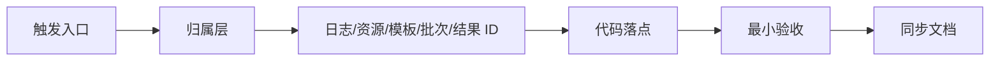

# Engine 业务场景交接手册

本页按“接到一个现场需求或缺陷后怎么处理”来组织 Engine 交接内容。它补充 [Engine 业务链路矩阵](./business-flow-matrix.md) 和 [Engine 业务交接手册](./business-handoff.md)：矩阵负责定位，交接手册负责讲完整链路，本页负责把常见变更拆成可执行步骤。

## 使用方法

| 你现在拿到的事情 | 先看本页哪一节 | 然后进入 |
| --- | --- | --- |
| 设备不存在、设备连不上、要新增设备 | [设备类场景](#设备类场景) | [设备服务链路](./device-service-chain.md) |
| 模板参数要新增、模板保存异常、导入流程失败 | [模板和 Flow 场景](#模板和-flow-场景) | [模板与 Flow 链路](./template-flow-chain.md) |
| 算法跑完但结果不显示、overlay 不对 | [结果展示场景](#结果展示场景) | [结果展示与项目交接链路](./result-handoff-chain.md) |
| 客户 CSV/PDF/MES 字段不对 | [项目包读取 Engine 结果](#项目包读取-engine-结果) | [项目包交接手册](../projects/project-handoff.md) |
| Socket/MQTT 联机异常 | [外部系统和远程服务场景](#外部系统和远程服务场景) | `SocketProtocol`、项目包页、MQTT 配置 |
| 不知道从哪个类开始 | [按类名反查场景](#按类名反查场景) | [Engine 运行时对象目录](./runtime-object-map.md) |

## 先做三步判断

任何 Engine 问题都先做这三步，不要一上来改代码：

1. 判断入口：这个动作是用户点 UI、Flow 节点执行、项目包自动触发、Socket/MES 触发，还是调度任务触发。
2. 判断归属：问题发生在资源/设备、模板/Flow、远程服务、结果展示、项目包映射、导出交付的哪一层。
3. 判断证据：至少拿到一条日志、一个资源或模板名、一个批次/SN/结果 ID，避免只根据界面现象猜。



## 设备类场景

### 场景 A：数据库里有设备，界面或 Flow 里没有

| 步骤 | 检查点 | 代码/数据入口 |
| --- | --- | --- |
| 1 | MySQL 是否连接，资源是否未删除、已启用 | `MySqlInitializer`、`SysResourceModel` |
| 2 | 资源 `Type` 是否能映射到 `ServiceTypes` | `Services/Type/TypeService.cs` |
| 3 | 该 `ServiceTypes` 是否注册了工厂 | `Services/Devices/DeviceServiceFactory.cs` |
| 4 | `ServiceManager.DeviceServices` 是否生成实例 | `Services/ServiceManager.cs` |
| 5 | Flow 节点配置器是否按正确设备类型筛选 | `Templates/Flow/NodeConfigurator/` |

最小验收：刷新资源树后设备能出现，打开对应设备页能看到状态，Flow 节点属性里能选到该设备。

不要直接在 Flow 节点里手写设备对象。这样会绕过 `ServiceManager`，后续设备页、状态栏和项目包读取都会不一致。

### 场景 B：新增一个设备类型

推荐步骤：

1. 在 `ServiceTypes` 中增加设备类型。
2. 新增 `ConfigXxx : DeviceServiceConfig`，写清连接参数和默认值。
3. 新增 `DeviceXxx : DeviceService<ConfigXxx>`，把连接、状态、命令入口放在服务层。
4. 在 `DeviceServiceFactoryRegistry` 注册工厂。
5. 如果要在主界面显示，补 `GetDisplayControl()` 和对应 `DisplayXxx`。
6. 如果要在 Flow 中使用，补 `NodeConfigurator` 或对应节点类型。
7. 如果有 MQTT 命令，新增或复用 `MQTTXxx`。
8. 更新设备使用文档、[设备服务链路](./device-service-chain.md) 和本页。

验收顺序：

| 验收项 | 通过标准 |
| --- | --- |
| 资源创建 | 数据库资源类型和配置字段正确 |
| 服务生成 | `ServiceManager` 里出现 `DeviceXxx` |
| UI 显示 | 设备页能打开，状态能刷新 |
| 命令执行 | 最小命令返回成功，失败时日志清楚 |
| Flow 绑定 | 节点能选择设备，保存后重新打开不丢 |
| 项目包调用 | 如果项目包使用它，项目流程能跑完一条最小数据 |

## 模板和 Flow 场景

### 场景 C：新增或修改算法模板参数

先判断模板属于哪类：

| 模板类型 | 常见目录 | 说明 |
| --- | --- | --- |
| 通用 JSON 算法模板 | `Templates/Jsons/` | MTF、FOV、Ghost、KB、OLED AOI 等 |
| POI/ROI 类模板 | `Templates/POI/`、`Templates/FindLightArea/` | 点位、区域、发光区域 |
| Flow 模板 | `Templates/Flow/` | 保存可视化流程 |
| 设备动作模板 | `Services/Devices/*/Templates/` | 相机曝光、自动对焦、PG、SMU 等 |

修改步骤：

1. 改参数类，保持字段命名、默认值和旧数据兼容。
2. 如果参数需要用户编辑，补 `DisplayName`、`Description`、分类和必要的自定义编辑器。
3. 改模板入口，确认 `Code`、`Title`、`TemplateDicId` 不冲突。
4. 如果 Flow 节点引用该参数，补节点配置器的读取/写回。
5. 如果结果展示依赖该参数，检查 `AlgorithmXxx`、DAO、`ViewHandleXxx`。
6. 用旧模板、新模板、复制模板、导入模板各验证一次。

风险点：

- `TemplateControl` 在 `TemplateContorl.cs`，不要因为文件名拼写误差误判。
- 模板名冲突会影响 Flow 导入和项目包选择。
- 只改参数类不改编辑器元数据，会让用户看到字段名但不知道含义。

### 场景 D：新增 Flow 节点或修改节点绑定

Flow 节点变更必须同时看三层：

| 层 | 关注点 | 代码入口 |
| --- | --- | --- |
| 节点执行骨架 | 节点输入输出、运行时事件、开始/结束 | `Engine/FlowEngineLib/` |
| Engine 业务绑定 | 设备、模板、参数如何写入节点 | `Templates/Flow/NodeConfigurator/` |
| 项目包后处理 | Flow 完成后谁读取结果 | `Projects/*/Process/`、`FlowControl.FlowCompleted` |

新增步骤：

1. 在 `FlowEngineLib` 增加节点类型或复用已有节点。
2. 如果节点要绑定设备、模板、POI、算法参数，新增或修改 `NodeConfigurator`。
3. 打开流程编辑器，确认节点属性面板能显示业务字段。
4. 保存流程，关闭后重新打开，确认参数不丢。
5. 导出 `.cvflow`，再导入到干净环境，确认关联模板和节点参数仍然可用。
6. 执行流程，确认 `FlowControl.FlowCompleted` 能返回状态和参数。

最小验收：打开流程、编辑节点、保存、重开、运行、查看结束状态。少一个环节都不能算完成。

## 结果展示场景

### 场景 E：算法有结果，但历史结果页或图像 overlay 不显示

排查顺序：

1. 结果主表是否有 `AlgResultMasterModel` 记录。
2. `ViewResultAlg` 的 `FilePath`、`ResultType`、`ResultCode` 是否正确。
3. `DisplayAlgorithmManager` 是否扫描到对应 `ViewHandleXxx`。
4. `ViewHandleXxx.CanHandle` 是否包含当前 `ViewResultAlgType`。
5. DAO 是否能查到明细，并填充 `result.ViewResults`。
6. `ImageView` 是否拿到正确图片路径，overlay 坐标是否按当前图像尺寸转换。

新增结果展示步骤：

| 步骤 | 代码入口 |
| --- | --- |
| 定义明细模型 | 实现 `IViewResult` |
| 读取明细数据 | 模板目录下 `*Dao.cs` 或 Engine `Dao/` |
| 新增展示 handler | `ViewHandleXxx : IResultHandleBase` |
| 声明支持类型 | `CanHandle` / `CanHandle1(result)` |
| 绘制 overlay | 复用 `ColorVision.ImageEditor.Draw` 图元 |
| 项目包映射 | 在 `Projects/<Project>/Process/Recipe/Fix` 单独处理客户字段 |

不要把客户 PASS/FAIL 判定塞进通用 `ViewHandleXxx`。通用 handler 负责显示，项目包负责客户判定和导出。

## 项目包读取 Engine 结果

### 场景 F：界面有结果，但客户 CSV/PDF/MES 字段为空或不对

先分清三件事：

| 层 | 问题证据 | 先查 |
| --- | --- | --- |
| Engine 原始结果 | 历史结果页、DAO、批次 ID | `ViewResultAlg`、模板 DAO |
| 项目业务映射 | `ObjectiveTestResult` 某字段为空 | `Projects/<Project>/Process/` |
| 客户导出格式 | CSV/PDF/MES 字段名或顺序错 | 项目 exporter、Socket/MES 响应模型 |

排查顺序：

1. 用批次号、SN 或结果 ID 确认 Engine 原始结果有值。
2. 查项目 `Process` 是否读取了正确模板名、key 或明细类型。
3. 查 `Recipe` / `Fix` 是否把值修正成空、Fail 或旧格式。
4. 查 `ObjectiveTestResult` 字段和导出器字段是否一致。
5. 如果是 Socket/MES，查事件名、返回字段和客户协议版本。

归属原则：通用算法结果、overlay、DAO 留在 Engine；客户字段、判定阈值、导出顺序和协议响应优先放在项目包。

## 外部系统和远程服务场景

### 场景 G：Flow 节点执行了，但远程服务没有结果

检查顺序：

| 环节 | 先查 |
| --- | --- |
| MQTT 连接 | `MQTTControl` 是否连接，broker 配置是否正确 |
| 服务注册 | `MqttRCService.ServiceTokens` 是否有对应服务 token |
| 设备命令 | `Services/Devices/*/MQTT*.cs` 组织的参数是否正确 |
| 文件依赖 | FileServer 是否能下载算法输入或输出文件 |
| 结果查询 | 返回结果 ID 后，DAO 是否查得到明细 |
| Flow 状态 | `FlowControlData.Status` 和 `Params` 是否反映失败原因 |

如果服务端没有收到命令，先查 MQTT topic 和 token；如果服务端成功但本地无结果，先查文件服务器、结果 ID 和 DAO。

### 场景 H：Socket/MES 能连接但业务结果不对

Socket/MES 通常是项目包业务，不是 Engine 通用设备逻辑。处理步骤：

1. 确认入口是 `UI/ColorVision.SocketProtocol` 的通用 server，还是项目包自己的 `SocketControl`。
2. 确认事件名、SN、流程组、模板名和返回字段来自当前项目页，而不是另一个客户项目。
3. 确认外部触发后项目包确实调用了 Engine Flow。
4. 确认 `FlowCompleted` 后项目包读取了正确结果。
5. 确认 Socket/MES 响应是在项目包最终结果之后发出。

如果协议字段和客户要求不一致，优先更新项目包页和 [项目包能力与交接矩阵](../projects/project-capability-matrix.md)。

## 按类名反查场景

| 你看到的类 | 多半属于 | 下一步 |
| --- | --- | --- |
| `ServiceManager` | 设备资源加载和运行时设备集合 | 查设备是否生成、服务树是否刷新 |
| `DeviceServiceFactoryRegistry` | 资源类型到设备实例 | 查新增设备是否注册 |
| `TemplateControl` | 模板发现和入口字典 | 查模板是否被扫描和加载 |
| `TemplateFlow` | Flow 模板保存、导入、导出 | 查 `.cvflow`、`DataBase64`、关联模板 |
| `FlowControl` | Engine 侧流程执行包装 | 查 `FlowCompleted` 和执行状态 |
| `NodeConfiguratorRegistry` | Flow 节点业务参数绑定 | 查节点属性是否能恢复 |
| `ViewResultAlg` | 通用算法主结果 | 查历史结果、文件路径和结果类型 |
| `IResultHandleBase` | 结果展示 handler | 查 overlay、表格、侧栏展示 |
| `ObjectiveTestResult` | 项目包客户结果 | 查 CSV/PDF/MES/Socket 字段 |

更完整的类名索引见 [Engine 运行时对象目录](./runtime-object-map.md)。

## 交接记录模板

每次改 Engine 业务逻辑，交接说明至少写清：

| 字段 | 示例 |
| --- | --- |
| 业务目标 | 新增某设备、修复某模板、补某结果 overlay |
| 触发入口 | 用户点击、Flow 节点、项目包、Socket/MES、调度 |
| 代码落点 | 具体目录、关键类、配置表 |
| 输入数据 | 设备 Code、模板名、SN、批次号、结果 ID、文件路径 |
| 输出结果 | UI 状态、Flow 状态、结果表、overlay、CSV/PDF/MES |
| 验收步骤 | 保存重开、最小流程、历史结果、导出文件、外部响应 |
| 文档同步 | 本页、链路页、项目页、插件页、使用手册 |

## 每次变更后的最小验证

| 变更类型 | 必做验证 |
| --- | --- |
| 设备服务 | 资源生成、设备页打开、命令执行、Flow 绑定 |
| 模板参数 | 新建、编辑、保存、复制、导入、旧数据兼容 |
| Flow 节点 | 打开、编辑、保存、重开、执行、查看 `FlowCompleted` |
| 结果展示 | 历史结果、图像打开、overlay 坐标、表格/侧栏、项目导出 |
| 项目包读取 | SN/批次、项目结果、CSV/PDF、Socket/MES 返回 |
| 远程服务 | MQTT 连接、服务 token、结果 ID、文件下载、DAO 查询 |

文档站改动后仍必须运行：

```powershell
npm run docs:build
```

并检查新增页面、本地 HTML、搜索索引和导航入口。
