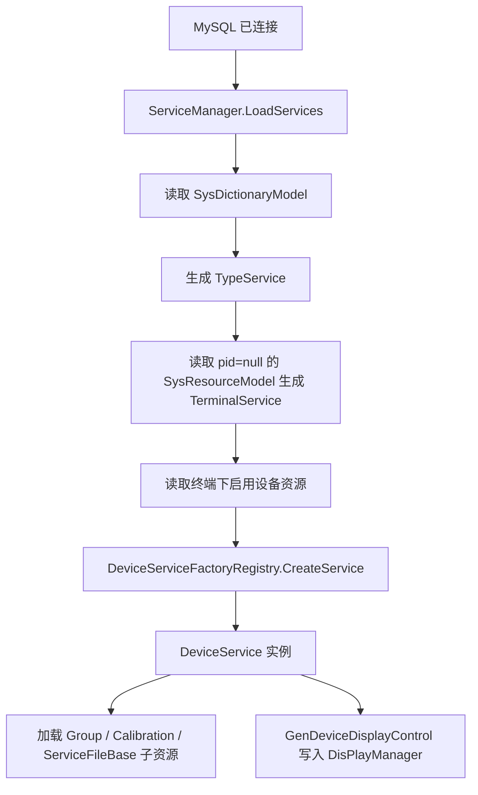

# Engine 设备服务链路

这页说明设备服务从数据库资源到运行时 `DeviceService` 的完整链路。接手设备、终端、MQTT、设备显示页时，先读这页。

## 一句话

设备服务不是靠窗口手动 new 出来的，而是由数据库中的 `SysResourceModel`、`ServiceTypes`、`DeviceServiceFactoryRegistry` 和 `ServiceManager` 共同生成。

## 关键源码

| 源码 | 作用 |
| --- | --- |
| `Services/ServiceManager.cs` | 设备服务集合中心，加载终端、设备、组和标定资源 |
| `Services/DeviceService.cs` | 设备服务基类 |
| `Services/Devices/DeviceServiceFactory.cs` | 设备服务工厂注册表 |
| `Services/Devices/DeviceServiceConfig.cs` | 设备配置基类 |
| `Services/Type/TypeService.cs` | `ServiceTypes` 枚举和类型节点 |
| `Services/Terminal/` | 终端节点 |
| `Services/Devices/<Device>/` | 各类具体设备实现 |

## 资源层级

当前运行时大致按这个层级组织资源：

```text
SysDictionaryModel
  TypeService
    TerminalService              # pid = null 的终端资源
      DeviceService              # pid = terminal id 的启用设备资源
        GroupResource            # type = Group
        CalibrationResource      # type 30-50
        ServiceFileBase          # 其他设备下资源
```

`ServiceManager.LoadServices()` 会从数据库读取 `SysDictionaryModel` 和 `SysResourceModel`，然后构建这棵树。

## 启动与重载

`ServiceManager` 是单例：

```text
ServiceManager.GetInstance()
```

初始化时如果 MySQL 已连接，会在 UI Dispatcher 上执行 `LoadServices()`。之后 `MySqlControl.GetInstance().MySqlConnectChanged` 触发时会重新加载。

这意味着设备缺失不一定是代码问题，可能是 MySQL 未连接、资源被标记删除、资源未启用或资源层级不符合预期。

## 设备服务生成流程



## 当前默认设备类型

`DeviceServiceFactoryRegistry.RegisterDefaults()` 当前注册了这些设备：

| ServiceTypes | 设备类 | 配置类 | 说明 |
| --- | --- | --- | --- |
| `Camera` | `DeviceCamera` | `ConfigCamera` | 相机设备 |
| `PG` | `DevicePG` | `ConfigPG` | Pattern Generator |
| `Spectrum` | `DeviceSpectrum` | `ConfigSpectrum` | 光谱仪 |
| `SMU` | `DeviceSMU` | `ConfigSMU` | SMU |
| `Sensor` | `DeviceSensor` | `ConfigSensor` | 传感器 |
| `FileServer` | `DeviceFileServer` | `ConfigFileServer` | 文件服务，默认 endpoint/port/path 会由工厂设置 |
| `Algorithm` | `DeviceAlgorithm` | `ConfigAlgorithm` | 算法服务，默认 `IsCCTWave = true` |
| `FilterWheel` | `DeviceCfwPort` | `ConfigCfwPort` | 滤光轮 |
| `Calibration` | `DeviceCalibration` | `ConfigCalibration` | 标定服务 |
| `Motor` | `DeviceMotor` | `ConfigMotor` | 电机 |
| `ThirdPartyAlgorithms` | `DeviceThirdPartyAlgorithms` | `ConfigThirdPartyAlgorithms` | 第三方算法 |
| `Flow` | `DeviceFlowDevice` | `ConfigFlowDevice` | 流程设备 |

如果 `SysResourceModel.Type` 对应的 `ServiceTypes` 没有注册工厂，`CreateService()` 会返回 `null`，设备不会进入 `DeviceServices`。

## TypeService 的过滤

`LoadServices()` 读取字典后会跳过一部分类型：

```text
6, 11, 12, 13, 14, 15, 16, 17
```

这些值对应 FileServer、FocusRing、Flow、Archived、ThirdPartyAlgorithms、ThirdPartyAlgorithms32、PowerControl、LightingControl 等类型。交接时不要看到枚举存在就默认它一定出现在左侧类型树里。

## 显示页生成

设备加载后，显示区不是自动等同于设备树。`ServiceManager` 还有两个显示生成入口：

| 方法 | 说明 |
| --- | --- |
| `GenDeviceDisplayControl()` | 从 `TypeServices` 遍历设备，生成显示控件列表 |
| `GenControl(ObservableCollection<DeviceService>)` | 用指定设备集合生成显示控件列表 |

两者都会先把 `FlowEngineManager.GetInstance().DisplayFlow` 放在第一个显示页，再追加各设备的 `GetDisplayControl()`。

因此排查“设备树里有设备，但主区域没有页”时，要检查：

1. 设备是否实现或返回了 `IDisPlayControl`。
2. `GenDeviceDisplayControl()` 是否执行。
3. `DisPlayManager.GetInstance().RestoreControl()` 是否恢复了旧布局。

## 新增设备的步骤

1. 在 `ServiceTypes` 增加枚举值。
2. 新增 `ConfigXxx : DeviceServiceConfig`。
3. 新增 `DeviceXxx : DeviceService<ConfigXxx>`。
4. 在 `DeviceServiceFactoryRegistry.RegisterDefaults()` 或合适初始化点注册工厂。
5. 如果设备需要终端图标，设置 `terminalIconResourceKey`。
6. 如果设备配置有默认值，用 `configureConfig` 填充。
7. 如果设备要进流程节点，补 `Templates/Flow/NodeConfigurator/`。
8. 如果设备要显示页面，实现 `GetDisplayControl()`。
9. 更新本页和用户设备文档。

## 排查清单

| 现象 | 优先检查 |
| --- | --- |
| 类型树没有设备分类 | `SysDictionaryModel`、过滤类型、MySQL 连接 |
| 有终端但没有设备 | `SysResourceModel.Pid`、`IsEnable`、`IsDelete`、`TenantId` |
| 设备资源存在但不生成 | `ServiceTypes` 值和 `DeviceServiceFactoryRegistry` |
| 设备生成但没有显示页 | `GetDisplayControl()`、`IDisPlayControl`、`DisPlayManager` |
| 标定/组资源不显示 | 子资源 type 是否为 `Group` 或 30-50 |
| 重连数据库后状态异常 | `MySqlConnectChanged` 是否触发重新 `LoadServices()` |

## 不要这样改

- 不要在窗口代码里绕过 `ServiceManager` 手动维护全局设备集合。
- 不要只新增菜单或窗口，不注册 `DeviceServiceFactoryRegistry`。
- 不要让底层设备类直接依赖客户项目包。
- 不要把标定资源、组资源和设备服务混成同一层对象。
