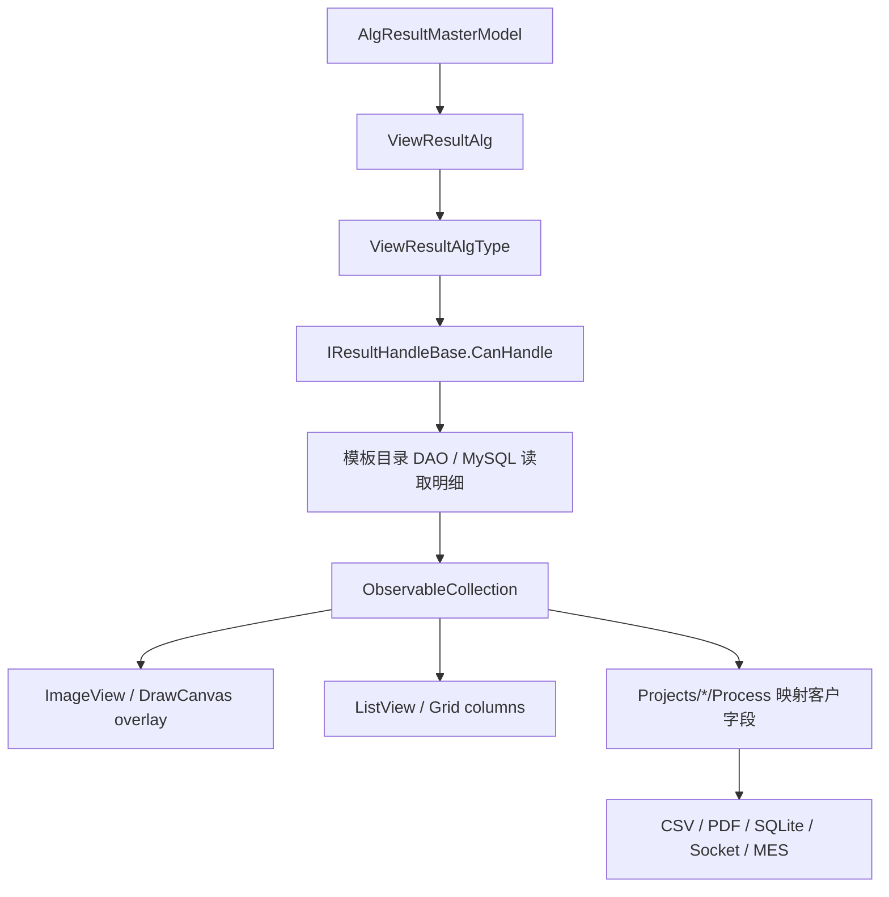

# Engine 结果展示与项目交接链路

这页说明算法结果如何从数据库/服务端回到 ImageEditor overlay，再进入项目包的客户结果。接手结果展示、Overlay、CSV/PDF/MES/Socket 输出时，先读这页。

## 一句话

Engine 结果链路分成三层：通用算法结果模型、通用显示 handler、项目包业务结果映射。不要把客户判定规则写进通用结果 handler。

## 关键源码

| 源码 | 作用 |
| --- | --- |
| `Services/Core/ViewResultAlg.cs` | 通用算法结果视图模型 |
| `Abstractions/IViewResult.cs` | 结果明细标记接口和集合转换 |
| `Abstractions/IResultHandlers.cs` | 结果处理器契约和基类 |
| `Abstractions/IDisplayAlgorithm.cs` | 结果 handler 扫描和算法显示入口 |
| `Services/Devices/Algorithm/Views/AlgorithmView.xaml.cs` | 算法结果查看窗口 |
| `Templates/**/ViewHandle*.cs` | 各算法结果展示 handler |
| `Templates/**/*Dao.cs` | 各算法结果明细读取 |
| `Projects/*/Process/` | 客户项目结果映射 |

## 结果对象分层

| 层 | 类型 | 说明 |
| --- | --- | --- |
| 主结果 | `ViewResultAlg` | 包含批次、文件路径、模板名、结果类型、耗时、结果描述等 |
| 明细结果 | `IViewResult` | POI、MTF、SFR、FOV、Ghost 等算法明细 |
| 展示处理器 | `IResultHandleBase` | 判断能否处理某种 `ViewResultAlgType` 并绘制 UI/overlay |
| 项目业务结果 | `ObjectiveTestResult` 等 | 客户字段、判定、导出、MES/Socket 返回 |

`ViewResultAlg.ViewResults` 是通用明细集合：

```text
ObservableCollection<IViewResult>
```

各算法 handler 会把 DAO 查到的明细塞进这个集合，再交给界面显示。

## ViewResultAlg 负责什么

`ViewResultAlg` 从 `AlgResultMasterModel` 构造，主要字段包括：

- `Id`
- `Batch`
- `FilePath`
- `POITemplateName`
- `CreateTime`
- `ResultType`
- `ResultCode`
- `ResultDesc`
- `ResultImagFile`
- `TotalTime`
- `Version`

它还提供若干右键命令：

- 打开所在文件夹。
- 导出 CVCIE。
- 复制原始文件。
- 从结果生成 POI 模板。

因此 `ViewResultAlg` 不是纯 DTO，它带有结果查看页需要的交互命令。

## handler 发现机制

`DisplayAlgorithmManager` 构造时会：

1. 遍历 `AssemblyHandler.GetInstance().GetAssemblies()`。
2. 找到所有继承 `IResultHandleBase` 且非抽象的类型。
3. `Activator.CreateInstance(type)`。
4. 加入 `ResultHandles`。

如果新增 `ViewHandleXxx` 后没有生效，优先检查：

- 程序集是否已加载。
- handler 是否继承 `IResultHandleBase`。
- handler 是否非抽象。
- 是否有可用无参构造。
- `CanHandle` 是否包含正确的 `ViewResultAlgType`。

## handler 怎么工作

`IResultHandleBase` 的核心成员：

| 成员 | 说明 |
| --- | --- |
| `Name` | 默认是类型名 |
| `RenderConfig` | overlay 文字、小数位、字体、线宽等显示配置 |
| `CanHandle` | 可处理的 `ViewResultAlgType` 列表 |
| `CanHandle1(result)` | 判断是否能处理某个主结果 |
| `Handle(context, result)` | 处理并展示结果 |
| `Load(context, result)` | 可选加载过程 |
| `SideSave(result, selectedPath)` | 可选侧边栏数据保存 |

`ViewResultContext` 给 handler 提供：

- `ImageView`
- `ListView`
- `LeftGridViewColumnVisibilitys`
- `SideTextBox`

所以 handler 可以同时操作图像 overlay、左侧表格列、侧边栏文本。

## 典型结果链



## overlay 怎么画

通用结果 handler 不直接画任意 WPF 元素，而是尽量复用 `ColorVision.ImageEditor` 的图元和 `ImageView` 能力。

`IResultHandleBase.AddPOIPoint()` 是一个典型例子：

- 圆形 POI 用 `DVCircleText`。
- 矩形 POI 用 `DVRectangleText`。
- 实心点用 `DVCircle`。
- 通过 `imageView.AddVisual(...)` 加入 overlay。

新增结果 overlay 时，优先复用 ImageEditor 的 `Draw/` 图元体系。不要在 handler 中临时堆一套独立 Canvas 逻辑。

## 常见 handler 类型

源码中常见的结果 handler 分布：

| 目录 | 示例 |
| --- | --- |
| `Templates/ARVR/SFR/` | `ViewHandleSFR` |
| `Templates/ARVR/MTF/` | `ViewHandleMTF` |
| `Templates/ARVR/Ghost/` | `ViewHandleGhost` |
| `Templates/ARVR/FOV/` | `ViewHandleFOV` |
| `Templates/POI/AlgorithmImp/` | `ViewHandleRealPOI`、`ViewHanlePOIY` |
| `Templates/Jsons/*/` | `ViewHandleSFR2`、`ViewHandleBlackMura`、`ViewHandleFindCross` 等 |
| `Templates/Compliance/` | [Compliance 结果交接](../algorithms/templates/compliance-results.md)：`ViewHandleComplianceY/XYZ/JND` |
| `Templates/Matching/` | [Matching 模板匹配](../algorithms/templates/matching-template.md)：`ViewHandleMatching`、AOI 四点 overlay |
| `Templates/ImageCropping/` | [ImageCropping 图像裁剪模板](../algorithms/templates/image-cropping-template.md)：`ViewHandleImageCropping`、裁剪文件明细 |

很多结果读取逻辑就近放在模板目录下的 DAO 文件中。排查某个算法结果时，通常按“ViewHandle -> Dao -> IViewResult model”去追。

## 项目包如何接结果

项目包不应直接改通用 handler 来实现客户字段。更合理的链路是：

1. Flow 或算法执行完成。
2. Engine 生成主结果和明细结果。
3. 通用 handler 保证图像、表格、侧边栏展示正确。
4. 项目包在 `Process/`、`Recipe/`、`Fix/` 中读取需要的结果。
5. 映射到 `ObjectiveTestResult` 或项目专用结果模型。
6. 输出 CSV、PDF、SQLite、Socket/MES 响应。

典型目录：

- `Projects/ProjectLUX/Process/`
- `Projects/ProjectARVRPro/Process/`
- `Projects/ProjectKB/`

## 新增算法结果展示步骤

1. 明确主结果的 `ViewResultAlgType`。
2. 新增明细模型，实现 `IViewResult`。
3. 新增 DAO，从 MySQL/服务端读取明细。
4. 新增 `ViewHandleXxx : IResultHandleBase`。
5. 在 `CanHandle` 中声明支持的结果类型。
6. 在 `Handle()` 中填充 `result.ViewResults`，并更新 `ImageView` overlay、表格或侧边栏。
7. 如果项目包需要客户字段，在项目 `Process/Recipe/Fix` 层单独映射。
8. 用真实结果验证：历史结果列表、图像 overlay、表格列、导出字段。

## 排查清单

| 现象 | 优先检查 |
| --- | --- |
| 历史结果列表有记录但打不开图像 | `ViewResultAlg.FilePath`、文件服务器下载、原始文件是否存在 |
| 能打开图像但没有 overlay | handler 是否被扫描、`CanHandle` 是否匹配、DAO 是否查到明细 |
| overlay 位置不对 | 图像尺寸、坐标系、POI/ROI 的像素转换 |
| 左侧表格没有列或为空 | `ViewResults` 类型、`GridViewColumnVisibility`、handler 填充逻辑 |
| 项目 CSV 字段为空 | 项目 `Process` 读取 key、Recipe/Fix 修正、导出字段名 |
| 同一结果被错误 handler 处理 | `ViewResultAlgType` 和多个 handler 的 `CanHandle` 是否冲突 |

## 不要这样改

- 不要把客户判定规则写入通用 `ViewHandleXxx`。
- 不要绕过 `IViewResult` 直接把匿名对象塞给项目包。
- 不要在 handler 里另起一套绘图框架。
- 不要只验证新结果，历史结果回放也必须验证。

## 继续阅读

- [Compliance 结果交接](../algorithms/templates/compliance-results.md)
- [Validate 判定规则模板](../algorithms/templates/validate-rules.md)
- [BuzProduct 产品业务参数模板](../algorithms/templates/buz-product-template.md)
