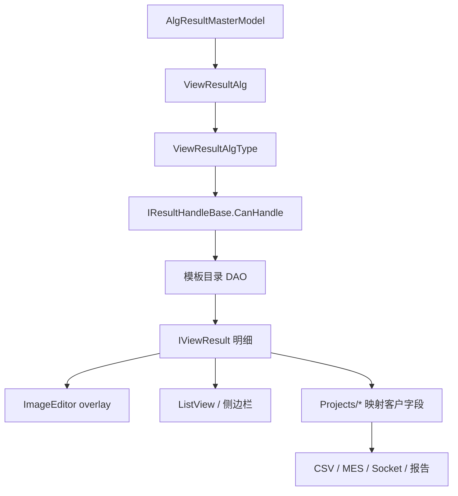

# Engine 结果展示链路

结果链路分三层：Engine 通用结果、通用显示 handler、项目包业务结果。排查 overlay、表格、CSV、MES 或 Socket 输出时，先确认问题落在哪一层。

## 先查什么

| 现象 | 第一检查点 |
| --- | --- |
| 历史结果有记录但打不开图 | `ViewResultAlg.FilePath`、文件服务、原始文件是否存在 |
| 图能打开但没有 overlay | handler 是否扫描到，`CanHandle` 是否匹配，DAO 是否查到明细 |
| overlay 位置不对 | 图像尺寸、坐标系、POI/ROI 像素转换 |
| 左侧表格为空 | `ViewResults` 类型、列可见性、handler 填充逻辑 |
| 项目 CSV/MES 字段为空 | 项目 `Process`、Recipe/Fix、exporter 字段名 |
| 结果被错误 handler 处理 | `ViewResultAlgType` 和多个 handler 的 `CanHandle` 是否冲突 |

## 分层边界

| 层 | 典型对象 | 负责 |
| --- | --- | --- |
| 主结果 | `ViewResultAlg` | 批次、文件路径、模板名、结果类型、结果描述 |
| 明细结果 | `IViewResult` | POI、MTF、SFR、FOV、Ghost 等算法明细 |
| 展示 handler | `IResultHandleBase` | 读取明细、填充表格、绘制 ImageEditor overlay |
| 项目结果 | `ObjectiveTestResult`、项目结果模型 | 客户字段、判定、CSV/PDF/MES/Socket |

客户判定和交付字段应该在 `Projects/*`，不要写进通用 `ViewHandleXxx`。

## 运行链路

## handler 发现机制

`DisplayAlgorithmManager` 会遍历已加载程序集，实例化所有继承 `IResultHandleBase` 且非抽象的类型。新增 handler 不生效时，优先检查：

- 程序集是否被加载。
- 类型是否继承 `IResultHandleBase`。
- 是否非抽象、可无参构造。
- `CanHandle` 是否包含正确的 `ViewResultAlgType`。

## 新增结果展示

| 步骤 | 要做什么 |
| --- | --- |
| 1 | 明确主结果的 `ViewResultAlgType` |
| 2 | 新增明细模型并实现 `IViewResult` |
| 3 | 新增 DAO，从 MySQL 或服务端结果读取明细 |
| 4 | 新增 `ViewHandleXxx : IResultHandleBase` |
| 5 | 在 `CanHandle` 中声明支持的结果类型 |
| 6 | 在 `Handle()` 中填充 `ViewResults`、表格、侧边栏和 overlay |
| 7 | 项目包需要客户字段时，在项目 `Process/Recipe/Fix` 单独映射 |
| 8 | 用真实历史结果验证回放、overlay、导出字段 |

## overlay 规则

优先复用 `ColorVision.ImageEditor/Draw/` 图元，例如 `DVCircleText`、`DVRectangleText`、`DVCircle`，再通过 `imageView.AddVisual(...)` 加入 overlay。不要在 handler 里另起一套独立 Canvas。

## 常见入口

| 想看 | 入口 |
| --- | --- |
| 主结果模型 | `Services/Core/ViewResultAlg.cs` |
| handler 契约 | `Abstractions/IResultHandlers.cs` |
| handler 扫描 | `Abstractions/IDisplayAlgorithm.cs` |
| 明细接口 | `Abstractions/IViewResult.cs` |
| 结果查看窗口 | `Services/Devices/Algorithm/Views/AlgorithmView.xaml.cs` |
| 算法结果展示 | `Templates/**/ViewHandle*.cs` |
| 明细读取 | `Templates/**/*Dao.cs` |
| 客户输出 | `Projects/*/Process/`、项目窗口和 exporter |

## 不要这样改

- 不要把客户判定规则写入通用 `ViewHandleXxx`。
- 不要绕过 `IViewResult` 用匿名对象传给项目包。
- 不要只验证新结果，历史结果回放也要验证。
- 不要让多个 handler 模糊匹配同一个结果类型。
