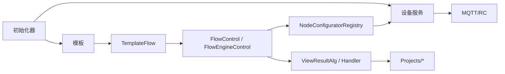

# Engine 运行时对象目录

这页只回答一个问题：看到 Engine 类名时，应该把它放到哪条运行链路里排查。它不是源码目录清单；目录和类太细时，优先跳到对应专题页。

## 先按链路定位

排查顺序通常是：初始化是否完成，设备是否生成，模板是否加载，Flow 节点是否绑定设备/模板，结果 handler 是否接住，项目包是否把结果转成客户字段。

## 对象速查

| 看到的对象 | 所属链路 | 先查什么 |
| --- | --- | --- |
| `MySqlInitializer` | 数据库启动 | 数据库连接、模板和设备依赖 |
| `MqttInitializer`、`MQTTControl` | MQTT | broker 配置、连接状态、topic |
| `ServiceInitializer`、`ServiceManager` | 设备服务 | `LoadServices()`、资源类型、工厂注册 |
| `DeviceService<TConfig>` | 具体设备 | 配置对象、启动/停止、MQTT service |
| `DeviceServiceFactoryRegistry` | 设备创建 | 新设备类型是否注册到 `ServiceTypes` |
| `TemplateInitializer`、`TemplateControl` | 模板 | `IITemplateLoad` 是否被扫描，`Code` 是否稳定 |
| `TemplateFlow`、`FlowParam` | 流程模板 | `.cvflow`/STN 是否保存，模板名是否匹配 |
| `FlowControl` | Engine 侧流程执行 | 批次、超时、完成事件 |
| `FlowEngineControl` | FlowEngineLib 执行 | 起止节点、运行状态、节点错误 |
| `NodeConfiguratorRegistry` | 节点配置 | 配置器是否扫描到，设备/模板是否写回节点 |
| `ViewResultAlg` | 算法主结果 | 批次、算法结果主表、明细结果 |
| `IResultHandleBase`、`DisplayAlgorithmManager` | 结果展示 | handler 是否扫描到，`ViewResultAlgType` 是否一致 |
| `MeasureBatchModel` | 批次 | 批次 ID、模板名、结果查询条件 |
| 项目 `Process` / `Recipe` / `Fix` | 客户业务 | CSV/MES/限值/修正是否在项目层处理 |

## 设备服务

新增或排查设备时，不要只看窗口。设备链路通常由四层组成：

1. `ServiceTypes` 和资源字典。
2. `DeviceServiceConfig` 配置。
3. `DeviceService<TConfig>` 运行时对象。
4. 具体 MQTT/串口/文件服务和显示页。

当前常见设备目录包括 Camera、PG、Spectrum、SMU、Sensor、FileServer、Algorithm、Calibration、Motor、FilterWheel、ThirdPartyAlgorithms、FlowDevice。

## 模板和 Flow

模板同时影响参数编辑、Flow 节点绑定、算法请求和结果解析。改模板时至少检查：

| 改动 | 必查 |
| --- | --- |
| 新增模板类 | 是否实现 `IITemplateLoad` 或对应 `ITemplate*` 基类 |
| 修改 `Code` | 手动算法、Flow `operatorCode`、结果 handler |
| 修改参数字段 | PropertyGrid、JSON 序列化、服务端算法参数 |
| 修改 Flow 模板名 | 项目包模板关键字、Recipe 选择、CSV 字段 |
| 新增 Flow 节点 | FlowEngineLib 节点、`NodeConfiguratorAttribute`、配置器写回 |

模板不显示先查 `TemplateInitializer` 和 `TemplateControl`。节点参数不恢复先查 `NodeConfiguratorRegistry` 和具体 `*NodeConfigurator`。

## 结果链路

结果不要混成一层看：

| 层 | 负责 |
| --- | --- |
| Engine 主结果 | `ViewResultAlg`、批次、算法结果主表 |
| 明细结果 | `Templates/**/*Dao.cs`、各算法结果实体 |
| 展示 handler | `ViewHandle*.cs`、overlay、CSV/统计展示 |
| 项目结果 | 客户字段、Recipe 判定、MES/Socket/CSV 输出 |

客户专用字段应留在 `Projects/*`，不要塞进通用 `ViewHandle`。通用 handler 只负责把算法结果看懂和展示清楚。

## 故障首查

| 现象 | 第一入口 | 相关入口 |
| --- | --- | --- |
| 设备没有生成 | `ServiceManager`、`DeviceServiceFactoryRegistry` | [设备服务链路](./device-service-chain.md) |
| 模板列表为空 | `TemplateInitializer`、`TemplateControl` | [模板与 Flow 链路](./template-flow-chain.md) |
| Flow 保存或加载失败 | `TemplateFlow`、`FlowParam`、资源 `Value` | [模板与 Flow 链路](./template-flow-chain.md) |
| 节点下拉没设备/模板 | `NodeConfiguratorRegistry`、具体配置器 | [模板与 Flow 链路](./template-flow-chain.md) |
| Flow 完成但项目没结果 | `FlowControlData`、项目 `Process.Execute()` | [项目包总览](../projects/README.md) |
| 结果列表有记录但 overlay 不显示 | `DisplayAlgorithmManager`、`IResultHandleBase` | [结果展示链路](./result-handoff-chain.md) |
| CSV/MES 字段为空 | 项目 `ObjectiveTestResult`、Recipe、exporter | [项目说明](../../00-projects/README.md) |

## 维护规则

- 新增运行时核心对象时，只在本页补“链路定位”，不要堆完整 API。
- 新增设备、模板、Flow 节点或结果 handler 时，同步对应链路页。
- 客户项目规则写到项目文档，不写成 Engine 通用承诺。
