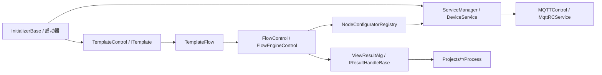

# Engine 运行时对象目录

这页按运行时对象整理 `Engine/` 的核心类。它不是替代 [Engine 业务交接手册](./business-handoff.md)，而是给接手人员一张“看到类名就知道它属于哪条业务链”的索引。

## 先看全局链路

排查时按这条链读：初始化是否完成，设备是否生成，模板是否加载，Flow 是否能绑定节点，结果是否能被 handler 处理，项目包是否把结果映射成客户字段。

## 启动和初始化对象

| 对象 | 源码 | 所属链路 | 交接时看什么 |
| --- | --- | --- | --- |
| `MySqlInitializer` | `Engine/ColorVision.Engine/MySqlInitializer.cs` | 数据库初始化 | MySQL 是否连接，后续模板和设备是否依赖它 |
| `MqttInitializer` | `Engine/ColorVision.Engine/MQTT/MqttInitializer.cs` | MQTT 初始化 | MQTT 配置是否加载，连接窗口和默认 broker 是否正确 |
| `ServiceInitializer` | `Engine/ColorVision.Engine/Services/ServiceInitializer.cs` | 设备服务初始化 | 是否调用 `ServiceManager.GetInstance()` |
| `TemplateInitializer` | `Engine/ColorVision.Engine/Templates/TemplateContorl.cs` | 模板初始化 | `Order=4`，依赖 `MySqlInitializer`，在 Dispatcher 上加载模板 |
| `IInitializerFlow` | `Engine/ColorVision.Engine/Templates/Flow/FlowEngineManager.cs` | Flow 初始化 | Flow 显示页和 FlowEngineManager 初始化 |
| `RCInitializer` | `Engine/ColorVision.Engine/Services/RC/RCInitializer.cs` | RC/MQTT 服务 | 远程服务 token 和服务启停 |

如果启动后“模板为空、设备为空、流程页不显示”，先检查这些初始化器的执行顺序，不要直接去改窗口代码。

## 设备和资源对象

| 对象 | 源码 | 职责 | 常见调用方 |
| --- | --- | --- | --- |
| `ServiceTypes` | `Services/Type/TypeService.cs` | 设备/资源类型枚举 | 资源树、工厂注册、设备创建 |
| `TypeService` | `Services/Type/TypeService.cs` | 按字典类型组织资源分类 | `ServiceManager.LoadServices()` |
| `ServiceManager` | `Services/ServiceManager.cs` | 运行时设备服务集合中心 | 主界面、Flow 节点配置器、设备显示页 |
| `DeviceService` | `Services/DeviceService.cs` | 设备服务基类 | Camera、PG、Spectrum、SMU 等具体设备 |
| `DeviceService<TConfig>` | `Services/DeviceService.cs` | 带类型化配置的设备基类 | 具体 `DeviceXxx` |
| `DeviceServiceConfig` | `Services/Devices/DeviceServiceConfig.cs` | 设备配置基类 | 配置编辑器、服务启动 |
| `DeviceServiceFactoryRegistry` | `Services/Devices/DeviceServiceFactory.cs` | `ServiceTypes` 到 `DeviceService` 的工厂注册 | `ServiceManager` |
| `DeviceServiceFactory<TConfig>` | `Services/Devices/DeviceServiceFactory.cs` | 默认工厂实现 | 新增设备类型 |

当前默认注册的设备包括 Camera、PG、Spectrum、SMU、Sensor、FileServer、Algorithm、FilterWheel、Calibration、Motor、ThirdPartyAlgorithms、Flow。新增设备必须进入 `DeviceServiceFactoryRegistry`，否则数据库资源不会变成运行时服务。

## 具体设备目录

| 目录 | 设备 | 交接重点 |
| --- | --- | --- |
| `Services/Devices/Camera/` | 相机 | 拍照、自动曝光、自动对焦、相机模板 |
| `Services/Devices/PG/` | Pattern Generator | 图案切换、PG 模板 |
| `Services/Devices/Spectrum/` | 光谱仪 | 光谱采集、光通量、光谱结果读取 |
| `Services/Devices/SMU/` | SMU | 电流电压源表控制 |
| `Services/Devices/Sensor/` | 传感器 | 通用 Sensor 命令 |
| `Services/Devices/FileServer/` | 文件服务 | 原始文件下载和路径 |
| `Services/Devices/Algorithm/` | 算法服务 | 算法执行、结果查询、AlgorithmView |
| `Services/Devices/Calibration/` | 标定服务 | 标定资源和相机标定链 |
| `Services/Devices/Motor/` | 电机 | 电机动作和位置 |
| `Services/Devices/CfwPort/` | 滤光轮 | 滤光轮串口/端口 |
| `Services/Devices/ThirdPartyAlgorithms/` | 第三方算法 | 外部算法结果查看 |
| `Services/Devices/FlowDevice/` | 流程设备 | Flow 设备服务 |

设备目录里的 display view、template、MQTT service 往往是同一业务链的不同层。不要只看窗口，也要看对应 `DService` 或 `MQTT*.cs`。

## MQTT 和远程服务对象

| 对象 | 源码 | 职责 |
| --- | --- | --- |
| `MQTTControl` | `MQTT/MQTTControl.cs` | MQTT 连接状态、启动/停止、消息转发 |
| `MQTTConfig` | `MQTT/MQTTConfig.cs` | MQTT 连接配置 |
| `MQTTConnect` | `MQTT/MQTTConnect.xaml.cs` | MQTT 配置窗口 |
| `MqttRCService` | `Services/RC/MQTTRCService.cs` | 远程服务控制、服务 token、服务重启 |
| `Messages/` | `Messages/` | MQTT 和业务消息模型 |

很多 Flow 节点最终不是本地算完，而是通过设备服务发 MQTT 命令，拿到服务端返回的结果 ID 或文件路径。排查“节点运行但没结果”时，继续看 MQTT 连接、topic、服务端返回和文件服务。

## 模板对象

| 对象 | 源码 | 职责 | 交接时看什么 |
| --- | --- | --- | --- |
| `IITemplateLoad` | `Templates/TemplateContorl.cs` | 模板加载扩展点 | 类型是否被程序集扫描到，是否能无参创建 |
| `TemplateControl` | `Templates/TemplateContorl.cs` | 模板入口字典和初始化中心 | `ITemplateNames`、`AddITemplateInstance` |
| `ITemplate<T>` | `Templates/ITemplate.cs` | 普通模板入口 | `Code`、`Title`、`Params`、菜单 |
| `ITemplateJson<T>` | `Templates/Jsons/` 相关基类 | JSON 算法模板入口 | JSON 参数、编辑控件、算法服务命令 |
| `TemplateModel<T>` | `Templates/TemplateModel.cs` | 模板列表项包装 | 名称、复制、重命名、参数对象 |
| `TemplateManagerWindow` | `Templates/TemplateManagerWindow.xaml.cs` | 模板入口管理窗口 | 模板分类和入口 |
| `TemplateEditorWindow` | `Templates/TemplateEditorWindow.xaml.cs` | 单类模板编辑宿主 | PropertyGrid 或自定义 UserControl |

模板不是单纯 UI 表单。它同时影响算法参数、Flow 节点绑定、导入导出和项目包解析。改模板名、`Code`、参数字段时，要同时验证 Flow 和结果 handler。

## 主要模板目录

| 目录 | 说明 |
| --- | --- |
| `Templates/Flow/` | 可视化流程模板，保存 `.cvflow`/STN 数据 |
| `Templates/POI/` | POI 点集、点位构建、POI 结果 |
| `Templates/Jsons/` | JSON 算法模板，包含 MTF、FOV、Ghost、KB、OLED AOI 等 |
| `Templates/ARVR/` | AR/VR 历史和通用算法模板 |
| `Templates/Compliance/` | 亮度/色度/JND 合规结果 |
| `Templates/FindLightArea/` | 发光区域查找 |
| `Templates/ImageCropping/` | 图像裁剪 |
| `Templates/Matching/` | AOI/匹配结果 |
| `Templates/DataLoad/` | 数据加载模板 |
| `Services/Devices/*/Templates/` | 设备侧模板，例如相机曝光、自动对焦、PG、SMU |

新增算法模板时，先确认它是通用 JSON 算法、设备动作模板，还是项目包专用 Process。客户判定不要写到通用模板里。

## Flow 对象

| 对象 | 源码 | 职责 |
| --- | --- | --- |
| `TemplateFlow` | `Templates/Flow/TemplateFlow.cs` | Flow 模板保存、加载、导入导出 |
| `FlowParam` | `Templates/Flow/` | 单个流程模板参数和 Base64 STN |
| `FlowControl` | `Templates/Flow/FlowControl.cs` | Engine 侧流程执行包装 |
| `FlowControlData` | `Templates/Flow/FlowControl.cs` | Flow 完成事件数据 |
| `FlowEngineManager` | `Templates/Flow/FlowEngineManager.cs` | Flow 显示和 FlowEngine 运行时管理 |
| `DisplayFlow` | `Templates/Flow/DisplayFlow.xaml.cs` | 主界面的流程显示页 |
| `FlowEngineControl` | `Engine/FlowEngineLib/FlowEngineControl.cs` | FlowEngineLib 执行控制 |
| `BaseStartNode` | `Engine/FlowEngineLib/Start/BaseStartNode.cs` | 起始节点 |
| `CVEndNode` | `Engine/FlowEngineLib/End/CVEndNode.cs` | 结束节点 |

项目包通常选择一个 `TemplateFlow`，调用 Flow 执行，等 `FlowCompleted` 后再解析结果。项目包不应该重写 FlowEngine 主循环。

## 节点配置器对象

| 对象 | 源码 | 职责 |
| --- | --- | --- |
| `NodeConfiguratorRegistry` | `Templates/Flow/NodeConfigurator/NodeConfiguratorRegistry.cs` | 扫描所有 `INodeConfigurator` 并按节点类型注册 |
| `NodeConfiguratorAttribute` | `Templates/Flow/NodeConfigurator/NodeConfiguratorAttribute.cs` | 声明配置器对应的节点类型 |
| `NodeConfiguratorBase` | `Templates/Flow/NodeConfigurator/NodeConfiguratorBase.cs` | 配置器基类 |
| `DeviceOnlyNodeConfigurator<TNode,TDevice>` | `Templates/Flow/NodeConfigurator/NodeConfiguratorBase.cs` | 只绑定设备的配置器基类 |
| `NodeConfiguratorContext` | `Templates/Flow/NodeConfigurator/NodeConfiguratorContext.cs` | 给配置器的上下文 |
| `CameraNodeConfigurators` | `Templates/Flow/NodeConfigurator/CameraNodeConfigurators.cs` | 相机类节点绑定 |
| `AlgorithmNodeConfigurators` | `Templates/Flow/NodeConfigurator/AlgorithmNodeConfigurators.cs` | 算法类节点绑定 |
| `POINodeConfigurators` | `Templates/Flow/NodeConfigurator/POINodeConfigurators.cs` | POI 类节点绑定 |
| `SpectrumNodeConfigurators` | `Templates/Flow/NodeConfigurator/SpectrumNodeConfigurators.cs` | 光谱节点绑定 |
| `OLEDNodeConfigurators` | `Templates/Flow/NodeConfigurator/OLEDNodeConfigurators.cs` | OLED/AOI 节点绑定 |
| `DeviceNodeConfigurators` | `Templates/Flow/NodeConfigurator/DeviceNodeConfigurators.cs` | PG、SMU、Sensor、Calibration 等设备节点 |

新增 Flow 节点时要同时确认三件事：节点类型是否在 FlowEngineLib 中可用，配置器是否能扫描到，配置器是否把设备、模板或参数写回节点。

## 结果对象

| 对象 | 源码 | 职责 |
| --- | --- | --- |
| `ViewResultAlg` | `Services/Core/ViewResultAlg.cs` | 通用算法主结果视图模型 |
| `IViewResult` | `Abstractions/IViewResult.cs` | 算法明细结果接口 |
| `IResultHandleBase` | `Abstractions/IResultHandlers.cs` | 通用结果 handler 基类 |
| `DisplayAlgorithmManager` | `Abstractions/IDisplayAlgorithm.cs` | 扫描结果 handler |
| `AlgorithmView` | `Services/Devices/Algorithm/Views/AlgorithmView.xaml.cs` | 算法结果查看 UI |
| `Templates/**/ViewHandle*.cs` | 各模板目录 | 具体算法结果展示 |
| `Templates/**/*Dao.cs` | 各模板目录 | 明细结果读取 |

结果链路要分清三层：Engine 主结果，通用显示 handler，项目包业务结果。客户 CSV 或 MES 字段应在项目包 `Process/Recipe/Fix` 层映射，不要塞进通用 `ViewHandle`。

## 数据和批次对象

| 对象 | 源码 | 职责 |
| --- | --- | --- |
| `MeasureBatchModel` | `Dao/MeasureBatchModel.cs` | 测试批次模型 |
| `BatchResultMasterDao` | `Dao/MeasureBatchModel.cs` | 批次查询 DAO |
| `Dao/` | `Engine/ColorVision.Engine/Dao/` | Engine 数据访问 |
| `Batch/` | `Engine/ColorVision.Engine/Batch/` | 批次相关 UI 和逻辑 |
| `Archive/` | `Engine/ColorVision.Engine/Archive/` | 归档结果查询 |
| `Reports/` | `Engine/ColorVision.Engine/Reports/` | 报表生成 |

项目包运行 Flow 时通常会创建或查询批次，再用批次 ID 回到算法结果。排查项目结果为空时，批次和模板名匹配是第一步。

## 按任务找对象

| 任务 | 先看对象 | 再看文档 |
| --- | --- | --- |
| 设备不生成 | `ServiceManager`、`DeviceServiceFactoryRegistry`、`ServiceTypes` | [设备服务链路](./device-service-chain.md) |
| 新增设备类型 | `DeviceService<TConfig>`、`DeviceServiceFactory<TConfig>` | [设备服务链路](./device-service-chain.md) |
| 模板不显示 | `TemplateInitializer`、`TemplateControl`、`IITemplateLoad` | [模板与 Flow 链路](./template-flow-chain.md) |
| Flow 保存失败 | `TemplateFlow`、`FlowParam`、`SysResourceModel.Value` | [模板与 Flow 链路](./template-flow-chain.md) |
| 节点参数不恢复 | `NodeConfiguratorRegistry`、具体 `*NodeConfigurator` | [模板与 Flow 链路](./template-flow-chain.md) |
| Flow 完成但项目没结果 | `FlowControlData`、项目 `Process.Execute()` | [项目包交接手册](../projects/project-handoff.md) |
| 结果列表有记录但 overlay 不显示 | `DisplayAlgorithmManager`、`IResultHandleBase`、`ViewHandleXxx` | [结果展示与项目交接链路](./result-handoff-chain.md) |
| CSV 字段为空 | Engine 结果 DAO、项目 `ObjectiveTestResult`、项目 exporter | [项目说明](../../00-projects/README.md) |

## 维护要求

- 新增运行时核心对象时，同步更新本页，让后续接手人员能从类名找到业务链路。
- 新增设备类型时，同步更新 [设备服务链路](./device-service-chain.md)。
- 新增模板或 Flow 节点时，同步更新 [模板与 Flow 链路](./template-flow-chain.md)。
- 新增结果 handler 时，同步更新 [结果展示与项目交接链路](./result-handoff-chain.md)。
- 客户项目规则仍应写在 `Projects/` 文档，不要把项目专用逻辑写成 Engine 通用承诺。
