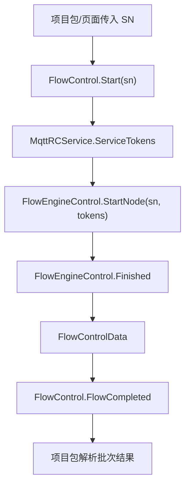

# Engine 模板与 Flow 链路

模板保存业务参数和流程定义，`FlowEngineLib` 执行节点。真正的业务流程由 `TemplateControl`、`TemplateFlow`、节点配置器、`FlowControl` 和项目包结果处理共同完成。

## 先查什么

| 现象 | 第一检查点 |
| --- | --- |
| 模板列表为空 | MySQL 连接、`TemplateInitializer`、`IITemplateLoad.Load()` |
| 新模板不出现 | 程序集是否加载、是否无参构造、是否注册到 `TemplateControl` |
| Flow 能打开但保存失败 | `FlowParam.DataBase64`、`ModMasterModel`、`ModDetailModel.ValueA` |
| Flow 导入后模板找不到 | `.cvflow` manifest、模板名称映射、`TemplateControl.ITemplateNames` |
| 节点参数不恢复 | 是否有匹配的 `NodeConfigurator` |
| Flow 完成但项目没结果 | `FlowCompleted` 后项目解析逻辑、模板名和结果类型 |

## 关键对象

| 对象 | 负责 |
| --- | --- |
| `TemplateInitializer` | 在 MySQL 后初始化模板系统 |
| `TemplateControl` | 扫描 `IITemplateLoad`，维护模板入口字典 |
| `TemplateModel<T>` | 模板列表项，包装真正的参数对象 |
| `TemplateFlow` | Flow 模板加载、保存、导入导出 |
| `FlowControl` | Engine 侧 Flow 执行包装和完成事件 |
| `FlowEngineControl` | FlowEngineLib 的底层执行控制 |
| `NodeConfiguratorRegistry` | 扫描节点配置器，绑定设备/模板/参数 |

## 模板初始化

`TemplateInitializer` 的顺序是 `Order = 4`，依赖 `MySqlInitializer`。`TemplateControl.Init()` 会：

1. 检查 MySQL 是否连接。
2. 遍历 `Application.Current.GetAssemblies()`。
3. 找到实现 `IITemplateLoad` 且非抽象的类型。
4. 无参创建实例并调用 `Load()`。

新增模板后如果没有加载，先查这四步，不要先改菜单。

## Flow 保存和导入

`TemplateFlow` 的关键点：

| 项 | 当前事实 |
| --- | --- |
| `Code` | `flow` |
| 主表 | `ModMasterModel`，`Pid == 11` |
| 明细表 | `ModDetailModel` |
| 流程内容 | `SysResourceModel.Value` 中的 Base64 STN |
| 导出 | `.cvflow`、`.stn` 或 zip |

`.cvflow` 不是单个 STN 文件，它会通过 `FlowPackageHelper` 带上关联模板。导入失败时同时看包 manifest、关联模板导入、模板重命名和 STN 引用替换。

## 执行链路

项目包通常监听 `FlowControl.FlowCompleted`，再根据批次、模板名和结果类型生成客户结果。

## 节点配置器

新增 Flow 节点时不要只改 `FlowEngineLib`。只要节点需要选择设备、模板或参数，就要补 `Templates/Flow/NodeConfigurator/` 下的配置器，例如 `DeviceNodeConfigurators`、`CameraNodeConfigurators`、`AlgorithmNodeConfigurators`、`POINodeConfigurators`、`SpectrumNodeConfigurators` 和 `OLEDNodeConfigurators`。

## 新增算法模板

| 任务 | 位置 |
| --- | --- |
| 参数类 | 对应模板目录，继承 `ParamBase` 或 JSON 参数基类 |
| 模板入口 | `ITemplate<T>` 或 `ITemplateJson<T>` |
| 初始化加载 | `IITemplateLoad.Load()` 注册到 `TemplateControl` |
| 编辑 UI | `EditTemplateJson` 或专用 UserControl |
| Flow 绑定 | `Templates/Flow/NodeConfigurator/` |
| 结果展示 | `ViewHandle*.cs`、`IResultHandleBase` |
| 明细读取 | DAO 或模板目录下 `*Dao.cs` |

## 不要这样改

- 不要把业务绑定全部写进 `FlowEngineLib`。
- 不要绕过 `TemplateFlow.Save2DB()` 直接改数据库字段。
- 不要只复制 STN 文件而不处理关联模板。
- 不要在通用模板里写客户项目专用判定。
