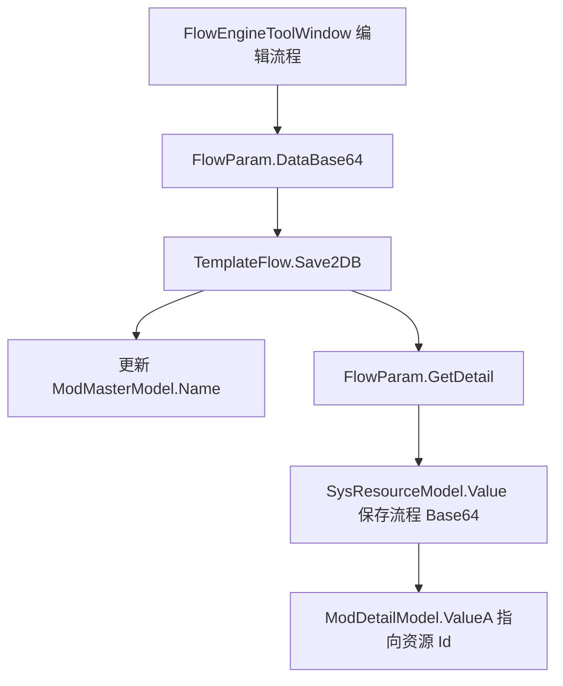
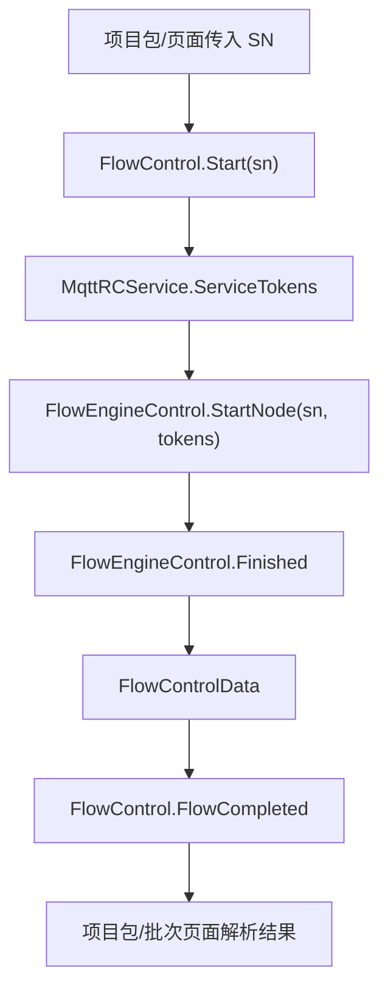

# Engine 模板与 Flow 链路

这页说明模板系统和流程引擎如何在当前仓库中协作。接手流程编辑、算法模板、Flow 节点、流程导入导出时，先读这页。

## 一句话

模板负责保存业务参数和流程定义，`FlowEngineLib` 负责执行节点；ColorVision 的真实业务流程是 `TemplateControl`、`TemplateFlow`、节点配置器、`FlowControl` 和项目包结果处理共同完成的。

## 关键源码

| 源码 | 作用 |
| --- | --- |
| `Templates/TemplateContorl.cs` | 模板初始化，扫描 `IITemplateLoad` |
| `Templates/TemplateModel.cs` | 模板列表项模型 |
| `Templates/TemplateEditorWindow.xaml.cs` | 模板管理和编辑窗口 |
| `Templates/Flow/TemplateFlow.cs` | Flow 模板加载、保存、导入导出 |
| `Templates/Flow/FlowControl.cs` | Engine 侧 Flow 执行包装 |
| `Templates/Flow/DisplayFlow.xaml.cs` | 流程显示和执行页面 |
| `Templates/Flow/NodeConfigurator/` | Flow 节点绑定设备、模板、参数的配置器 |
| `Engine/FlowEngineLib/` | 节点画布、节点执行、开始/结束节点 |

## 模板初始化

`TemplateInitializer` 是初始化器：

| 属性 | 当前值 |
| --- | --- |
| `Order` | `4` |
| `Dependencies` | `MySqlInitializer` |
| 初始化动作 | UI Dispatcher 上调用 `TemplateControl.GetInstance()` |

`TemplateControl` 构造后会执行 `Init()`，并在 MySQL 连接变化时重新执行。

`Init()` 的核心动作是：

1. 检查 MySQL 是否连接。
2. 遍历 `Application.Current.GetAssemblies()`。
3. 找出实现 `IITemplateLoad` 且非抽象的类型。
4. `Activator.CreateInstance(type)`。
5. 调用 `Load()`。

所以新增模板后，如果 `Load()` 不执行，先检查程序集是否被加载、类型是否实现 `IITemplateLoad`、构造函数是否可无参创建。

## 模板模型

`TemplateModel<T>` 是模板列表中的单项模型，`T : ParamBase`。

它把 `Value.Name` 暴露为 `Key`，并提供：

- 重命名命令。
- 复制名称命令。
- 右键菜单。
- `GetValue()` 返回参数对象。

模板页面显示的是 `TemplateModel<T>`，真正保存的业务参数在 `Value` 里。

## TemplateControl 的注册字典

`TemplateControl.ITemplateNames` 是当前模板入口字典：

```text
Dictionary<string, ITemplate>
```

模板实现通过 `AddITemplateInstance(code, template)` 注册。`ExitsTemplateName()` 和 `FindDuplicateTemplate()` 会遍历所有模板入口的模板名，用来检查名称冲突。

这意味着模板名冲突不是只在一个模板类型内判断；跨模板类型也可能影响导入、复制和创建。

## Flow 模板保存位置

`TemplateFlow` 的关键常量和存储关系：

| 项 | 当前值或位置 |
| --- | --- |
| `Code` | `flow` |
| `Title` | 流程模板管理 |
| `TemplateParams` | `TemplateFlow.Params` |
| 主表 | `ModMasterModel`，`Pid == 11` |
| 明细表 | `ModDetailModel` |
| 流程数据 | `SysResourceModel.Value` 中的 Base64 STN |
| 导出格式 | `.cvflow` 流程包或 `.stn`/`.zip` |

`Load()` 会读取 `ModMasterModel(Pid=11)`，再读对应 `ModDetailModel`，并把 `SysResourceModel.Value` 填入明细模型。

## Flow 保存链



保存时要特别注意：

- `flowParam.ModMaster.Name` 会被同步成模板名。
- 流程内容主要在 `DataBase64`。
- 明细第一项 `ValueA` 通常指向承载流程内容的 `SysResourceModel`。
- 如果旧资源不存在，会新建 `SysResourceModel`。

## Flow 导入导出

`TemplateFlow.Export()` 支持两类场景：

- 单个流程：导出 `.cvflow` 流程包，或写出 STN 数据。
- 多选流程：导出 zip。

`.cvflow` 不是简单 STN 文件。它会通过 `FlowPackageHelper` 收集关联模板，导入时也会自动导入关联模板，并在名称变化时替换 STN 中的模板引用。

排查流程导入后执行失败时，要检查：

1. `.cvflow` 包是否包含关联模板 manifest。
2. 关联模板是否成功导入。
3. 模板名是否被重命名。
4. STN 中引用是否被替换。

## Flow 执行链

`Templates/Flow/FlowControl.cs` 是 Engine 对 `FlowEngineControl` 的包装：



`FlowControlData` 会把底层 `StatusTypeEnum` 映射成 `FlowStatus`，包含：

- `StartNodeName`
- `SerialNumber`
- `EventName`
- `Status`
- `Params`
- `TotalTime`

项目包通常不是直接监听 `FlowEngineLib`，而是通过 Engine 的 `FlowControl.FlowCompleted` 或上层页面继续处理。

## 节点配置器

`Templates/Flow/NodeConfigurator/` 是 Flow 节点和 Engine 业务绑定的关键目录。

当前包含：

- `NodeConfiguratorRegistry`
- `NodeConfiguratorBase`
- `NodeConfiguratorContext`
- `NodeConfiguratorAttribute`
- `DeviceNodeConfigurators`
- `CameraNodeConfigurators`
- `AlgorithmNodeConfigurators`
- `POINodeConfigurators`
- `SpectrumNodeConfigurators`
- `OLEDNodeConfigurators`

新增节点时不要只改 `FlowEngineLib`。如果节点需要绑定设备、模板或参数，必须补节点配置器，否则编辑器里看得到节点，但业务参数可能无法正确写入或恢复。

## 常见模板接入点

| 模板/入口 | Flow 交接点 |
| --- | --- |
| [FocusPoints 关注点模板](../algorithms/templates/focus-points-template.md) | `AlgorithmNode` 的 `发光区检测` 映射到 `operatorCode = "FocusPoints"`，节点配置器绑定 `TemplateFocusPoints`。 |
| [ImageCropping 图像裁剪模板](../algorithms/templates/image-cropping-template.md) | `AlgorithmType.图像裁剪` 与 `OLEDImageCroppingNode` 都会绑定 `TemplateImageCropping`，双输入节点还依赖上游 ROI `MasterId`。 |
| [模板菜单入口](../algorithms/templates/template-menu-entries.md) | 菜单只负责打开模板编辑窗口，Flow 节点能否选择模板仍取决于 `NodeConfigurator`。 |
| [DataLoad 数据加载模板](../algorithms/templates/data-load-template.md) | DataLoad 节点有模板路径和显式参数路径两种输入方式。 |

## 新增算法模板的落点

| 任务 | 位置 |
| --- | --- |
| 新增参数类 | 对应模板目录，继承 `ParamBase` 或 JSON 模板参数基类 |
| 新增模板入口 | 实现 `ITemplate<T>` / `ITemplateJson<T>` |
| 模板初始化加载 | 实现 `IITemplateLoad.Load()` 并注册到 `TemplateControl` |
| 模板编辑 UI | `EditTemplateJson` 或专用 UserControl |
| Flow 节点绑定 | `Templates/Flow/NodeConfigurator/` |
| 算法结果展示 | `ViewHandle*.cs`、`IResultHandleBase` |
| 数据读取 | `Dao` 或模板目录下 `*Dao.cs` |

## 排查清单

| 现象 | 优先检查 |
| --- | --- |
| 模板列表为空 | MySQL 连接、`TemplateInitializer`、`IITemplateLoad.Load()` |
| 新模板不出现 | 程序集是否加载、是否无参构造、是否注册到 `TemplateControl` |
| Flow 能打开但保存失败 | `FlowParam.DataBase64`、`ModMasterModel`、`ModDetailModel.ValueA` |
| Flow 导入后模板找不到 | `.cvflow` manifest、模板名称映射、`TemplateControl.ITemplateNames` |
| 节点参数不恢复 | `NodeConfigurator` 是否覆盖该节点类型 |
| Flow 完成但项目没结果 | `FlowCompleted` 后项目包解析逻辑、模板名和结果类型 |

## 不要这样改

- 不要把流程执行逻辑全部写进 `FlowEngineLib`，业务绑定应在 Engine 的模板和配置器层。
- 不要绕过 `TemplateFlow.Save2DB()` 直接改数据库字段。
- 不要只复制 STN 文件，不处理关联模板。
- 不要在通用模板里写客户项目专用判定。
