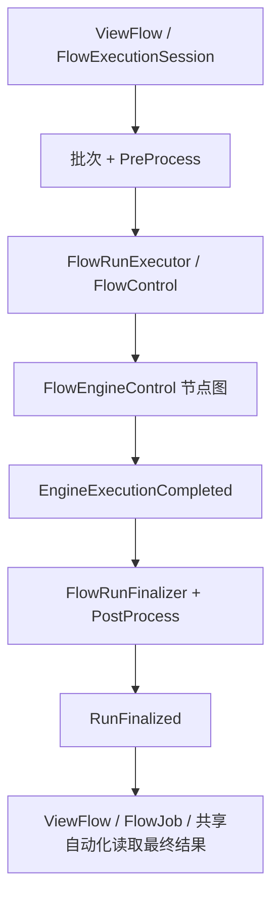

# Engine 模板与 Flow 链路

模板保存业务参数和流程定义，`FlowEngineLib` 执行节点。真正的业务流程由 `TemplateControl`、`TemplateFlow`、Flow 属性编辑器、`FlowExecutionSession` 和最终化链共同完成。

## 先查什么

| 现象 | 第一检查点 |
| --- | --- |
| 模板列表为空 | MySQL 连接、`TemplateInitializer`、`IITemplateLoad.Load()` |
| 新模板不出现 | 程序集是否加载、是否无参构造、是否注册到 `TemplateControl` |
| Flow 能打开但保存失败 | `FlowParam.DataBase64`、`ModMasterModel`、`ModDetailModel.ValueA` |
| Flow 导入后模板找不到 | `.cvflow` manifest、模板名称映射、`TemplateControl.ITemplateNames` |
| 节点模板选择器不出现 | `FlowNodePropertyEditorAttribute` / `PropertyEditorTypeAttribute`；类型级补充面板再查 `NodeConfiguratorRegistry` |
| 共享执行链引擎完成但没最终结果 | `FlowRunFinalizer`、`RunFinalized`、后处理策略、模板名和结果类型 |

## 关键对象

| 对象 | 负责 |
| --- | --- |
| `TemplateInitializer` | 在 MySQL 后初始化模板系统 |
| `TemplateControl` | 扫描 `IITemplateLoad`，维护模板入口字典 |
| `TemplateModel<T>` | 模板列表项，包装真正的参数对象 |
| `TemplateFlow` | Flow 模板目录、数据库持久化和 `.cvflow` 包接入 |
| `FlowExecutionSession` | UI 批次、前处理、节点执行、诊断和最终化编排 |
| `FlowControl` | Engine 侧节点图执行包装和 engine completion 事件 |
| `FlowEngineControl` | FlowEngineLib 的底层执行控制 |
| `FlowRunFinalizer` | engine completion 后执行后处理并解析最终业务结果 |
| `NodeConfiguratorRegistry` | 扫描节点类型级补充配置器；普通属性不依赖它 |

## 模板初始化

`TemplateInitializer` 的顺序是 `Order = 4`，依赖 `MySqlInitializer`。`TemplateControl.Init()` 会：

1. 检查 MySQL 是否连接。
2. 调用 `AssemblyHandler.GetInstance().LoadImplementations<IITemplateLoad>()` 读取已缓存程序集。
3. 筛选可实例化且有无参构造的 `IITemplateLoad` 类型。
4. 创建实例并调用 `Load()`。

新增模板后如果没有加载，先查这四步，不要先改菜单。

## Flow 保存和导入

`TemplateFlow` 的关键点：

| 项 | 当前事实 |
| --- | --- |
| `Code` | `flow` |
| 主表 | `ModMasterModel`，`Pid == 11` |
| 明细表 | `ModDetailModel` |
| 流程内容 | `SysResourceModel.Value` 中的 Base64 STN |
| 本地 `.stn` | 独立 `ViewFlow` 打开和保存，不作为当前 `TemplateFlow.ImportFile(...)` 的可靠模板导入路径 |
| `.cvflow` | `FlowPackageHelper` 导入导出单流程及关联模板；多选导出仍是 zip 内多个 `.stn` |

`.cvflow` 不是单个 STN 文件，它会通过 `FlowPackageHelper` 带上关联模板。导入失败时同时看包 manifest、关联模板导入、模板重命名和 STN 引用替换。

## 执行链路

```mermaid
flowchart TD
  View["ViewFlow / FlowExecutionSession"] --> Pre["批次 + PreProcess"]
  Pre --> Run["FlowRunExecutor / FlowControl"]
  Run --> Engine["FlowEngineControl 节点图"]
  Engine --> Completed["EngineExecutionCompleted"]
  Completed --> Finalizer["FlowRunFinalizer + PostProcess"]
  Finalizer --> Final["RunFinalized"]
  Final --> SharedResult["ViewFlow / FlowJob / 共享自动化读取最终结果"]
```

`FlowControl.FlowCompleted` / `EngineExecutionCompleted` 只表示节点图结束，后处理可能仍在运行。`ViewFlow`、`FlowJob` 和共享自动化应等待 `RunFinalized`，或调用 `RunFlowAndWaitForFinalizationAsync()` 取得最终结果。部分现有项目窗口仍直接创建 `FlowControl`，并在 `FlowCompleted` 后调用项目自己的 `FinalizeCurrentFlowRunAsync` 或 `Processing`；这是尚未迁入共享最终化链的兼容路径。

## 节点属性 UI

新增 Flow 节点时不要只改执行类。普通设备/模板字段优先用 `FlowNodePropertyEditorAttribute` 或 `PropertyEditorTypeAttribute` 接入 `FlowPropertyEditorRegistry`；只有多模板族、随算法类型变化等节点级补充面板才放进 `Engine/ColorVision.Engine/FlowProcessing/Editor/NodeConfiguration/`。当前真实分组文件是 `CameraNodeConfigurators.cs`、`AlgorithmNodeConfigurators.cs`、`POINodeConfigurators.cs` 和 `OLEDNodeConfigurators.cs`。

## 新增算法模板

| 任务 | 位置 |
| --- | --- |
| 参数类 | 对应模板目录，继承 `ParamBase` 或 JSON 参数基类 |
| 模板入口 | `ITemplate<T>` 或 `ITemplateJson<T>` |
| 初始化加载 | `IITemplateLoad.Load()` 注册到 `TemplateControl` |
| 编辑 UI | `EditTemplateJson` 或专用 UserControl |
| Flow 绑定 | 普通字段走属性编辑器注册；补充面板走 `Engine/ColorVision.Engine/FlowProcessing/Editor/NodeConfiguration/` |
| 结果展示 | `ViewHandle*.cs`、`IResultHandleBase` |
| 明细读取 | DAO 或模板目录下 `*Dao.cs` |

## 不要这样改

- 不要把业务绑定全部写进 `FlowEngineLib`。
- 不要绕过 `TemplateFlow.Save2DB()` 直接改数据库字段。
- 不要只复制 STN 文件而不处理关联模板。
- 不要在通用模板里写客户项目专用判定。
