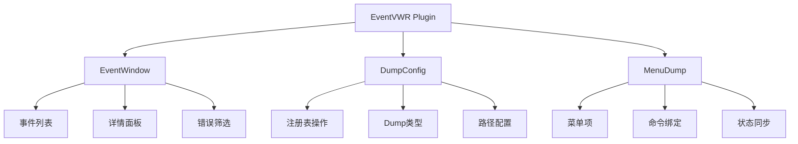

# EventVWR Plugin - 事件查看器与Dump管理

## 目录

1. [概述](#概述)
2. [主要功能](#主要功能)
3. [架构设计](#架构设计)
4. [使用指南](#使用指南)
5. [API参考](#api参考)
6. [配置说明](#配置说明)
7. [故障排除](#故障排除)
8. [最佳实践](#最佳实践)
9. [版本历史](#版本历史)

## 概述

**EventVWR** 是 ColorVision 的系统事件查看与应用程序崩溃转储(Dump)管理插件，提供Windows事件日志查看和应用程序Dump文件配置功能，帮助开发者和运维人员快速诊断系统问题和应用崩溃。

### 基本信息

- **版本**: 1.0.0
- **目标框架**: .NET 8.0 / .NET 10.0 Windows
- **主要功能**: Windows事件日志查看、Dump文件管理
- **依赖**: ColorVision.UI, ColorVision.Common
- **权限要求**: 配置Dump需要管理员权限

## 主要功能

### 1. 事件查看器

- **Windows事件日志查看** - 查看系统应用程序事件日志
- **错误事件筛选** - 自动筛选并显示错误级别的事件
- **事件详情展示** - 点击事件查看详细错误信息和堆栈跟踪
- **时间倒序排列** - 最新发生的事件显示在最前面
- **现代化界面** - 采用Material Design风格的用户界面

### 2. Dump文件管理

- **Dump类型配置** - 支持自定义、小型、完全三种Dump类型
- **注册表配置** - 通过Windows注册表配置LocalDumps
- **Dump文件夹设置** - 自定义Dump文件保存路径
- **Dump数量限制** - 设置保留的Dump文件数量
- **自定义Dump标志** - 支持MinidumpType标志组合

### 3. 菜单集成

- **帮助菜单集成** - 在帮助菜单下添加Dump文件设置子菜单
- **动态菜单项** - 根据当前配置动态显示选中状态
- **快捷操作** - 一键保存Dump、清空Dump配置

## 架构设计



### 核心组件

```
EventVWR/
├── EventWindow.xaml(.cs)      # 事件查看器窗口
├── EventVWRPlugins.cs         # 插件入口
├── ExportEventWindow.cs       # 事件导出
└── Dump/
    ├── DumpConfig.cs          # Dump配置管理
    ├── DumpType.cs            # Dump类型枚举
    ├── MinidumpType.cs        # Minidump标志枚举
    ├── MenuDump.cs            # Dump菜单项
    └── DumpFileCollector.cs   # Dump文件收集器
```

## 使用指南

### 查看Windows事件日志

1. 启动 ColorVision 主程序
2. 通过菜单访问事件查看器（如已配置菜单项）
3. 在事件列表中查看所有错误级别的事件
4. 点击事件查看详细信息

界面说明：
- **左侧列表** - 显示所有错误级别的事件，包含时间和来源
- **右侧详情** - 显示选中事件的详细错误信息
- **状态栏** - 显示当前状态

### 配置Dump文件

```csharp
// 获取Dump配置
var dumpConfig = new DumpConfig();

// 设置Dump类型
dumpConfig.DumpType = DumpType.Mini;

// 设置Dump文件夹
dumpConfig.DumpFolder = @"C:\CrashDumps";

// 设置Dump数量限制
dumpConfig.DumpCount = 10;

// 应用配置（需要管理员权限）
dumpConfig.SetDump();
```

### Dump类型说明

| 类型 | 值 | 说明 |
|------|-----|------|
| Custom | 0 | 自定义转储，使用CustomDumpFlags指定详细选项 |
| Mini | 1 | 小型转储，包含基本信息，文件较小 |
| Full | 2 | 完全转储，包含完整内存信息，文件较大 |

### MinidumpType标志

参考 [Microsoft文档](https://learn.microsoft.com/en-us/windows/win32/api/minidumpapiset/ne-minidumpapiset-minidump_type)

常用标志：

| 标志 | 值 | 说明 |
|------|-----|------|
| MiniDumpNormal | 0x00000000 | 正常小型转储 |
| MiniDumpWithDataSegs | 0x00000001 | 包含数据段 |
| MiniDumpWithFullMemory | 0x00000002 | 包含完整内存 |
| MiniDumpWithHandleData | 0x00000004 | 包含句柄数据 |
| MiniDumpWithProcessThreadData | 0x00000100 | 包含进程线程数据 |
| MiniDumpWithThreadInfo | 0x00001000 | 包含线程信息 |

## API参考

### EventWindow

事件查看器主窗口。

```csharp
public partial class EventWindow : Window
{
    // 事件日志条目集合
    public ObservableCollection<EventLogEntry> logEntries { get; set; }
    
    // 构造函数
    public EventWindow();
    
    // 窗口初始化时加载事件日志
    private void Window_Initialized(object sender, EventArgs e);
    
    // 选择变更时显示事件详情
    private void ListViewEvent_SelectionChanged(object sender, SelectionChangedEventArgs e);
}
```

### DumpConfig

Dump文件配置类。

```csharp
public class DumpConfig : IConfig
{
    // 默认Dump文件夹路径
    public string DumpFolder { get; set; } = 
        Path.Combine(Environment.GetFolderPath(Environment.SpecialFolder.UserProfile), 
        "AppData", "Local", "CrashDumps");
    
    // Dump类型
    public DumpType DumpType { get; set; } = DumpType.Mini;
    
    // Dump文件数量限制
    public int DumpCount { get; set; } = 10;
    
    // 自定义Dump标志
    public MinidumpType CustomDumpFlags { get; set; } = MinidumpType.MiniDumpNormal;
    
    // 应用配置到注册表（需要管理员权限）
    public void SetDump();
    
    // 保存当前Dump
    public void SaveDump();
    
    // 清除Dump配置
    public void ClearDump();
}
```

### DumpType

Dump类型枚举。

```csharp
public enum DumpType
{
    Custom = 0,  // 自定义转储
    Mini = 1,    // 小型转储
    Full = 2     // 完全转储
}
```

### EventVWRPlugins

插件入口类。

```csharp
public class EventVWRPlugins : IPluginBase
{
    public override string Header => "事件插件";
    public override string Description => "增强的异常管理,提供事件插件和Dump设置";
}
```

## 配置说明

### 注册表路径

Dump配置存储在以下注册表路径：

```
HKEY_LOCAL_MACHINE\SOFTWARE\Microsoft\Windows\Windows Error Reporting\LocalDumps\{AppName}.exe
```

### 配置项

| 配置项 | 类型 | 说明 |
|--------|------|------|
| DumpFolder | string (ExpandString) | Dump文件保存文件夹路径 |
| DumpCount | DWORD | 保留的Dump文件数量 |
| DumpType | DWORD | Dump类型 (0=Custom, 1=Mini, 2=Full) |
| CustomDumpFlags | DWORD | 自定义Dump标志（当DumpType=0时使用） |

### 示例配置

```powershell
# 使用PowerShell配置Dump
$appName = "ColorVision.exe"
$keyPath = "HKLM:\SOFTWARE\Microsoft\Windows\Windows Error Reporting\LocalDumps\$appName"

# 创建注册表项
New-Item -Path $keyPath -Force

# 设置Dump文件夹
Set-ItemProperty -Path $keyPath -Name "DumpFolder" -Value "C:\CrashDumps" -Type ExpandString

# 设置Dump类型为Mini
Set-ItemProperty -Path $keyPath -Name "DumpType" -Value 1 -Type DWord

# 设置Dump数量限制
Set-ItemProperty -Path $keyPath -Name "DumpCount" -Value 10 -Type DWord
```

## 故障排除

### 问题1: 无法配置Dump（权限不足）

**症状**: 点击设置Dump时提示"操作需要使用管理员权限"

**解决方案**:
1. 以管理员身份运行 ColorVision
2. 或右键点击应用程序选择"以管理员身份运行"

### 问题2: 事件日志为空

**症状**: 事件查看器中不显示任何事件

**可能原因**:
- 应用程序事件日志为空
- 没有错误级别的事件
- 权限不足

**解决方案**:
1. 使用Windows事件查看器验证日志是否存在
2. 检查应用程序是否有写入事件日志的权限
3. 以管理员身份运行

### 问题3: Dump文件未生成

**症状**: 应用程序崩溃后未生成Dump文件

**检查清单**:
- [ ] Dump配置已正确应用
- [ ] 应用程序名称与配置匹配
- [ ] Dump文件夹存在且有写入权限
- [ ] Windows Error Reporting服务正常运行

## 最佳实践

### 1. Dump文件管理

- **定期清理** - 定期清理旧的Dump文件以释放磁盘空间
- **合理选择类型** - 使用Mini类型进行日常调试，Full类型进行深度分析
- **路径设置** - 将Dump文件夹设置在非系统盘以避免系统盘空间不足

```csharp
// 定期清理示例
public void CleanOldDumps(string dumpFolder, int keepDays)
{
    var cutoffDate = DateTime.Now.AddDays(-keepDays);
    var dumpFiles = Directory.GetFiles(dumpFolder, "*.dmp");
    
    foreach (var file in dumpFiles)
    {
        var fileInfo = new FileInfo(file);
        if (fileInfo.CreationTime < cutoffDate)
        {
            File.Delete(file);
        }
    }
}
```

### 2. 事件日志监控

- **关注重复错误** - 关注重复出现的错误事件
- **时间关联** - 结合时间戳定位问题发生时机
- **来源分析** - 查看事件来源确定问题组件

### 3. 权限处理

```csharp
// 检查管理员权限
if (!Tool.IsAdministrator())
{
    MessageBox.Show(
        Application.Current.GetActiveWindow(),
        "操作需要使用管理员权限",
        "权限不足",
        MessageBoxButton.OK,
        MessageBoxImage.Warning);
    return;
}
```

## 版本历史

### v1.0.0（2026-02）

**初始版本**:
- ✅ Windows事件日志查看功能
- ✅ Dump文件配置管理
- ✅ 菜单集成
- ✅ 现代化UI界面

---

*文档版本: 1.0*  
*最后更新: 2026-04-02*

## 相关资源

- [Windows Error Reporting 文档](https://docs.microsoft.com/en-us/windows/win32/wer/collecting-user-mode-dumps)
- [MinidumpType 枚举文档](https://learn.microsoft.com/en-us/windows/win32/api/minidumpapiset/ne-minidumpapiset-minidump_type)
- [源代码](../../../../Plugins/EventVWR/)
- [CHANGELOG](../../../../Plugins/EventVWR/CHANGELOG.md)
