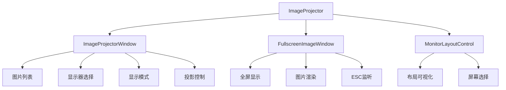

# ImageProjector Plugin - 图片投影工具

## 目录

1. [概述](#概述)
2. [主要功能](#主要功能)
3. [架构设计](#架构设计)
4. [使用指南](#使用指南)
5. [API参考](#api参考)
6. [配置说明](#配置说明)
7. [故障排除](#故障排除)
8. [最佳实践](#最佳实践)
9. [版本历史](#版本历史)

## 概述

**ImageProjector** 是 ColorVision 的图片投影工具插件，支持将图片全屏投影到指定显示器上。适用于测试图案展示、色彩校准、多屏演示等场景。

### 基本信息

- **版本**: 1.0.0
- **目标框架**: .NET 8.0 / .NET 10.0 Windows
- **主要功能**: 图片投影、多显示器支持、显示模式切换
- **依赖**: ColorVision.UI, ColorVision.Common
- **图片格式**: TIF, PNG, JPG, BMP

## 主要功能

### 1. 多显示器支持

- **显示器选择** - 可视化显示器布局，支持选择任意显示器
- **主/副显示器** - 自动识别主显示器和副显示器
- **分辨率显示** - 显示各显示器的分辨率信息

### 2. 图片管理

- **多图片管理** - 添加、删除、上移、下移图片列表
- **图片预览** - 主界面实时预览选中图片
- **批量添加** - 支持多选文件批量添加
- **重复检测** - 自动检测并跳过重复图片

### 3. 投影控制

- **投影中切换** - 上一张/下一张按钮快速切换投影图片
- **显示模式** - 适应、拉伸、居中、填充四种显示模式
- **ESC快速关闭** - 按 ESC 键快速关闭投影窗口

### 4. 配置持久化

- **图片列表** - 自动保存图片列表
- **选中项** - 记住上次选中的图片
- **显示器** - 记住上次使用的显示器
- **显示模式** - 记住上次使用的显示模式

## 架构设计



### 核心组件

```
ImageProjector/
├── ImageProjectorWindow.xaml(.cs)   # 主窗口
├── FullscreenImageWindow.xaml(.cs)  # 全屏投影窗口
├── ImageProjectorConfig.cs          # 配置类
├── ImageProjectorItem.cs            # 图片项模型
├── MenuImageProjector.cs            # 菜单项
├── MonitorLayoutControl.cs          # 显示器布局控件
└── manifest.json                    # 插件清单
```

## 使用指南

### 基本使用流程

1. **添加图片**
   - 点击"添加"按钮选择图片文件（支持多选）
   - 支持格式：TIF, PNG, JPG, BMP

2. **选择显示器**
   - 在可视化布局中点击选择目标显示器
   - 蓝色边框表示当前选中显示器

3. **选择显示模式**
   - **适应** - 保持宽高比，完整显示图片（默认）
   - **拉伸** - 拉伸填满整个屏幕，可能变形
   - **居中** - 原始尺寸居中显示，不缩放
   - **填充** - 保持宽高比填满屏幕，可能裁剪

4. **开始投影**
   - 点击"投影"按钮开始全屏投影
   - 投影窗口将显示在选中的显示器上

5. **投影中切换**
   - 使用"上一张"/"下一张"按钮切换图片
   - 无需停止投影即可实时切换

6. **停止投影**
   - 点击"停止投影"按钮关闭
   - 或按 ESC 键快速关闭

### 快捷键

| 快捷键 | 功能 |
|--------|------|
| Delete | 删除选中的图片 |
| Ctrl + A | 全选图片 |
| ESC | 关闭投影窗口 |

## API参考

### ImageProjectorWindow

主窗口类，提供图片管理和投影控制界面。

```csharp
public partial class ImageProjectorWindow : Window, IDisposable
{
    // 全屏投影窗口实例
    private FullscreenImageWindow? _fullscreenWindow;
    
    // 当前显示的图片
    private BitmapImage? _currentImage;
    
    // 选中的显示器
    private Screen? _selectedScreen;
    
    // 构造函数
    public ImageProjectorWindow();
    
    // 添加图片
    private void AddImage_Click(object sender, RoutedEventArgs e);
    
    // 删除图片
    private void RemoveSelectedImages();
    
    // 上移/下移图片
    private void MoveUp_Click(object sender, RoutedEventArgs e);
    private void MoveDown_Click(object sender, RoutedEventArgs e);
    
    // 开始投影
    private void Project_Click(object sender, RoutedEventArgs e);
    
    // 停止投影
    private void Stop_Click(object sender, RoutedEventArgs e);
    
    // 上一张/下一张
    private void Previous_Click(object sender, RoutedEventArgs e);
    private void Next_Click(object sender, RoutedEventArgs e);
    
    // 释放资源
    public void Dispose();
}
```

### ImageProjectorConfig

配置类，存储图片投影器的设置。

```csharp
public class ImageProjectorConfig : ViewModelBase, IConfig
{
    public static ImageProjectorConfig Instance => 
        ConfigService.Instance.GetRequiredService<ImageProjectorConfig>();
    
    // 图片列表
    public ObservableCollection<ImageProjectorItem> ImageItems { get; set; }
    
    // 上次选中的索引
    public int LastSelectedIndex { get; set; }
    
    // 上次选中的显示器
    public string LastSelectedMonitor { get; set; }
    
    // 图片显示模式
    public ImageStretchMode StretchMode { get; set; }
    
    // 转换显示模式到 WPF Stretch
    public static Stretch ToStretch(ImageStretchMode mode);
}
```

### ImageProjectorItem

图片项模型。

```csharp
public class ImageProjectorItem : ViewModelBase
{
    // 文件路径
    public string FilePath { get; set; }
    
    // 文件名（自动从路径提取）
    public string FileName { get; }
    
    // 构造函数
    public ImageProjectorItem(string filePath);
}
```

### ImageStretchMode

图片显示模式枚举。

```csharp
public enum ImageStretchMode
{
    [Description("适应")]
    Uniform,        // 保持宽高比，完整显示图片
    
    [Description("拉伸")]
    Fill,           // 拉伸填满整个屏幕，可能变形
    
    [Description("居中")]
    None,           // 原始尺寸居中显示，不缩放
    
    [Description("填充")]
    UniformToFill   // 保持宽高比填满屏幕，可能裁剪
}
```

### MonitorLayoutControl

显示器布局控件，可视化显示多显示器布局。

```csharp
public class MonitorLayoutControl : UserControl
{
    // 当前选中的屏幕
    public Screen? SelectedScreen { get; set; }
    
    // 屏幕选择事件
    public event EventHandler<Screen>? ScreenSelected;
    
    // 刷新显示器列表
    public void RefreshMonitors();
}
```

## 配置说明

### ImageProjectorConfig

| 配置项 | 类型 | 默认值 | 说明 |
|--------|------|--------|------|
| ImageItems | ObservableCollection | 空列表 | 图片文件列表 |
| LastSelectedIndex | int | -1 | 上次选中的图片索引 |
| LastSelectedMonitor | string | 空字符串 | 上次使用的显示器设备名 |
| StretchMode | ImageStretchMode | Uniform | 图片显示模式 |

### 显示模式说明

| 模式 | 说明 | 适用场景 |
|------|------|----------|
| 适应 | 保持宽高比，完整显示图片 | 默认模式，适合大多数场景 |
| 拉伸 | 拉伸填满整个屏幕，可能变形 | 需要填满屏幕时使用 |
| 居中 | 原始尺寸居中显示，不缩放 | 需要原始像素显示时使用 |
| 填充 | 保持宽高比填满屏幕，可能裁剪 | 需要填满屏幕且保持比例时使用 |

## 故障排除

### 问题1: 图片无法加载

**症状**: 选择图片后预览区域不显示图片

**解决方案**:
1. 检查图片文件是否存在
2. 确认图片格式受支持（TIF, PNG, JPG, BMP）
3. 检查图片文件是否损坏
4. 查看日志文件获取详细错误信息

### 问题2: 投影窗口未在目标显示器显示

**症状**: 投影窗口显示在了错误的显示器上

**解决方案**:
1. 确认已正确选择目标显示器
2. 检查显示器连接线是否正常
3. 重新检测显示器（重启插件）
4. 检查显示器配置是否发生变化

### 问题3: 显示模式不生效

**症状**: 切换显示模式后图片显示没有变化

**解决方案**:
1. 确保已重新开始投影（显示模式在投影启动时应用）
2. 检查图片和显示器的宽高比
3. 尝试其他显示模式

### 问题4: 配置未保存

**症状**: 重启后图片列表或设置丢失

**解决方案**:
1. 检查配置保存路径是否有写入权限
2. 查看日志文件中的保存错误
3. 手动检查配置文件是否存在

## 最佳实践

### 1. 图片准备

- 使用与目标显示器分辨率匹配的图片以获得最佳效果
- 提前将测试图片整理到同一目录便于批量添加
- 使用有意义的文件名便于识别

### 2. 显示器选择

- 在投影前确认目标显示器已正确连接和识别
- 使用可视化布局控件确认选择了正确的显示器
- 对于多显示器环境，建议先测试投影位置

### 3. 显示模式选择

| 场景 | 推荐模式 |
|------|----------|
| 色彩校准 | 居中（原始像素） |
| 测试图案展示 | 适应或填充 |
| 全屏演示 | 填充 |
| 特殊比例图片 | 适应 |

### 4. 快捷键使用

- 使用 Delete 键快速删除不需要的图片
- 使用 Ctrl+A 全选后批量删除
- 使用 ESC 键快速关闭投影

## 版本历史

### v1.0.0（2026-02）

**初始版本**:
- ✅ 多显示器选择支持
- ✅ 图片列表管理
- ✅ 四种显示模式
- ✅ 投影中切换图片
- ✅ 配置持久化
- ✅ 多语言支持

---

*文档版本: 1.0*  
*最后更新: 2026-04-02*

## 相关资源

- [源代码](../../../../Plugins/ImageProjector/)
- [CHANGELOG](../../../../Plugins/ImageProjector/CHANGELOG.md)
- [ColorVision 插件开发指南](../../../02-developer-guide/plugin-development/overview.md)
