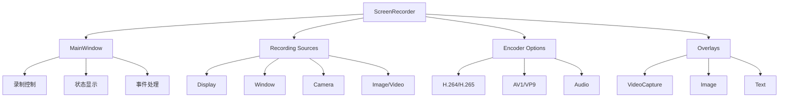

# ScreenRecorder Plugin - 屏幕录制工具

## 目录

1. [概述](#概述)
2. [主要功能](#主要功能)
3. [架构设计](#架构设计)
4. [使用指南](#使用指南)
5. [API参考](#api参考)
6. [配置说明](#配置说明)
7. [故障排除](#故障排除)
8. [最佳实践](#最佳实践)
9. [版本历史](#版本历史)

## 概述

**ScreenRecorder** 是 ColorVision 的高性能屏幕录制插件，支持多录制源、实时预览和高级编码选项。基于 ScreenRecorderLib 实现，提供专业的屏幕录制能力。

### 基本信息

- **版本**: 1.0.0
- **目标框架**: .NET 8.0 / .NET 10.0 Windows
- **主要功能**: 屏幕录制、多源录制、视频编码
- **依赖**: ColorVision.UI, ColorVision.Common, ScreenRecorderLib
- **最低要求**: ColorVision ≥ 1.3.12.34

## 主要功能

### 1. 多源录制

- **显示器录制** - 录制整个显示器或指定区域
- **窗口录制** - 录制特定应用程序窗口
- **摄像头录制** - 录制摄像头画面
- **图片/视频源** - 将图片或视频作为录制源
- **多源组合** - 同时录制多个源并自定义布局位置

### 2. 编码选项

- **视频编码** - 支持 H.264、H.265、AV1 等现代编码格式
- **音频录制** - 支持系统音频和麦克风音频同时录制
- **质量设置** - 支持质量和码率控制模式
- **硬件加速** - 利用 GPU 硬件编码提升性能

### 3. 高级功能

- **实时预览** - 录制过程中显示帧率和录制时长
- **暂停/恢复** - 录制过程中可暂停和恢复
- **覆盖层** - 支持添加摄像头、视频、图片和文本覆盖层
- **鼠标效果** - 可选显示鼠标指针和点击效果
- **快照功能** - 录制过程中可保存屏幕快照

## 架构设计



### 核心组件

```
ScreenRecorder/
├── MainWindow.xaml(.cs)              # 主窗口
├── App.xaml(.cs)                     # 应用程序
├── Sources/                          # 录制源
│   ├── ICheckableRecordingSource.cs  # 录制源接口
│   ├── CheckableRecordableDisplay.cs # 显示器源
│   ├── CheckableRecordableWindow.cs  # 窗口源
│   ├── CheckableRecordableCamera.cs  # 摄像头源
│   ├── CheckableRecordableImage.cs   # 图片源
│   └── CheckableRecordableVideo.cs   # 视频源
├── OverlayModel.cs                   # 覆盖层模型
├── OverlayTemplateSelector.cs        # 覆盖层模板选择器
├── RecordingSourceTemplateSelector.cs# 录制源模板选择器
└── manifest.json                     # 插件清单
```

## 使用指南

### 基本录制流程

1. **启动插件**
   - 通过主程序菜单或快捷方式启动 ScreenRecorder

2. **选择录制源**
   - 在"Recording Sources"列表中选择要录制的源
   - 可多选显示器、窗口或摄像头
   - 设置每个源的输出位置和尺寸（可选）

3. **配置编码参数**
   - 选择视频编码格式（H.264/H.265/AV1）
   - 设置帧率（建议30-60fps）
   - 选择质量或码率控制模式
   - 配置输出分辨率

4. **配置音频**
   - 启用音频录制
   - 选择麦克风设备
   - 选择系统音频设备

5. **开始录制**
   - 点击"Record"按钮开始
   - 使用"Pause"按钮暂停/恢复
   - 点击"Stop"停止录制

### 多源组合录制

```csharp
// 场景：同时录制主显示器和摄像头
var sources = new List<RecordingSourceBase>();

// 添加主显示器
var mainDisplay = Recorder.GetDisplays().First();
sources.Add(new DisplayRecordingSource(mainDisplay));

// 添加摄像头（画中画）
var camera = Recorder.GetSystemVideoCaptureDevices().First();
sources.Add(new VideoCaptureRecordingSource(camera)
{
    Position = new ScreenPoint(1600, 900),
    OutputSize = new ScreenSize(320, 240)
});

options.SourceOptions.RecordingSources = sources;
recorder.Record(@"C:\Videos\pip_output.mp4");
```

### 添加覆盖层

```csharp
// 添加摄像头覆盖层
var cameraOverlay = new VideoCaptureOverlay
{
    AnchorPoint = Anchor.TopLeft,
    Offset = new ScreenSize(100, 100),
    Size = new ScreenSize(0, 250),
    Device = selectedCamera
};
Overlays.Add(new OverlayModel { Overlay = cameraOverlay, IsEnabled = true });

// 添加文本覆盖层
var textOverlay = new TextOverlay
{
    AnchorPoint = Anchor.BottomRight,
    Text = "Recording...",
    FontSize = 20,
    FontColor = "#FFFFFF",
    Offset = new ScreenSize(10, 10)
};
```

## API参考

### MainWindow

主窗口类，负责录制控制和状态显示。

```csharp
public partial class MainWindow : Window, INotifyPropertyChanged
{
    // 录制源集合
    public ObservableCollection<ICheckableRecordingSource> RecordingSources { get; }
    
    // 覆盖层集合
    public ObservableCollection<OverlayModel> Overlays { get; }
    
    // 录制器实例
    private Recorder _rec;
    
    // 录制选项
    public RecorderOptions RecorderOptions { get; set; }
    
    // 是否正在录制
    public bool IsRecording { get; set; }
    
    // 刷新录制源列表
    private void RefreshCaptureTargetItems();
    
    // 创建选定的录制源
    private List<RecordingSourceBase> CreateSelectedRecordingSources();
    
    // 录制控制
    private void RecordButton_Click(object sender, RoutedEventArgs e);
    private void PauseButton_Click(object sender, RoutedEventArgs e);
    private void StopButton_Click(object sender, RoutedEventArgs e);
}
```

### ICheckableRecordingSource

录制源统一接口。

```csharp
public interface ICheckableRecordingSource
{
    bool IsSelected { get; set; }           // 是否被选中
    bool IsCheckable { get; set; }          // 是否可勾选
    bool IsCustomOutputSizeEnabled { get; set; }    // 启用自定义输出尺寸
    bool IsCustomPositionEnabled { get; set; }      // 启用自定义位置
    bool IsCustomOutputSourceRectEnabled { get; set; }  // 启用自定义源区域
    
    ScreenSize OutputSize { get; set; }     // 输出尺寸
    ScreenPoint Position { get; set; }      // 输出位置
    ScreenRect SourceRect { get; set; }     // 源区域
}
```

### RecorderOptions

录制选项配置类。

```csharp
public class RecorderOptions
{
    // 视频编码选项
    public VideoEncoderOptions VideoEncoderOptions { get; set; }
    
    // 音频选项
    public AudioOptions AudioOptions { get; set; }
    
    // 源选项
    public SourceOptions SourceOptions { get; set; }
    
    // 输出选项
    public OutputOptions OutputOptions { get; set; }
    
    // 鼠标选项
    public MouseOptions MouseOptions { get; set; }
    
    // 日志选项
    public LogOptions LogOptions { get; set; }
}
```

## 配置说明

### 录制选项

| 配置项 | 类型 | 默认值 | 说明 |
|--------|------|--------|------|
| Framerate | int | 60 | 录制帧率 |
| IsAudioEnabled | bool | true | 启用音频录制 |
| Encoder | VideoEncoder | H264 | 视频编码器 |
| Quality | int | 70 | 编码质量 (0-100) |
| Bitrate | int | 8000 | 码率 (kbps) |
| IsMousePointerEnabled | bool | true | 显示鼠标指针 |
| IsMouseClicksDetected | bool | false | 显示鼠标点击效果 |

### 输出选项

| 配置项 | 类型 | 默认值 | 说明 |
|--------|------|--------|------|
| RecorderMode | RecorderMode | Video | 录制模式 |
| OutputFileFormat | string | ".mp4" | 输出文件格式 |
| SourceRect | ScreenRect | null | 源区域（null=全屏） |
| OutputFrameSize | ScreenSize | null | 输出尺寸（null=原始） |

### 音频选项

| 配置项 | 类型 | 默认值 | 说明 |
|--------|------|--------|------|
| IsInputDeviceEnabled | bool | false | 启用麦克风 |
| IsOutputDeviceEnabled | bool | false | 启用系统音频 |
| AudioInputDevice | string | null | 麦克风设备ID |
| AudioOutputDevice | string | null | 音频输出设备ID |

### 编码器支持

| 编码器 | Windows 10 | Windows 11 | 硬件加速 |
|--------|-----------|-----------|----------|
| H.264 | ✓ | ✓ | ✓ |
| H.265 | ✓ | ✓ | ✓ |
| AV1 | 部分支持 | ✓ | 需GPU支持 |
| VP9 | ✓ | ✓ | ✓ |

## 故障排除

### 问题1: 录制失败

**症状**: 点击录制后无法开始或立即失败

**解决方案**:
1. 检查磁盘空间是否充足
2. 验证输出路径是否有写入权限
3. 查看日志文件中的错误信息
4. 确认录制源是否有效（窗口未关闭）

### 问题2: 音频无声音

**症状**: 录制的视频没有声音

**解决方案**:
1. 检查"IsAudioEnabled"是否为 true
2. 验证音频设备是否正确选择
3. 确认系统音频设备是否正常工作
4. 检查音频驱动是否正常

### 问题3: 帧率低

**症状**: 录制画面卡顿，帧率不稳定

**解决方案**:
1. 降低录制分辨率
2. 使用硬件编码器
3. 减少录制源数量
4. 关闭不必要的覆盖层
5. 降低帧率设置

### 问题4: 编码错误

**症状**: 提示编码器错误或无法创建编码器

**解决方案**:
1. 确认系统支持所选编码器
2. 尝试使用不同的编码格式
3. 检查 GPU 驱动是否最新
4. 降低码率或质量设置

## 最佳实践

### 推荐配置

#### 高质量录制
```
分辨率: 1920x1080
帧率: 60fps
编码器: H.265 (HEVC)
质量: 85
码率模式: Quality
```

#### 平衡模式
```
分辨率: 1920x1080
帧率: 30fps
编码器: H.264
质量: 70
码率模式: Quality
```

#### 低资源模式
```
分辨率: 1280x720
帧率: 30fps
编码器: H.264
质量: 60
码率模式: UnconstrainedVBR
```

### 优化技巧

1. **使用硬件加速**
   - 启用 GPU 硬件编码
   - 优先选择支持的现代编码器

2. **合理选择帧率**
   - 游戏录制: 60fps
   - 教程录制: 30fps
   - 演示录制: 24-30fps

3. **控制录制源数量**
   - 避免同时录制过多源
   - 优化覆盖层使用

4. **定期清理**
   - 及时删除测试录制文件
   - 清理日志文件

## 版本历史

### v1.0.0（2026-02）

**初始版本**:
- ✅ 多源录制支持
- ✅ H.264/H.265/AV1 编码
- ✅ 音频录制
- ✅ 覆盖层支持
- ✅ 实时预览

---

*文档版本: 1.0*  
*最后更新: 2026-04-02*

## 相关资源

- [ScreenRecorderLib 文档](https://github.com/sskodje/ScreenRecorderLib)
- [源代码](../../../../Plugins/ScreenRecorder/)
- [CHANGELOG](../../../../Plugins/ScreenRecorder/CHANGELOG.md)
