# ColorVision.Common

## 目录
1. [概述](#概述)
2. [核心功能](#核心功能)
3. [架构组件](#架构组件)
4. [接口定义](#接口定义)
5. [MVVM支持](#mvvm支持)
6. [命令模式](#命令模式)
7. [使用示例](#使用示例)

## 概述

**ColorVision.Common** 是整个 ColorVision 系统的基础组件库，提供了通用的框架基础设施。它定义了系统的核心抽象接口、MVVM 架构支持、命令模式实现以及各种通用工具类。

通用框架中的基础封装包括 MVVM、ActionCommand、RelayCommand。提供对于整体框架的接口封装，比如 IConfig、IConfigSetting、IMenuItem、IWizardStep、IFileProcessor、ISearch、IInitializer 等。

### 基本信息

- **版本**: 1.5.1.2
- **目标框架**: .NET 8.0 / .NET 10.0 Windows
- **技术栈**: WPF, Windows Forms
- **包类型**: NuGet 包支持（含符号包）

## 核心功能

### 1. MVVM 架构支持
- 提供完整的 MVVM 模式基础设施
- ViewModelBase 基类实现
- 属性变更通知机制
- 命令绑定支持

### 2. 命令模式实现
- ActionCommand 实现
- RelayCommand 支持
- 参数化命令处理

### 3. 接口定义系统
- 配置管理接口 (IConfig, IConfigSettingProvider)
- 插件系统接口 (IPlugin, IPluginBase)
- UI 组件接口 (IMenuItem, IMenuItemProvider)
- 文件处理接口 (IFileProcessor)
- 搜索接口 (ISearch, ISearchProvider)
- 初始化接口 (IInitializer)
- 视图接口 (IView, IViewManager)
- 状态栏接口 (IStatusBarProvider)

### 4. 通用工具类
- 文件工具 (FileUtils)
- 图像工具 (ImageUtils)
- 加密工具 (Cryptography)
- 正则工具 (RegexUtils)
- 注册表工具 (RegUtils)
- 窗口工具 (WindowHelpers, WindowUtils)
- 集合工具 (CollectionUtils)
- 字典工具 (DictionaryUtils)

### 5. 原生方法封装
- Windows API 封装 (User32, Dwmapi)
- 剪贴板操作 (Clipboard)
- 文件属性 (FileProperties)
- INI 文件 (IniFiles)
- 键盘操作 (Keyboard)
- 性能信息 (PerformanceInfo)

### 6. 权限管理
- 访问控制 (AccessControl)
- 权限特性 (RequiresPermissionAttribute)
- 权限模式 (PermissionMode)

## 架构组件

```mermaid
graph TD
    A[ColorVision.Common] --> B[MVVM]
    A --> C[接口定义]
    A --> D[命令系统]
    A --> E[工具类]
    A --> F[权限管理]
    A --> G[原生方法]
    
    B --> B1[ViewModelBase]
    B --> B2[RelayCommand]
    B --> B3[ActionCommand]
    
    C --> C1[IConfig]
    C --> C2[IPlugin]
    C --> C3[IMenuItem]
    C --> C4[IFileProcessor]
    C --> C5[ISearch]
    C --> C6[IInitializer]
    C --> C7[IView]
    C --> C8[IStatusBarProvider]
    
    D --> D1[ActionCommand]
    D --> D2[RelayCommand]
    
    E --> E1[FileUtils]
    E --> E2[ImageUtils]
    E --> E3[Cryptography]
    E --> E4[RegexUtils]
    
    F --> F1[AccessControl]
    F --> F2[RequiresPermissionAttribute]
    
    G --> G1[User32]
    G --> G2[Dwmapi]
    G --> G3[Clipboard]
    G --> G4[Keyboard]
```



## 接口定义

### 配置管理接口

#### IConfig
配置对象的基础接口，作为配置类的标记接口。

```csharp
public interface IConfig
{
}
```

#### IConfigSettingProvider
配置设置提供者接口，用于向设置窗口提供配置项。

```csharp
public interface IConfigSettingProvider
{
    IEnumerable<ConfigSettingMetadata> GetConfigSettings();
}
```

#### ConfigSettingMetadata
配置设置元数据，描述一个配置项。

```csharp
public class ConfigSettingMetadata
{
    public string Name { get; set; }
    public ConfigSettingType Type { get; set; }
    public int Order { get; set; }
    public string Group { get; set; }
    public object Source { get; set; }
    public string BindingName { get; set; }
    public UserControl UserControl { get; set; }
}

public enum ConfigSettingType
{
    TabItem,    // 标签页类型
    Class,      // 类类型
    Property    // 属性类型
}
```

### 菜单系统接口

#### IMenuItemProvider
菜单项提供者接口，用于动态提供菜单项。

```csharp
public interface IMenuItemProvider
{
    IEnumerable<MenuItemMetadata> GetMenuItems();
}

public interface IRightMenuItemProvider
{
    IEnumerable<MenuItemMetadata> GetMenuItems();
}
```

#### MenuItemMetadata
菜单项元数据。

```csharp
public class MenuItemMetadata
{
    public string Id { get; set; }
    public string Header { get; set; }
    public string Icon { get; set; }
    public ICommand Command { get; set; }
    public object CommandParameter { get; set; }
    public int Order { get; set; }
    public string ParentId { get; set; }
}
```

### 插件系统接口

#### IPlugin
插件的基础接口，定义插件的基本信息。

```csharp
public interface IPlugin
{
    string Header { get; }
    string Description { get; }
    void Execute();
}
```

#### IPluginBase
插件基类，提供默认实现。

```csharp
public abstract class IPluginBase : IPlugin
{
    public virtual string Header { get; set; }
    public virtual string Description { get; set; }
    public virtual void Execute() { }
}
```

### 视图接口

#### IView
视图接口。

```csharp
public interface IView
{
    string ViewName { get; }
    UserControl View { get; }
}
```

#### IViewManager
视图管理器接口。

```csharp
public interface IViewManager
{
    void RegisterView(IView view);
    void UnregisterView(string viewName);
    IView GetView(string viewName);
    IEnumerable<IView> GetAllViews();
}
```

### 状态栏接口

#### IStatusBarProvider
状态栏提供者接口。

```csharp
public interface IStatusBarProvider
{
    IEnumerable<StatusBarMeta> GetStatusBarIconMetadata();
}
```

#### StatusBarMeta
状态栏元数据。

```csharp
public class StatusBarMeta
{
    public string Icon { get; set; }
    public string Tooltip { get; set; }
    public ICommand Command { get; set; }
    public object CommandParameter { get; set; }
    public StatusBarAlignment Alignment { get; set; }
}

public enum StatusBarAlignment
{
    Left,
    Center,
    Right
}
```

### 搜索接口

#### ISearch
搜索功能接口。

```csharp
public interface ISearch
{
    string SearchText { get; set; }
    bool CaseSensitive { get; set; }
    IEnumerable<object> Search();
}
```

#### ISearchProvider
搜索提供者接口。

```csharp
public interface ISearchProvider
{
    string SearchName { get; }
    IEnumerable<SearchMeta> GetSearchResults(string searchText);
}
```

#### SearchBase
搜索基类。

```csharp
public abstract class SearchBase : ISearch
{
    public string SearchText { get; set; }
    public bool CaseSensitive { get; set; }
    public abstract IEnumerable<object> Search();
}
```

### 初始化接口

#### IInitializer
初始化器接口，用于组件的启动初始化。

```csharp
public interface IInitializer
{
    int Order { get; }
    Task InitializeAsync();
}

public abstract class InitializerBase : IInitializer
{
    public virtual int Order => 0;
    public abstract Task InitializeAsync();
}
```

### 文件处理接口

#### IFileProcessor
文件处理器接口。

```csharp
public interface IFileProcessor
{
    string[] SupportedExtensions { get; }
    bool CanProcess(string filePath);
    Task<bool> ProcessAsync(string filePath);
}
```

#### IThumbnailProvider
缩略图提供者接口。

```csharp
public interface IThumbnailProvider
{
    string[] SupportedExtensions { get; }
    Task<ImageSource> GetThumbnailAsync(string filePath, int width, int height);
}
```

### 向导接口

#### IWizardStep
向导步骤接口。

```csharp
public interface IWizardStep
{
    int Order { get; }
    string Title { get; }
    string Description { get; }
    bool ConfigurationStatus { get; }
    UserControl StepContent { get; }
    void Initialize();
    bool Validate();
}
```

## MVVM支持

### ViewModelBase
提供 INotifyPropertyChanged 的基础实现：

```csharp
[Serializable]
public class ViewModelBase : INotifyPropertyChanged
{
    public event PropertyChangedEventHandler? PropertyChanged;

    protected void OnPropertyChanged([CallerMemberName] string propertyName = "")
        => PropertyChanged?.Invoke(this, new PropertyChangedEventArgs(propertyName));

    protected virtual bool SetProperty<T>(ref T storage, T value, [CallerMemberName] string propertyName = "")
    {
        storage = value;
        OnPropertyChanged(propertyName);
        return true;
    }
}
```

### ViewModelBaseExtensions
ViewModelBase 扩展方法。

```csharp
public static class ViewModelBaseExtensions
{
    // 批量属性变更通知
    public static void RaisePropertyChanged(this ViewModelBase viewModel, params string[] propertyNames);
    
    // 验证属性
    public static bool ValidateProperty<T>(this ViewModelBase viewModel, T value, string propertyName);
}
```

## 命令模式

### ActionCommand
简单的命令实现：

```csharp
public class ActionCommand : ICommand
{
    private readonly Action _execute;
    private readonly Func<bool> _canExecute;

    public ActionCommand(Action execute, Func<bool> canExecute = null)
    {
        _execute = execute ?? throw new ArgumentNullException(nameof(execute));
        _canExecute = canExecute;
    }

    public event EventHandler CanExecuteChanged
    {
        add { CommandManager.RequerySuggested += value; }
        remove { CommandManager.RequerySuggested -= value; }
    }

    public bool CanExecute(object parameter) => _canExecute?.Invoke() ?? true;
    public void Execute(object parameter) => _execute();
}
```

### RelayCommand
支持参数的命令实现：

```csharp
public class RelayCommand<T> : ICommand
{
    private readonly Action<T> _execute;
    private readonly Predicate<T> _canExecute;

    public RelayCommand(Action<T> execute, Predicate<T> canExecute = null)
    {
        _execute = execute ?? throw new ArgumentNullException(nameof(execute));
        _canExecute = canExecute;
    }

    public bool CanExecute(object parameter) => _canExecute?.Invoke((T)parameter) ?? true;
    public void Execute(object parameter) => _execute((T)parameter);

    public event EventHandler CanExecuteChanged
    {
        add { CommandManager.RequerySuggested += value; }
        remove { CommandManager.RequerySuggested -= value; }
    }
}
```

## 工具类

### FileUtils
文件工具类。

```csharp
public static class FileUtils
{
    // 确保目录存在
    public static void EnsureDirectory(string path);
    
    // 安全删除文件
    public static bool SafeDelete(string path);
    
    // 复制目录
    public static void CopyDirectory(string sourceDir, string destDir);
    
    // 计算文件哈希
    public static string ComputeFileHash(string filePath);
    
    // 获取文件大小文本
    public static string GetFileSizeText(long bytes);
}
```

### ImageUtils
图像工具类。

```csharp
public static class ImageUtils
{
    // 调整图像大小
    public static BitmapSource ResizeImage(BitmapSource source, int width, int height);
    
    // 保存图像
    public static void SaveImage(BitmapSource source, string filePath);
    
    // 转换格式
    public static BitmapSource ConvertToFormat(BitmapSource source, PixelFormat format);
}
```

### Cryptography
加密工具类。

```csharp
public static class Cryptography
{
    // MD5 哈希
    public static string MD5Hash(string input);
    
    // SHA256 哈希
    public static string SHA256Hash(string input);
    
    // AES 加密
    public static byte[] AESEncrypt(byte[] data, byte[] key, byte[] iv);
    
    // AES 解密
    public static byte[] AESDecrypt(byte[] data, byte[] key, byte[] iv);
}
```

### RegexUtils
正则表达式工具类。

```csharp
public static class RegexUtils
{
    // 验证邮箱
    public static bool IsValidEmail(string email);
    
    // 验证IP地址
    public static bool IsValidIP(string ip);
    
    // 验证文件名
    public static bool IsValidFileName(string fileName);
}
```

### WindowHelpers
窗口帮助类。

```csharp
public static class WindowHelpers
{
    // 获取活动窗口
    public static Window GetActiveWindow();
    
    // 居中窗口
    public static void CenterWindow(Window window);
    
    // 设置窗口置顶
    public static void SetTopmost(Window window, bool topmost);
}
```

## 权限管理

### AccessControl
访问控制类。

```csharp
public static class AccessControl
{
    // 检查权限
    public static bool HasPermission(string permissionCode);
    
    // 检查角色
    public static bool HasRole(string roleCode);
    
    // 当前用户
    public static IPrincipal CurrentUser { get; }
}
```

### RequiresPermissionAttribute
权限要求特性。

```csharp
[AttributeUsage(AttributeTargets.Method | AttributeTargets.Class)]
public class RequiresPermissionAttribute : Attribute
{
    public string PermissionCode { get; }
    public string Description { get; set; }
    
    public RequiresPermissionAttribute(string permissionCode)
    {
        PermissionCode = permissionCode;
    }
}
```

## 使用示例

### 1. 基础 ViewModel 创建

```csharp
public class MainViewModel : ViewModelBase
{
    private string _status;
    public string Status
    {
        get => _status;
        set => SetProperty(ref _status, value);
    }

    public ICommand SaveCommand { get; }
    public ICommand LoadCommand { get; }

    public MainViewModel()
    {
        SaveCommand = new ActionCommand(Save, CanSave);
        LoadCommand = new ActionCommand(Load);
    }

    private void Save()
    {
        // 保存逻辑
        Status = "已保存";
    }

    private bool CanSave() => !string.IsNullOrEmpty(Status);

    private void Load()
    {
        // 加载逻辑
        Status = "已加载";
    }
}
```

### 2. 配置管理实现

```csharp
public class AppConfig : IConfig
{
    private string _theme = "Light";
    private string _language = "zh-CN";
    
    public string Theme
    {
        get => _theme;
        set => SetProperty(ref _theme, value);
    }
    
    public string Language
    {
        get => _language;
        set => SetProperty(ref _language, value);
    }
}

// 配置设置提供者
public class AppConfigSettingProvider : IConfigSettingProvider
{
    public IEnumerable<ConfigSettingMetadata> GetConfigSettings()
    {
        return new List<ConfigSettingMetadata>
        {
            new ConfigSettingMetadata
            {
                Type = ConfigSettingType.Property,
                Name = "主题",
                Group = "通用",
                Order = 1,
                Source = AppConfig.Instance,
                BindingName = nameof(AppConfig.Theme)
            },
            new ConfigSettingMetadata
            {
                Type = ConfigSettingType.Property,
                Name = "语言",
                Group = "通用",
                Order = 2,
                Source = AppConfig.Instance,
                BindingName = nameof(AppConfig.Language)
            }
        };
    }
}
```

### 3. 菜单提供者实现

```csharp
public class MyMenuProvider : IMenuItemProvider
{
    public IEnumerable<MenuItemMetadata> GetMenuItems()
    {
        return new List<MenuItemMetadata>
        {
            new MenuItemMetadata
            {
                Id = "menuMyFeature",
                Header = "我的功能",
                Icon = "/Icons/myfeature.png",
                Command = new ActionCommand(ExecuteMyFeature),
                Order = 100,
                ParentId = "menuTools"
            }
        };
    }
    
    private void ExecuteMyFeature()
    {
        // 功能实现
    }
}
```

### 4. 初始化器实现

```csharp
public class MyInitializer : InitializerBase
{
    public override int Order => 10;
    
    public override async Task InitializeAsync()
    {
        // 异步初始化逻辑
        await Task.Delay(100);
        
        // 初始化代码
        Console.WriteLine("MyInitializer 已执行");
    }
}
```

### 5. 搜索提供者实现

```csharp
public class MySearchProvider : ISearchProvider
{
    public string SearchName => "我的搜索";
    
    public IEnumerable<SearchMeta> GetSearchResults(string searchText)
    {
        var results = new List<SearchMeta>();
        
        // 搜索逻辑
        foreach (var item in MyDataSource)
        {
            if (item.Name.Contains(searchText, StringComparison.OrdinalIgnoreCase))
            {
                results.Add(new SearchMeta
                {
                    Title = item.Name,
                    Description = item.Description,
                    Icon = item.Icon,
                    Action = () => OpenItem(item)
                });
            }
        }
        
        return results;
    }
}
```

### 6. 文件处理器实现

```csharp
public class MyFileProcessor : IFileProcessor
{
    public string[] SupportedExtensions => new[] { ".myext", ".data" };

    public bool CanProcess(string filePath)
    {
        var ext = Path.GetExtension(filePath).ToLowerInvariant();
        return SupportedExtensions.Contains(ext);
    }

    public async Task<bool> ProcessAsync(string filePath)
    {
        try
        {
            // 文件处理逻辑
            var content = await File.ReadAllTextAsync(filePath);
            // 处理内容
            return true;
        }
        catch
        {
            return false;
        }
    }
}
```

## 最佳实践

1. **MVVM 模式**: 使用 ViewModelBase 基类确保属性变更通知
2. **命令绑定**: 使用 ActionCommand 和 RelayCommand 实现命令绑定
3. **接口设计**: 通过接口定义组件契约，提高系统的可测试性和可扩展性
4. **配置管理**: 实现 IConfigSettingProvider 接口统一配置管理方式
5. **插件架构**: 通过 IPlugin 接口实现插件化架构
6. **初始化顺序**: 使用 Order 属性控制初始化器的执行顺序
7. **权限控制**: 使用 RequiresPermissionAttribute 标记需要权限的方法

## 依赖关系

ColorVision.Common 作为基础库，被其他所有组件依赖：

- ColorVision.UI 依赖 Common
- ColorVision.ImageEditor 依赖 Common
- ColorVision.Themes 依赖 Common
- ColorVision.Database 依赖 Common
- 所有业务模块都依赖 Common

## 更新日志

### v1.5.1.2（2026-02）
- ✅ 升级目标框架至 .NET 8.0 / .NET 10.0
- ✅ 移除 .NET 6.0 支持
- ✅ 新增 NuGet 符号包发布支持
- ✅ 改进 ViewModelBase 属性通知性能
- ✅ 新增 IStatusBarProvider 接口
- ✅ 新增 IView 和 IViewManager 接口
- ✅ 优化文件工具类性能

### v1.3.8.1 及更早
- 基础 MVVM 架构支持
- 接口定义系统（IConfig、IPlugin、IMenuItem 等）
- ActionCommand / RelayCommand 命令模式
- 权限管理系统

## 相关资源

- [MVVM 模式最佳实践](../developer-guide/mvvm-patterns/)
- [插件开发指南](../developer-guide/plugin-development/)
- [配置管理指南](../developer-guide/configuration-management/)
- [命令模式实现](../developer-guide/command-patterns/)
