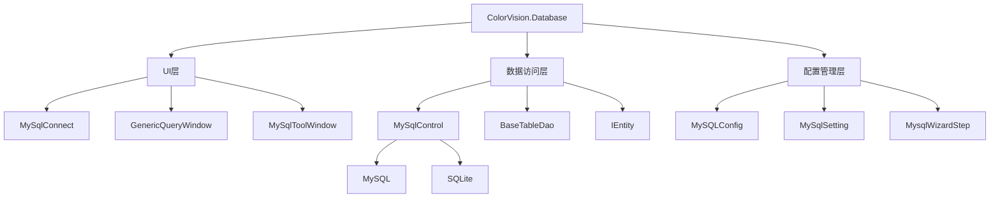

# ColorVision.Database

## 目录
1. [概述](#概述)
2. [核心功能](#核心功能)
3. [架构设计](#架构设计)
4. [主要组件](#主要组件)
5. [UI控件](#ui控件)
6. [数据访问层](#数据访问层)
7. [使用示例](#使用示例)
8. [配置管理](#配置管理)
9. [最佳实践](#最佳实践)

## 概述

**ColorVision.Database** 是专门为 ColorVision 系统提供数据库功能的 UI 组件库，主要支持 MySQL 数据库的连接、配置、管理和操作。它提供了可视化的数据库管理界面，简化了数据库相关的开发和维护工作。

### 基本信息

- **主要功能**: 数据库连接管理、UI控件、查询工具
- **支持数据库**: MySQL, SQLite
- **UI 框架**: WPF
- **特色功能**: 可视化配置、本地服务管理、通用查询界面、泛型DAO
- **版本**: 1.5.1.1
- **目标框架**: .NET 8.0 / .NET 10.0

## 核心功能

### 1. 数据库连接管理
- **MySQL 连接配置**: 可视化的连接参数设置
- **连接状态监控**: 实时连接状态检测和显示
- **连接池管理**: 高效的数据库连接复用
- **安全认证**: 支持用户名密码和高级安全选项，密码加密存储
- **连接测试**: 一键测试数据库连接

### 2. 可视化管理工具
- **数据库连接窗口** (`MySqlConnect`): 图形化配置数据库连接参数
- **管理工具窗口** (`MySqlToolWindow`): 集成的数据库管理界面
- **通用查询窗口** (`GenericQueryWindow`): 执行 SQL 查询并显示结果
- **本地服务管理** (`MySqlLocalServicesManager`): MySQL 本地服务的启停控制

### 3. 数据访问抽象
- **泛型 DAO** (`BaseTableDao<T>`): 基于泛型的数据访问对象，支持 CRUD 操作
- **实体接口** (`IEntity`): 标准化实体定义
- **SQL 命令抽象** (`IMysqlCommand`): 命令模式的数据库操作
- **配置向导** (`MysqlWizardStep`): 向导式数据库配置流程

## 架构设计



## 主要组件

### MySQLConfig

数据库连接配置类，采用单例模式管理连接参数。

```csharp
public class MySQLConfig : IConfig
{
    public static MySQLConfig Instance { get; } = new MySQLConfig();
    
    public string Server { get; set; } = "localhost";
    public int Port { get; set; } = 3306;
    public string Database { get; set; }
    public string Username { get; set; }
    public string Password { get; set; }
    public string ConnectionString { get; }
    
    public void Save();
    public void Load();
}
```

### MySqlControl

数据库连接控制类，提供连接管理和 SQL 执行功能。

```csharp
public static class MySqlControl
{
    public static MySqlConnection GetConnection();
    public static bool TestConnection();
    public static bool TestConnection(string connectionString);
    public static DataTable ExecuteQuery(string sql, Dictionary<string, object> parameters = null);
    public static int ExecuteNonQuery(string sql, Dictionary<string, object> parameters = null);
}
```

### BaseTableDao<T>

泛型数据访问对象基类，提供标准 CRUD 操作。

```csharp
public abstract class BaseTableDao<T> where T : class, IEntity, new()
{
    public virtual List<T> GetAll();
    public virtual T GetById(int id);
    public virtual int Insert(T entity);
    public virtual int Update(T entity);
    public virtual int Delete(int id);
    protected List<T> ExecuteQuery(string sql, Dictionary<string, object> parameters = null);
}
```

## UI控件

### MySqlConnect

数据库连接配置窗口，提供可视化的连接参数设置界面。

**功能特性**:
- 服务器地址、端口、数据库名输入
- 用户名、密码输入（密码加密显示）
- 连接测试按钮
- 保存配置按钮

### GenericQueryWindow

通用 SQL 查询窗口，支持执行查询、显示结果、导出数据。

**功能特性**:
- SQL 语句编辑区
- 查询执行按钮
- 结果表格显示
- 导出到 CSV/Excel

### MySqlToolWindow

数据库管理工具窗口，提供常用的数据库管理功能。

**功能特性**:
- 数据库状态监控
- 快速查询工具
- 连接信息展示

## 数据访问层

### IEntity 接口

实体类的标准接口，所有数据库实体都应实现此接口。

```csharp
public interface IEntity
{
    int Id { get; set; }
}
```

### 使用 DAO 进行数据操作

```csharp
// 定义实体
public class User : IEntity
{
    public int Id { get; set; }
    public string Username { get; set; }
    public string Email { get; set; }
    public DateTime CreatedAt { get; set; }
}

// 创建 DAO
public class UserDao : BaseTableDao<User>
{
    public UserDao() : base("users") { }
    
    public User GetByUsername(string username)
    {
        var sql = $"SELECT * FROM {TableName} WHERE Username = @username";
        var parameters = new Dictionary<string, object> { { "@username", username } };
        return ExecuteQuery(sql, parameters).FirstOrDefault();
    }
}

// 使用 DAO
var userDao = new UserDao();

// 插入
var newUser = new User { Username = "john", Email = "john@example.com" };
userDao.Insert(newUser);

// 查询
var users = userDao.GetAll();
var user = userDao.GetById(1);

// 更新
user.Email = "new@example.com";
userDao.Update(user);

// 删除
userDao.Delete(1);
```

## 使用示例

### 1. 配置数据库连接

```csharp
// 配置数据库连接
var config = MySQLConfig.Instance;
config.Server = "localhost";
config.Port = 3306;
config.Database = "colorvision_db";
config.Username = "admin";
config.Password = "password";
config.Save();

// 测试连接
if (MySqlControl.TestConnection())
{
    Console.WriteLine("数据库连接成功");
}
```

### 2. 显示连接配置窗口

```csharp
// 显示数据库连接配置窗口
var connectWindow = new MySqlConnect();
if (connectWindow.ShowDialog() == true)
{
    // 连接配置完成并保存
}
```

### 3. 执行自定义 SQL 查询

```csharp
// 执行查询
var dataTable = MySqlControl.ExecuteQuery("SELECT * FROM users WHERE IsActive = 1");

// 带参数的查询
var parameters = new Dictionary<string, object> 
{ 
    { "@status", "active" },
    { "@date", DateTime.Now.AddDays(-30) }
};
var results = MySqlControl.ExecuteQuery(
    "SELECT * FROM users WHERE Status = @status AND CreatedAt > @date", 
    parameters);
```

### 4. 显示通用查询窗口

```csharp
// 显示 SQL 查询窗口
var queryWindow = new GenericQueryWindow();
queryWindow.Show();
```

## 配置管理

### 配置向导步骤

```csharp
public class DatabaseWizardStep : IWizardStep
{
    public string Title => "数据库配置";
    public string Description => "配置数据库连接参数";
    
    public UserControl StepContent => new DatabaseConfigControl();
    
    public bool CanGoNext => MySqlControl.TestConnection();
    
    public bool Validate()
    {
        var config = MySQLConfig.Instance;
        
        if (string.IsNullOrEmpty(config.Server) ||
            string.IsNullOrEmpty(config.Database))
        {
            MessageBox.Show("请填写完整的数据库连接信息");
            return false;
        }
        
        if (!MySqlControl.TestConnection())
        {
            MessageBox.Show("数据库连接测试失败");
            return false;
        }
        
        return true;
    }
}
```

## 最佳实践

### 1. 连接管理
- 使用连接池避免频繁创建连接
- 及时释放数据库资源
- 实现连接超时和重试机制

### 2. 安全考虑
- 密码加密存储（使用 EncryptionHelper）
- SQL 注入防护（使用参数化查询）
- 避免在代码中硬编码连接字符串

### 3. 性能优化
- 使用索引优化查询
- 分页处理大数据集
- 缓存常用查询结果

### 4. 错误处理
- 完善的异常处理机制
- 用户友好的错误信息
- 详细的日志记录

## 相关资源

- [数据存储文档](../../05-resources/data-storage.md)
- [配置管理指南](../../00-getting-started/README.md)
- [RBAC 权限系统](../../ui-components/ColorVision.Solution.md#权限控制)
