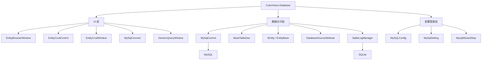

# ColorVision.Database

## 目录
1. [概述](#概述)
2. [核心功能](#核心功能)
3. [架构设计](#架构设计)
4. [主要组件](#主要组件)
5. [实体浏览器](#实体浏览器)
6. [通用 CRUD 控件](#通用-crud-控件)
7. [数据访问层](#数据访问层)
8. [SQLite 日志系统](#sqlite-日志系统)
9. [使用示例](#使用示例)
10. [配置管理](#配置管理)
11. [最佳实践](#最佳实践)

## 概述

**ColorVision.Database** 是 ColorVision 系统的数据库功能模块，提供 MySQL / SQLite 双数据库支持、可视化实体浏览器、通用 CRUD 界面和数据访问层。

### 基本信息

- **版本**: 1.5.5.1
- **目标框架**: .NET 8.0 / .NET 10.0 Windows
- **支持数据库**: MySQL, SQLite
- **ORM**: SqlSugar
- **UI 框架**: WPF
- **特色功能**: 实体浏览器、通用 CRUD、单元格内编辑、数据库来源标注

## 核心功能

### 1. 实体浏览器 (EntityBrowserWindow)
- **自动发现**: 扫描所有程序集，发现 `IEntity` 实现类
- **数据库分类**: 通过 `[DatabaseSource]` 属性标注实体所属数据库（MySQL / SQLite）
- **记录数统计**: 异步查询每个实体表的记录数
- **搜索过滤**: 按表名、类型名、显示名过滤
- **即时 CRUD**: 选中实体后右侧直接显示 DataGrid 增删改查界面

### 2. 通用 CRUD 控件 (EntityCrudControl)
- **单元格内编辑**: DataGrid 支持直接编辑单元格，失焦自动保存
- **自动生成列**: 根据实体属性自动创建 DataGrid 列
- **分页**: 支持分页浏览大数据集
- **搜索**: 关键字过滤数据
- **新增/删除**: 工具栏按钮操作
- **双数据库**: 传入 `Type` + `SqlSugarClient` 即可使用，支持 MySQL 和 SQLite

### 3. 数据库连接管理
- **MySQL 连接配置**: 可视化的连接参数设置 (`MySqlConnect`)
- **连接测试**: 一键测试数据库连接
- **SQLite 本地数据库**: `SqliteLogManager` 管理本地 SQLite 数据库

### 4. 数据访问层
- **IEntity 接口**: 标准化实体定义 (`int Id`)
- **EntityBase / ViewEntity**: POCO 和 MVVM 两种实体基类
- **BaseTableDao\<T\>**: 泛型数据访问对象
- **DatabaseSourceAttribute**: 标记实体所属数据库

## 架构设计


```mermaid
graph TD
    A[ColorVision.Database] --> B[UI 层]
    A --> C[数据访问层]
    A --> D[配置管理层]

    B --> B1[EntityBrowserWindow]
    B --> B2[EntityCrudControl]
    B --> B3[EntityCrudWindow]
    B --> B4[MySqlConnect]
    B --> B5[GenericQueryWindow]

    C --> C1[MySqlControl]
    C --> C2[BaseTableDao]
    C --> C3[IEntity / EntityBase]
    C --> C4[DatabaseSourceAttribute]
    C --> C5[SqliteLogManager]

    D --> D1[MySQLConfig]
    D --> D2[MySqlSetting]
    D --> D3[MysqlWizardStep]

    C1 --> E[MySQL]
    C5 --> F[SQLite]
```

## 主要组件

### IEntity 接口

实体类的标准接口，所有数据库实体都应实现此接口。

```csharp
public interface IEntity
{
    int Id { get; set; }
}
```

### EntityBase / ViewEntity

两种内置基类：

```csharp
// POCO 实体基类
public class EntityBase : IEntity
{
    [SugarColumn(ColumnName = "id", IsPrimaryKey = true, IsIdentity = true)]
    public int Id { get; set; }
}

// MVVM 实体基类（支持属性变更通知）
public class ViewEntity : ViewModelBase, IEntity
{
    [SugarColumn(ColumnName = "id", IsPrimaryKey = true, IsIdentity = true)]
    public int Id { get; set; }
}
```

### DatabaseSourceAttribute

标记实体类型所属的数据库。未标记的实体默认使用 MySQL。

```csharp
public enum DatabaseType { MySql, Sqlite }

[AttributeUsage(AttributeTargets.Class, Inherited = false, AllowMultiple = false)]
public class DatabaseSourceAttribute : Attribute
{
    public DatabaseType DatabaseType { get; }
    public DatabaseSourceAttribute(DatabaseType databaseType) { ... }
}
```

**用法**：
```csharp
[DatabaseSource(DatabaseType.Sqlite)]
[SugarTable("log_entries")]
public class LogEntry : EntityBase
{
    public string Message { get; set; }
    public DateTime Timestamp { get; set; }
}
```

### MySQLConfig

数据库连接配置类，单例模式。

```csharp
public class MySQLConfig : IConfig
{
    public static MySQLConfig Instance { get; } = new MySQLConfig();
    public string Server { get; set; } = "localhost";
    public int Port { get; set; } = 3306;
    public string Database { get; set; }
    public string Username { get; set; }
    public string Password { get; set; }
    public string ConnectionString { get; }
    public void Save();
    public void Load();
}
```

### MySqlControl

数据库连接控制类。

```csharp
public static class MySqlControl
{
    public static string GetConnectionString();
    public static MySqlConnection GetConnection();
    public static bool TestConnection();
    public static DataTable ExecuteQuery(string sql, Dictionary<string, object> parameters = null);
    public static int ExecuteNonQuery(string sql, Dictionary<string, object> parameters = null);
}
```

### BaseTableDao\<T\>

泛型数据访问对象基类。

```csharp
public class BaseTableDao<T> where T : class, IEntity, new()
{
    // CRUD 操作通过 BaseTableDaoExtensions 扩展方法实现
}
```

## 实体浏览器

### EntityBrowserWindow

实体浏览器主窗口，左侧实体列表 + 右侧 CRUD 界面。

**菜单入口**：工具 → 实体浏览器 (`MenuEntityBrowser`)

**左侧面板（DataGrid）**：

| 列 | 说明 |
|---|---|
| 表名 | 实体类名或 `[SugarTable]` 指定的表名 |
| 数据库 | MySQL 或 SQLite（由 `[DatabaseSource]` 决定） |
| 记录数 | 异步加载，显示 "..." 加载中 / "错误" 查询失败 |

**右侧 CRUD 面板**：选中实体后加载 `EntityCrudControl`。

**实体发现逻辑**：
1. 扫描 `AppDomain.CurrentDomain.GetAssemblies()` 所有程序集
2. 查找实现了 `IEntity` 接口的非抽象、非泛型类
3. 通过 `[DatabaseSource]` 属性判断数据库类型，兜底按命名空间推断
4. 异步查询每个实体的记录数

**核心类**：

```csharp
public class EntityTypeInfo
{
    public Type Type { get; set; }
    public string DisplayName { get; set; }
    public string TableName { get; set; }
    public string Namespace { get; set; }
    public string DbType { get; set; } = "MySQL";
    public int RecordCount { get; set; } = -1;
    public string RecordCountDisplay { get; } // "..." / "错误" / "1,234"
}
```

### MenuEntityBrowser

菜单项注册，位于工具菜单下。

```csharp
public class MenuEntityBrowser : GlobalMenuBase
{
    public override string OwnerGuid => MenuItemConstants.Tool;
    public override int Order => 50;
    public override string Header => "实体浏览器";
    public override void Execute() { ... }
}
```

## 通用 CRUD 控件

### EntityCrudControl

类似 Navicat 的通用增删改查控件。

**构造函数**：
```csharp
// 推荐：指定数据库
public EntityCrudControl(Type entityType, SqlSugarClient db)

// 兼容旧代码：默认 MySQL
public EntityCrudControl(Type entityType)
```

**功能特性**：
- **自动生成列**: 根据实体属性创建 DataGrid 列，读取 `[DisplayName]`、`[SugarColumn]` 作为列头
- **单元格内编辑**: `IsReadOnly="False"`，Id/主键/自增列自动只读
- **自动保存**: `CellEditEnding` 事件触发，通过 `Dispatcher.BeginInvoke` 异步保存
- **搜索过滤**: 工具栏搜索框实时过滤
- **分页**: 上一页/下一页，每页 20 条
- **新增/删除**: 工具栏按钮

**数据操作**（直接使用 SqlSugar，不依赖 BaseTableDaoExtensions）：
```csharp
// 查询
var list = db.Queryable(entityType).ToList();

// 新增/更新
db.Insertable(entity).ExecuteCommand();
db.Updateable(entity).ExecuteCommand();

// 删除
db.Deleteable(entity).ExecuteCommand();
```

### EntityCrudWindow

简单包装窗口，内部使用 `EntityCrudControl`。

```csharp
// 使用方式
var window = new EntityCrudWindow(typeof(UserEntity));
window.Show();

// 或使用泛型工厂
EntityCrudWindow.Create<UserEntity>().Show();
```

## 数据访问层

### 使用实体

```csharp
// 定义实体（MySQL）
[SugarTable("users")]
public class UserEntity : EntityBase
{
    [SugarColumn(ColumnName = "username")]
    public string Username { get; set; }

    [SugarColumn(ColumnName = "email")]
    public string Email { get; set; }

    public DateTime CreatedAt { get; set; }
}

// 定义实体（SQLite）
[DatabaseSource(DatabaseType.Sqlite)]
[SugarTable("log_entries")]
public class LogEntry : EntityBase
{
    public string Level { get; set; }
    public string Message { get; set; }
    public DateTime Timestamp { get; set; }
}
```

### 使用 BaseTableDao

```csharp
var dao = new BaseTableDao<UserEntity>();
var users = dao.GetAll();
var user = dao.GetById(1);
```

## SQLite 日志系统

`SqliteLog/` 子目录提供基于 SQLite 的本地日志功能。

| 文件 | 说明 |
|------|------|
| `LogEntry.cs` | 日志实体（已标记 `[DatabaseSource(DatabaseType.Sqlite)]`） |
| `SqliteLogManager.cs` | SQLite 数据库管理，提供 `CreateDbClient()` 工厂方法 |
| `SqliteLogManagerConfig.cs` | SQLite 配置 |
| `SqliteLogInitializer.cs` | 初始化器 |
| `SqliteLogWindow.xaml.cs` | 日志查看窗口 |

## 使用示例

### 1. 打开实体浏览器

```csharp
// 通过菜单：工具 → 实体浏览器
// 或代码打开：
var window = new EntityBrowserWindow();
window.Show();
```

### 2. 打开指定实体的 CRUD 窗口

```csharp
// 方式一：直接使用 EntityCrudControl
var db = new SqlSugarClient(new ConnectionConfig
{
    ConnectionString = MySqlControl.GetConnectionString(),
    DbType = SqlSugar.DbType.MySql,
    IsAutoCloseConnection = true
});
var control = new EntityCrudControl(typeof(UserEntity), db);

// 方式二：使用 EntityCrudWindow
var window = new EntityCrudWindow(typeof(UserEntity));
window.Show();
```

### 3. 定义新实体并自动出现在浏览器

```csharp
[DatabaseSource(DatabaseType.MySql)]  // 可选，默认 MySQL
[SugarTable("products")]
[DisplayName("产品表")]
public class ProductEntity : EntityBase
{
    [DisplayName("产品名称")]
    public string Name { get; set; }

    [DisplayName("价格")]
    public decimal Price { get; set; }

    [DisplayName("创建时间")]
    public DateTime CreatedAt { get; set; }
}
```

实现 `IEntity` 并有无参构造函数的类会自动被实体浏览器发现。

### 4. 配置数据库连接

```csharp
var config = MySQLConfig.Instance;
config.Server = "localhost";
config.Port = 3306;
config.Database = "colorvision_db";
config.Username = "admin";
config.Password = "password";
config.Save();

if (MySqlControl.TestConnection())
    Console.WriteLine("数据库连接成功");
```

### 5. 显示连接配置窗口

```csharp
var connectWindow = new MySqlConnect();
if (connectWindow.ShowDialog() == true)
{
    // 连接配置完成并保存
}
```

### 6. 执行自定义 SQL 查询

```csharp
var dataTable = MySqlControl.ExecuteQuery("SELECT * FROM users WHERE IsActive = 1");

var parameters = new Dictionary<string, object>
{
    { "@status", "active" },
    { "@date", DateTime.Now.AddDays(-30) }
};
var results = MySqlControl.ExecuteQuery(
    "SELECT * FROM users WHERE Status = @status AND CreatedAt > @date",
    parameters);
```

## 配置管理

### 配置向导步骤

```csharp
public class MysqlWizardStep : IWizardStep
{
    public string Title => "数据库配置";
    public string Description => "配置数据库连接参数";
    public UserControl StepContent => new DatabaseConfigControl();
    public bool CanGoNext => MySqlControl.TestConnection();
    public bool Validate() { ... }
}
```

## 最佳实践

### 1. 实体定义
- 实现 `IEntity` 接口（直接实现或继承 `EntityBase`/`ViewEntity`）
- 使用 `[SugarTable]` 指定表名
- 使用 `[DatabaseSource]` 标记 SQLite 实体（默认 MySQL）
- 确保有无参构造函数

### 2. 连接管理
- 使用连接池避免频繁创建连接
- 及时释放 `SqlSugarClient` 资源
- 实现连接超时和重试机制

### 3. 安全考虑
- 密码加密存储（使用 EncryptionHelper）
- SQL 注入防护（使用参数化查询）
- 避免在代码中硬编码连接字符串

### 4. 性能优化
- 使用索引优化查询
- 分页处理大数据集
- 缓存常用查询结果

## 更新日志

### v1.5.5.1 (2026-04)
- ✅ 新增实体浏览器 (`EntityBrowserWindow`) — 自动发现所有 IEntity 实现
- ✅ 新增通用 CRUD 控件 (`EntityCrudControl`) — 类似 Navicat 的增删改查界面
- ✅ 新增 `[DatabaseSource]` 属性 — 标记实体所属数据库
- ✅ DataGrid 支持单元格内编辑，失焦自动保存
- ✅ 异步加载实体记录数
- ✅ 左侧面板改为 DataGrid（显示表名、数据库、记录数）
- ✅ 简化 `EntityCrudWindow` 为薄包装

### v1.5.1.1 (2026-02)
- ✅ 基础数据库连接管理
- ✅ MySQL / SQLite 支持
- ✅ 泛型 DAO (`BaseTableDao<T>`)

## 相关资源

- [数据库操作用户指南](../../01-user-guide/data-management/database.md)
- [数据导出与导入](../../01-user-guide/data-management/export-import.md)
- [ColorVision.UI 菜单系统](ColorVision.UI.md#菜单系统)
