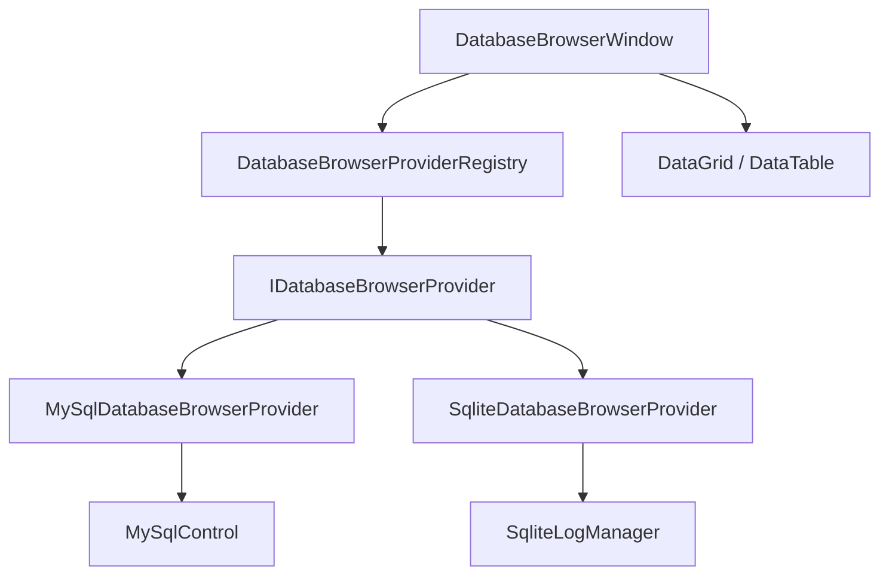

# ColorVision.Database

## 概述

`ColorVision.Database` 是 ColorVision 的数据库功能模块，提供 MySQL / SQLite 连接管理、基础 DAO、SQLite 日志系统，以及数据库优先的表浏览器。当前通用维护入口不再依赖 C# 实体，而是通过数据库连接查询库、表、列和行数据。

## 核心能力

- **数据库浏览器**: `DatabaseBrowserWindow`，按数据源 -> 库 -> 表浏览数据。
- **Provider 抽象**: `IDatabaseBrowserProvider`，把 MySQL、SQLite 或其他数据库统一暴露给浏览器。
- **通用表 CRUD**: 对具备主键的表执行新增、修改、删除；查询和新增不要求实体类。
- **分页搜索排序**: Provider 在数据库侧完成分页、文本列搜索和排序。
- **连接管理**: `MySqlControl` 管理 MySQL 配置和连接，`SqliteLogManager` 管理日志 SQLite 文件。
- **数据访问层**: `IEntity`、`EntityBase`、`ViewEntity`、`BaseTableDao<T>` 保留给业务实体和已有 DAO 使用。

## 架构


```mermaid
graph TD
    A[DatabaseBrowserWindow] --> B[DatabaseBrowserProviderRegistry]
    B --> C[IDatabaseBrowserProvider]
    C --> D[MySqlDatabaseBrowserProvider]
    C --> E[SqliteDatabaseBrowserProvider]
    D --> F[MySqlControl]
    E --> G[SqliteLogManager]
    A --> H[DataGrid / DataTable]
```

## 数据库浏览器

### DatabaseBrowserWindow

主窗口提供左侧树和右侧数据表格：

- 左侧树：数据源、数据库、表。
- 右侧工具栏：搜索、新增、保存、撤销、删除、刷新。
- 表格：直接绑定 `DataTable.DefaultView`，支持列头排序和分页。
- 写入策略：新增可直接构造值字典；修改/删除需要表中存在主键列。

菜单入口位于工具菜单：

```csharp
public class MenuEntityBrowser : GlobalMenuBase
{
    public override string Header => "数据库浏览器";
    public override void Execute()
    {
        new DatabaseBrowserWindow().Show();
    }
}
```

### DatabaseRowEditWindow

新增行弹窗根据 `DatabaseColumnInfo` 动态生成输入项，跳过自增列和只读列，并按数据库类型做基础值转换。

## Provider API

### IDatabaseBrowserProvider

```csharp
public interface IDatabaseBrowserProvider
{
    string ProviderId { get; }
    string ProviderName { get; }
    DatabaseType DatabaseType { get; }
    bool CanWrite { get; }

    IReadOnlyList<DatabaseCatalogInfo> GetDatabases();
    IReadOnlyList<DatabaseTableInfo> GetTables(string databaseName);
    IReadOnlyList<DatabaseColumnInfo> GetColumns(DatabaseTableInfo table);
    DatabaseTablePage QueryPage(DatabaseTableInfo table, int pageIndex, int pageSize, string? keyword, string? sortColumn, ListSortDirection sortDirection);
    int InsertRow(DatabaseTableInfo table, IReadOnlyDictionary<string, object?> values);
    int UpdateRow(DatabaseTableInfo table, IReadOnlyDictionary<string, object?> keys, IReadOnlyDictionary<string, object?> values);
    int DeleteRow(DatabaseTableInfo table, IReadOnlyDictionary<string, object?> keys);
}
```

### 默认 Provider

| ProviderId | 实现 | 数据源 |
|---|---|---|
| `mysql.default` | `MySqlDatabaseBrowserProvider` | `MySqlControl.Config` |
| `sqlite.log` | `SqliteDatabaseBrowserProvider` | `SqliteLogManager.SqliteDbPath` |

默认 Provider 通过 `DatabaseBrowserProviderRegistry.GetProviders()` 懒加载注册。

### 注册其他 SQLite 数据库

```csharp
DatabaseBrowserProviderRegistry.Register(new SqliteDatabaseBrowserProvider(
    "sqlite.scheduler",
    "SQLite 调度任务",
    () => SchedulerDbManager.DbPath,
    SchedulerDbManager.CreateDbClient));
```

其他数据库类型可以直接实现 `IDatabaseBrowserProvider`。

## 数据模型

| 类型 | 说明 |
|---|---|
| `DatabaseCatalogInfo` | 数据库/文件 catalog 元数据 |
| `DatabaseTableInfo` | 表名、库名、注释、估算行数、写权限 |
| `DatabaseColumnInfo` | 列名、类型、主键、自增、只读、可搜索信息 |
| `DatabaseTablePage` | 分页查询结果，包含 `DataTable Rows` 和 `TotalCount` |
| `DatabaseType` | `MySql` / `Sqlite` |

## 数据访问层

业务实体 API 仍保留：

```csharp
public interface IEntity
{
    int Id { get; set; }
}

public class EntityBase : IEntity
{
    [SugarColumn(ColumnName = "id", IsPrimaryKey = true, IsIdentity = true)]
    public int Id { get; set; }
}
```

`BaseTableDao<T>` 及其扩展方法继续用于已有业务代码。数据库浏览器不再扫描或依赖这些实体类型。

## SQLite 日志系统

| 文件 | 说明 |
|---|---|
| `SqliteLog/LogEntry.cs` | 日志实体 |
| `SqliteLog/SqliteLogManager.cs` | SQLite 日志数据库路径、连接工厂和浏览器 Provider 创建 |
| `SqliteLog/SqliteLogInitializer.cs` | 日志表初始化 |
| `SqliteLog/SqliteLogWindow.xaml.cs` | 日志查看窗口 |

## 使用示例

### 打开数据库浏览器

```csharp
new DatabaseBrowserWindow().Show();
```

### 获取所有浏览器 Provider

```csharp
var providers = DatabaseBrowserProviderRegistry.GetProviders();
```

### 查询表第一页

```csharp
var provider = DatabaseBrowserProviderRegistry.GetProvider("mysql.default");
var database = provider.GetDatabases().First();
var table = provider.GetTables(database.Name).First();
var page = provider.QueryPage(table, 1, 50, keyword: null, sortColumn: null, ListSortDirection.Descending);
```

## 最佳实践

- 为需要修改或删除的表配置主键；无主键表只适合查询和新增。
- Provider 内部必须校验表名和列名，避免直接拼接 UI 输入。
- UI 层调用同步 Provider 方法时使用 `Task.Run`，避免阻塞 WPF 线程。
- SQLite 多文件场景注册多个 `SqliteDatabaseBrowserProvider`，不要把不同文件混在同一个 Provider 中。
- MySQL 连接使用 `MySqlControl.GetConnectionString(config, timeout, databaseName)`，避免跨库查询时仍绑定默认库。

## 验证

```powershell
dotnet build UI/ColorVision.Database/ColorVision.Database.csproj -f net8.0-windows -p:Platform=x64
```

当前状态：构建通过，0 errors。
