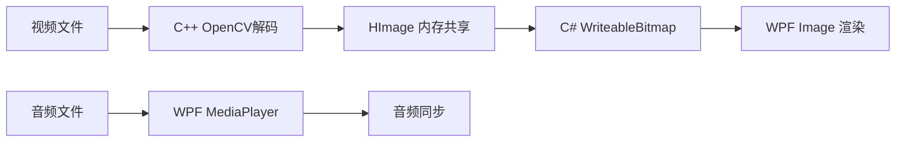
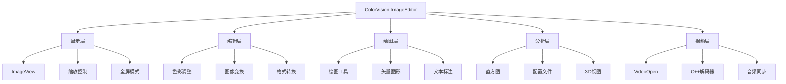

# ColorVision.ImageEditor

## 目录
1. [概述](#概述)
2. [核心功能](#核心功能)
3. [视频播放功能](#视频播放功能)
4. [架构设计](#架构设计)
5. [主要组件](#主要组件)
6. [绘图工具](#绘图工具)
7. [图像处理功能](#图像处理功能)
8. [使用示例](#使用示例)
9. [视频播放使用指南](#视频播放使用指南)
10. [扩展开发](#扩展开发)
11. [性能优化建议](#性能优化建议)
12. [最佳实践](#最佳实践)
13. [改进建议](#改进建议)
14. [相关资源](#相关资源)

## 概述

**ColorVision.ImageEditor** 是一个功能完整的 WPF 图像编辑控件库，提供了专业级的图像显示、编辑、标注、分析和视频播放功能。它支持多种图像格式，包括高精度的 RGB48 格式，提供了丰富的绘图工具和图像处理算法，以及高性能的视频播放能力。

基于UI和Core的图像展示控件，提供图像的展示，编辑，保存等功能。可以调整对比度，gamma，色调等功能，可以绘制图形，比如文字、矩形，圆，线，贝塞尔曲线等，可以删除或者编辑，可以保存为图片。**v1.5+ 版本新增视频播放功能**，支持多种视频格式的高性能播放。

### 基本信息

- **版本**: 1.5.1.1
- **目标框架**: .NET 8.0 / .NET 10.0 Windows
- **UI 框架**: WPF
- **特色功能**: RGB48 支持、矢量绘图、图像分析、3D可视化、**视频播放**
- **支持格式**: 
  - 图像：RGB48、PNG、JPG、BMP、TIFF、CVRAW、CVCIE
  - 视频：MP4、AVI、MKV、MOV、WMV、FLV、WebM

## 核心功能

### 1. 图像显示与交互
- **多格式支持**: 支持常见图像格式和 RGB48 高精度格式
- **缩放与平移**: 流畅的缩放、平移和适配功能
- **全屏显示**: 沉浸式图像浏览体验
- **网格显示**: 像素级精确定位辅助

### 2. 视频播放 (v1.5+)
- **格式支持**: MP4、AVI、MKV、MOV、WMV、FLV、WebM
- **音频同步**: 基于 WPF MediaPlayer 的音视频同步
- **播放控制**: 播放/暂停/停止、进度拖拽、倍速播放
- **降采样预览**: 支持 1x/1/2/1/4/1/8 缩放，优化高分辨率视频
- **自动隐藏**: 播放时工具栏自动隐藏
- **帧丢弃**: 高分辨率视频自动丢弃帧保证流畅

### 3. 图像编辑功能
- **色彩调整**: 对比度、Gamma、色调、饱和度调整
- **伪彩色显示**: 科学数据可视化支持
- **直方图分析**: 实时直方图显示和分析
- **配置文件剖析**: 像素数据分析工具

### 4. 绘图与标注工具
- **几何图形**: 矩形、圆形、线条、多边形
- **文本标注**: 自定义字体、颜色和样式
- **贝塞尔曲线**: 复杂路径绘制
- **测量工具**: 距离和角度测量

### 5. 3D 可视化
- **3D 图像视图**: 立体数据展示
- **CIE 色彩空间**: 色彩科学分析工具
- **深度数据处理**: 点云和深度图支持

## 视频播放功能

### 技术架构

视频播放采用 C++ 解码 + C# 渲染的架构：



### 性能优化策略

| 优化点 | 说明 | 效果 |
|--------|------|------|
| 最新帧槽模型 | 生产者不阻塞，始终推送最新帧 | 避免播放卡顿 |
| pyrDown 降采样 | OpenCV 图像金字塔下采样 | 减少 75% 数据传输 |
| 并行内存拷贝 | 多线程拷贝大帧数据 | 8K帧 25ms→5ms |
| 帧丢弃机制 | UI 繁忙时自动跳过帧 | 保证时间线稳定 |
| UI更新节流 | 进度条每10帧更新一次 | 减少UI开销 |

### 分辨率支持

| 分辨率 | 原始帧率 | 建议设置 | 预期效果 |
|--------|----------|----------|----------|
| 1080p | 60fps | 1x | ✅ 流畅 |
| 4K | 60fps | 1x | ✅ 流畅 |
| 8K | 60fps | 1/4x 或 1/8x | ⚠️ 需降采样 |

## 架构设计



## 主要组件

### ImageView 主控件
核心显示控件，负责图像/视频的渲染、交互和事件处理。

**主要功能：**
- 图像/视频显示和缩放
- 鼠标交互处理
- 绘图工具集成
- 性能优化的渲染

### VideoOpen 视频播放器 (v1.5+)
视频播放控制器，实现 `IImageOpen` 接口。

**主要功能：**
- 通过 `OpenCVMediaHelper` 与 C++ 层交互
- 管理 WPF MediaPlayer 音频播放
- 处理播放控制UI（工具栏）
- 实现帧丢弃和降采样逻辑
- 音视频同步修正

**关键方法：**
```csharp
public void OpenImage(EditorContext context, string filePath)
private void PlayVideo()
private void PauseVideo()
private void OnFrameReceived(int handle, ref HImage frame, int currentFrame, int totalFrames, IntPtr userData)
private static void UpdateWriteableBitmapFast(WriteableBitmap writeableBitmap, HImage hImage)
```

### ImageViewModel
MVVM模式的视图模型，管理图像数据和用户界面状态。

**主要功能：**
- 图像数据管理
- 命令绑定
- 属性通知
- 状态同步

### DrawCanvas
基于WPF DrawingVisual的高性能绘图画布。

**主要功能：**
- 矢量图形渲染
- 撤销/重做管理
- 命中测试
- 视觉树管理

## 绘图工具

### 几何图形工具
- **矩形工具**: 支持填充和边框样式，可设置圆角
- **圆形工具**: 椭圆和正圆绘制，支持填充和描边
- **线条工具**: 直线、折线和箭头线
- **多边形工具**: 任意多边形区域绘制
- **贝塞尔工具**: 平滑曲线绘制和路径编辑
- **标尺工具**: 距离测量和比例尺显示

### 文本工具
- **文本标注**: 可编辑文本框
- **字体设置**: 字体、大小、颜色
- **对齐选项**: 左对齐、居中、右对齐

### 测量工具
- **距离测量**: 两点间距离计算
- **角度测量**: 角度计算和显示
- **面积测量**: 区域面积计算

## 图像处理功能

### 色彩调整
- **亮度/对比度**: 线性调整
- **Gamma校正**: 非线性色调调整
- **色调/饱和度**: HSV颜色空间调整
- **色彩平衡**: RGB通道独立调整

### 伪彩色映射
- **热力图**: 温度数据可视化
- **光谱映射**: 科学数据展示
- **自定义LUT**: 用户定义查找表

## 使用示例

### 1. 基础图像显示

```xml
<cv:ImageView x:Name="imageView" 
              Source="{Binding ImageSource}"
              ZoomMode="Fit"
              ShowGrid="True" />
```

### 2. 视频播放

```csharp
// 打开视频文件
var videoOpen = new VideoOpen(editorContext);
videoOpen.OpenImage(editorContext, "path/to/video.mp4");

// 视频播放由 UI 工具栏控制：
// - ▶/⏸ 播放/暂停
// - ■ 停止
// - 进度条 跳转
// - 速度选择 0.25x-4x
// - 缩放选择 1x/1/2/1/4/1/8
// - 🔊/🔇 静音
// - Auto Hide 自动隐藏
```

### 3. 色彩调整功能

```csharp
imageView.ColorAdjustment.Brightness = 0.1;
imageView.ColorAdjustment.Contrast = 1.2;
imageView.ColorAdjustment.Gamma = 2.2;
```

### 4. 绘图工具使用

```csharp
// 启用矩形绘制工具
imageView.DrawingTool = DrawingToolType.Rectangle;
imageView.IsDrawingEnabled = true;

// 设置绘制样式
imageView.DrawingStyle.StrokeColor = Colors.Red;
imageView.DrawingStyle.StrokeThickness = 2;
```

### 5. 直方图分析

```csharp
// 获取直方图数据
var histogram = imageView.GetHistogram();
histogramView.DataSource = histogram;
```

### 6. 3D 可视化

```csharp
// 启用3D视图
imageView.Enable3DView = true;
imageView.View3D.SetViewAngle(45, 30);
```

## 视频播放使用指南

### 界面控制说明

打开视频文件后，底部工具栏会显示视频控制按钮：

| 控件 | 功能 |
|------|------|
| ▶/⏸ | 播放/暂停 |
| ■ | 停止并回到开头 |
| 🔊/🔇 | 静音/取消静音 |
| 进度条 | 点击或拖拽跳转 |
| 速度选择 | 0.25x / 0.5x / 1x / 1.5x / 2x / 4x |
| 缩放选择 | 1x / 1/2 / 1/4 / 1/8 |
| Auto Hide | 启用/禁用自动隐藏工具栏 |

### 播放高分辨率视频建议

对于 4K/8K 高分辨率视频：
1. **使用降采样**: 选择 1/4 或 1/8 预览可大幅提升流畅度
2. **关闭其他应用**: 释放 CPU/GPU 资源
3. **使用 SSD**: 视频文件存放在 SSD 上减少 IO 瓶颈
4. **适当降低倍速**: 高分辨率时建议使用 1x 或更低倍速

### 音画同步修正

播放器会自动检测音频漂移并修正。如果观察到音画不同步：
1. 暂停后重新播放
2. 跳转到其他位置再跳回
3. 检查视频文件本身是否音画同步

## 扩展开发

### 自定义绘图工具

```csharp
public class CustomDrawingTool : IDrawingTool
{
    public string Name => "Custom Tool";
    public Cursor Cursor => Cursors.Cross;
    
    public void OnMouseDown(Point point) { /* 实现 */ }
    public void OnMouseMove(Point point) { /* 实现 */ }
    public void OnMouseUp(Point point) { /* 实现 */ }
}
```

### 自定义图像处理算法

```csharp
public class CustomImageProcessor : IImageProcessor
{
    public string Name => "Custom Filter";
    
    public ImageData Process(ImageData input)
    {
        // 自定义处理逻辑
        return processedImage;
    }
}
```

## 性能优化建议

### 图像处理
1. **大图像处理**: 使用分块加载和虚拟化
2. **内存管理**: 及时释放不需要的图像资源
3. **GPU加速**: 利用硬件加速进行图像处理
4. **缓存策略**: 合理使用图像缓存机制

### 视频播放
1. **使用降采样**: 高分辨率视频使用 1/2、1/4 或 1/8 预览
2. **帧丢弃容忍**: 允许播放器自动丢弃帧保持流畅
3. **UI更新节流**: 进度条每10帧更新是正常优化行为
4. **并行拷贝**: 8K视频使用多线程内存拷贝

## 最佳实践

1. **MVVM模式**: 使用数据绑定和命令模式
2. **异步处理**: 大图像操作使用异步方法
3. **错误处理**: 完善的异常处理机制
4. **用户体验**: 提供进度指示和取消操作
5. **资源释放**: 关闭视频时正确释放资源，避免内存泄漏

## 改进建议

为了持续提升 ColorVision.ImageEditor 的质量和功能，我们制定了详细的改进计划：

### 📚 主要改进方向

1. **架构优化** 🔴
   - 依赖注入改造
   - 接口抽象设计
   - 命令模式改进

2. **性能优化** 🔴
   - 异步编程改进
   - 内存优化（对象池、弱引用缓存）
   - 渲染优化（虚拟化、GPU加速）
   - **视频硬件解码** - 使用 GPU 解码器减轻 CPU 负担

3. **代码质量** 🟡
   - 命名规范统一
   - 代码复用提升
   - SOLID原则应用

4. **功能增强** 🟢
   - 图层支持
   - 选区工具
   - AI功能集成
   - **视频编辑功能** - 剪辑、合并、导出

5. **用户体验** 🟡
   - 快捷键系统
   - 工具提示改进
   - 进度指示优化
   - **播放列表** - 连续播放多个视频

6. **测试与质量保证** 🟡
   - 单元测试
   - 集成测试
   - 性能测试

7. **安全性** 🔴
   - 输入验证
   - 安全文件操作

### 📖 详细文档

完整的改进建议和实现方案请参考：
- [ColorVision.ImageEditor 改进建议](../../UI/ColorVision.ImageEditor/改进建议.md) - 详细的改进方案和代码示例

## 更新日志

### v1.5.1.1 (2025-02)
- ✅ 新增视频播放功能（MP4/AVI/MKV/MOV/WMV/FLV/WebM）
- ✅ 实现 C++/C# 跨语言视频解码架构
- ✅ 添加音频同步播放支持
- ✅ 实现最新帧槽模型（无阻塞生产者）
- ✅ 添加 pyrDown 降采样预览优化
- ✅ 实现帧丢弃机制（高分辨率视频流畅播放）
- ✅ 添加自动隐藏工具栏功能
- ✅ 优化 8K 视频播放性能（并行内存拷贝）
- ✅ 支持 0.25x-4x 倍速播放

### v1.4.1.1 及更早
- 基础图像编辑功能
- RGB48 高位深支持
- 矢量绘图工具
- 3D 可视化

## 相关资源

- [用户指南 - 图像编辑器](../01-user-guide/image-editor/overview.md)
- [示例项目](../developer-guide/examples/)
- [故障排除](../troubleshooting/common-issues/)
- [改进建议详细文档](../../UI/ColorVision.ImageEditor/改进建议.md)
