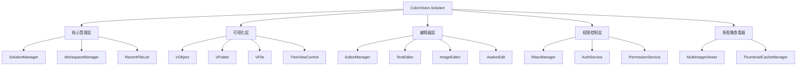

# ColorVision.Solution

## 目录
1. [概述](#概述)
2. [核心功能](#核心功能)
3. [新增功能 (v1.5+)](#新增功能-v15)
4. [架构设计](#架构设计)
5. [主要组件](#主要组件)
6. [文件管理](#文件管理)
7. [编辑器系统](#编辑器系统)
8. [权限控制](#权限控制)
9. [多图像查看器](#多图像查看器)
10. [使用示例](#使用示例)
11. [最佳实践](#最佳实践)

## 概述

**ColorVision.Solution** 是 ColorVision 系统的解决方案管理组件，提供了工程文件的创建、打开、管理和编辑功能。它类似于 Visual Studio 的解决方案资源管理器，为用户提供了层次化的项目文件管理界面和丰富的文件操作功能。

### 基本信息

- **主要功能**: 解决方案管理、文件树视图、多编辑器支持、权限控制、多图像查看
- **UI 框架**: WPF TreeView + MVVM
- **特色功能**: 文件系统监控、最近文件、插件系统、RBAC权限管理、缩略图缓存
- **版本**: 1.5.1.1
- **目标框架**: .NET 8.0 / .NET 10.0

## 核心功能

### 1. 解决方案管理
- **创建解决方案**: 通过 `SolutionManager.CreateSolution()` 创建新的工程解决方案
- **打开解决方案**: 支持打开 .cvsln 格式的解决方案文件
- **自动保存**: 程序退出时自动保存解决方案配置
- **最近文件**: 维护最近打开的解决方案历史记录
- **命令行支持**: 支持通过 `-s` 参数指定解决方案路径

### 2. 文件树视图
- **层次化显示**: TreeView 控件展示文件夹和文件的树形结构
- **可视化对象模型**: 基于 VObject、VFile、VFolder 的 MVVM 架构
- **文件图标**: 根据文件类型自动显示对应图标
- **右键菜单**: 丰富的上下文菜单操作（剪切、复制、粘贴、删除、重命名等）
- **拖拽支持**: 支持从外部拖拽文件到解决方案

### 3. 文件系统监控
- **实时更新**: 使用 FileSystemWatcher 监控文件系统变化
- **自动刷新**: 文件创建、删除、修改时自动更新树视图
- **性能优化**: 延迟加载和批量更新减少界面卡顿

### 4. 编辑器系统
- **多编辑器支持**: 
  - TextEditor - 文本文件编辑
  - ImageEditor - 图像查看和编辑
  - HexEditor - 二进制文件编辑
  - WebEditor - Web内容查看
  - AvalonEdit - 代码编辑器（支持语法高亮）
  - ProjectEditor - 项目文件编辑
  - SystemEditor - 系统编辑器
- **编辑器注册**: 通过 `EditorForExtensionAttribute` 特性自动注册
- **默认编辑器**: 可配置每种文件类型的默认编辑器
- **编辑器选择**: 支持"打开方式"功能选择编辑器

### 5. 权限控制（RBAC）
- **用户管理**: 用户注册、登录、权限验证
- **角色管理**: 基于角色的访问控制
- **权限管理**: 细粒度的文件和操作权限控制
- **审计日志**: 记录用户操作日志
- **多租户**: 支持多租户架构

### 6. 搜索功能
- **文件搜索**: 在解决方案中搜索文件名
- **搜索视图**: SolutionView 提供搜索界面
- **快速定位**: 支持快速定位到搜索结果

## 新增功能 (v1.5+)

### 多图像查看器 (MultiImageViewer)

支持文件夹内多张图片的预览和缩略图缓存。

```csharp
// 创建多图像查看器
var viewer = new MultiImageViewer();
viewer.LoadFolder(@"C:\Images");
viewer.Show();
```

**功能特性**:
- 文件夹内图像批量加载
- 缩略图网格显示
- 图像预览导航
- 文件信息显示

### 缩略图缓存管理 (ThumbnailCacheManager)

高效的图像缩略图生成和缓存系统。

```csharp
// 获取缩略图
var thumbnail = await ThumbnailCacheManager.Instance.GetThumbnailAsync(
    imagePath, 
    width: 128, 
    height: 128);
```

**功能特性**:
- 异步缩略图生成
- 内存和磁盘缓存
- 缓存过期管理
- 多线程处理

### Markdown 查看器 (MarkdownViewWindow)

支持 Markdown 文件的预览。

```csharp
// 显示 Markdown 文件
var mdWindow = new MarkdownViewWindow();
mdWindow.LoadFile(@"C:\Docs\readme.md");
mdWindow.Show();
```

**功能特性**:
- Markdown 渲染
- 代码语法高亮
- 图片显示
- 打印支持

### 工作区管理 (WorkspaceManager)

多工作区切换管理。

```csharp
// 切换工作区
WorkspaceManager.Instance.SwitchWorkspace(workspacePath);

// 获取当前工作区
var current = WorkspaceManager.Instance.CurrentWorkspace;
```

## 架构设计

### 整体架构



## 主要组件

### SolutionManager

解决方案的中央管理器，负责创建、打开、保存解决方案。

```csharp
public class SolutionManager : ViewModelBase
{
    public static SolutionManager GetInstance();
    
    public ObservableCollection<SolutionExplorer> SolutionExplorers { get; }
    public SolutionExplorer CurrentSolutionExplorer { get; set; }
    public RecentFileList SolutionHistory { get; set; }
    
    public bool OpenSolution(string fullPath);
    public bool CreateSolution(string solutionDirectoryPath);
    
    public event EventHandler SolutionCreated;
    public event EventHandler SolutionLoaded;
}
```

### SolutionExplorer

表示一个打开的解决方案，继承自 VObject。

```csharp
public class SolutionExplorer : VObject
{
    public DirectoryInfo DirectoryInfo { get; }
    public SolutionConfig Config { get; }
    public FileInfo ConfigFileInfo { get; }
    public SolutionEnvironments SolutionEnvironments { get; }
    
    public void SaveConfig();
}
```

### VObject / VFolder / VFile

可视化对象层次结构：

```csharp
public class VObject : INotifyPropertyChanged, IObject
{
    public VObject Parent { get; set; }
    public string Name { get; set; }
    public string FullPath { get; set; }
    public ImageSource Icon { get; set; }
    public bool IsExpanded { get; set; }
    public bool IsSelected { get; set; }
    public ObservableCollection<VObject> VisualChildren { get; set; }
    
    public virtual void Open();
    public virtual void Delete();
    public virtual bool ReName(string name);
}

public class VFolder : VObject, IDisposable
{
    public DirectoryInfo DirectoryInfo { get; set; }
    public FileSystemWatcher FileSystemWatcher { get; set; }
}

public class VFile : VObject
{
    public FileInfo FileInfo { get; set; }
    public IFileMeta FileMeta { get; set; }
}
```

### EditorManager

管理所有编辑器的注册和分配。

```csharp
public class EditorManager
{
    public static EditorManager Instance { get; }
    
    public List<IEditor> GetEditorsForFile(string filePath);
    public IEditor GetDefaultEditor(string extension);
    public void SetDefaultEditor(string extension, Type editorType);
}
```

### RbacManager

权限管理的中央管理器。

```csharp
public class RbacManager
{
    public static RbacManager Instance { get; }
    
    public UserEntity CurrentUser { get; set; }
    public IAuthService AuthService { get; }
    
    public bool HasPermission(string permissionCode);
    public bool HasRole(string roleCode);
}
```

## 文件管理

### 文件元数据系统

```csharp
public interface IFileMeta
{
    string Name { get; }
    string FullName { get; }
    ImageSource Icon { get; }
    FileInfo FileInfo { get; }
}

// 注册自定义文件元数据
FileMetaRegistry.Register(".myext", typeof(CustomFileMeta));
```

### 工厂模式

```csharp
public class VObjectFactory
{
    public static VFile CreateVFile(FileInfo fileInfo)
    {
        var fileMeta = FileMetaRegistry.GetFileMeta(fileInfo);
        return new VFile(fileMeta);
    }
    
    public static VFolder CreateVFolder(DirectoryInfo directoryInfo)
    {
        var folderMeta = FolderMetaRegistry.GetFolderMeta(directoryInfo);
        return new VFolder(folderMeta);
    }
}
```

## 编辑器系统

### 编辑器特性

```csharp
// 标记编辑器支持的文件扩展名
[EditorForExtension(".txt", ".log", ".md")]
public class TextEditor : EditorBase
{
    public override void Open(string filePath)
    {
        // 编辑器实现
    }
}

// 标记通用编辑器（支持所有文件类型）
[GenericEditor]
public class HexEditor : EditorBase
{
}
```

### 内置编辑器

| 编辑器 | 支持的扩展名 | 说明 |
|--------|--------------|------|
| TextEditor | .txt, .log, .md, .json, .xml | 文本文件 |
| ImageEditor | .png, .jpg, .jpeg, .bmp, .gif | 图像文件 |
| HexEditor | * (通用) | 二进制文件 |
| AvalonEdit | .cs, .xaml, .cpp, .h, .py | 代码文件 |
| WebEditor | .html, .htm | Web 文件 |
| MarkdownView | .md | Markdown 文件 (v1.5+) |

## 权限控制

### RBAC 核心组件

```csharp
// 认证服务
public interface IAuthService
{
    Task<LoginResultDto> LoginAsync(string username, string password);
    Task<bool> RegisterAsync(UserEntity user, string password);
    Task LogoutAsync();
}

// 权限服务
public class PermissionService
{
    public List<PermissionEntity> GetUserPermissions(int userId);
    public bool HasPermission(int userId, string permissionCode);
}

// 审计日志服务
public class AuditLogService
{
    public void LogAction(string action, string details);
    public List<AuditLogEntity> GetUserLogs(int userId);
}
```

### 使用示例

```csharp
// 登录
var authService = RbacManager.Instance.AuthService;
var result = await authService.LoginAsync("username", "password");

// 检查权限
if (RbacManager.Instance.HasPermission("FILE_DELETE"))
{
    DeleteFile(filePath);
}

// 记录审计日志
var auditService = new AuditLogService();
auditService.LogAction("FILE_DELETE", $"删除文件: {filePath}");
```

## 多图像查看器

### 基本使用

```csharp
// 创建并显示多图像查看器
var viewer = new MultiImageViewer();
viewer.LoadFolder(@"C:\Images");
viewer.Show();

// 使用配置
var config = new MultiImageViewerConfig
{
    ThumbnailSize = 128,
    CacheEnabled = true,
    ShowFileName = true,
    SortBy = SortBy.Name,
    SortOrder = SortOrder.Ascending
};
viewer.ApplyConfig(config);
```

### 缩略图缓存

```csharp
// 异步获取缩略图
var thumbnail = await ThumbnailCacheManager.Instance.GetThumbnailAsync(
    imagePath, 
    width: 128, 
    height: 128);

// 预加载文件夹缩略图
await ThumbnailCacheManager.Instance.PreloadFolderAsync(folderPath);

// 清除缓存
ThumbnailCacheManager.Instance.ClearCache();
```

## 使用示例

### 1. 基础解决方案管理

```csharp
var solutionManager = SolutionManager.GetInstance();

// 创建新解决方案
solutionManager.CreateSolution(@"D:\Projects\MyColorVisionProject");

// 打开现有解决方案
solutionManager.OpenSolution(@"D:\Projects\ExistingProject\ExistingProject.cvsln");

// 访问当前解决方案
var currentSolution = solutionManager.CurrentSolutionExplorer;
```

### 2. 注册自定义编辑器

```csharp
[EditorForExtension(".myext", ".data")]
public class MyCustomEditor : EditorBase
{
    public override void Open(string filePath)
    {
        var window = new MyCustomEditorWindow();
        window.LoadFile(filePath);
        window.Show();
    }
    
    public override string DisplayName => "我的自定义编辑器";
}
```

### 3. 搜索文件

```csharp
public void SearchFiles(string searchPattern)
{
    var solutionExplorer = SolutionManager.GetInstance().CurrentSolutionExplorer;
    var results = new List<VFile>();
    
    void SearchRecursive(VObject node)
    {
        if (node is VFile file && 
            file.Name.Contains(searchPattern, StringComparison.OrdinalIgnoreCase))
        {
            results.Add(file);
        }
        
        foreach (var child in node.VisualChildren)
        {
            SearchRecursive(child);
        }
    }
    
    SearchRecursive(solutionExplorer);
    Console.WriteLine($"找到 {results.Count} 个匹配的文件");
}
```

### 4. 处理文件系统事件

```csharp
var solutionExplorer = SolutionManager.GetInstance().CurrentSolutionExplorer;

solutionExplorer.VisualChildrenEventHandler += (sender, e) =>
{
    Console.WriteLine("解决方案树结构已变化");
};
```

## 最佳实践

### 1. 性能优化

```csharp
// ✅ 推荐：使用延迟加载
public async Task LoadLargeSolution()
{
    await VMUtil.Instance.GeneralChild(solutionExplorer, directoryInfo);
}

// ✅ 使用批处理和延迟
int i = 0;
foreach (var item in directoryInfo.GetFiles())
{
    i++;
    if (i == 100) // 每100个文件延迟一次
    {
        await Task.Delay(100);
        i = 0;
    }
    CreateFile(item);
}
```

### 2. 资源管理

```csharp
// ✅ 正确释放 FileSystemWatcher
public class VFolder : VObject, IDisposable
{
    public void Dispose()
    {
        if (FileSystemWatcher != null)
        {
            FileSystemWatcher.EnableRaisingEvents = false;
            FileSystemWatcher.Dispose();
            FileSystemWatcher = null;
        }
    }
}
```

### 3. 错误处理

```csharp
// ✅ 完善的异常处理
public override bool ReName(string newName)
{
    try
    {
        if (string.IsNullOrWhiteSpace(newName))
        {
            ShowUserError("文件名不能为空");
            return false;
        }
        
        DirectoryInfo.MoveTo(newPath);
        LogOperation($"重命名: {Name} -> {newName}");
        return true;
    }
    catch (UnauthorizedAccessException)
    {
        ShowUserError("没有权限重命名此文件");
        return false;
    }
    catch (IOException ex)
    {
        ShowUserError($"重命名失败：{ex.Message}");
        return false;
    }
}
```

### 4. UI响应性

```csharp
// ✅ 在 UI 线程上更新界面
FileSystemWatcher.Created += (s, e) =>
{
    Application.Current?.Dispatcher.Invoke(() =>
    {
        VMUtil.Instance.CreateFile(this, new FileInfo(e.FullPath));
    });
};
```

### 5. 安全性

```csharp
// ✅ 验证文件路径
public bool IsValidPath(string path)
{
    try
    {
        var fullPath = Path.GetFullPath(path);
        var solutionDir = solutionExplorer.DirectoryInfo.FullName;
        return fullPath.StartsWith(solutionDir, StringComparison.OrdinalIgnoreCase);
    }
    catch
    {
        return false;
    }
}

// ✅ 使用权限检查
if (!RbacManager.Instance.HasPermission("FILE_DELETE"))
{
    ShowUserError("您没有删除文件的权限");
    return;
}
```

## 更新日志

### v1.5.1.1 (2025-02)
- ✅ 新增多图像查看器 (`MultiImageViewer`)
- ✅ 新增缩略图缓存管理 (`ThumbnailCacheManager`)
- ✅ 新增 Markdown 查看器 (`MarkdownViewWindow`)
- ✅ 新增工作区管理 (`WorkspaceManager`)
- ✅ 新增可编辑文本块 (`EditableTextBlock`)
- ✅ 支持 .NET 10.0
- ✅ 优化文件系统监控性能
- ✅ 改进 RBAC 权限系统

### v1.4.1.1 (2025-02)
- 新增图像文件夹预览
- 优化解决方案加载速度

### v1.3.18.1 (2025-02)
- 增加 RBAC 权限系统
- 增加多语言支持
- 增加 AvalonEdit 代码编辑器

## 相关资源

- [用户指南](../user-guide/)
- [入门指南](../getting-started/)
- [故障排除](../troubleshooting/)
