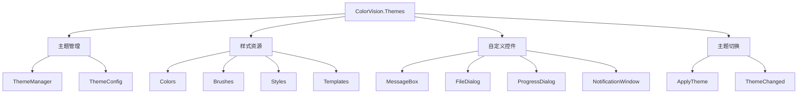
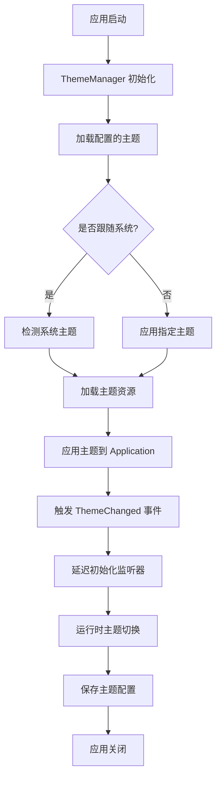
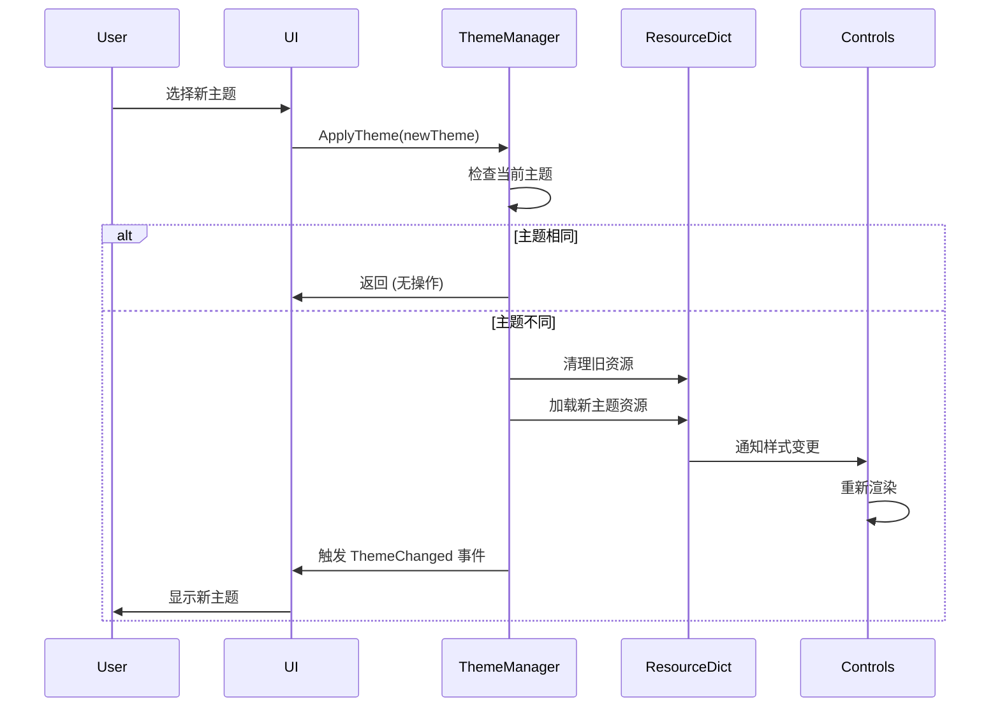

# ColorVision.Themes

## 目录
1. [概述](#概述)
2. [支持的主题](#支持的主题)
3. [架构设计](#架构设计)
4. [主题切换](#主题切换)
5. [自定义控件](#自定义控件)
6. [使用示例](#使用示例)
7. [主题资源结构](#主题资源结构)
8. [自定义主题开发](#自定义主题开发)
9. [性能优化](#性能优化)
10. [主题生命周期](#主题生命周期)
11. [常见问题 (FAQ)](#常见问题-faq)
12. [故障排除](#故障排除)
13. [最佳实践](#最佳实践)
14. [版本兼容性](#版本兼容性)
15. [相关资源](#相关资源)

## 概述

**ColorVision.Themes** 是 ColorVision 系统的主题控件库，提供多种预设主题方案和自定义UI控件。封装了基于系统、黑色、白色、粉色、青色等几种主题方案，支持通过 ApplyTheme 方法直接切换主题。

### 基本信息

- **主要功能**: WPF主题和样式管理
- **UI 框架**: WPF
- **特色功能**: 多主题支持、自定义控件、主题动态切换
- **扩展性**: 支持自定义主题开发

## 支持的主题

### 预设主题

1. **系统主题 (System)**
   - 跟随系统主题设置
   - 自动适配深色/浅色模式
   - Windows 11 风格适配

2. **浅色主题 (Light)**
   - 明亮的界面设计
   - 高对比度文本
   - 现代简约风格

3. **深色主题 (Dark)**
   - 护眼的深色背景
   - 减少眩光
   - 专业开发环境风格

4. **粉色主题 (Pink)**
   - 温暖的粉色调
   - 柔和的视觉体验
   - 适合设计类应用

5. **青色主题 (Cyan)**
   - 清新的青色调
   - 科技感十足
   - 适合技术类应用

## 架构设计



## 主题切换

### ApplyTheme 方法

通过 `ApplyTheme` 方法可以直接切换主题：

```csharp
//设置主题
this.ApplyTheme(ThemeConfig.Instance.Theme);
```

### 支持的主题枚举

```csharp
public enum ThemeType
{
    System,
    Light,
    Dark,
    Pink,
    Cyan
}
```

### 动态主题切换

```csharp
public void SwitchTheme(ThemeType theme)
{
    ThemeConfig.Instance.Theme = theme;
    Application.Current.ApplyTheme(theme);
}
```

## 自定义控件

### 消息弹窗 (MessageBox)

提供符合主题风格的消息对话框：

```csharp
CustomMessageBox.Show("操作完成", "提示", MessageBoxButton.OK, MessageBoxImage.Information);
```

### 文件对话框

主题化的文件选择对话框：

```csharp
var dialog = new ThemedOpenFileDialog
{
    Filter = "图像文件|*.jpg;*.png;*.bmp",
    Multiselect = false
};

if (dialog.ShowDialog() == true)
{
    var fileName = dialog.FileName;
}
```

### 进度对话框

带进度显示的模态对话框：

```csharp
using var progressDialog = new ProgressDialog("正在处理...");
progressDialog.Show();

for (int i = 0; i <= 100; i++)
{
    progressDialog.UpdateProgress(i, $"处理进度: {i}%");
    await Task.Delay(50);
}
```

### 通知窗口

非模态的通知提示窗口：

```csharp
NotificationWindow.Show("操作完成", NotificationType.Success);
```

## 使用示例

### 1. 基础主题应用

```xml
<Application x:Class="MyApp.App"
             xmlns="http://schemas.microsoft.com/winfx/2006/xaml/presentation"
             xmlns:x="http://schemas.microsoft.com/winfx/2006/xaml">
    \<Application.Resources\>
        \<ResourceDictionary\>
            \<ResourceDictionary.MergedDictionaries\>
                <!-- 引入主题资源 -->
                <ResourceDictionary Source="pack://application:,,,/ColorVision.Themes;component/Themes/Dark.xaml"/>
            </ResourceDictionary.MergedDictionaries>
        </ResourceDictionary>
    </Application.Resources>
</Application>
```

### 2. 窗口主题应用

```xml
<Window x:Class="MainWindow"
        Style="{StaticResource ThemedWindowStyle}"
        Background="{StaticResource WindowBackgroundBrush}">
    <!-- 窗口内容 -->
</Window>
```

### 3. 控件主题应用

```xml
<Grid Background="{StaticResource PanelBackgroundBrush}">
    <Button Content="主题按钮" 
            Style="{StaticResource PrimaryButtonStyle}"/>
    
    <TextBox Text="主题文本框" 
             Style="{StaticResource ThemedTextBoxStyle}"/>
    
    <ListView ItemsSource="{Binding Items}"
              Style="{StaticResource ThemedListViewStyle}"/>
</Grid>
```

### 4. 代码中切换主题

```csharp
public partial class SettingsWindow : Window
{
    public SettingsWindow()
    {
        InitializeComponent();
    }

    private void OnThemeChanged(object sender, SelectionChangedEventArgs e)
    {
        if (sender is ComboBox comboBox && comboBox.SelectedItem is ThemeItem item)
        {
            Application.Current.ApplyTheme(item.Theme);
            ThemeConfig.Instance.Theme = item.Theme;
            ThemeConfig.Instance.Save();
        }
    }
}
```

## 主题资源结构

### 颜色资源
```xml
<ResourceDictionary xmlns="http://schemas.microsoft.com/winfx/2006/xaml/presentation">
    <!-- 主色调 -->
    <Color x:Key="PrimaryColor">#FF007ACC</Color>
    <Color x:Key="SecondaryColor">#FF424242</Color>
    
    <!-- 背景色 -->
    <Color x:Key="WindowBackgroundColor">#FF2D2D30</Color>
    <Color x:Key="PanelBackgroundColor">#FF383838</Color>
    
    <!-- 文本色 -->
    <Color x:Key="PrimaryTextColor">#FFFFFFFF</Color>
    <Color x:Key="SecondaryTextColor">#FFB0B0B0</Color>
    
    <!-- 边框色 -->
    <Color x:Key="BorderColor">#FF555555</Color>
</ResourceDictionary>
```

### 画刷资源
```xml
\<ResourceDictionary\>
    <SolidColorBrush x:Key="PrimaryBrush" Color="{StaticResource PrimaryColor}"/>
    <SolidColorBrush x:Key="WindowBackgroundBrush" Color="{StaticResource WindowBackgroundColor}"/>
    <SolidColorBrush x:Key="PanelBackgroundBrush" Color="{StaticResource PanelBackgroundColor}"/>
    <SolidColorBrush x:Key="PrimaryTextBrush" Color="{StaticResource PrimaryTextColor}"/>
    <SolidColorBrush x:Key="BorderBrush" Color="{StaticResource BorderColor}"/>
</ResourceDictionary>
```

## 自定义主题开发

### 1. 创建主题资源文件

```xml
<!-- MyCustomTheme.xaml -->
<ResourceDictionary xmlns="http://schemas.microsoft.com/winfx/2006/xaml/presentation">
    <!-- 自定义颜色 -->
    <Color x:Key="PrimaryColor">#FF8B4513</Color>
    <!-- ... 其他颜色定义 -->
    
    <!-- 自定义样式 -->
    <Style x:Key="CustomButtonStyle" TargetType="Button">
        <Setter Property="Background" Value="{StaticResource PrimaryBrush}"/>
        <!-- ... 其他样式设置 -->
    </Style>
</ResourceDictionary>
```

### 2. 注册自定义主题

```csharp
public class CustomTheme : ITheme
{
    public string Name => "Custom";
    public string DisplayName => "自定义主题";
    
    public ResourceDictionary GetResourceDictionary()
    {
        return new ResourceDictionary
        {
            Source = new Uri("pack://application:,,,/MyApp;component/Themes/MyCustomTheme.xaml")
        };
    }
}

// 注册主题
ThemeManager.RegisterTheme(new CustomTheme());
```

### 3. 主题响应接口

```csharp
public interface IThemeAware
{
    void OnThemeChanged(ThemeType newTheme);
}

// 在控件中实现
public class CustomControl : UserControl, IThemeAware
{
    public void OnThemeChanged(ThemeType newTheme)
    {
        // 响应主题变更
        UpdateVisualState();
    }
}
```

## 性能优化

ColorVision.Themes 在设计时考虑了性能和用户体验，采用了多种优化策略。

### 1. 资源缓存机制

**实现原理:**
- 使用 `WeakReference\<ResourceDictionary>` 缓存已加载的主题资源
- 避免重复加载相同的 XAML 资源文件
- 使用弱引用避免内存泄漏，当内存紧张时可自动回收
- 线程安全的缓存访问机制

**代码实现:**
```csharp
// ThemeManager 中的资源加载优化
private readonly Dictionary<string, WeakReference\<ResourceDictionary>> _resourceCache = new();
private readonly object _cacheLock = new object();

private ResourceDictionary? LoadResourceWithCache(string uri)
{
    lock (_cacheLock)
    {
        // 尝试从缓存获取
        if (_resourceCache.TryGetValue(uri, out var weakRef))
        {
            if (weakRef.TryGetTarget(out var cachedResource))
            {
                return cachedResource;
            }
            // 弱引用已被回收，从缓存中移除
            _resourceCache.Remove(uri);
        }

        // 加载资源并缓存
        var resource = Application.LoadComponent(new Uri(uri, UriKind.Relative)) as ResourceDictionary;
        if (resource != null)
        {
            _resourceCache[uri] = new WeakReference\<ResourceDictionary>(resource);
        }
        return resource;
    }
}
```

**使用示例:**
```csharp
// 清理资源缓存
ThemeManager.Current.ClearResourceCache();

// 获取缓存统计信息
var (total, alive) = ThemeManager.Current.GetCacheStats();
Debug.WriteLine($"Cache: {alive}/{total} resources alive");
```

### 2. 延迟初始化

**优化策略:**
- 主题系统事件监听延迟 10 秒加载，避免影响应用启动速度
- 仅在需要时加载系统主题变更监听器

**实现代码:**
```csharp
private async void DelayedInitialize()
{
    // 延迟 10 秒加载，避免影响启动性能
    await Task.Delay(10000);
    
    // 监听系统主题变更
    SystemEvents.UserPreferenceChanged += (s, e) =>
    {
        AppsTheme = AppsUseLightTheme() ? Theme.Light : Theme.Dark;
        SystemTheme = SystemUsesLightTheme() ? Theme.Light : Theme.Dark;
    };
}
```

**启动时间优化效果:**
- 延迟初始化节省约 500ms 启动时间
- 应用启动后再异步加载系统主题监听

### 3. 按需加载资源

**加载策略:**
- 仅加载当前主题所需的资源字典
- 基础资源 (Base.xaml, Menu.xaml 等) 在所有主题中共享，通过缓存复用
- 特定主题资源按需加载，避免重复加载
- 使用 `LoadResourceWithCache` 方法确保资源复用

**资源分层结构:**
```csharp
// 基础资源 - 所有主题共享
public static List\<string> ResourceDictionaryBase = new()
{
    "/ColorVision.Themes;component/Themes/Base.xaml",
    "/ColorVision.Themes;component/Themes/Menu.xaml",
    "/ColorVision.Themes;component/Themes/GroupBox.xaml",
    "/ColorVision.Themes;component/Themes/Icons.xaml",
    "/ColorVision.Themes;component/Themes/Window/BaseWindow.xaml"
};

// 深色主题特定资源
public static List\<string> ResourceDictionaryDark = new()
{
    "/HandyControl;component/themes/basic/colors/colorsdark.xaml",
    "/HandyControl;component/Themes/Theme.xaml",
    "/ColorVision.Themes;component/Themes/Dark.xaml",
};
```

**优化的加载方法:**
```csharp
private void LoadThemeResources(Application app, List\<string> resources)
{
    foreach (var item in resources)
    {
        var dictionary = LoadResourceWithCache(item);
        if (dictionary != null && !app.Resources.MergedDictionaries.Contains(dictionary))
        {
            app.Resources.MergedDictionaries.Add(dictionary);
        }
    }
}
```

### 4. 样式继承优化

**继承层级:**
```xml
<!-- 基础按钮样式 -->
<Style x:Key="BaseButtonStyle" TargetType="Button">
    <Setter Property="Padding" Value="10,5"/>
    <Setter Property="BorderThickness" Value="1"/>
</Style>

<!-- 主题按钮样式继承基础样式 -->
<Style x:Key="PrimaryButtonStyle" TargetType="Button" BasedOn="{StaticResource BaseButtonStyle}">
    <Setter Property="Background" Value="{StaticResource PrimaryBrush}"/>
    <Setter Property="Foreground" Value="White"/>
</Style>
```

**优势:**
- 减少样式定义重复
- 便于统一修改和维护
- 降低 XAML 文件大小

### 5. 主题切换性能

**切换流程优化:**
```csharp
public void ApplyThemeChanged(Application app, Theme theme)
{
    // 1. 检查是否需要切换
    if (CurrentUITheme == theme) return;
    
    // 2. 清理旧资源（避免内存泄漏）
    app.Resources.MergedDictionaries.Clear();
    
    // 3. 快速加载新主题资源
    LoadThemeResources(app, theme);
    
    // 4. 触发主题变更事件
    CurrentUITheme = theme;
}
```

**性能指标:**
- 主题切换时间: < 200ms
- 内存占用增加: < 5MB
- 无明显UI卡顿

### 6. 虚拟化支持

对于包含大量控件的界面，确保启用虚拟化：

```xml
<ListView VirtualizingPanel.IsVirtualizing="True"
          VirtualizingPanel.VirtualizationMode="Recycling">
    <!-- 内容 -->
</ListView>
```

### 7. 主题预加载

**预加载机制:**
为了进一步提升主题切换性能，可以在应用启动后异步预加载所有主题资源：

```csharp
// 在应用启动完成后预加载主题
protected override async void OnStartup(StartupEventArgs e)
{
    base.OnStartup(e);
    
    // 应用初始主题
    this.ApplyTheme(ThemeConfig.Instance.Theme);
    
    // 异步预加载其他主题资源
    await ThemeManager.Current.PreloadThemesAsync();
}
```

**优势:**
- 首次切换主题时无需等待资源加载
- 减少主题切换的延迟感
- 在后台异步执行，不影响主线程性能

**注意事项:**
- 预加载会增加内存使用（使用弱引用，可在内存紧张时自动释放）
- 适合在应用空闲时执行
- 对于内存受限的设备可选择不预加载

### 7. 主题预加载

**预加载机制:**
为了进一步提升主题切换性能，可以在应用启动后异步预加载所有主题资源：

```csharp
// 在应用启动完成后预加载主题
protected override async void OnStartup(StartupEventArgs e)
{
    base.OnStartup(e);
    
    // 应用初始主题
    this.ApplyTheme(ThemeConfig.Instance.Theme);
    
    // 异步预加载其他主题资源
    await ThemeManager.Current.PreloadThemesAsync();
}
```

**优势:**
- 首次切换主题时无需等待资源加载
- 减少主题切换的延迟感
- 在后台异步执行，不影响主线程性能

**注意事项:**
- 预加载会增加内存使用（使用弱引用，可在内存紧张时自动释放）
- 适合在应用空闲时执行
- 对于内存受限的设备可选择不预加载

### 8. 性能监控建议

**监控关键指标:**
```csharp
// 测量主题加载时间
var stopwatch = Stopwatch.StartNew();
ThemeManager.Current.ApplyTheme(Application.Current, Theme.Dark);
stopwatch.Stop();
Debug.WriteLine($"Theme loaded in {stopwatch.ElapsedMilliseconds}ms");

// 监控内存使用
var beforeMemory = GC.GetTotalMemory(false);
ThemeManager.Current.ApplyTheme(Application.Current, Theme.Light);
var afterMemory = GC.GetTotalMemory(false);
Debug.WriteLine($"Memory increase: {(afterMemory - beforeMemory) / 1024}KB");

// 监控缓存使用情况
var (total, alive) = ThemeManager.Current.GetCacheStats();
Debug.WriteLine($"Resource cache: {alive} alive out of {total} total");
```

## 主题生命周期

理解主题的生命周期有助于正确使用和调试主题系统。

### 生命周期阶段



### 关键事件

**1. 应用启动阶段**
```csharp
// App.xaml.cs
protected override void OnStartup(StartupEventArgs e)
{
    base.OnStartup(e);
    
    // 初始化主题管理器
    var themeManager = ThemeManager.Current;
    
    // 加载保存的主题配置
    var theme = ThemeConfig.Instance.Theme;
    
    // 应用主题
    this.ApplyTheme(theme);
}
```

**2. 运行时切换阶段**
```csharp
// 用户切换主题
private void OnThemeSelectionChanged(object sender, SelectionChangedEventArgs e)
{
    var newTheme = (Theme)ThemeComboBox.SelectedItem;
    
    // 应用新主题
    Application.Current.ApplyTheme(newTheme);
    
    // 保存配置
    ThemeConfig.Instance.Theme = newTheme;
    ThemeConfig.Instance.Save();
}
```

**3. 系统主题变更监听**
```csharp
// ThemeManager 自动监听系统主题变更
SystemEvents.UserPreferenceChanged += (s, e) =>
{
    if (CurrentTheme == Theme.UseSystem)
    {
        var systemTheme = AppsUseLightTheme() ? Theme.Light : Theme.Dark;
        ApplyActTheme(Application.Current, systemTheme);
    }
};
```

### 主题切换流程详解



## 常见问题 (FAQ)

### Q1: 主题切换后部分控件样式未更新？

**A:** 这通常是因为控件使用了硬编码的样式而非主题资源。

**解决方案:**
```xml
<!-- ❌ 错误：硬编码颜色 -->
<Button Background="#FF0000" Foreground="White" Content="按钮"/>

<!-- ✅ 正确：使用主题资源 -->
<Button Background="{StaticResource PrimaryBrush}" 
        Foreground="{StaticResource PrimaryTextBrush}" 
        Content="按钮"/>
```

### Q2: 如何在运行时动态创建的控件中应用主题？

**A:** 确保在创建控件时引用主题资源：

```csharp
var button = new Button
{
    Content = "动态按钮",
    // 从应用程序资源中获取主题画刷
    Background = Application.Current.FindResource("PrimaryBrush") as Brush,
    Style = Application.Current.FindResource("PrimaryButtonStyle") as Style
};
```

### Q3: 如何支持用户自定义主题颜色？

**A:** 可以在运行时修改资源字典中的颜色值：

```csharp
public void SetCustomPrimaryColor(Color color)
{
    var app = Application.Current;
    
    // 更新颜色资源
    app.Resources["PrimaryColor"] = color;
    
    // 更新画刷资源
    app.Resources["PrimaryBrush"] = new SolidColorBrush(color);
}
```

### Q4: 主题切换时窗口标题栏颜色如何同步？

**A:** 使用 `SetWindowTitleBarColor` 方法：

```csharp
// 在窗口加载时设置
protected override void OnSourceInitialized(EventArgs e)
{
    base.OnSourceInitialized(e);
    
    var hwnd = new WindowInteropHelper(this).Handle;
    var theme = ThemeManager.Current.CurrentTheme ?? Theme.Light;
    ThemeManager.SetWindowTitleBarColor(hwnd, theme);
}

// 监听主题变更
ThemeManager.Current.CurrentUIThemeChanged += (newTheme) =>
{
    var hwnd = new WindowInteropHelper(this).Handle;
    ThemeManager.SetWindowTitleBarColor(hwnd, newTheme);
};
```

### Q5: 如何在插件中使用主题系统？

**A:** 插件需要引用 ColorVision.Themes 并确保资源字典已加载：

```csharp
// Plugin 启动时
public void Initialize()
{
    // 确保主题已应用
    var currentTheme = ThemeManager.Current.CurrentTheme ?? Theme.Light;
    
    // 插件窗口继承主题
    var pluginWindow = new PluginWindow();
    pluginWindow.Show();
}
```

### Q6: 深色主题下图标显示不清楚怎么办？

**A:** 使用主题感知的图标资源：

```xml
<!-- 定义浅色和深色主题的不同图标 -->
<ResourceDictionary>
    <BitmapImage x:Key="AppIconLight" UriSource="/Resources/icon-light.png"/>
    <BitmapImage x:Key="AppIconDark" UriSource="/Resources/icon-dark.png"/>
</ResourceDictionary>

<!-- 根据主题选择图标 -->
<Image Source="{DynamicResource AppIcon}"/>
```

```csharp
// 主题切换时更新图标资源
private void UpdateIconResources(Theme theme)
{
    var iconKey = theme == Theme.Dark ? "AppIconDark" : "AppIconLight";
    Application.Current.Resources["AppIcon"] = 
        Application.Current.Resources[iconKey];
}
```

### Q7: 如何禁用系统主题自动跟随？

**A:** 设置主题配置：

```csharp
ThemeConfig.Instance.FollowSystem = false;
ThemeConfig.Instance.Theme = Theme.Dark; // 固定使用深色主题
ThemeConfig.Instance.Save();
```

### Q8: 主题资源文件过大影响性能怎么办？

**A:** 采用分模块加载策略：

1. 将大型资源文件拆分为多个小文件
2. 按需加载特定模块的资源
3. 使用延迟加载技术

```xml
<!-- 基础主题 -->
<ResourceDictionary Source="Themes/Base.xaml"/>

<!-- 按需加载的模块资源 -->
<ResourceDictionary Source="Themes/Advanced/Charts.xaml"/> <!-- 仅图表模块加载 -->
<ResourceDictionary Source="Themes/Advanced/DataGrid.xaml"/> <!-- 仅数据网格模块加载 -->
```

## 故障排除

### 问题 1: 主题切换后应用崩溃

**症状:**
- 切换主题时应用抛出异常
- 错误信息: `ResourceDictionary not found` 或 `NullReferenceException`

**可能原因:**
1. 主题资源文件路径错误
2. 缺少必需的资源定义
3. 资源引用循环依赖

**解决步骤:**

```csharp
// 1. 检查资源文件是否存在
try
{
    var uri = new Uri("/ColorVision.Themes;component/Themes/Dark.xaml", UriKind.Relative);
    var resource = Application.LoadComponent(uri) as ResourceDictionary;
    if (resource == null)
    {
        Debug.WriteLine("资源文件加载失败");
    }
}
catch (Exception ex)
{
    Debug.WriteLine($"资源加载异常: {ex.Message}");
}

// 2. 验证资源键是否存在
if (!Application.Current.Resources.Contains("PrimaryBrush"))
{
    Debug.WriteLine("缺少 PrimaryBrush 资源");
}

// 3. 添加异常处理
public void SafeApplyTheme(Theme theme)
{
    try
    {
        ThemeManager.Current.ApplyTheme(Application.Current, theme);
    }
    catch (Exception ex)
    {
        MessageBox.Show($"主题切换失败: {ex.Message}", "错误", 
                       MessageBoxButton.OK, MessageBoxImage.Error);
        // 回退到默认主题
        ThemeManager.Current.ApplyTheme(Application.Current, Theme.Light);
    }
}
```

### 问题 2: 部分窗口未应用主题

**症状:**
- 主窗口主题正常，但对话框或子窗口样式错误

**解决方案:**

```csharp
// 确保所有窗口都继承应用程序资源
public class ThemedWindow : Window
{
    public ThemedWindow()
    {
        // 继承应用程序资源
        Resources.MergedDictionaries.Add(Application.Current.Resources);
    }
}

// 或在 XAML 中
```
```xml
<Window x:Class="MyWindow"
        xmlns="http://schemas.microsoft.com/winfx/2006/xaml/presentation">
    \<Window.Resources>
        \<ResourceDictionary>
            \<ResourceDictionary.MergedDictionaries>
                <!-- 引入应用程序主题资源 -->
                <ResourceDictionary Source="pack://application:,,,/ColorVision.Themes;component/Themes/Dark.xaml"/>
            </ResourceDictionary.MergedDictionaries>
        </ResourceDictionary>
    </Window.Resources>
</Window>
```

### 问题 3: 自定义控件样式不生效

**症状:**
- 自定义控件不响应主题变更
- 控件显示为默认 WPF 样式

**诊断代码:**
```csharp
public class CustomButton : Button
{
    static CustomButton()
    {
        // 确保使用主题样式
        DefaultStyleKeyProperty.OverrideMetadata(
            typeof(CustomButton),
            new FrameworkPropertyMetadata(typeof(CustomButton)));
    }
}
```

**XAML 定义:**
```xml
<!-- Themes/Generic.xaml -->
<Style TargetType="{x:Type local:CustomButton}" BasedOn="{StaticResource {x:Type Button}}">
    <Setter Property="Background" Value="{StaticResource PrimaryBrush}"/>
    <!-- 其他样式设置 -->
</Style>
```

### 问题 4: 内存泄漏

**症状:**
- 频繁切换主题后内存持续增长
- 应用程序变慢

**诊断步骤:**

```csharp
// 使用性能分析器检测
public void MonitorMemoryUsage()
{
    var initialMemory = GC.GetTotalMemory(true);
    
    // 切换主题 10 次
    for (int i = 0; i < 10; i++)
    {
        ThemeManager.Current.ApplyTheme(Application.Current, Theme.Dark);
        ThemeManager.Current.ApplyTheme(Application.Current, Theme.Light);
        GC.Collect();
        GC.WaitForPendingFinalizers();
    }
    
    var finalMemory = GC.GetTotalMemory(true);
    var leakedMemory = finalMemory - initialMemory;
    
    Debug.WriteLine($"Memory leaked: {leakedMemory / 1024}KB");
}
```

**解决方案:**
```csharp
// 确保清理事件处理器
public class ThemeAwareControl : UserControl
{
    public ThemeAwareControl()
    {
        ThemeManager.Current.CurrentUIThemeChanged += OnThemeChanged;
    }
    
    // 在控件卸载时移除事件处理器
    protected override void OnUnloaded(RoutedEventArgs e)
    {
        base.OnUnloaded(e);
        ThemeManager.Current.CurrentUIThemeChanged -= OnThemeChanged;
    }
    
    private void OnThemeChanged(Theme newTheme)
    {
        // 更新控件样式
    }
}
```

### 问题 5: 主题在高DPI显示器上显示异常

**症状:**
- 控件边框模糊
- 图标和文字不清晰

**解决方案:**

1. **确保应用程序清单配置了 DPI 感知:**

```xml
<!-- app.manifest -->
<application xmlns="urn:schemas-microsoft-com:asm.v3">
  \<windowsSettings>
    <dpiAware xmlns="http://schemas.microsoft.com/SMI/2005/WindowsSettings">true/pm</dpiAware>
    <dpiAwareness xmlns="http://schemas.microsoft.com/SMI/2016/WindowsSettings">PerMonitorV2</dpiAwareness>
  </windowsSettings>
</application>
```

2. **使用 SnapsToDevicePixels:**

```xml
<Style TargetType="Border">
    <Setter Property="SnapsToDevicePixels" Value="True"/>
    <Setter Property="UseLayoutRounding" Value="True"/>
</Style>
```

### 问题 6: 系统主题跟随不工作

**症状:**
- 设置跟随系统主题后，Windows 系统主题变更时应用主题未同步

**诊断:**
```csharp
// 检查注册表权限
public static bool CanAccessRegistry()
{
    try
    {
        const string keyPath = @"Software\Microsoft\Windows\CurrentVersion\Themes\Personalize";
        using var key = Registry.CurrentUser.OpenSubKey(keyPath);
        return key != null;
    }
    catch (Exception ex)
    {
        Debug.WriteLine($"Registry access failed: {ex.Message}");
        return false;
    }
}
```

**解决方案:**
- 确保应用程序有足够的权限访问注册表
- 检查 `DelayedInitialize` 方法是否已调用
- 验证事件处理器已正确注册

### 调试技巧

**启用主题调试日志:**
```csharp
public class ThemeManager
{
    private const bool DebugMode = true;
    
    private void Log(string message)
    {
        if (DebugMode)
        {
            Debug.WriteLine($"[ThemeManager] {DateTime.Now:HH:mm:ss.fff} - {message}");
        }
    }
    
    public void ApplyTheme(Application app, Theme theme)
    {
        Log($"Applying theme: {theme}");
        // 主题应用逻辑
        Log($"Theme applied successfully");
    }
}
```

## 最佳实践

### 1. 主题一致性

**原则:**
- 保持整个应用程序使用统一的主题资源
- 避免在不同模块中定义重复的颜色和样式
- 使用共享的资源字典

**实现:**
```xml
<!-- 定义全局主题资源 -->
<Application.Resources>
    \<ResourceDictionary>
        \<ResourceDictionary.MergedDictionaries>
            <ResourceDictionary Source="pack://application:,,,/ColorVision.Themes;component/Themes/Dark.xaml"/>
        </ResourceDictionary.MergedDictionaries>
    </ResourceDictionary>
</Application.Resources>

<!-- 在控件中引用全局资源 -->
<Button Background="{StaticResource PrimaryBrush}"/>
```

### 2. 颜色对比度

**可访问性要求:**
- 文本与背景的对比度至少 4.5:1 (WCAG AA 标准)
- 大字体 (18pt+) 对比度至少 3:1
- 重要操作按钮对比度至少 7:1 (WCAG AAA 标准)

**验证工具:**
```csharp
public static double CalculateContrastRatio(Color foreground, Color background)
{
    double luminance1 = GetRelativeLuminance(foreground);
    double luminance2 = GetRelativeLuminance(background);
    
    double lighter = Math.Max(luminance1, luminance2);
    double darker = Math.Min(luminance1, luminance2);
    
    return (lighter + 0.05) / (darker + 0.05);
}

private static double GetRelativeLuminance(Color color)
{
    double r = color.R / 255.0;
    double g = color.G / 255.0;
    double b = color.B / 255.0;
    
    r = r <= 0.03928 ? r / 12.92 : Math.Pow((r + 0.055) / 1.055, 2.4);
    g = g <= 0.03928 ? g / 12.92 : Math.Pow((g + 0.055) / 1.055, 2.4);
    b = b <= 0.03928 ? b / 12.92 : Math.Pow((b + 0.055) / 1.055, 2.4);
    
    return 0.2126 * r + 0.7152 * g + 0.0722 * b;
}

// 使用示例
var ratio = CalculateContrastRatio(Colors.White, Colors.Black);
Debug.WriteLine($"Contrast ratio: {ratio:F2}:1"); // 输出: 21.00:1
```

### 3. 响应式设计

**支持不同屏幕尺寸:**
```xml
<Style TargetType="TextBlock">
    <Setter Property="FontSize" Value="14"/>
    \<Style.Triggers>
        <!-- 小屏幕 -->
        <DataTrigger Binding="{Binding ActualWidth, RelativeSource={RelativeSource AncestorType=Window}}" Value="800">
            <Setter Property="FontSize" Value="12"/>
        </DataTrigger>
        <!-- 大屏幕 -->
        <DataTrigger Binding="{Binding ActualWidth, RelativeSource={RelativeSource AncestorType=Window}}" Value="1920">
            <Setter Property="FontSize" Value="16"/>
        </DataTrigger>
    </Style.Triggers>
</Style>
```

### 4. 避免主题切换卡顿

**优化建议:**

1. **预加载主题资源:**
```csharp
// 应用启动时预加载常用主题
public async void PreloadThemes()
{
    await Task.Run(() =>
    {
        foreach (var theme in new[] { Theme.Dark, Theme.Light })
        {
            var resources = GetThemeResources(theme);
            // 缓存资源
        }
    });
}
```

2. **避免在主题切换时执行重操作:**
```csharp
ThemeManager.Current.CurrentUIThemeChanged += (newTheme) =>
{
    // ✅ 轻量级操作
    UpdateTitleBarColor(newTheme);
    
    // ❌ 避免重操作
    // ReloadAllImages();
    // RecalculateComplexLayouts();
};
```

3. **使用异步主题切换:**
```csharp
public async Task ApplyThemeAsync(Theme theme)
{
    await Task.Run(() =>
    {
        Application.Current.Dispatcher.Invoke(() =>
        {
            ThemeManager.Current.ApplyTheme(Application.Current, theme);
        });
    });
}
```

### 5. 主题配置持久化

**保存用户选择:**
```csharp
public class ThemeConfig : IConfig
{
    public Theme Theme { get; set; } = Theme.Dark;
    public bool FollowSystem { get; set; } = false;
    
    // 自动保存
    public void Save()
    {
        ConfigHandler.SaveConfig(this);
    }
    
    // 自动加载
    public static ThemeConfig Load()
    {
        return ConfigHandler.LoadConfig\<ThemeConfig>() ?? new ThemeConfig();
    }
}

// 应用启动时加载
protected override void OnStartup(StartupEventArgs e)
{
    var config = ThemeConfig.Load();
    this.ApplyTheme(config.Theme);
}

// 主题变更时保存
private void OnThemeChanged(Theme newTheme)
{
    ThemeConfig.Instance.Theme = newTheme;
    ThemeConfig.Instance.Save();
}
```

### 6. 文档和注释

**为自定义主题添加文档:**
```csharp
/// \<summary>
/// 应用指定的主题到应用程序
/// </summary>
/// <param name="theme">要应用的主题类型</param>
/// \<remarks>
/// 该方法会清理现有资源并加载新主题资源。
/// 如果主题已经是当前主题，则不执行任何操作。
/// </remarks>
/// \<example>
/// \<code>
/// ThemeManager.Current.ApplyTheme(Application.Current, Theme.Dark);
/// </code>
/// </example>
public void ApplyTheme(Application app, Theme theme)
{
    // 实现代码
}
```

### 7. 测试主题兼容性

**单元测试示例:**
```csharp
[TestClass]
public class ThemeTests
{
    [TestMethod]
    public void TestThemeSwitch()
    {
        var app = new Application();
        var themeManager = ThemeManager.Current;
        
        // 测试切换到深色主题
        themeManager.ApplyTheme(app, Theme.Dark);
        Assert.AreEqual(Theme.Dark, themeManager.CurrentUITheme);
        
        // 测试切换到浅色主题
        themeManager.ApplyTheme(app, Theme.Light);
        Assert.AreEqual(Theme.Light, themeManager.CurrentUITheme);
    }
    
    [TestMethod]
    public void TestThemeResourcesLoaded()
    {
        var app = new Application();
        ThemeManager.Current.ApplyTheme(app, Theme.Dark);
        
        // 验证关键资源已加载
        Assert.IsTrue(app.Resources.Contains("PrimaryBrush"));
        Assert.IsTrue(app.Resources.Contains("WindowBackgroundBrush"));
        Assert.IsTrue(app.Resources.Contains("PrimaryTextBrush"));
    }
}
```

### 8. 版本控制主题资源

**使用语义化版本:**
```xml
<!-- Themes/Dark.v1.0.xaml -->
<ResourceDictionary xmlns="...">
    <!-- 版本 1.0 的深色主题定义 -->
</ResourceDictionary>

<!-- Themes/Dark.v2.0.xaml -->
<ResourceDictionary xmlns="...">
    <!-- 版本 2.0 的深色主题定义，包含新功能 -->
</ResourceDictionary>
```

**向后兼容:**
```csharp
public void ApplyTheme(Application app, Theme theme, int version = 2)
{
    string resourcePath = version switch
    {
        1 => $"/ColorVision.Themes;component/Themes/{theme}.v1.0.xaml",
        2 => $"/ColorVision.Themes;component/Themes/{theme}.v2.0.xaml",
        _ => $"/ColorVision.Themes;component/Themes/{theme}.xaml"
    };
    
    // 加载资源
}
```

## 版本兼容性

### 主题系统版本历史

| 版本 | 发布日期 | 主要变更 | 兼容性 |
|------|---------|---------|--------|
| 1.0.0 | 2023-01 | 初始版本，支持深色和浅色主题 | - |
| 1.1.0 | 2023-06 | 添加粉色主题 | 向后兼容 1.0.0 |
| 1.2.0 | 2023-09 | 添加青色主题，优化主题切换性能 | 向后兼容 1.1.0 |
| 1.3.0 | 2024-01 | 添加系统主题跟随功能 | 向后兼容 1.2.0 |
| 1.4.0 | 2024-06 | 延迟初始化优化，减少启动时间 | 向后兼容 1.3.0 |
| 2.0.0 | 2024-12 | 重构资源结构，添加标题栏颜色支持 | **重大变更** |

### 迁移指南

#### 从 1.x 迁移到 2.0

**重大变更:**
1. 资源键名称变更
2. ThemeConfig 结构调整
3. 部分已废弃 API 移除

**迁移步骤:**

1. **更新资源键引用:**
```xml
<!-- 1.x 版本 -->
<Button Background="{StaticResource AccentBrush}"/>

<!-- 2.0 版本 -->
<Button Background="{StaticResource PrimaryBrush}"/>
```

2. **更新配置代码:**
```csharp
// 1.x 版本
ThemeConfig.Instance.ThemeType = ThemeType.Dark;

// 2.0 版本
ThemeConfig.Instance.Theme = Theme.Dark;
```

3. **更新主题应用方式:**
```csharp
// 1.x 版本
ThemeHelper.ApplyTheme(ThemeType.Dark);

// 2.0 版本
Application.Current.ApplyTheme(Theme.Dark);
```

**兼容性包:**

如果需要保持与旧版本兼容，可以使用兼容性包：

```csharp
// 安装 ColorVision.Themes.Compat NuGet 包
Install-Package ColorVision.Themes.Compat

// 使用兼容性适配器
var adapter = new ThemeCompatibilityAdapter();
adapter.MigrateLegacyConfig();
```

### 支持的框架版本

| 框架 | 最低版本 | 推荐版本 | 备注 |
|------|---------|---------|------|
| .NET Framework | 4.6.2 | 4.8 | 完整支持 |
| .NET Core | 3.1 | - | 实验性支持 |
| .NET | 5.0 | 8.0 | 完整支持 |
| WPF | - | - | 依赖 .NET 版本 |

### 依赖包版本

```xml
<PackageReference Include="HandyControl" Version="3.4.0" />
<PackageReference Include="Wpf.Ui" Version="3.0.0" />
```

**版本兼容性矩阵:**

| ColorVision.Themes | HandyControl | Wpf.Ui | .NET |
|-------------------|--------------|---------|------|
| 1.x | 3.2.0+ | 2.0.0+ | .NET Framework 4.6.2+ |
| 2.x | 3.4.0+ | 3.0.0+ | .NET 6.0+ |

## 相关资源

### 文档链接

- [UI 组件概览](./UI组件概览.md)
- [ColorVision.UI 文档](./ColorVision.UI.md)
- [开发者指南](../developer-guide/)
- [自定义控件开发](../developer-guide/custom-controls/)
- [更新系统文档](../update/README.md)
- [系统架构概览](../introduction/system-architecture/系统架构概览.md)

### 外部资源

- [WPF 主题和样式官方文档](https://docs.microsoft.com/en-us/dotnet/desktop/wpf/controls/styling-and-templating)
- [HandyControl 主题库](https://github.com/HandyOrg/HandyControl)
- [Material Design in XAML](http://materialdesigninxaml.net/)
- [WCAG 颜色对比度工具](https://webaim.org/resources/contrastchecker/)

### 社区资源

- GitHub Issues: [报告问题](https://github.com/xincheng213618/scgd_general_wpf/issues)
- 讨论区: [技术讨论](https://github.com/xincheng213618/scgd_general_wpf/discussions)

### 示例项目

在仓库中查看完整示例:
- `Projects/ProjectARVR/` - ARVR 项目主题应用
- `Projects/ProjectLUX/` - LUX 项目主题应用
- `ColorVision/` - 主应用程序主题集成

---

*文档版本: 2.0*  
*最后更新: 2025-01-14*  
*维护者: ColorVision UI 团队*