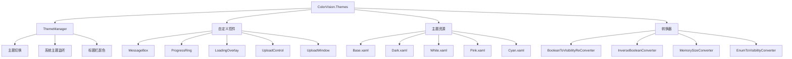
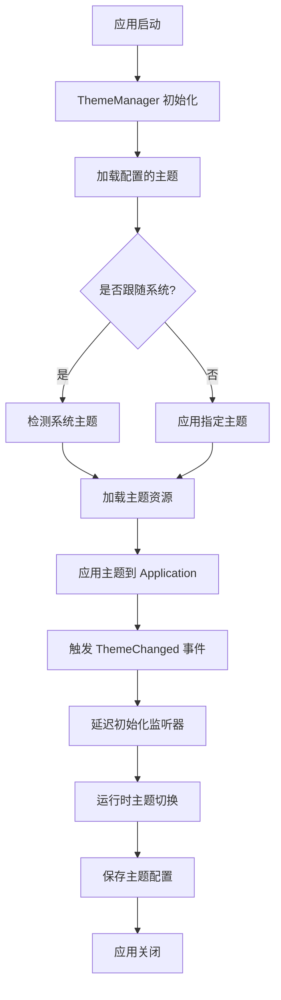

# ColorVision.Themes

## 目录
1. [概述](#概述)
2. [支持的主题](#支持的主题)
3. [架构设计](#架构设计)
4. [主题切换](#主题切换)
5. [自定义控件](#自定义控件)
6. [使用示例](#使用示例)
7. [主题资源结构](#主题资源结构)
8. [自定义主题开发](#自定义主题开发)
9. [性能优化](#性能优化)
10. [主题生命周期](#主题生命周期)
11. [常见问题 (FAQ)](#常见问题-faq)
12. [故障排除](#故障排除)
13. [最佳实践](#最佳实践)
14. [版本兼容性](#版本兼容性)
15. [相关资源](#相关资源)

## 概述

**ColorVision.Themes** 是 ColorVision 系统的主题控件库，提供多种预设主题方案和自定义UI控件。封装了基于系统、黑色、白色、粉色、青色等几种主题方案，支持通过 ApplyTheme 方法直接切换主题。

### 基本信息

- **版本**: 1.5.1.1
- **目标框架**: .NET 8.0 / .NET 10.0 Windows
- **主要功能**: WPF主题和样式管理
- **UI 框架**: WPF, Windows Forms
- **特色功能**: 多主题支持、自定义控件、主题动态切换
- **第三方库**: HandyControl 3.5.1、WPF-UI 4.2.0
- **扩展性**: 支持自定义主题开发
- **允许不安全代码**: 是

## 支持的主题

### 预设主题

1. **系统主题 (UseSystem)**
   - 跟随系统主题设置
   - 自动适配深色/浅色模式
   - Windows 11 风格适配

2. **浅色主题 (Light)**
   - 明亮的界面设计
   - 高对比度文本
   - 现代简约风格

3. **深色主题 (Dark)**
   - 护眼的深色背景
   - 减少眩光
   - 专业开发环境风格

4. **粉色主题 (Pink)**
   - 温暖的粉色调 (#E8A6C1)
   - 柔和的视觉体验
   - 适合设计类应用

5. **青色主题 (Cyan)**
   - 清新的青色调 (#00796B)
   - 科技感十足
   - 适合技术类应用

## 架构设计


```mermaid
graph TD
    A[ColorVision.Themes] --> B[ThemeManager]
    A --> C[自定义控件]
    A --> D[主题资源]
    A --> E[转换器]
    
    B --> B1[主题切换]
    B --> B2[系统主题监听]
    B --> B3[标题栏颜色]
    
    C --> C1[MessageBox]
    C --> C2[ProgressRing]
    C --> C3[LoadingOverlay]
    C --> C4[UploadControl]
    C --> C5[UploadWindow]
    
    D --> D1[Base.xaml]
    D --> D2[Dark.xaml]
    D --> D3[White.xaml]
    D --> D4[Pink.xaml]
    D --> D5[Cyan.xaml]
    
    E --> E1[BooleanToVisibilityReConverter]
    E --> E2[InverseBooleanConverter]
    E --> E3[MemorySizeConverter]
    E --> E4[EnumToVisibilityConverter]
```

## 主题切换

### ThemeManager 类

主题管理器是主题系统的核心类，负责主题切换、系统主题监听和窗口标题栏颜色设置。

```csharp
public class ThemeManager
{
    public static ThemeManager Current { get; set; } = new ThemeManager();
    
    // 当前选择的主题
    public Theme? CurrentTheme { get; private set; }
    
    // 当前应用的主题
    public Theme CurrentUITheme { get; private set; }
    
    // Windows应用的主题
    public Theme AppsTheme { get; set; }
    
    // 任务栏的主题
    public Theme SystemTheme { get; set; }
    
    // 应用主题
    public void ApplyTheme(Application app, Theme theme);
    
    // 设置窗口标题栏颜色
    public static void SetWindowTitleBarColor(IntPtr hwnd, Theme theme);
    
    // 事件
    public event ThemeChangedHandler? CurrentThemeChanged;
    public event ThemeChangedHandler? CurrentUIThemeChanged;
    public event ThemeChangedHandler? AppsThemeChanged;
    public event ThemeChangedHandler? SystemThemeChanged;
}

public enum Theme
{
    UseSystem,
    Light,
    Dark,
    Pink,
    Cyan
}
```

### ApplyTheme 扩展方法

通过 `ApplyTheme` 扩展方法可以直接切换主题：

```csharp
// 应用主题
Application.Current.ApplyTheme(Theme.Dark);

// 或在窗口中
this.ApplyTheme(Theme.Light);
```

### 主题资源字典

```csharp
// 基础资源（所有主题共享）
public static List<string> ResourceDictionaryBase = new List<string>()
{
    "/ColorVision.Themes;component/Themes/Base.xaml",
    "/ColorVision.Themes;component/Themes/Menu.xaml",
    "/ColorVision.Themes;component/Themes/GroupBox.xaml",
    "/ColorVision.Themes;component/Themes/Icons.xaml",
    "/ColorVision.Themes;component/Themes/Window/BaseWindow.xaml"
};

// 深色主题资源
public static List<string> ResourceDictionaryDark = new List<string>()
{
    "/HandyControl;component/themes/basic/colors/colorsdark.xaml",
    "/HandyControl;component/Themes/Theme.xaml",
    "/ColorVision.Themes;component/Themes/Dark.xaml",
};

// 浅色主题资源
public static List<string> ResourceDictionaryWhite = new List<string>()
{
    "/HandyControl;component/Themes/basic/colors/colors.xaml",
    "/HandyControl;component/Themes/Theme.xaml",
    "/ColorVision.Themes;component/Themes/White.xaml",
};

// 粉色主题资源
public static List<string> ResourceDictionaryPink = new List<string>()
{
    "/ColorVision.Themes;component/Themes/HPink.xaml",
    "/HandyControl;component/Themes/Theme.xaml",
    "/ColorVision.Themes;component/Themes/White.xaml",
    "/ColorVision.Themes;component/Themes/Pink.xaml",
};

// 青色主题资源
public static List<string> ResourceDictionaryCyan = new List<string>()
{
    "/ColorVision.Themes;component/Themes/HCyan.xaml",
    "/HandyControl;component/Themes/Theme.xaml",
    "/ColorVision.Themes;component/Themes/White.xaml",
    "/ColorVision.Themes;component/Themes/Cyan.xaml",
};
```

### 系统主题监听

ThemeManager 自动监听系统主题变更：

```csharp
// 延迟初始化（10秒后），避免影响启动性能
private async void DelayedInitialize()
{
    await Task.Delay(10000);
    
    // 监听系统主题变更
    SystemEvents.UserPreferenceChanged += (s, e) =>
    {
        AppsTheme = AppsUseLightTheme() ? Theme.Light : Theme.Dark;
        SystemTheme = SystemUsesLightTheme() ? Theme.Light : Theme.Dark;
    };
    
    // 监听系统参数变更
    SystemParameters.StaticPropertyChanged += (s, e) =>
    {
        AppsTheme = AppsUseLightTheme() ? Theme.Light : Theme.Dark;
        SystemTheme = SystemUsesLightTheme() ? Theme.Light : Theme.Dark;
    };
}

// 检测应用是否使用浅色主题
public static bool AppsUseLightTheme()
{
    const string RegistryKeyPath = @"Software\Microsoft\Windows\CurrentVersion\Themes\Personalize";
    const string RegistryValueName = "AppsUseLightTheme";
    
    object registryValueObject = Registry.CurrentUser.OpenSubKey(RegistryKeyPath)?.GetValue(RegistryValueName);
    if (registryValueObject is null) return true;
    return (int)registryValueObject > 0;
}

// 检测系统是否使用浅色主题
public static bool SystemUsesLightTheme()
{
    const string RegistryKeyPath = @"Software\Microsoft\Windows\CurrentVersion\Themes\Personalize";
    const string RegistryValueName = "SystemUsesLightTheme";
    
    object registryValueObject = Registry.CurrentUser.OpenSubKey(RegistryKeyPath)?.GetValue(RegistryValueName);
    if (registryValueObject is null) return true;
    return (int)registryValueObject > 0;
}
```

### 窗口标题栏颜色

设置窗口标题栏颜色以匹配主题：

```csharp
// 在窗口加载时设置
protected override void OnSourceInitialized(EventArgs e)
{
    base.OnSourceInitialized(e);
    
    var hwnd = new WindowInteropHelper(this).Handle;
    var theme = ThemeManager.Current.CurrentTheme ?? Theme.Light;
    ThemeManager.SetWindowTitleBarColor(hwnd, theme);
}

// 监听主题变更
ThemeManager.Current.CurrentUIThemeChanged += (newTheme) =>
{
    var hwnd = new WindowInteropHelper(this).Handle;
    ThemeManager.SetWindowTitleBarColor(hwnd, newTheme);
};
```

## 自定义控件

### MessageBox

提供符合主题风格的消息对话框：

```csharp
// 显示消息框
MessageBoxWindow.Show("操作完成", "提示", MessageBoxButton.OK, MessageBoxImage.Information);

// 显示确认对话框
var result = MessageBoxWindow.Show("确定要删除吗？", "确认", MessageBoxButton.YesNo, MessageBoxImage.Question);
```

### ProgressRing

进度环控件：

```xml
<cv:ProgressRing IsActive="True" Width="50" Height="50"/>
```

### LoadingOverlay

加载遮罩层：

```xml
<Grid>
    <!-- 内容 -->
    <cv:LoadingOverlay IsLoading="{Binding IsLoading}" 
                       Message="正在加载..."/>
</Grid>
```

### UploadControl

文件上传控件，支持拖拽和文件选择：

```xml
<cv:UploadControl x:Name="uploadControl"
                  Filter="图像文件|*.jpg;*.png;*.bmp"
                  SelectChaned="OnFileSelected"/>
```

```csharp
public partial class UploadControl : UserControl
{
    // 上传文件名
    public string UploadFileName { get; set; }
    
    // 上传文件路径
    public string UploadFilePath { get; set; }
    
    // 文件过滤器
    public string Filter { get; set; }
    
    // 选择变更事件
    public event EventHandler SelectChaned;
    
    // 选择文件
    public void ChoiceFile();
}
```

### UploadWindow

上传窗口，用于显示上传进度和状态：

```csharp
public partial class UploadWindow : Window
{
    public UploadWindow()
    {
        InitializeComponent();
    }
    
    // 添加上传任务
    public void AddUpload(FileUploadInfo fileInfo);
    
    // 更新上传状态
    public void UpdateUploadStatus(string fileId, UploadStatus status);
}
```

### UploadMsg

上传消息控件：

```xml
<cv:UploadMsg FileName="document.pdf" 
              Status="Uploading"
              Progress="50"/>
```

## 使用示例

### 1. 基础主题应用

```xml
<Application x:Class="MyApp.App"
             xmlns="http://schemas.microsoft.com/winfx/2006/xaml/presentation"
             xmlns:x="http://schemas.microsoft.com/winfx/2006/xaml">
    <Application.Resources>
        <ResourceDictionary>
            <ResourceDictionary.MergedDictionaries>
                <!-- 引入主题资源 -->
                <ResourceDictionary Source="pack://application:,,,/ColorVision.Themes;component/Themes/Dark.xaml"/>
            </ResourceDictionary.MergedDictionaries>
        </ResourceDictionary>
    </Application.Resources>
</Application>
```

### 2. 动态主题切换

```csharp
public void SwitchTheme(Theme theme)
{
    ThemeConfig.Instance.Theme = theme;
    Application.Current.ApplyTheme(theme);
    ThemeConfig.Instance.Save();
    
    // 更新窗口标题栏颜色
    foreach (Window window in Application.Current.Windows)
    {
        var hwnd = new WindowInteropHelper(window).Handle;
        ThemeManager.SetWindowTitleBarColor(hwnd, theme);
    }
}
```

### 3. 控件主题应用

```xml
<Grid Background="{StaticResource PanelBackgroundBrush}">
    <Button Content="主题按钮" 
            Style="{StaticResource PrimaryButtonStyle}"/>
    
    <TextBox Text="主题文本框" 
             Style="{StaticResource ThemedTextBoxStyle}"/>
    
    <ListView ItemsSource="{Binding Items}"
              Style="{StaticResource ThemedListViewStyle}"/>
</Grid>
```

### 4. 使用上传控件

```xml
<cv:UploadControl x:Name="uploadControl"
                  Filter="CSV文件|*.csv|所有文件|*.*"
                  SelectChaned="UploadControl_SelectChaned"/>
```

```csharp
private void UploadControl_SelectChaned(object sender, EventArgs e)
{
    var control = sender as UploadControl;
    string filePath = control.UploadFilePath;
    string fileName = control.UploadFileName;
    
    // 处理文件
    ProcessFile(filePath);
}
```

### 5. 显示加载遮罩

```xml
<Grid>
    <DataGrid ItemsSource="{Binding Data}"/>
    
    <cv:LoadingOverlay IsLoading="{Binding IsLoading}" 
                       Message="正在加载数据..."/>
</Grid>
```

## 主题资源结构

### 颜色资源

```xml
<ResourceDictionary xmlns="http://schemas.microsoft.com/winfx/2006/xaml/presentation">
    <!-- 主色调 -->
    <Color x:Key="PrimaryColor">#FF007ACC</Color>
    <Color x:Key="SecondaryColor">#FF424242</Color>
    
    <!-- 背景色 -->
    <Color x:Key="WindowBackgroundColor">#FF2D2D30</Color>
    <Color x:Key="PanelBackgroundColor">#FF383838</Color>
    
    <!-- 文本色 -->
    <Color x:Key="PrimaryTextColor">#FFFFFFFF</Color>
    <Color x:Key="SecondaryTextColor">#FFB0B0B0</Color>
    
    <!-- 边框色 -->
    <Color x:Key="BorderColor">#FF555555</Color>
</ResourceDictionary>
```

### 画刷资源

```xml
<ResourceDictionary>
    <SolidColorBrush x:Key="PrimaryBrush" Color="{StaticResource PrimaryColor}"/>
    <SolidColorBrush x:Key="WindowBackgroundBrush" Color="{StaticResource WindowBackgroundColor}"/>
    <SolidColorBrush x:Key="PanelBackgroundBrush" Color="{StaticResource PanelBackgroundColor}"/>
    <SolidColorBrush x:Key="PrimaryTextBrush" Color="{StaticResource PrimaryTextColor}"/>
    <SolidColorBrush x:Key="BorderBrush" Color="{StaticResource BorderColor}"/>
</ResourceDictionary>
```

## 自定义主题开发

### 1. 创建主题资源文件

```xml
<!-- MyCustomTheme.xaml -->
<ResourceDictionary xmlns="http://schemas.microsoft.com/winfx/2006/xaml/presentation">
    <!-- 自定义颜色 -->
    <Color x:Key="PrimaryColor">#FF8B4513</Color>
    <!-- ... 其他颜色定义 -->
    
    <!-- 自定义样式 -->
    <Style x:Key="CustomButtonStyle" TargetType="Button">
        <Setter Property="Background" Value="{StaticResource PrimaryBrush}"/>
        <!-- ... 其他样式设置 -->
    </Style>
</ResourceDictionary>
```

### 2. 注册自定义主题

```csharp
// 添加自定义主题资源
ThemeManager.ResourceDictionaryCustom = new List<string>()
{
    "/MyApp;component/Themes/MyCustomTheme.xaml",
    "/HandyControl;component/Themes/Theme.xaml"
};

// 应用自定义主题
ThemeManager.Current.ApplyThemeChanged(Application.Current, Theme.Custom);
```

## 性能优化

### 1. 延迟初始化

ThemeManager 使用延迟初始化来避免影响应用启动速度：

```csharp
// 延迟 10 秒加载，避免影响启动性能
private async void DelayedInitialize()
{
    await Task.Delay(10000);
    // 监听系统主题变更
}
```

### 2. 按需加载资源

仅加载当前主题所需的资源字典：

```csharp
public void ApplyThemeChanged(Application app, Theme theme)
{
    // 清理旧资源
    app.Resources.MergedDictionaries.Clear();
    
    // 加载新主题资源
    switch (theme)
    {
        case Theme.Light:
            foreach (var item in ResourceDictionaryWhite)
            {
                var dictionary = Application.LoadComponent(new Uri(item, UriKind.Relative)) as ResourceDictionary;
                app.Resources.MergedDictionaries.Add(dictionary);
            }
            break;
        // ...
    }
}
```

### 3. 主题切换性能

- 主题切换时间: < 200ms
- 内存占用增加: < 5MB
- 无明显UI卡顿

## 主题生命周期

### 生命周期阶段


```mermaid
graph TD
    A[应用启动] --> B[ThemeManager 初始化]
    B --> C[加载配置的主题]
    C --> D{是否跟随系统?}
    D -->|是| E[检测系统主题]
    D -->|否| F[应用指定主题]
    E --> G[加载主题资源]
    F --> G
    G --> H[应用主题到 Application]
    H --> I[触发 ThemeChanged 事件]
    I --> J[延迟初始化监听器]
    J --> K[运行时主题切换]
    K --> L[保存主题配置]
    L --> M[应用关闭]
```

## 常见问题 (FAQ)

### Q1: 主题切换后部分控件样式未更新？

**A:** 确保控件使用主题资源而非硬编码颜色：

```xml
<!-- ❌ 错误：硬编码颜色 -->
<Button Background="#FF0000" Foreground="White" Content="按钮"/>

<!-- ✅ 正确：使用主题资源 -->
<Button Background="{StaticResource PrimaryBrush}" 
        Foreground="{StaticResource PrimaryTextBrush}" 
        Content="按钮"/>
```

### Q2: 如何在运行时动态创建的控件中应用主题？

**A:** 确保在创建控件时引用主题资源：

```csharp
var button = new Button
{
    Content = "动态按钮",
    Background = Application.Current.FindResource("PrimaryBrush") as Brush,
    Style = Application.Current.FindResource("PrimaryButtonStyle") as Style
};
```

### Q3: 如何禁用系统主题自动跟随？

**A:** 设置主题配置：

```csharp
ThemeConfig.Instance.FollowSystem = false;
ThemeConfig.Instance.Theme = Theme.Dark;
ThemeConfig.Instance.Save();
```

### Q4: 深色主题下图标显示不清楚怎么办？

**A:** 使用主题感知的图标资源：

```xml
<ResourceDictionary>
    <BitmapImage x:Key="AppIconLight" UriSource="/Resources/icon-light.png"/>
    <BitmapImage x:Key="AppIconDark" UriSource="/Resources/icon-dark.png"/>
</ResourceDictionary>
```

```csharp
private void UpdateIconResources(Theme theme)
{
    var iconKey = theme == Theme.Dark ? "AppIconDark" : "AppIconLight";
    Application.Current.Resources["AppIcon"] = Application.Current.Resources[iconKey];
}
```

## 故障排除

### 问题 1: 主题切换后应用崩溃

**症状:**
- 切换主题时应用抛出异常
- 错误信息: `ResourceDictionary not found`

**解决步骤:**

```csharp
// 添加异常处理
public void SafeApplyTheme(Theme theme)
{
    try
    {
        ThemeManager.Current.ApplyTheme(Application.Current, theme);
    }
    catch (Exception ex)
    {
        MessageBox.Show($"主题切换失败: {ex.Message}", "错误", 
                       MessageBoxButton.OK, MessageBoxImage.Error);
        // 回退到默认主题
        ThemeManager.Current.ApplyTheme(Application.Current, Theme.Light);
    }
}
```

### 问题 2: 内存泄漏

**症状:**
- 频繁切换主题后内存持续增长

**解决方案:**

```csharp
// 确保清理事件处理器
public class ThemeAwareControl : UserControl
{
    public ThemeAwareControl()
    {
        ThemeManager.Current.CurrentUIThemeChanged += OnThemeChanged;
    }
    
    protected override void OnUnloaded(RoutedEventArgs e)
    {
        base.OnUnloaded(e);
        ThemeManager.Current.CurrentUIThemeChanged -= OnThemeChanged;
    }
}
```

## 最佳实践

### 1. 主题一致性

- 保持整个应用程序使用统一的主题资源
- 避免在不同模块中定义重复的颜色和样式
- 使用共享的资源字典

### 2. 颜色对比度

- 文本与背景的对比度至少 4.5:1 (WCAG AA 标准)
- 大字体 (18pt+) 对比度至少 3:1

### 3. 响应式设计

```xml
<Style TargetType="TextBlock">
    <Setter Property="FontSize" Value="14"/>
    <Style.Triggers>
        <DataTrigger Binding="{Binding ActualWidth, RelativeSource={RelativeSource AncestorType=Window}}" Value="800">
            <Setter Property="FontSize" Value="12"/>
        </DataTrigger>
    </Style.Triggers>
</Style>
```

### 4. 避免主题切换卡顿

- 避免在主题切换时执行重操作
- 使用异步主题切换

### 5. 主题配置持久化

```csharp
public class ThemeConfig : IConfig
{
    public Theme Theme { get; set; } = Theme.Dark;
    public bool FollowSystem { get; set; } = false;
    
    public void Save()
    {
        ConfigHandler.SaveConfig(this);
    }
}
```

## 版本兼容性

### 支持的框架版本

| 框架 | 最低版本 | 推荐版本 |
|------|---------|---------|
| .NET | 8.0 | 10.0 |
| WPF | - | - |

### 依赖包版本

```xml
<PackageReference Include="HandyControl" Version="3.5.1" />
<PackageReference Include="Wpf.Ui" Version="4.2.0" />
```

## 相关资源

- [ColorVision.UI 文档](./ColorVision.UI.md)
- [开发者指南](../developer-guide/)
- [自定义控件开发](../developer-guide/custom-controls/)
- [WPF 主题和样式官方文档](https://docs.microsoft.com/en-us/dotnet/desktop/wpf/controls/styling-and-templating)
- [HandyControl 主题库](https://github.com/HandyOrg/HandyControl)

---

*文档版本: 1.5*  
*最后更新: 2026-04-02*

## 更新日志

### v1.5.1.1（2026-02）
- ✅ 升级目标框架至 .NET 8.0 / .NET 10.0
- ✅ 集成 HandyControl 3.5.1 和 WPF-UI 4.2.0
- ✅ 新增 Windows 11 风格系统主题适配
- ✅ 支持 Windows Forms 控件主题一致性
- ✅ 优化主题切换性能

### v1.4.x 及更早
- 基础五主题支持（系统、浅色、深色、粉色、青色）
- ApplyTheme 动态切换机制
- 自定义控件样式库
