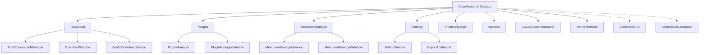

# ColorVision.UI.Desktop

## 目录
1. [概述](#概述)
2. [核心功能](#核心功能)
3. [架构设计](#架构设计)
4. [主要组件](#主要组件)
5. [使用示例](#使用示例)
6. [最佳实践](#最佳实践)

## 概述

**ColorVision.UI.Desktop** 是 ColorVision 系统的桌面应用程序入口模块，提供主窗口、下载管理、插件管理、菜单定制、设置管理、第三方应用集成和配置向导等功能。它是整个应用程序的启动点和桌面端特定功能的实现层。

### 基本信息

- **主要功能**: 桌面应用程序入口、下载管理、插件管理、菜单定制、系统设置
- **UI 框架**: WPF
- **特色功能**: Aria2c 下载管理、插件热加载与更新、菜单自定义、配置向导
- **版本**: 1.5.1.5
- **目标框架**: .NET 8.0 / .NET 10.0

## 核心功能

### 1. 下载管理 (Download)
- **Aria2c 集成** - 基于 Aria2c 的高性能下载引擎
- **多协议支持** - 支持 HTTP/HTTPS、BitTorrent、磁力链接
- **并发下载** - 可配置的最大并发任务数和速度限制
- **断点续传** - 自动恢复未完成的下载任务
- **下载窗口** - 可视化的下载进度管理界面

### 2. 插件管理 (Plugins)
- **插件发现** - 自动扫描和加载插件程序集
- **在线更新** - 检查并更新已安装的插件
- **插件商店** - 浏览和下载可用的插件包
- **版本管理** - DLL 版本查看和依赖关系追踪

### 3. 菜单管理 (MenuItemManager)
- **菜单定制** - 自定义菜单项的可见性和排序
- **快捷键配置** - 为菜单项分配自定义快捷键
- **持久化设置** - 保存和恢复菜单配置

### 4. 设置管理 (Settings)
- **统一设置界面** - 从所有已注册的配置提供者加载设置
- **分类管理** - 按类别分组显示配置项
- **配置导入导出** - 支持配置备份和恢复

### 5. 第三方应用 (ThirdPartyApps)
- **应用浏览** - 按分类浏览和搜索已注册的第三方应用
- **快速启动** - 一键启动系统工具和外部应用
- **系统工具** - 内置 Windows 系统工具集合

### 6. 配置向导 (Wizards)
- **多步引导** - 分步骤的初始化配置向导
- **进度跟踪** - 可视化的完成进度指示
- **自动发现** - 通过反射自动发现向导步骤

### 7. 系统初始化 (CUDA)
- **系统信息** - 启动时记录操作系统、.NET 版本、CPU 和内存信息
- **调试支持** - 记录调试模式状态和应用程序版本

## 架构设计



## 主要组件

### 下载管理

#### Aria2cDownloadManager

下载任务管理核心类，封装 Aria2c JSON-RPC 接口，提供下载任务的生命周期管理。

```csharp
public class Aria2cDownloadManager
{
    // 下载任务集合
    public ObservableCollection<DownloadTask> Downloads { get; }

    // 状态消息
    public string StatusMessage { get; }
    public event Action<string> StatusMessageChanged;

    // 下载操作
    public Task<DownloadTask> AddDownload(string url, string saveDir,
        string authorization = null, Action<DownloadTask> onCompleted = null);
    public Task PauseDownload(DownloadTask task);
    public Task ResumeDownload(DownloadTask task);
    public void CancelDownload(DownloadTask task);
    public void DeleteRecords(IEnumerable<DownloadTask> tasks,
        bool? deleteFiles = null);

    // 服务管理
    public Task PreloadAria2cAsync();
    public void StopAria2cDaemon();
    public void AutoRestartIncompleteDownloads();

    // 配置
    public DownloadManagerConfig Config { get; }
}
```

#### DownloadTask

下载任务数据模型，支持 MVVM 绑定。

```csharp
public class DownloadTask : ViewModelBase
{
    public int Id { get; set; }
    public string Url { get; set; }
    public string FileName { get; set; }
    public string SavePath { get; set; }
    public string Gid { get; set; }
    public string Status { get; set; }
    public double ProgressValue { get; set; }
    public long DownloadedBytes { get; set; }
    public long TotalBytes { get; set; }
    public string SpeedText { get; set; }
    public Action<DownloadTask> OnCompletedCallback { get; set; }

    // 状态属性
    public bool IsDownloading { get; }
    public bool IsCompleted { get; }
    public bool IsPaused { get; }
    public string FileSizeDisplayText { get; }
}
```

#### Aria2cDownloadService

`IDownloadService` 的实现，提供跨程序集的下载 API。

```csharp
public class Aria2cDownloadService : IDownloadService
{
    public void Download(string url, string saveDir,
        string authorization = null,
        Action<DownloadTask> onCompleted = null);
    public void ShowDownloadWindow();
}
```

### 插件管理

#### PluginManager

插件生命周期管理类，支持插件的发现、安装、更新和卸载。

```csharp
public class PluginManager : ViewModelBase
{
    public static PluginManager GetInstance();

    public ObservableCollection<PluginInfoVM> Plugins { get; }
    public int UpdateAvailableCount { get; }

    public void UpdateAll();
    public void DownloadPackage();
    public void InstallPackage();
    public void OpenStore();
    public void OpenViewDllVersion();
    public void Restart();
}
```

#### PluginManagerWindow

插件管理窗口，提供可视化的插件浏览、安装和配置界面。支持多标签页查看插件文档、变更日志、详情和依赖关系。

### 菜单管理

#### MenuItemManagerService

菜单自定义服务，管理菜单项的可见性、排序和快捷键绑定。

```csharp
public class MenuItemManagerService
{
    public static MenuItemManagerService GetInstance();

    public void ApplySettings();
    public void ApplyHotkeys();
    public void SyncSettingsFromMenuItems();
    public void SetMenuItemVisibility(string id, bool visible);
    public void SetMenuItemOrder(string id, int order);
    public void SetMenuItemHotkey(string id, string hotkey);
    public void RebuildMenu();
}
```

### 设置管理

#### SettingWindow

统一设置界面，自动发现并加载所有已注册配置提供者的设置项。

```csharp
public partial class SettingWindow : Window
{
    // 自动发现并加载设置
    // 支持三种设置类型: TabItem, Class, Property
    // 按类别分组、按优先级排序
}
```

### 第三方应用

#### ThirdPartyAppsWindow

第三方应用浏览窗口，支持分组过滤、搜索和快速启动。

#### SystemAppProvider

Windows 系统工具提供者，内置常用系统工具：命令提示符、PowerShell、控制面板、注册表编辑器、组策略、系统信息、远程桌面、事件查看器、任务计划程序、服务管理和网络连接。

### 配置向导

#### WizardWindow

多步骤配置向导窗口，通过反射自动发现 `IWizardStep` 实现，引导用户完成初始化配置。

### 系统初始化

#### SystemInitializer

应用程序启动时的系统信息记录器，记录操作系统版本、.NET 运行时、CPU 信息、内存状态等。

### 本地方法

#### ShortcutCreator

Windows 快捷方式创建工具，使用 WScript.Shell COM 对象创建 `.lnk` 文件。

```csharp
public static class ShortcutCreator
{
    public static void CreateShortcut(string name, string path,
        string target, string arguments);
    public static string GetShortcutTargetFile(string filename);
}
```

## 使用示例

### 添加下载任务

```csharp
// 通过 IDownloadService 接口下载文件
var downloadService = AssemblyHandler.GetInstance()
    .LoadImplementations<IDownloadService>().FirstOrDefault();

if (downloadService != null)
{
    // 打开下载窗口
    downloadService.ShowDownloadWindow();

    // 添加下载任务（支持完成回调）
    downloadService.Download(
        "https://example.com/file.zip",
        @"C:\Downloads",
        authorization: null,
        onCompleted: task =>
        {
            Console.WriteLine($"下载完成: {task.FileName}");
        });
}
```

### 管理插件

```csharp
// 获取插件管理器
var pluginManager = PluginManager.GetInstance();

// 检查更新
int updateCount = pluginManager.UpdateAvailableCount;

// 批量更新
pluginManager.UpdateAll();

// 安装指定插件
pluginManager.InstallPackage();
```

### 自定义菜单

```csharp
// 获取菜单管理服务
var menuService = MenuItemManagerService.GetInstance();

// 设置菜单项可见性
menuService.SetMenuItemVisibility("menuItem1", false);

// 设置快捷键
menuService.SetMenuItemHotkey("menuItem1", "Ctrl+Shift+S");

// 重建菜单
menuService.RebuildMenu();
```

### 创建桌面快捷方式

```csharp
// 创建桌面快捷方式
ShortcutCreator.CreateShortcut(
    "ColorVision",
    Environment.GetFolderPath(Environment.SpecialFolder.Desktop),
    Application.ResourceAssembly.Location,
    "--startup");
```

## 最佳实践

### 1. 下载管理
- 使用 `IDownloadService` 接口而非直接引用 `Aria2cDownloadManager`
- 设置 `OnCompletedCallback` 处理下载完成后的逻辑
- 通过 `DownloadManagerConfig` 配置并发数和速度限制

### 2. 插件管理
- 插件程序集放置在 `Plugins/<Name>/` 目录下自动发现
- 使用 `PluginManagerWindow` 查看插件详情和依赖关系
- 定期检查插件更新以获取最新功能和修复

### 3. 菜单定制
- 使用 `MenuItemManagerService` 而非直接修改菜单结构
- 快捷键格式示例: `"Ctrl+S"`, `"Ctrl+Shift+N"`, `"Alt+F4"`
- 修改后调用 `RebuildMenu()` 刷新菜单

### 4. 启动优化
- `SystemInitializer` 的 `Order` 值为 8，确保在其他初始化步骤之后运行
- 使用 `WizardWindow` 引导首次配置，避免启动时加载过多内容
- 利用 `DownloadInitializer` 自动恢复未完成的下载
