# ColorVision.UI.Desktop

## 目录
1. [概述](#概述)
2. [核心功能](#核心功能)
3. [架构设计](#架构设计)
4. [主要组件](#主要组件)
5. [使用示例](#使用示例)
6. [最佳实践](#最佳实践)

## 概述

**ColorVision.UI.Desktop** 是 ColorVision 系统的桌面应用程序入口模块，提供主窗口、菜单定制、设置管理、配置向导、插件管理和第三方应用集成等功能。它是整个应用程序的启动点和桌面端特定功能的实现层。

### 基本信息

- **主要功能**: 桌面应用程序入口、菜单管理、设置管理、配置向导、系统初始化
- **UI 框架**: WPF
- **特色功能**: 菜单自定义、统一设置界面、多步配置向导、系统初始化
- **版本**: 1.5.1.5
- **目标框架**: .NET 8.0 / .NET 10.0

## 核心功能

### 1. 应用程序入口 (App.xaml.cs)
- **应用启动** - 应用程序入口点，初始化全局资源
- **异常处理** - 全局异常捕获和处理
- **单实例** - 确保应用程序单实例运行
- **启动参数** - 支持命令行参数处理

### 2. 主窗口 (MainWindow)
- **主界面容器** - 应用程序主窗口容器
- **停靠布局** - 基于 AvalonDock 的停靠面板系统
- **视图管理** - 文档视图和面板视图管理
- **状态栏** - 应用程序状态信息显示

### 3. 菜单管理 (MenuItemManager)
- **菜单定制** - 自定义菜单项的可见性和排序
- **持久化设置** - 保存和恢复菜单配置
- **树形编辑** - 可视化菜单结构编辑
- **导入导出** - 菜单配置的导入导出

### 4. 设置管理 (Settings)
- **统一设置界面** - SettingWindow 从所有已注册的配置提供者加载设置
- **分类管理** - 按类别分组显示配置项
- **三种类型** - 支持 TabItem、Class、Property 三种设置类型
- **自动发现** - 通过反射自动发现 IConfigSettingProvider 实现

### 5. 配置向导 (Wizards)
- **多步引导** - WizardWindow 提供分步骤的初始化配置向导
- **自动发现** - WizardManager 通过反射自动发现 IWizardStep 实现
- **进度跟踪** - 可视化的完成进度指示
- **完成验证** - 验证所有步骤配置是否完成

### 6. 插件更新 (PluginsUpdate)
- **版本检查** - 检查插件更新
- **DLL版本查看** - ViewDllVersionsWindow 查看DLL版本信息

### 7. 第三方应用 (ThirdPartyApps)
- **应用浏览** - SystemAppProvider 提供 Windows 系统工具集合
- **快速启动** - 一键启动系统工具和外部应用

### 8. 系统初始化 (SystemInitializer)
- **CUDA初始化** - SystemInitializer 初始化 CUDA 环境
- **系统信息** - 启动时记录操作系统、.NET 版本、CPU 和内存信息
- **调试支持** - 记录调试模式状态和应用程序版本

### 9. 原生方法 (NativeMethods)
- **快捷方式创建** - ShortcutCreator 创建 Windows 快捷方式

## 架构设计

```mermaid
graph TD
    A[ColorVision.UI.Desktop] --> B[App]
    A --> C[MainWindow]
    A --> D[MenuItemManager]
    A --> E[Settings]
    A --> F[Wizards]
    A --> G[Plugins]
    A --> H[ThirdPartyApps]
    A --> I[SystemInitializer]
    A --> J[NativeMethods]

    B --> B1[启动流程]
    B --> B2[异常处理]
    B --> B3[单实例]

    C --> C1[停靠布局]
    C --> C2[视图管理]
    C --> C3[状态栏]

    D --> D1[MenuItemManagerConfig]
    D --> D2[MenuItemSetting]
    D --> D3[菜单编辑]

    E --> E1[SettingWindow]
    E --> E2[IConfigSettingProvider]
    E --> E3[PropertyEditorHelper]

    F --> F1[WizardWindow]
    F --> F2[WizardManager]
    F --> F3[IWizardStep]

    G --> G1[PluginsUpdate]
    G --> G2[ViewDllVersionsWindow]

    H --> H1[SystemAppProvider]

    I --> I1[CUDA初始化]
    I --> I2[系统信息]

    J --> J1[ShortcutCreator]
```



## 主要组件

### App

应用程序类，定义应用程序的入口点和全局行为。

```csharp
public partial class App : Application
{
    protected override void OnStartup(StartupEventArgs e)
    {
        // 初始化插件系统
        PluginLoader.LoadPlugins();
        
        // 应用主题
        this.ApplyTheme(ThemeConfig.Instance.Theme);
        
        // 显示主窗口
        base.OnStartup(e);
    }
}
```

### MainWindow

主窗口类，应用程序的主界面容器。

```csharp
public partial class MainWindow : Window
{
    public MainWindow()
    {
        InitializeComponent();
    }
    
    // 停靠布局管理
    public DockLayoutManager LayoutManager { get; }
    
    // 文档视图宿主
    public DockViewManagerHost ViewManagerHost { get; }
}
```

### MenuItemManagerConfig

菜单项管理配置类，存储菜单的自定义配置。

```csharp
public class MenuItemManagerConfig : IConfig
{
    public static MenuItemManagerConfig Instance => 
        ConfigService.Instance.GetRequiredService<MenuItemManagerConfig>();
    
    // 菜单项设置集合
    public ObservableCollection<MenuItemSetting> Settings { get; set; } = new();
    
    // 最后选中的树节点
    public string? LastSelectedTreeNode { get; set; }
}
```

### MenuItemSetting

菜单项设置类，定义单个菜单项的配置。

```csharp
public class MenuItemSetting
{
    public string Id { get; set; }
    public string? Header { get; set; }
    public bool IsVisible { get; set; } = true;
    public int Order { get; set; }
    public string? Hotkey { get; set; }
}
```

### SettingWindow

统一设置窗口，自动发现并加载所有已注册配置提供者的设置项。

```csharp
public partial class SettingWindow : Window
{
    public SettingWindow()
    {
        InitializeComponent();
        this.ApplyCaption();
    }
    
    // 加载配置设置
    public void LoadIConfigSetting()
    {
        // 自动发现所有 IConfigSettingProvider 实现
        // 支持三种设置类型: TabItem, Class, Property
        // 按类别分组、按优先级排序
    }
}
```

### WizardWindow

配置向导窗口，引导用户完成初始化配置。

```csharp
public partial class WizardWindow : Window
{
    public static WizardWindowConfig WindowConfig => WizardWindowConfig.Instance;
    
    public WizardWindow()
    {
        InitializeComponent();
        this.ApplyCaption();
        WindowConfig.SetWindow(this);
    }
    
    // 显示当前步骤
    private void ShowCurrentStep()
    
    // 上一步
    private void Previous_Click(object sender, RoutedEventArgs e)
    
    // 下一步
    private void Next_Click(object sender, RoutedEventArgs e)
    
    // 完成配置
    private void ConfigurationComplete_Click(object sender, RoutedEventArgs e)
}
```

### WizardManager

向导管理器，负责发现和管理所有向导步骤。

```csharp
public class WizardManager : ViewModelBase
{
    public static WizardManager GetInstance()
    
    // 所有向导步骤
    public List<IWizardStep> IWizardSteps { get; private set; } = new();
    
    // 初始化，自动发现所有 IWizardStep 实现
    public void Initialized()
}
```

### WizardWindowConfig

向导窗口配置类。

```csharp
public class WizardWindowConfig : IConfig
{
    public static WizardWindowConfig Instance => 
        ConfigService.Instance.GetRequiredService<WizardWindowConfig>();
    
    // 向导完成标识
    public bool WizardCompletionKey { get; set; }
}
```

### SystemInitializer

系统初始化器，负责应用程序启动时的系统初始化和信息记录。

```csharp
public class SystemInitializer : IInitializer
{
    public int Order => 8;
    
    public async Task InitializeAsync()
    {
        // 记录系统信息
        // 初始化 CUDA
        // 记录 .NET 版本
        // 记录 CPU 和内存信息
    }
}
```

### ShortcutCreator

快捷方式创建工具，使用 WScript.Shell COM 对象创建 `.lnk` 文件。

```csharp
public static class ShortcutCreator
{
    // 创建快捷方式
    public static void CreateShortcut(string name, string path, 
        string target, string arguments)
    
    // 获取快捷方式目标文件
    public static string GetShortcutTargetFile(string filename)
}
```

### PluginsUpdate

插件更新类，负责检查和管理插件更新。

```csharp
public static class PluginsUpdate
{
    // 检查插件更新
    public static void CheckForUpdates()
    
    // 更新插件
    public static void UpdatePlugin(string pluginId)
}
```

### ViewDllVersionsWindow

DLL版本查看窗口，显示已加载DLL的版本信息。

```csharp
public partial class ViewDllVersionsWindow : Window
{
    public ViewDllVersionsWindow()
    {
        InitializeComponent();
    }
    
    // 加载DLL版本信息
    public void LoadDllVersions()
}
```

### SystemAppProvider

Windows 系统应用提供者，提供常用系统工具的快捷访问。

```csharp
public class SystemAppProvider : IThirdPartyAppProvider
{
    // 获取系统应用列表
    public List<ThirdPartyAppInfo> GetApps()
    
    // 内置系统工具:
    // - 命令提示符
    // - PowerShell
    // - 控制面板
    // - 注册表编辑器
    // - 组策略编辑器
    // - 系统信息
    // - 远程桌面
    // - 事件查看器
    // - 任务计划程序
    // - 服务管理
    // - 网络连接
}
```

## 使用示例

### 1. 应用程序启动

```csharp
public partial class App : Application
{
    protected override void OnStartup(StartupEventArgs e)
    {
        // 加载插件
        PluginLoader.LoadPlugins();
        
        // 应用主题
        this.ApplyTheme(ThemeConfig.Instance.Theme);
        
        // 检查是否首次运行
        if (!WizardWindowConfig.Instance.WizardCompletionKey)
        {
            // 显示配置向导
            var wizard = new WizardWindow();
            wizard.ShowDialog();
            
            if (!WizardWindowConfig.Instance.WizardCompletionKey)
            {
                Shutdown();
                return;
            }
        }
        
        // 显示主窗口
        var mainWindow = new MainWindow();
        mainWindow.Show();
        
        base.OnStartup(e);
    }
}
```

### 2. 菜单项配置

```csharp
// 添加菜单项设置
var config = MenuItemManagerConfig.Instance;
config.Settings.Add(new MenuItemSetting
{
    Id = "menuFileOpen",
    Header = "打开",
    IsVisible = true,
    Order = 1,
    Hotkey = "Ctrl+O"
});

// 保存配置
ConfigHandler.GetInstance().SaveConfigs();
```

### 3. 创建设置提供者

```csharp
public class MySettingProvider : IConfigSettingProvider
{
    public IEnumerable<ConfigSettingMetadata> GetConfigSettings()
    {
        return new List<ConfigSettingMetadata>
        {
            // TabItem 类型
            new ConfigSettingMetadata
            {
                Type = ConfigSettingType.TabItem,
                Name = "我的设置",
                Order = 100,
                UserControl = new MySettingsControl()
            },
            
            // Class 类型
            new ConfigSettingMetadata
            {
                Type = ConfigSettingType.Class,
                Name = "高级设置",
                Order = 200,
                Source = MyConfig.Instance
            },
            
            // Property 类型
            new ConfigSettingMetadata
            {
                Type = ConfigSettingType.Property,
                Name = "启用功能",
                Group = "通用",
                Order = 1,
                Source = MyConfig.Instance,
                BindingName = nameof(MyConfig.EnableFeature)
            }
        };
    }
}
```

### 4. 创建向导步骤

```csharp
public class DatabaseWizardStep : IWizardStep
{
    public int Order => 1;
    
    public string Title => "数据库配置";
    
    public string Description => "配置数据库连接参数";
    
    // 配置状态
    public bool ConfigurationStatus => MySQLConfig.Instance.TestConnection();
    
    // 步骤内容控件
    public UserControl StepContent => new DatabaseConfigControl();
    
    public void Initialize()
    {
        // 初始化步骤
    }
    
    public bool Validate()
    {
        // 验证配置
        return MySQLConfig.Instance.TestConnection();
    }
}
```

### 5. 创建桌面快捷方式

```csharp
// 创建桌面快捷方式
ShortcutCreator.CreateShortcut(
    "ColorVision",
    Environment.GetFolderPath(Environment.SpecialFolder.Desktop),
    Application.ResourceAssembly.Location.Replace(".dll", ".exe"),
    "--startup"
);
```

### 6. 使用系统应用提供者

```csharp
// 获取系统应用列表
var provider = new SystemAppProvider();
var apps = provider.GetApps();

// 显示系统应用菜单
foreach (var app in apps)
{
    Console.WriteLine($"{app.Name}: {app.ExecutablePath}");
}
```

## 最佳实践

### 1. 应用程序启动
- 在 `OnStartup` 中按正确顺序初始化各子系统
- 首先加载插件，然后应用主题
- 首次运行时显示配置向导
- 处理启动参数

### 2. 菜单定制
- 使用 `MenuItemManagerConfig` 持久化菜单配置
- 提供菜单配置的导入导出功能
- 支持快捷键绑定

### 3. 设置管理
- 实现 `IConfigSettingProvider` 提供设置项
- 合理使用三种设置类型（TabItem/Class/Property）
- 设置项按逻辑分组
- 提供设置项的排序

### 4. 配置向导
- 实现 `IWizardStep` 接口创建向导步骤
- 设置合适的 `Order` 值控制步骤顺序
- 提供配置验证
- 显示配置进度

### 5. 系统初始化
- 设置合适的 `Order` 值确保初始化顺序
- 记录必要的系统信息
- 处理初始化失败的情况
- 异步初始化避免阻塞UI

### 6. 快捷方式
- 验证目标路径存在
- 提供图标设置
- 支持命令行参数

## 更新日志

### v1.5.1.5 (2026-02)
- ✅ 升级目标框架至 .NET 8.0 / .NET 10.0
- ✅ 重构菜单项管理系统
- ✅ 优化配置向导界面
- ✅ 增强设置窗口功能
- ✅ 改进系统初始化流程

### v1.4.x
- 停靠布局管理
- 多图像查看器
- 工作区管理

### v1.3.x 及更早
- 基础应用程序框架
- 配置向导
- 系统初始化

## 相关资源

- [ColorVision.UI 文档](./ColorVision.UI.md)
- [ColorVision.Common 文档](./ColorVision.Common.md)
- [开发者指南](../developer-guide/)
- [配置管理指南](../getting-started/)
